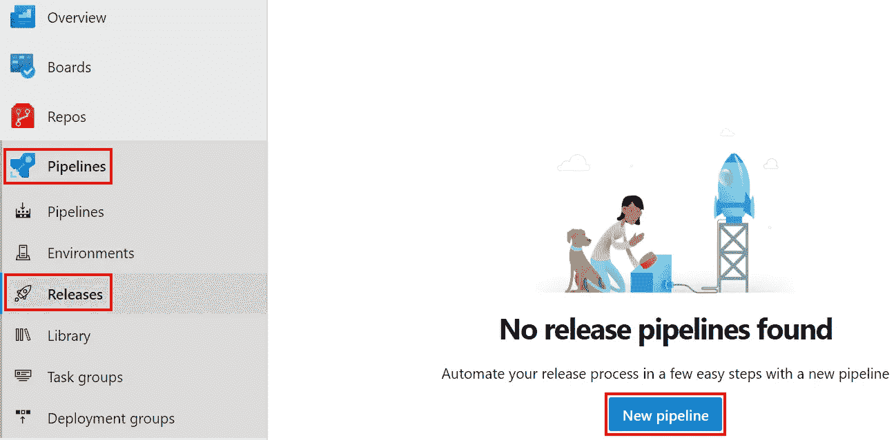
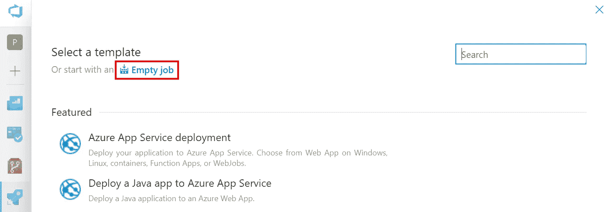
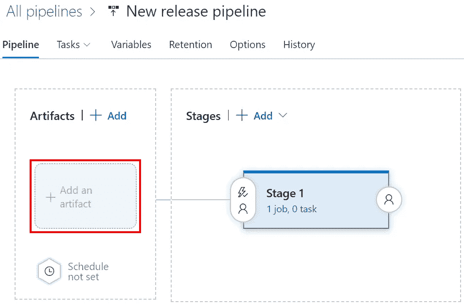
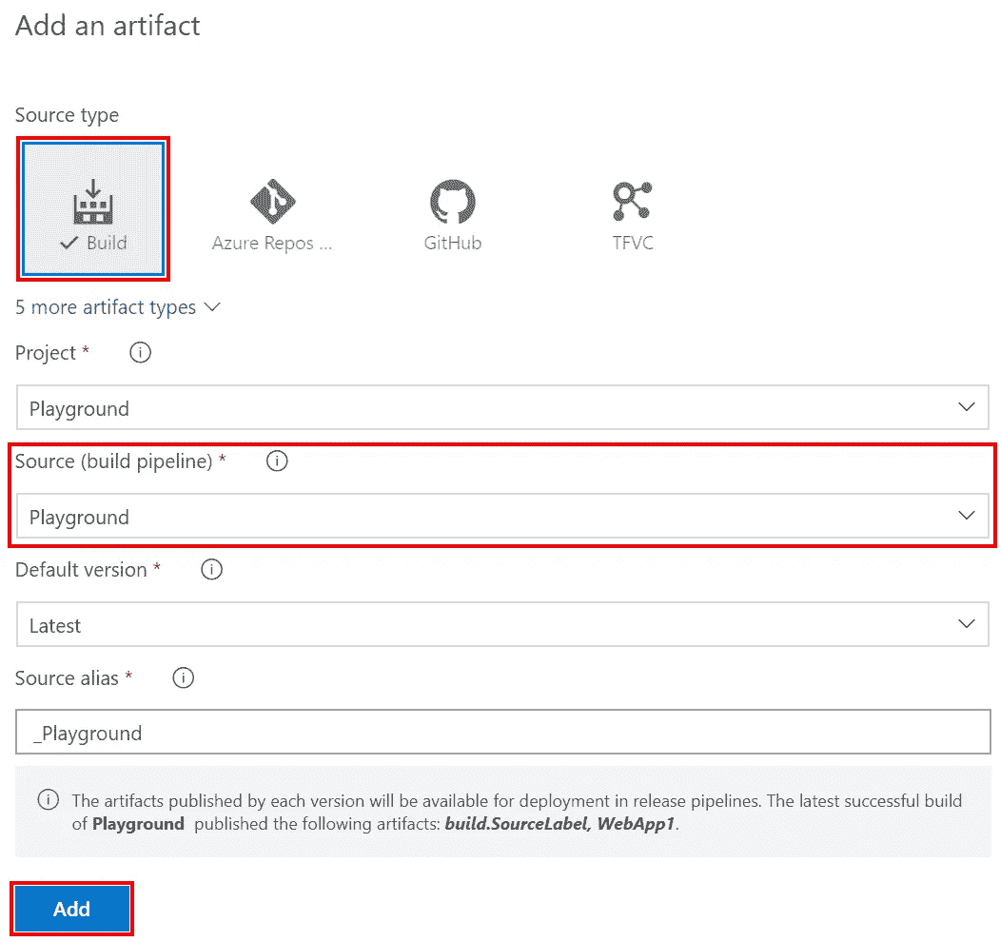
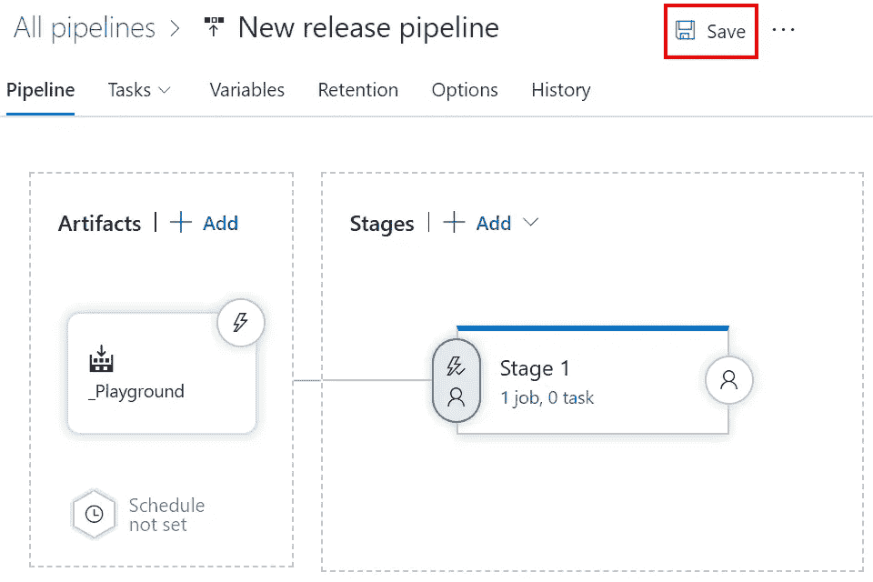
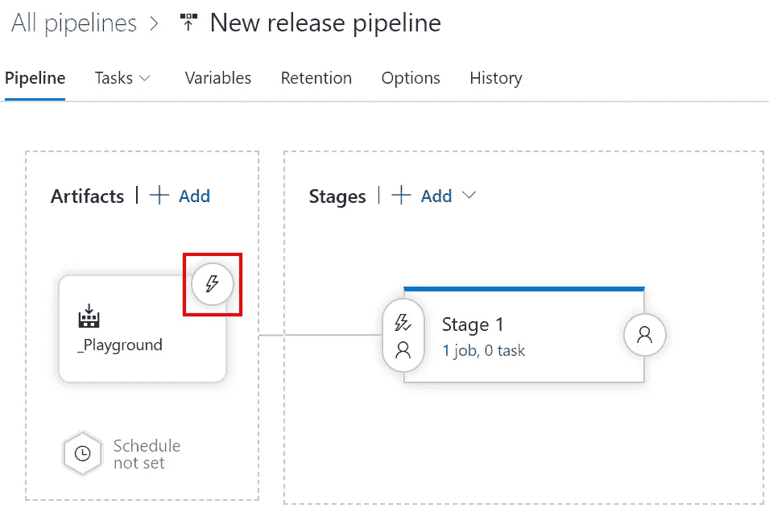
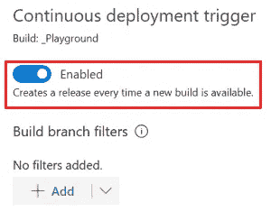
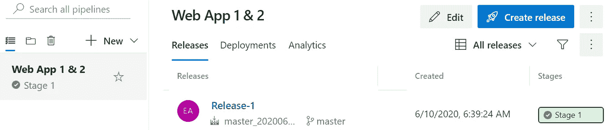

# Azure DevOps 版本:在管道构建后自动创建新版本

> 原文：<https://itnext.io/azure-devops-releases-auto-create-new-release-after-pipeline-build-ac03d21f726e?source=collection_archive---------1----------------------->

我本周的计划帖子遇到了障碍，决定希望回到 Azure DevOps，并展示如何创建一个发布，并在构建管道成功完成时触发该发布。这篇文章将使用相同的 Azure DevOps 项目，就像这个系列之前所有的文章一样，链接如下。

[Azure devo PS 入门](https://elanderson.net/2020/02/getting-started-with-azure-devops/)
[Azure devo PS 中的管道创建](https://elanderson.net/2020/03/pipeline-creation-in-azure-devops/)
[Azure DevOps 为 ASP.NET 核心发布工件](https://elanderson.net/2020/03/azure-devops-publish-asp-net-core/)
[Azure DevOps 管道:YAML 的多个作业](https://elanderson.net/2020/03/azure-devops-pipelines-multiple-jobs-in-yaml/)
[Azure DevOps 管道:可重用的 YAML](https://elanderson.net/2020/03/azure-devops-pipelines-reuseable-yaml/)
[Azure DevOps 管道:跨 Repos 使用 YAML](https://elanderson.net/2020/04/azure-devops-pipelines-use-yaml-across-repos/)
[Azure devo PS 管道:YAML 的条件](https://elanderson.net/2020/04/azure-devops-pipelines-conditionals-in-yaml/)

## 创建版本

在 Azure DevOps 中，要创建一个发布，请转到**管道**，然后**发布**。因为这是我们项目的第一次发布，我们有一个**新管道**按钮来点击开始创建过程。

新管道按钮将通过显示一个**选择模板**对话框来开始创建过程。由于我们的发布并没有真正做什么，我们将点击**空任务**选项。

接下来，我们想要将构建管道中的工件添加到这个版本中。点击**添加神器**开始流程。

将显示添加工件对话框，它允许我们在工件的源上有很多选项。对于这个设置，我们将使用**构建**的**源类型**，因为我们的工件是 Azure DevOps 构建的结果。我们需要选择的下一个选项是 **Source** ，在这里我们选择想要使用哪个 Azure DevOps 构建管道中的工件。在这个示例中，我们只有一个选项。一旦选择了信号源，将会显示更多选项，但我们将采用这些选项的默认值，只需单击**添加**按钮。

现在我们有了基本的发布设置，点击**保存**按钮。会有一个文件夹的提示。输入一个文件夹名或留空以将发布保存在根目录中，然后点击 **OK** 完成保存。

## 管道构建后自动创建

现在我们已经有了基本的发布管道，我们将在工件上设置一个连续的部署触发器，这样每当一个新的构建完成时。在**工件**区域点击工件上的**照明螺栓**触发器应该打开，我们的示例中只有一个选项。

一个对话框将显示不同的触发选项。我们将**启用**的**持续展开触发器**。请注意，当启用触发器时，有一个选项只为特定分支触发。我经常使用这个选项，只在 master 上完成构建时触发发布。完成后点击 **X** 关闭对话框，然后**保存**释放。我还将该版本重命名为 Web App 1 & 2，以便更清楚地了解该版本的功能。

现在弹出到管道并运行一个构建。构建完成后，返回到发布版本，您将会看到一个新的发布版本被触发，并且在这种情况下是基于发布版本的其余部分是如何设置的来部署的。

## 包扎

在这篇文章中，我们创建了我们的第一个版本，它实际上不做任何事情，并将其配置为在构建应用程序时自动部署。我使用类似的设置来自动部署到 QA 环境。这种设置可以打开大量的场景。

*原载于***。**