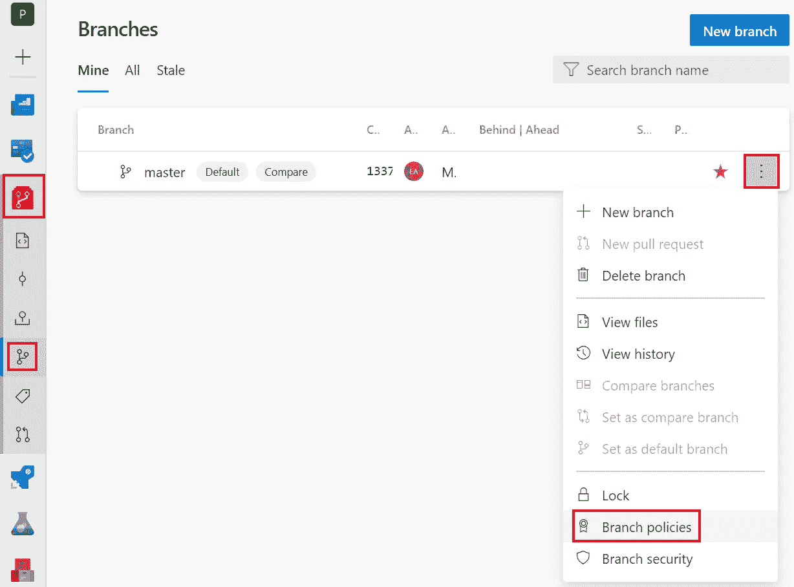
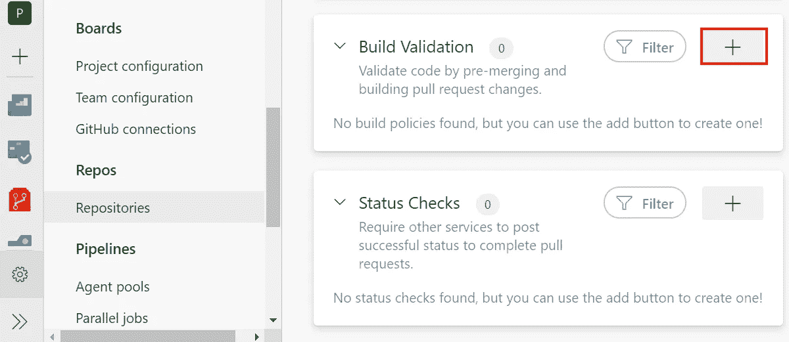
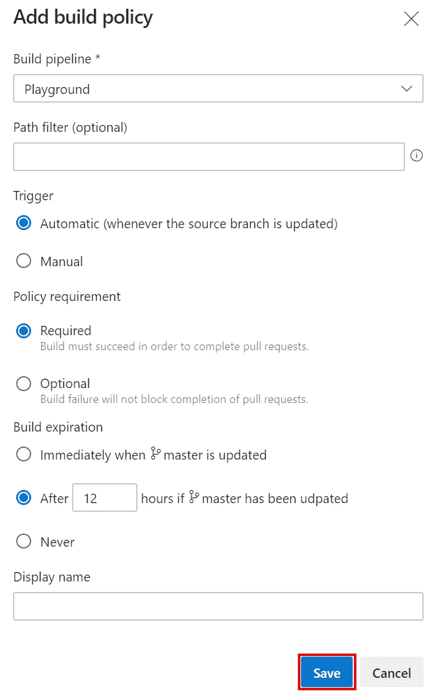
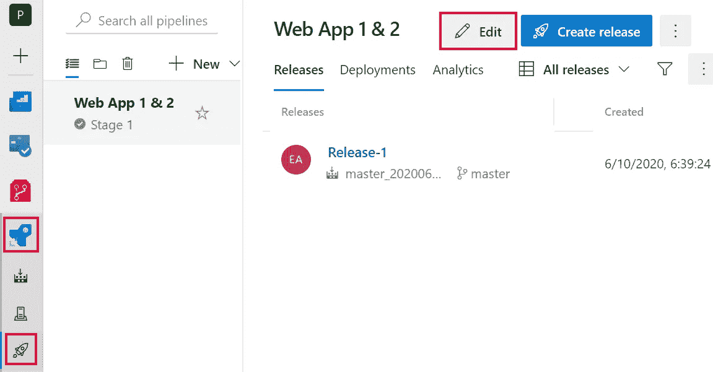
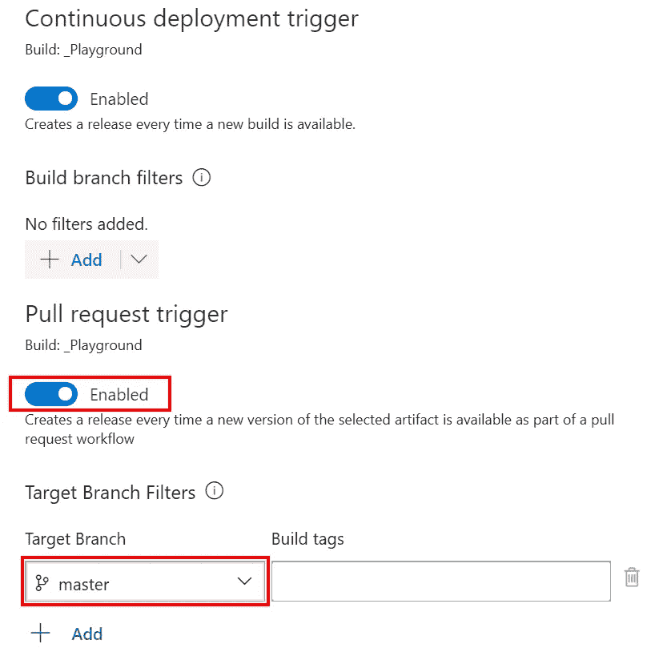
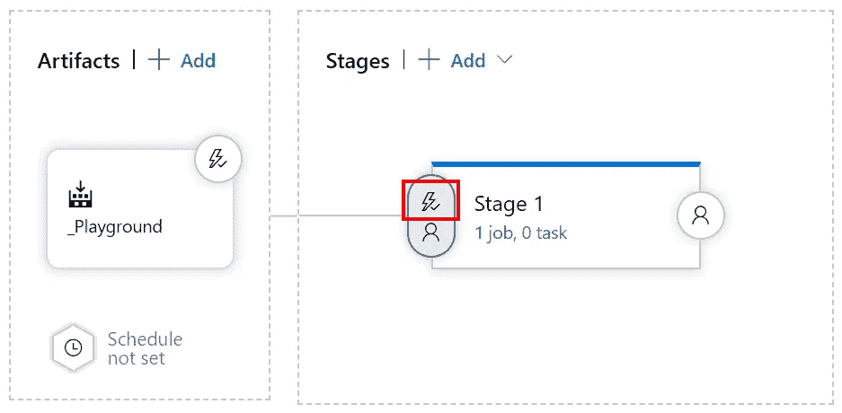
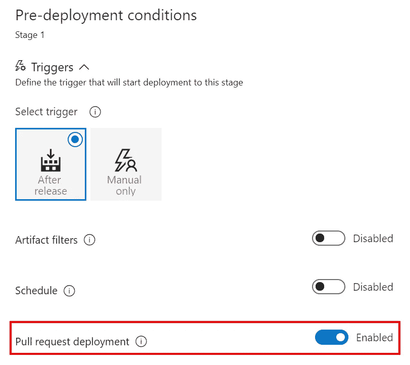
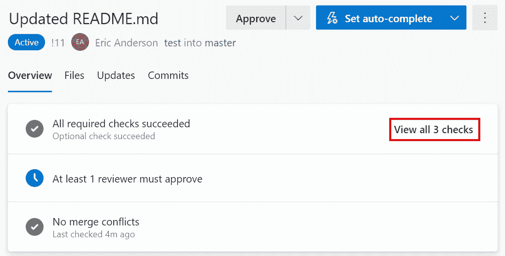
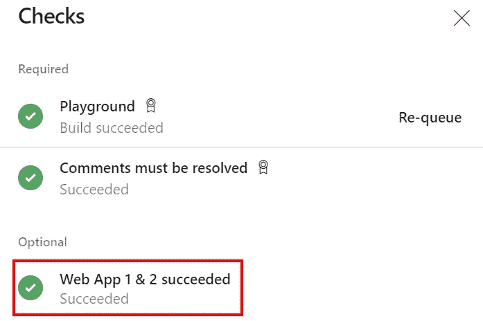
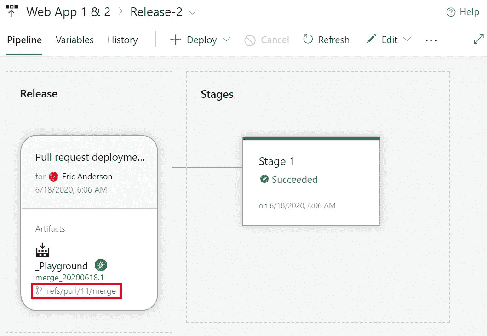

# Azure DevOps 版本:自动创建带有拉请求的版本

> 原文：<https://itnext.io/azure-devops-releases-auto-create-release-with-pull-requests-ad42d259da8?source=collection_archive---------1----------------------->

上周我们讨论了当一个构建完成时自动创建发布。本周，我们将讨论如何在从拉取请求构建完成时创建一个发布。这种设置将有助于在实际的变更成为可发布的分支之前对变更进行验证。如果你是这个系列的新手，下面的帖子会帮助你赶上进度。

[Azure devo PS 入门](https://elanderson.net/2020/02/getting-started-with-azure-devops/)
[Azure devo PS 中的管道创建](https://elanderson.net/2020/03/pipeline-creation-in-azure-devops/)
[Azure DevOps 为 ASP.NET 核心发布工件](https://elanderson.net/2020/03/azure-devops-publish-asp-net-core/)
[Azure DevOps 管道:YAML 的多个作业](https://elanderson.net/2020/03/azure-devops-pipelines-multiple-jobs-in-yaml/)
[Azure DevOps 管道:可重用的 YAML](https://elanderson.net/2020/03/azure-devops-pipelines-reuseable-yaml/)
[Azure DevOps 管道:跨 Repos 使用 YAML](https://elanderson.net/2020/04/azure-devops-pipelines-use-yaml-across-repos/)
[Azure devo PS 管道:YAML 的条件](https://elanderson.net/2020/04/azure-devops-pipelines-conditionals-in-yaml/)
[Azure DevOps 管道:依赖与 YAML 的条件](https://elanderson.net/2020/04/azure-devops-pipelines-naming-and-tagging/)
[Azure DevOps 管道:PowerShell 任务](https://elanderson.net/2020/05/azure-devops-pipelines-powershell-task/)
[Azure DevOps 版本:在管道构建后自动创建新版本](https://elanderson.net/2020/07/azure-devops-releases-auto-create-new-release-after-pipeline-build/)

## 生成验证分支策略

在我们可以用一个拉请求创建一个发布之前，我们必须确保拉请求过程是一个构建。我将回顾如何快速做到这一点，更多信息请参见我的[分支机构政策帖子](https://elanderson.net/2020/05/azure-devops-repos-branch-policies/)。为此，我们将前往 Azure DevOps 的**回购**部分。在分支的**分支**部分中，我们希望构建一个针对选择三个点的拉请求，然后单击**分支策略**。

在 repo settings 页面上，向下滚动到 **Build Validation** 部分，并单击 **+** 按钮将构建添加到 pull request 流程中。

**添加构建策略**对话框有几个选项，但我们采用默认值。请注意，如果您有多个构建管道，请确保将选项调整到正确的构建。完成后点击**保存**。

## 发布更改以允许拉请求触发器

根据我们如何设置在构建完成时触发我们的发布，您可能会认为使用相同的构建来验证 Pull 请求会自动触发新的发布，但事实并非如此。在大多数情况下，这实际上是一件好事，因为您不希望在审查变更之前就部署变更。在这种情况下，我们试图将我们的发布覆盖到一个 QA 环境中，这样所请求的变更可以在它们成为一个可发布的分支之前得到验证。

为了能够从拉请求中创建发布，我们需要前往 Azure DevOps 中的**管道>发布**区域。一旦选择了有问题的版本，点击**编辑**按钮。

在**工件**部分点击**闪电**编辑持续展开触发器。

在对话框中间附近，我们想要**启用****拉动请求触发器**。这样做还需要您输入**目标分支过滤器**，当这些分支是一个拉请求的目标时，它们将被允许触发一个释放。

接下来，我们需要使我们的示例阶段能够为基于拉请求的发布进行部署。点击舞台左侧的**闪电**编辑预部署条件。

在显示**启用**的对话框上**拉动请求部署**设置。

关闭对话框后，确保**保存**释放。

## 结果

为了显示结果，我创建了一个新的分支，做了一点小小的修改，并在主分支中创建了一个 PR。从 Pull 请求中，我们可以单击**查看所有检查**按钮来查看所需构建的状态。

在 Checks 对话框中，您可以在底部看到我们的示例发布成功运行。

如果您点击发布，您可以在工件部分看到正在使用的文件来自拉请求的合并分支，而不是 PRed 分支或目标分支。

## 包扎

构建和发布 pull 请求提供了许多选择，尤其是在将代码发布到发布分支之前，要确保您的代码已经过验证。

*原载于* [*安德森*](https://elanderson.net/2020/07/azure-devops-releases-auto-create-release-with-pull-requests/) *。*