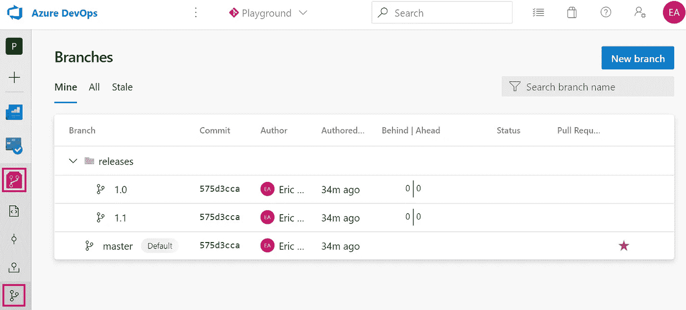
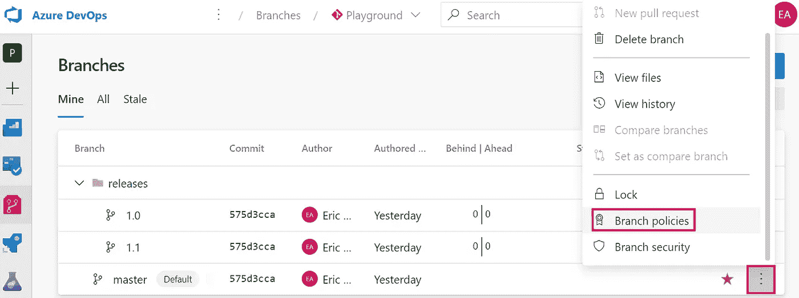
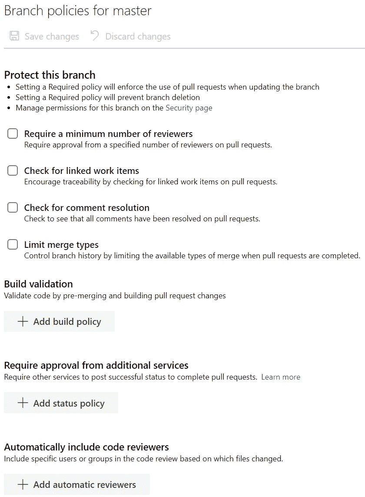
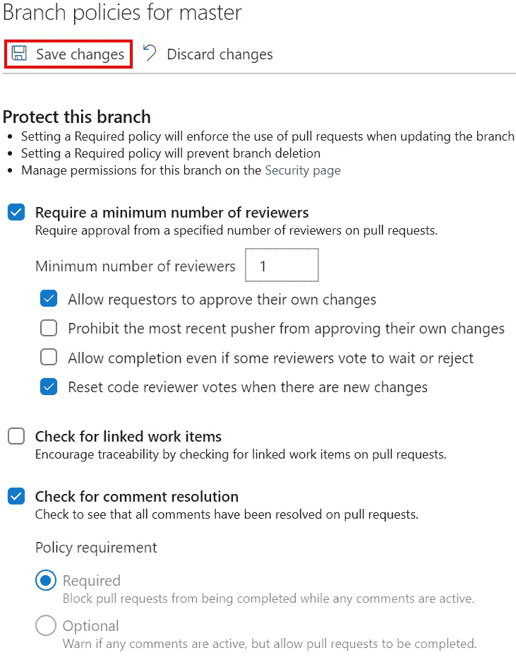
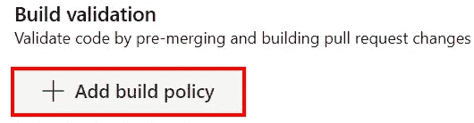
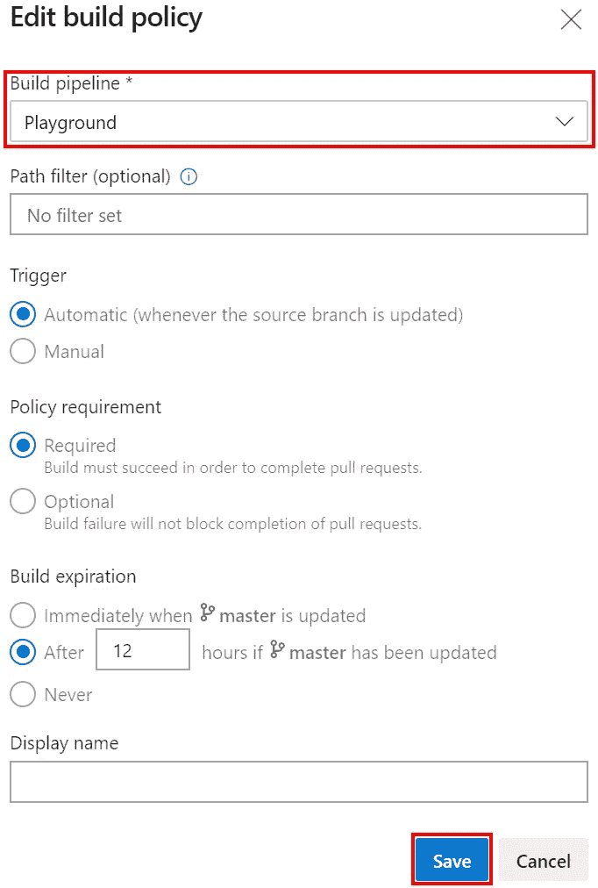
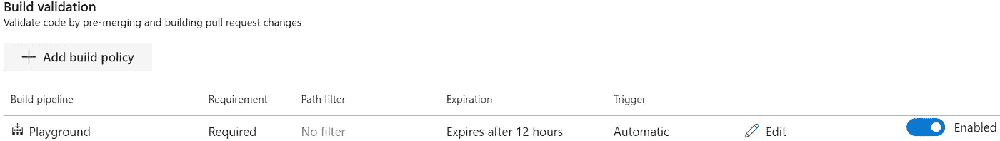

# Azure DevOps 回购:分支策略

> 原文：<https://itnext.io/azure-devops-repos-branch-policies-cbe7aed8df9a?source=collection_archive---------5----------------------->

在过去的几周里，我写了一系列关于 Azure DevOps Pipelines 的帖子，我发现我想写的一篇帖子如果不介绍 Azure Repos 的分支策略功能就没有意义。这篇文章假设你已经有了一个包含一些代码的 Azure DevOps 项目。如果没有，你可以看看我在[上发表的关于 Azure DevOps](https://elanderson.net/2020/02/getting-started-with-azure-devops/) 入门的帖子。

## 回购简介

这里使用的回购与上面链接的管道帖子中使用的回购相同，包含两个回购。NET Core 3.1 web 应用程序。repo 还包含三个分支(主版本、版本/1.0 和版本/1.1)。

值得注意的是，在分支名称中添加一个正斜杠会在 UI 中显示为一个文件夹，正如你在上面的截图中看到的**发布**一样。

## 编辑策略

将鼠标放在特定的分支或文件夹上，它会显示菜单的三个点。点击圆点，然后选择**分支策略**。对于本例，我们将策略放在主分支上。

这将带您进入允许您查看和编辑所选分支或文件夹上的策略的页面。

这些描述很好地解释了什么政策做什么，所以我不会重复它们来烦你。关于分支机构政策的[官方文件](https://docs.microsoft.com/en-us/azure/devops/repos/git/branch-policies?view=azure-devops)也有更多细节。如果你不合作，我强烈推荐使用**要求最少数量的评论**和**检查评论决议**。**构建验证**无论你的团队规模有多大，我都会推荐，因为它会让你远离拥有一台神奇的机器的可能性，而那是你的构建唯一可以工作的机器。下面的屏幕截图包含前两个建议策略集。为“需要最少数量的审阅”显示的设置是基于我的项目只有一个参与者这一事实。完成后，确认并点击**保存更改**按钮。

## 构建验证策略

关于构建验证策略还有更多内容，这就是为什么我将在不同的章节中讨论它。在**分支策略**屏幕上，点击**添加构建策略**按钮。

在 edit build policy 屏幕中，唯一需要的更改是选择**构建管道**,以便在针对策略所在分支的 PR 可用时使用。在这里，我们使用自动**触发器**，因此每当我们推送到我们的远程分支时，当它有一个打开的拉请求时，它将运行选择构建管道。**策略需求**控制在拉请求完成之前是否需要一个成功的构建。对于一个自人项目**来说，构建到期**没什么大不了的，但是如果你和一个团队一起工作，它会很有帮助。完成后点击**保存**。

回到 branch policies 屏幕，您会看到列出了新的要求。您还可以根据需要添加任意数量的构建验证。

## 包扎

希望这个快速进入分支策略将帮助您的团队提高进入您的分支的代码的质量。我知道在你签入之前，要求另外一两个人审查你的代码听起来会让你慢下来，如果你是这个概念的新手，但是实际上，这有助于在问题进入 QA 和生产之前发现问题，从长远来看，这可以节省时间和金钱。

*最初发表于* [*埃里克·安德森*](https://elanderson.net/2020/05/azure-devops-repos-branch-policies/) *。*