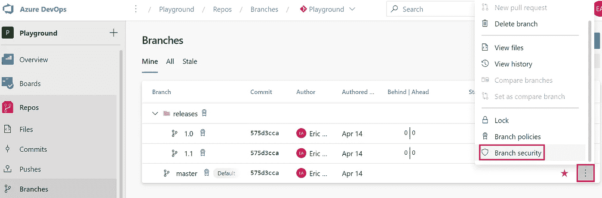
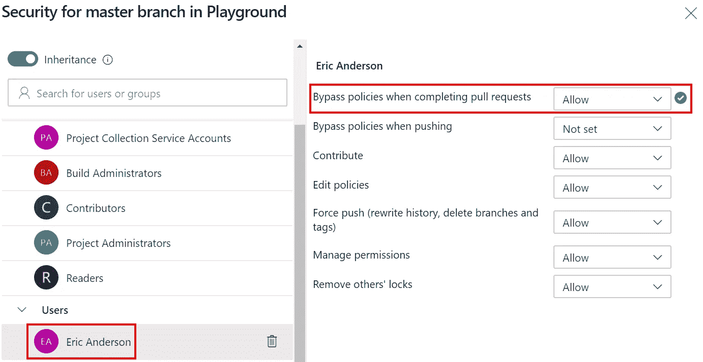
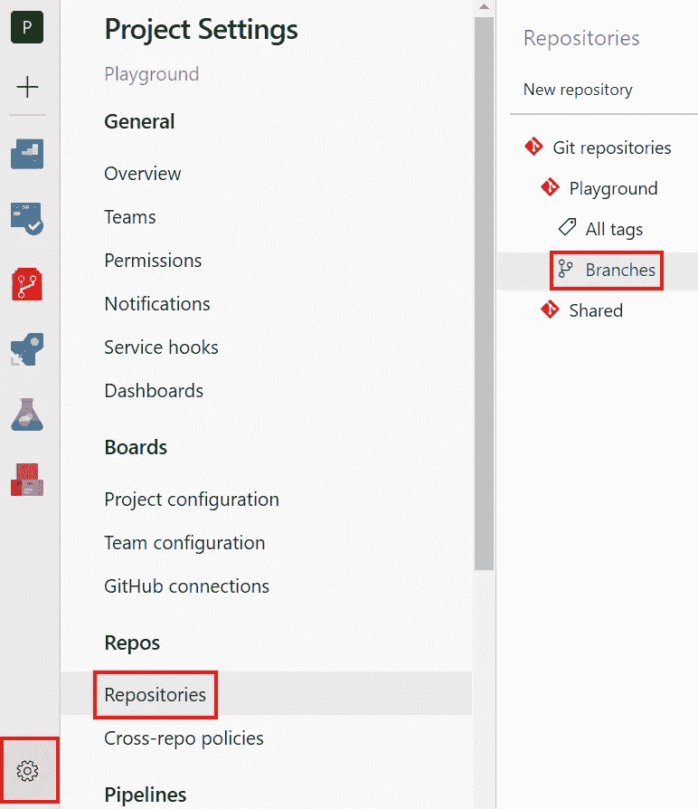
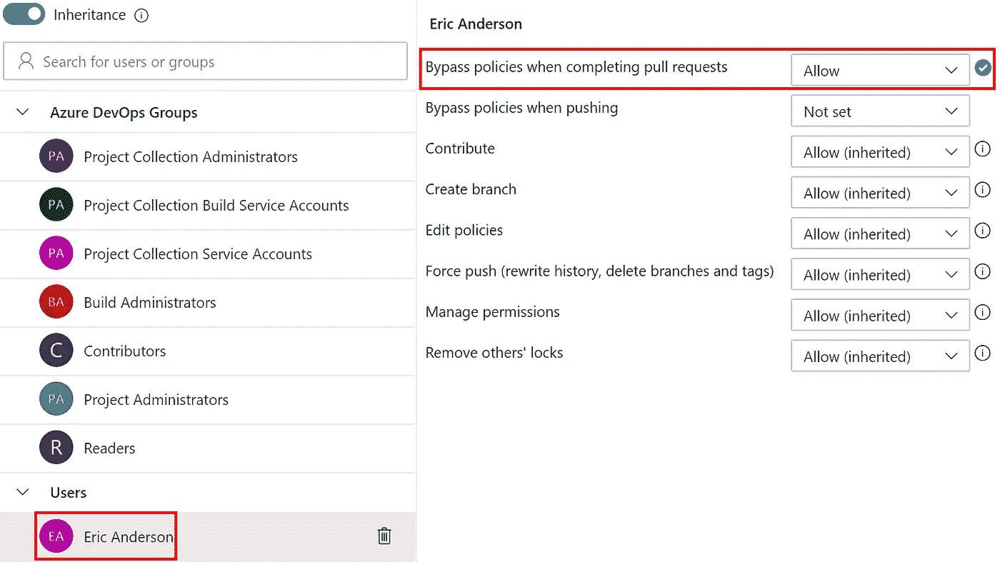
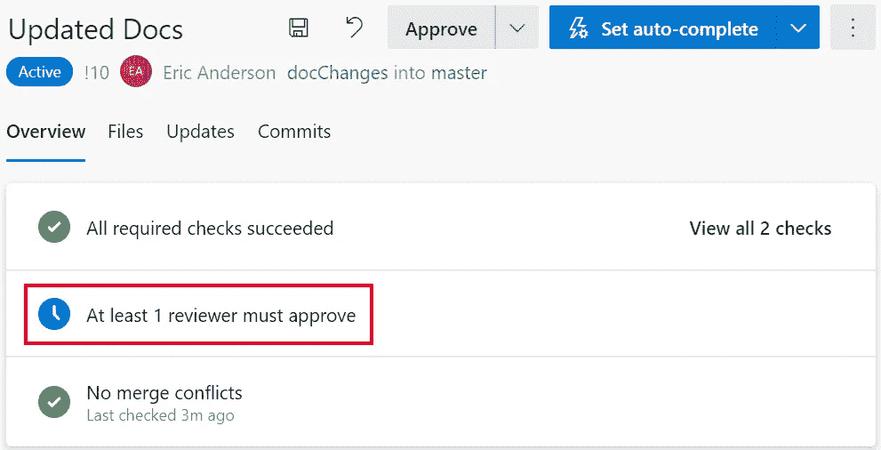
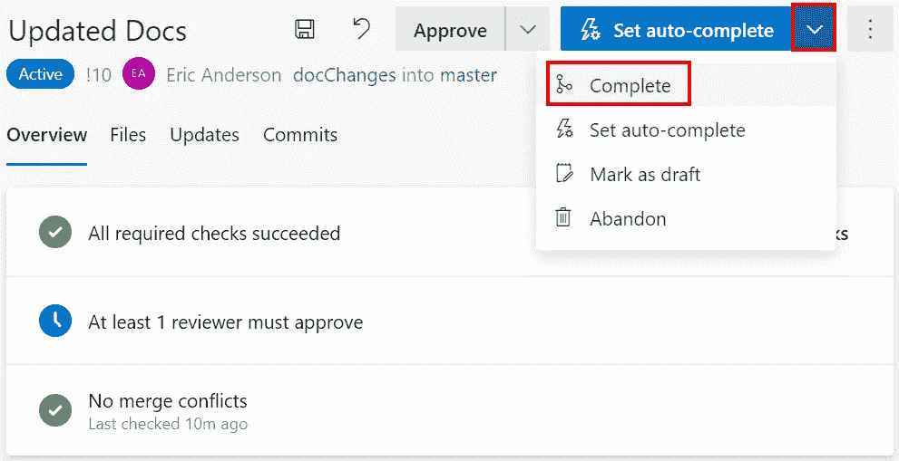
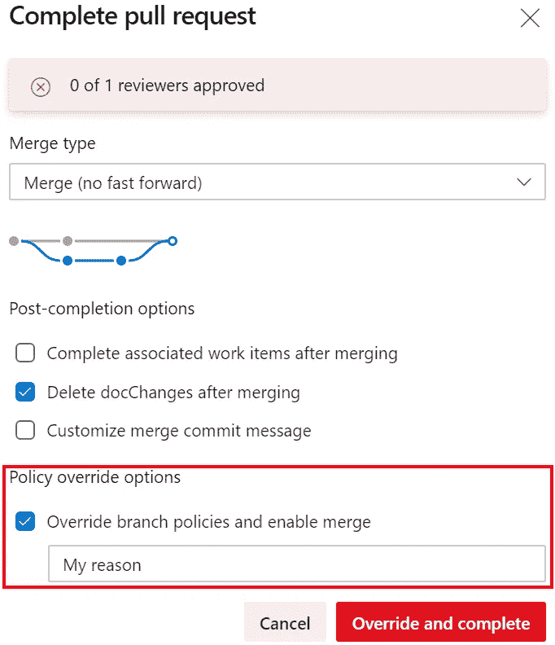
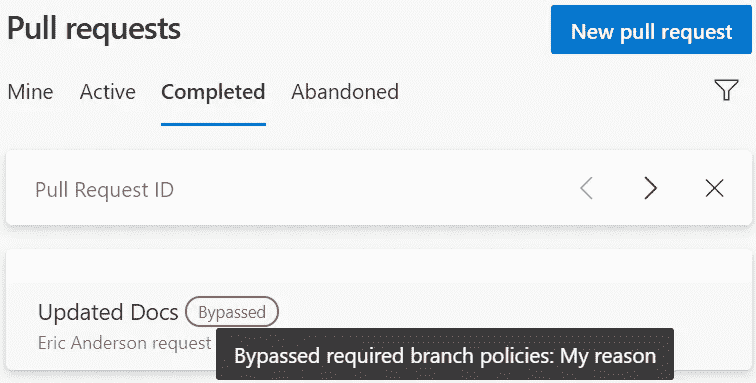

# Azure DevOps 回购:绕过分支策略

> 原文：<https://itnext.io/azure-devops-repos-bypass-branch-policies-1dece75b98ad?source=collection_archive---------1----------------------->

上周我们讨论了在 Azure DevOps Repo 中向分支添加分支策略，本周我们将讨论当您出于某种原因需要违反您设置的策略时会发生什么。

## 设置旁路安全性

有几种方法可以设置绕过，这取决于您希望授予某人绕过权限的范围。我们将从允许绕过单个分支的较窄选项开始(遗憾的是，安全选项目前像策略一样在文件夹级别可用)。从您的回购分支机构列表开始，将鼠标放在您要设置安全性的分支机构上，点击菜单上的三个点，选择**分支机构安全性**。

在显示“查找您想要更改安全性的用户”的对话框中，在本例中为埃里克·安德森。选择用户后，他们的具体设置将被加载到右侧。在**旁路策略上，当完成拉取请求**时，将选项更改为**允许**。

设置旁路安全性的第二个选项是在回购级别。从您的**项目设置**中的 **Repos** 下选择 **Repositories** ，然后在您想要设置策略的项目下选择 **Branches** 节点。

从这里开始，它与分支级别相同。找到您要更改安全性的用户，并在完成拉取请求时设置**旁路策略**到**允许**。

## 绕过拉取请求的策略

现在我们已经有了安全设置，我们将浏览一下旁路过程是什么样子的。在这里，我们有一个未得到审查者批准的拉取请求。

现在让我们说，由于某种原因，我们没有一个可用的审查者，我们需要在没有审查的情况下完成此 PR。使用**设置自动完成**按钮上的下拉菜单，点击**完成**。

当 PR 完成对话框显示时，您会注意到顶部有一个红色背景的部分，列出了尚未满足的策略。有了新发现的安全性，您还将拥有一个用于**策略覆盖选项**的部分。要继续并绕过策略，请选中**覆盖分支策略并启用合并**复选框，输入您的覆盖原因，然后单击**覆盖并完成**按钮。

请注意，采购申请被覆盖的事实在已完成的采购申请列表中是可见的，原因将在鼠标悬停在绕过的指标上时以及在采购申请的详细信息中显示。

## 包扎

分支策略很棒，它将帮助您确保在您的分支中生成的代码是高质量的，并且不会破坏您的构建。希望您不需要经常绕过您的策略，但是现在您知道如何不用临时删除策略或让人们习惯于盲目批准更改。

*原载于***。**