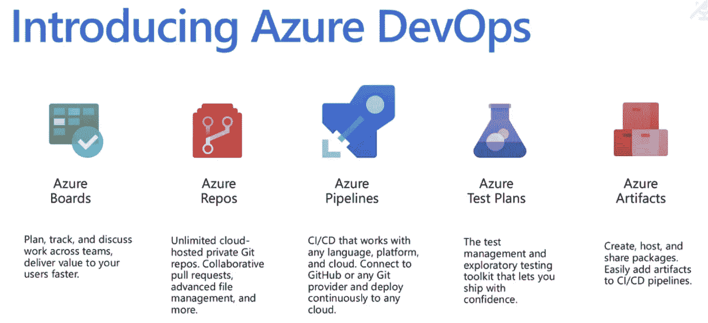
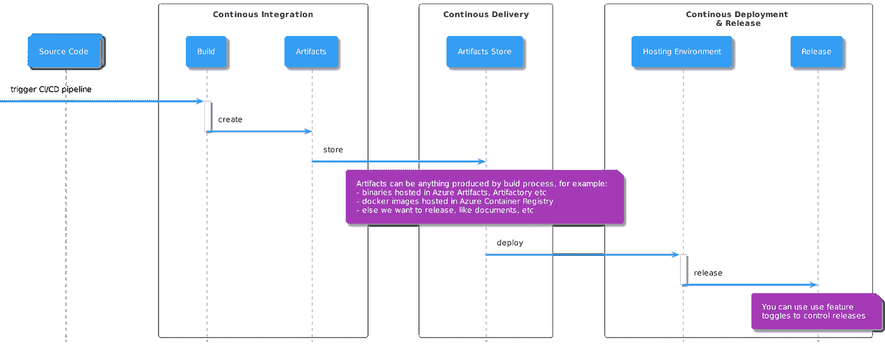
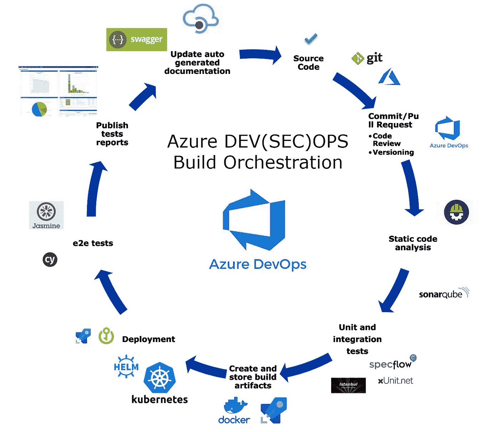
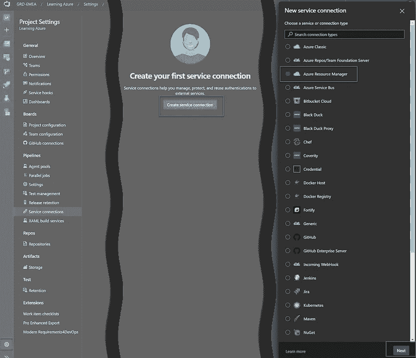
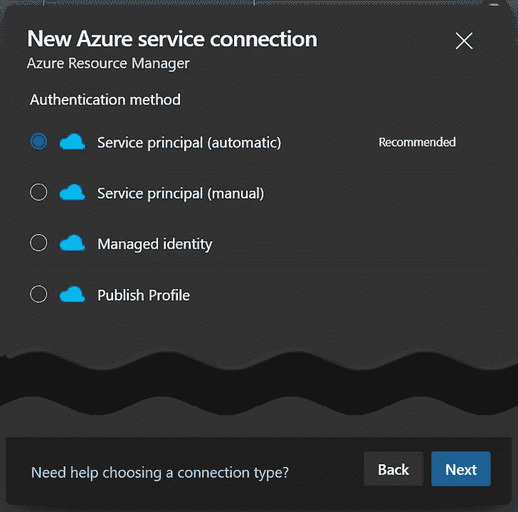
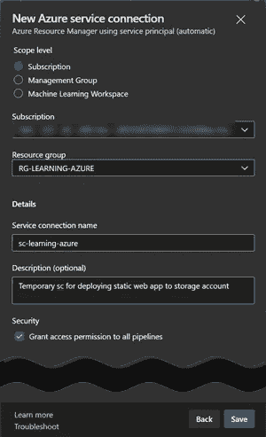
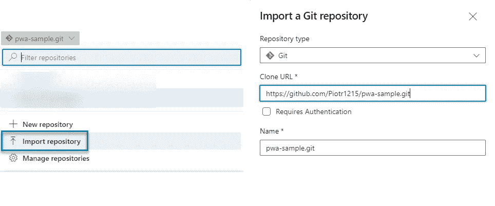
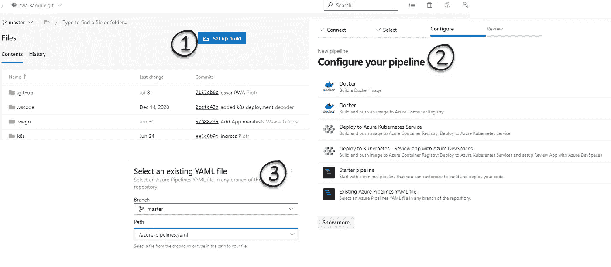
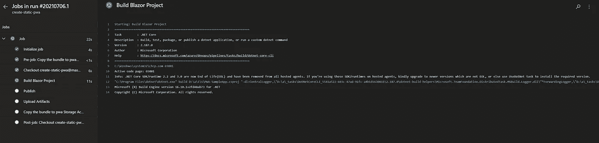

# Azure 解释的够深刻:Azure DevOps

> 原文：<https://itnext.io/azure-explained-deep-enough-azure-devops-210629b5480e?source=collection_archive---------6----------------------->


图片由来自 [Pixabay](https://pixabay.com/?utm_source=link-attribution&utm_medium=referral&utm_campaign=image&utm_content=3148393) 的[德克·伍特斯](https://pixabay.com/users/pcb-tech-2044000/?utm_source=link-attribution&utm_medium=referral&utm_campaign=image&utm_content=3148393)拍摄

关注 CI/CD 管道

## 介绍

这是 Azure 迷你系列的第四部 **Azure 解释的够深刻了**

[Part1: Azure 解释得够深刻:学习并获得认证](/azure-explained-deep-enough-learn-and-get-certified-95c928b0e16c)

[Part2: Azure 解释得够深刻:容器](https://medium.com/codex/azure-explained-deep-enough-containers-a516af1caab1)

[Part3: Azure 解释得够深刻:Azure PaaS](https://piotrzan.medium.com/azure-explained-deep-enough-azure-paas-321a0f16bd57)

第四部分:Azure 解释得够深刻:Azure DevOps

In this blog, we are going to look into Azure DevOps, CI/CD pipelines and Infrastructure as Code.

Before we take a closer look at Azure DevOps, let’s try to understand first what is **DevOps**

按照微软的说法，是:

> *devo PS 是开发(Dev)和运营(Ops)的综合体，是人员、流程和技术的结合，不断为客户提供价值。*
> 
> *devo PS 对团队意味着什么？DevOps 支持以前孤立的角色(开发、IT 运营、质量工程和安全)进行协调和合作，以生产更好、更可靠的产品。通过采用 DevOps 文化以及 DevOps 实践和工具，团队能够更好地响应客户需求，增强对他们构建的应用程序的信心，并更快地实现业务目标。*

我喜欢用这个简短的描述:

DevOps 是一种确保**持续的、自动化的、不间断的变更流程的方法**。对于软件来说，这种变化的趋势当然是新的特性和产品。

## 先看 Azure DevOps

Azure DevOps 是一套协作开发工具。Azure DevOps 的功能与 GitHub、GitLab、Bitbucket 等很多类似。事实上，微软[在 2018 年收购了 Github](https://news.microsoft.com/2018/06/04/microsoft-to-acquire-github-for-7-5-billion/) ，我推测 Azure DevOps 和 Github 的路线图将随着时间的推移而靠拢。

它使用*组织*作为顶级分组级别。您可以使用一个组织来分离业务单位、部门或不同的物理办公室，这由您决定。

每个组织(自动创建一个默认组织)都附带以下内容:

> *每个组织都有自己的免费服务等级(每种服务类型最多五个用户),如下所示。您可以使用所有服务，或者选择您需要的服务来补充您现有的工作流程。*
> 
> - Azure Pipelines:一个托管作业，每月 1，800 分钟用于 CI/CD 和一个自托管作业
> 
> - Azure 板:工作项跟踪和看板板
> 
> - Azure Repos:无限私人 Git repos
> 
> - Azure 工件:包管理
> 
> -无限的利益相关者
> 
> -五个 Azure DevOps 用户(基本)
> 
> -免费的 Microsoft 托管 CI/CD 层(一个并发作业，每月多达 30 小时)2 GiB Azure 工件存储
> 
> -一个自托管 CI/CD 并发作业

每个组织可以有一个或多个*项目*。组织仅用于分组和计费目的，项目是从用户角度与 Azure DevOps 进行所有交互的地方。

部署后，Azure DevOps 项目可以包含以下组件。



【https://azure.microsoft.com/en-us/services/devops/#overview 

有关所有服务的深入审查，请参考官方 [Azure DevOps 文档](https://docs.microsoft.com/en-us/azure/devops/user-guide/services?view=azure-devops)。

## 注册 Azure DevOps

有两种方法可以为 Azure DevOps 唱赞歌。今天我们要用 GitHub 集成。请按照这里概述的步骤[设置 Azure DevOps 服务。](https://docs.microsoft.com/en-us/azure/devops/user-guide/sign-up-invite-teammates?toc=%2Fazure%2Fdevops%2Fget-started%2Ftoc.json&bc=%2Fazure%2Fdevops%2Fget-started%2Fbreadcrumb%2Ftoc.json&view=azure-devops#sign-up-with-a-github-account)

## CI/CD

在所有的 Azure DevOps 服务中，我想更多地关注 CI/CD 流程。CI/CD 代表*持续集成/持续部署/交付*。从一个非常高的角度来看，CI/CD 看起来像这样:



来源:作者

让我们仔细看看图上发生了什么，并将其映射到 Azure DevOps 组件。

图上没有描述的部分是如何将工作分配给开发人员的，这里是 SCRUM 过程中的一个常见场景。

在 Azure 中，DevOps 工作来自从 PBIs 提炼的[用户故事](https://docs.microsoft.com/en-us/azure/devops/boards/work-items/agile-glossary?view=azure-devops#user-story)，PBIs 代表[产品积压项目](https://docs.microsoft.com/en-us/azure/devops/boards/work-items/agile-glossary?view=azure-devops#product-backlog-item)，所以让我们假设这里也是这种情况。

一旦开发人员开始开发用户故事，他们通常会创建一个单独的分支，通常称为[特性分支](https://docs.microsoft.com/en-us/azure/devops/repos/git/git-branching-guidance?view=azure-devops#use-feature-branches-for-your-work)，并将它与用户故事联系起来。

从这一点来看，该图提供了一般 CI/CD 管道的高级概述。

这当然是一个非常简单的管道，在现实生活中，管道通常要复杂得多。下面是一个更成熟的管道示例:



## 管道作为代码

传统上，Azure DevOps 及其前身 Team Foundation Service (TFS)中的管道是通过 GUI 创建和管理的。这是一个“基于点击”的过程的主要原因之一是，开发和运营团队是独立的孤岛。

[DevOps](https://devopedia.org/devops) 运动和 [Shift Left](https://devopedia.org/shift-left) 哲学的开始要求发明描述构建、部署和基础设施需求的新方法。开发人员应该被充分授权来设计和执行管道。基于这些要求，引入了代码为的[管道。](https://www.jenkins.io/doc/book/pipeline-as-code/)

# 演示

出于演示目的，我们将把一个示例静态网页部署到一个启用了静态网站托管选项的 Azure 存储帐户。

## 创建存储帐户

如果您想跟随演示，请遵循以下步骤:

登录 Azure 门户，选择云壳。如果你是第一次使用新账号登录，请按照本教程[激活云壳。一旦进入云 shell，确保选择 bash 环境并遵循下面的步骤。](https://docs.microsoft.com/en-us/azure/cloud-shell/overview)

```
*# Clone the exercise repository*
git clone https://github.com/ilearnazuretoday/azure-devops.git*# Switch to right directory*
cd azure-devops/terraform*# Initialize terraform with Azure Provider*
terraform init*# Validate terraform scripts*
terraform plan*# Create infrastructure, confirm with "yes"*
terraform apply
```

输出应该类似于以下内容:


地形输出

## 创建服务连接以允许部署

为了能够从我们的 Azure DevOps 服务部署到我们的 Azure 订阅，我们需要创建一个服务连接，以便在项目设置中启用它。

此操作将创建一个代表我们的 [*服务负责人*](https://docs.microsoft.com/en-us/azure/active-directory/develop/app-objects-and-service-principals) 帐户来建立连接。



> *好的做法是缩小权限范围！*

记下您的服务连接名称，管道设置将需要它。

# 部署示例静态网页

我们将直接从 GitHub 部署一个示例应用程序，但出于演示的目的，我们将首先将存储库克隆到我们的 Azure DevOps 中。

在 Azure DevOps 中很容易做到。点击存储库并使用[这个链接](https://github.com/Piotr1215/pwa-sample.git)来导入。



一旦存储库被导入 Azure DevOps，我们就可以设置 CI/CD 管道。CI/CD 管道 YAML 文件已经在存储库中，但是请记住调整更改

*   **azureSubscription** :上一步中的 *serviceConnectionName*
*   **存储** : *要从 terraform 输出部署到的存储帐户的名称*

以下是设置初始构建的步骤:



让我们看看管道文件，看看它包含什么。

管道文件描述了构建和部署我们的软件需要按顺序执行的步骤:

*   选择触发器(可以是分支、标记等)
*   确保排除不想触发管道的文件
*   为生成代理选择虚拟机映像
*   执行构建和部署步骤(特定于您要部署的内容)
*   将 YAML 文件签入到名为`azure-pipelines.yaml`的存储库中
*   触发代码中满足触发条件的更改，并将更改推送到远程
*   构建应该自动触发
*   在管道->管道菜单下，您可以实时观察管道日志



> *如果您有兴趣了解更多关于 PWA web 技术的信息，请查看* [*部署静态网站的 5 个选项*](/5-static-websites-deployment-options-d0aac1570331)

您可能想知道这些任务来自哪里？比如 AzureFileCopy 或者 DotNetCoreCLI 等等？这些任务大多是类型脚本程序或 PowerShell 脚本，你可以在 GitHub 上看到它们的[源代码！](https://github.com/microsoft/azure-pipelines-tasks/tree/master/Tasks)

任务是通用的和可重用的，你也可以自己写。

如果一切顺利，导航到 terraform 输出的 URL，您应该会看到一个静态页面部署完毕！尝试 CI/CD 流程。

*   尝试更改任何文件(除了 [README.md](http://README.md) )，管道触发了吗？
*   如果出现错误，dotnet 无法构建工件，会发生什么情况？

# 摧毁基础设施

如果你跟随演示，这一步**很重要**。为了避免不必要的费用，让我们删除资源，这是很容易做到这一点与 terraform。

```
*# Destroy all resources, confirm with yes*
terraform destroy
```

# 结论

我们已经覆盖了很多领域，一些概念可能会很新或者很混乱，尤其是如果你是 Azure 的新手。请不要气馁，而是试着一步一步地复习所有的东西，在你最不熟悉的领域加深你的知识。我试图重新创建一个接近真实流程的场景，这就是为什么有 IaC 和部署与核心 Azure DevOps 概念混合在一起。

你可以查看[我的其他博客](https://medium.com/@piotrzan)来了解更多。