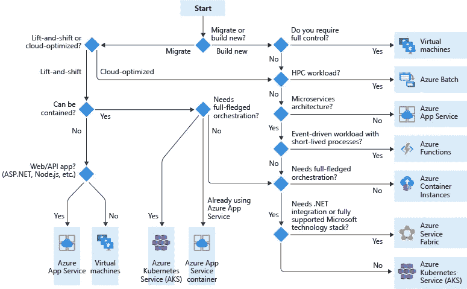
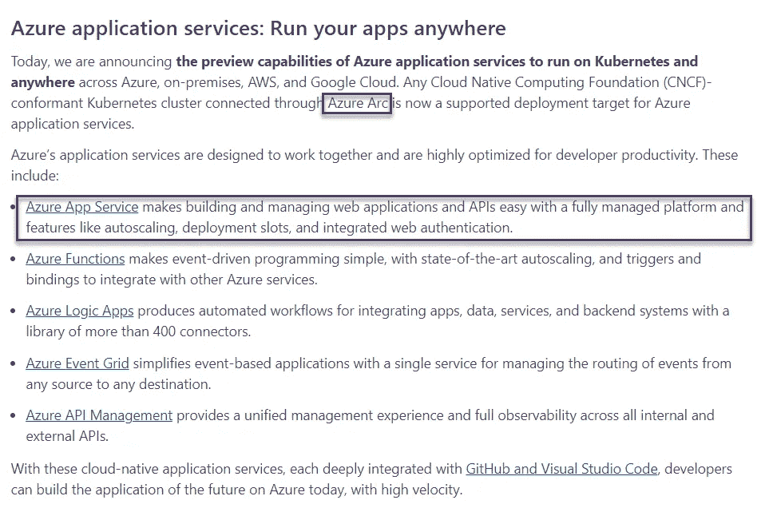
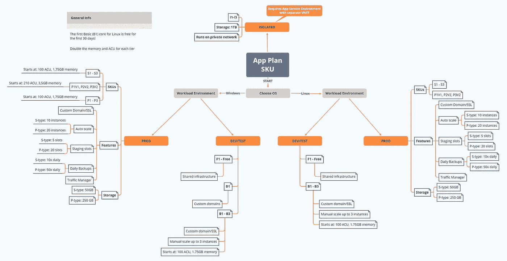

# Azure 解释得够深刻:Azure PaaS

> 原文：<https://itnext.io/azure-explained-deep-enough-azure-paas-321a0f16bd57?source=collection_archive---------4----------------------->


图片由 [PIRO4D](https://pixabay.com/users/piro4d-2707530/?utm_source=link-attribution&utm_medium=referral&utm_campaign=image&utm_content=1713170) 来自 [Pixabay](https://pixabay.com/?utm_source=link-attribution&utm_medium=referral&utm_campaign=image&utm_content=1713170)

## 容器上的应用服务

## 介绍

这是 Azure 迷你系列的第三部 **Azure 解释的够深刻了**

[Part1: Azure 解释得够深刻:学习并获得认证](https://medium.com/codex/azure-explained-deep-enough-learn-and-get-certified-95c928b0e16c)

[Part2: Azure 解释得够深刻:容器](https://piotrzan.medium.com/azure-explained-deep-enough-containers-a516af1caab1)

第三部分:Azure 解释得足够深刻:Azure PaaS

[第四部分:Azure 解释得足够深刻:Azure DevOps](https://piotrzan.medium.com/azure-explained-deep-enough-azure-devops-210629b5480e)

Azure App Service 是一个完全托管的服务，用于构建、部署和扩展您的 web 应用、web APIs 和其他服务器端工作负载。App Service 是 Azure PaaS 产品，PaaS 代表平台即服务。

## PaaS 提供商

除了 Azure，还有其他 PaaS 提供商，每个主要的云提供商都有自己的产品:

*   [GCP:谷歌应用引擎](https://cloud.google.com/appengine/)
*   [AWS:弹性豆茎](https://aws.amazon.com/elasticbeanstalk/)
*   虽然不是“大”云提供商，但我喜欢数字海洋的应用平台

还有一些有趣的小型 PaaS 提供商

*   Heroku 是第一家推出类似 PaaS 产品的公司
*   牧场主埃皮尼奥仍处于试验阶段，但非常有前景的 PaaS 产品

## PaaS 有什么好处？

从虚拟机到容器，现代软件基础设施相当复杂。从单一应用程序到无服务器，从本地模式到混合模式。一切都变得更加紧密，物联网和边缘需求每天都在推动着可能性的边界！像 [WASM](https://webassembly.org/) 、 [RISC-V](https://riscv.org/) 、Kubernetes、机器学习& AI、量子计算等等技术将彻底改变软件的创建、交付和个性化方式。

这一切都很棒，但是开发人员应该如何跟上所有的构建和部署选项呢？如何轻松监控和运营所有这些不同的工作负载？这就是 PaaS 的用武之地。

PaaS 通过在固执己见的默认值和配置选项之间提供**的良好平衡，弥合了底层托管平台和运行工作负载之间的差距**。

> *换句话说，一个好的 PaaS 产品将足够灵活以适应不同的需求和工作负载，并且足够智能以通过提供智能抽象层来隐藏基础架构的复杂性。*

## 选择托管您的微(服务)的位置

Azure 和其他主要的云提供商一样，提供了很多服务可供选择。大多数情况下，选项和服务的数量之多令人困惑。下图指导您完成决策过程，并帮助您了解 PaaS 产品在哪些方面是一个好的选择。

一般来说，如果你有一个通过 HTTP(s)面向消费者的工作负载，比如网页、web API 等，Azure App Service 是一个不错的选择。



*来源:*[*Azure docs*](https://docs.microsoft.com/en-us/azure/architecture/guide/technology-choices/compute-decision-tree)

除了标准的托管选项，现在可以在任何地方运行支持 Azure Arc 的 Kubernetes 上的应用服务。这是一个非常有趣的功能，因为它扩展了 Azure 应用服务控制平面，并在 Kubernetes 上运行，这意味着如果你已经在 Azure 上运行了应用服务，你可以在 Kubernetes 集群上本地运行它们，并像在 Azure 本身一样使用 Azure 应用服务抽象。



*更多详情请参考本博客*[](https://azure.microsoft.com/en-us/blog/build-cloudnative-applications-that-run-anywhere/#azure-application-services:-run-your-apps-anywhere)

## **选择应用服务 SKU 计划**

**最后，为了运行我们的应用服务，我们需要选择一个 SKU(库存单位)计划，它将定义底层基础设施的功能。**

**在这里，我们可以决定我们的基础设施应该有多少 CPU 和 RAM，有什么自动扩展规则和其他功能，如支持自定义证书或自定义域名等。**

> ***有关可用配置选项的完整列表，请参考* [*Azure 文档*](https://docs.microsoft.com/en-us/azure/app-service/overview-hosting-plans)**

**由于没有好的图形表示来帮助我们选择 SKU(类似于帮助我们选择我们服务的主机选项)，我创建了一个:**

****

# **演示**

**我们将部署 Azure 基础设施，并使用带有 Azure Container Registry 的应用服务来部署在 docker 容器中运行的示例 web 应用。**

## **基础设施**

**为了设置我们的测试基础设施，我们将利用 Azure Cloud Shell 附带预安装的 terraform 这一事实。**

**你不需要熟悉 terraform，所有的命令都会提供，但是记住**在执行**之前一定要从网上查脚本。所有脚本都是学习资源库[的一部分，这里是](https://github.com/ilearnazuretoday/create-app-service/tree/main/terraform)。**

**请随意派生存储库并做出自己的更改。需要注意的一点是，一旦您开始输入 terraform 命令，就会生成 terraform 状态文件。Terraform 状态文件包含您不想提交到存储库的敏感信息。 *terraform* 文件夹中的`.gitignore`将排除状态文件添加到存储库中，因此请不要删除该文件。**

**登录 Azure 门户，选择云壳。如果你是第一次使用新账号登录，请按照本教程[激活云壳。](https://docs.microsoft.com/en-us/azure/cloud-shell/overview)**

**一旦进入云 shell，请确保选择 *bash* 环境并遵循以下步骤。**

```
***# Clone the exercise repository*
git clone https://github.com/ilearnazuretoday/create-app-service*# Switch to right directory*
cd create-app-service/terraform*# Initialize terraform with Azure Provider*
terraform init*# Validate terraform scripts*
terraform plan*# Create infrastructure, confirm with "yes"*
terraform apply**
```

**上面的命令应该创建我们的 Azure 基础设施和。继续从 terraform 输出中复制 URL，您应该会从我的 Docker Hub 注册表中看到一个[示例 PWA 网页](https://hub.docker.com/repository/docker/piotrzan/blazorindocker)。**

****

## **部署应用程序**

**在这里，我们有各种选项可以选择，从 nginx-demo 文件夹部署一个样本 HTML 页面，用另一个容器替换 app service 容器，设置 CI/CD 管道，等等。如果您感兴趣，请按照说明进行操作。**

**将登录详细信息检索到我们的 Azure 容器注册表中，这样我们就可以使用示例 web 应用程序推送图像**

```
***# Capture resource group name output from terraform into a variable*
export RG_NAME=$(terraform output --raw resource_group)*# Capture ACR name output from terraform into a variable*
export ACR_NAME=$(terraform output --raw acr_name)*# Capture app service name into a variable*
export APP_NAME=$(terraform output --raw app_service_name)*# Obtain user name for the ACR*
export ACR_USERNAME=$(az acr credential show --resource-group $RG_NAME_ --name $ACR_NAME --query username)*# Obtain password for the ACR*
export ACR_PASSWORD=$(az acr credential show --resource-group $RG_NAME_ --name $ACR_NAME --query passwords[0].value)**
```

## **从 Azure Cloud shell 本地构建映像**

**由于 docker 守护进程没有在云 shell VM 中运行，我们必须使用 *az acr build* 命令来构建映像并将其部署到 acr。**

```
***# Navigate to folder with demo app*
cd ../nginx-demo*# Use az cli to build and upload container to ACR*
az acr build --image nginx-demo:1.0 \
    --registry $ACR_NAME \
    --file Dockerfile .**
```

## **为我们的应用服务设置新推送的图片**

**现在，我们可以为我们的应用程序服务设置图像。请注意，出于教育目的，所有这些行为都是以“强制”方式进行的。在真实的场景中，将建立 CI/CD 管道来处理变更和更新的流程**

```
**az webapp config container set --name $APP_NAME \
    --resource-group $RG_NAME \
    --docker-custom-image-name nginx-demo:1.0 \
    --docker-registry-server-url "https://$ACR_NAME.azurecr.io" \
    --docker-registry-server-user $ACR_USERNAME \
    --docker-registry-server-password $ACR_PASSWORD**
```

**稍等片刻，以便 Azure 可以刷新图像并导航到相同的地址，您应该会看到一个 nginx 演示页面。**

## **摧毁基础设施**

**这一步很重要，这样你就可以避免不必要的费用。让我们移除资源，使用 terraform 很容易做到这一点。**

```
***# Navigate to folder with demo app*
cd ../terraform*# Destroy all resources, confirm with yes*
terraform destroy**
```

# **结论**

**Azure PaaS，App Service 是一个非常通用和强大的服务。我们已经学会了何时使用它，如何选择正确的 SKU，最后如何按照代码实践中的**基础设施部署一个样本工作负载。****