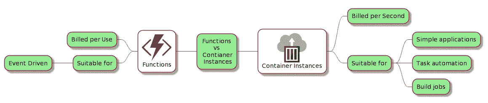

# Azure 解释得够深刻了:容器

> 原文：<https://itnext.io/azure-explained-deep-enough-containers-a516af1caab1?source=collection_archive---------0----------------------->


迪安·布瑞尔利在 [Unsplash](https://unsplash.com/s/photos/oil-platform?utm_source=unsplash&utm_medium=referral&utm_content=creditCopyText) 上的照片

## Azure 容器实例

## 介绍

这是 Azure 迷你系列的第二部 **Azure 解释的够深刻了**

[Part1: Azure 解释得够深刻:学习并获得认证](https://medium.com/codex/azure-explained-deep-enough-learn-and-get-certified-95c928b0e16c)

第二部分:Azure 解释得足够深刻:容器

[第三部分:Azure 解释得足够深刻:Azure PaaS](https://piotrzan.medium.com/azure-explained-deep-enough-azure-paas-321a0f16bd57)

[Part4: Azure 解释够深:Azure DevOps](https://piotrzan.medium.com/azure-explained-deep-enough-azure-devops-210629b5480e)

## Azure 容器实例

容器现在是一个成熟的解决方案，提供了额外的基础设施抽象级别。在许多情况下，容器可以取代传统上由虚拟机驱动的工作负载。

把一个容器“扔”给云提供商，然后说“嘿，这是我的容器，让它工作吧!”,这不是很好吗？ACI (Azure 容器实例)就是这么做的！其他主要的云提供商也有类似的产品，如 GCP 云运行或 AWS Far Gate。

与本系列中的其他博客一样，附带代码的 repo 可从[这里](https://github.com/ilearnazuretoday/create-aci)获得。

# 先决条件

如果您想跟进，请确保准备好以下内容:

*   [获得免费 Azure 订阅](https://azure.microsoft.com/en-us/free/)
*   [安装 Azure CLI](https://docs.microsoft.com/en-us/cli/azure/install-azure-cli)
*   [安装 Docker 桌面](https://www.docker.com/products/docker-desktop)

你可以在桌面上使用 Azure CLI，或者直接在 Azure shell 中执行命令。请阅读本系列的第一部分了解更多详情。

# 概观

在这堂 Azure 课中，我们将看看 Azure 容器实例。服务是关于什么的，它带来了什么好处，架构看起来怎么样，如何从一个简单的例子开始。

Azure Container Instances 是一个计算产品，它在轻量级 Azure 功能和更复杂但成熟的 Azure Kubernetes 服务之间架起了一座桥梁。


*来源:*[*https://docs . Microsoft . com/en-us/azure/container-instances/container-instances-container-groups*](https://docs.microsoft.com/en-us/azure/container-instances/container-instances-container-groups)

ACI 最适合可以独立运行的容器化工作负载、简单的应用程序、包括数据科学模型在内的批处理作业、各种任务自动化和集成场景。

*   **快速启动:**几秒钟启动容器。
*   **每秒计费:**仅在容器运行时产生费用。
*   **虚拟机管理程序级安全性:**完全隔离您的应用程序，就像它在虚拟机中一样。
*   **自定义大小:**指定 CPU 内核和内存的精确值。
*   **持久化存储:**将 Azure 文件共享直接挂载到一个容器中，以检索和持久化状态。
*   **Linux 和 Windows:** 使用相同的 API 调度 Windows 和 Linux 容器。

## ACI 和 Azure 函数之间的差异

这里有一张图片，展示了 Azure Functions (Azure 无服务器产品，将在以后的博客中介绍)和 ACI 之间的主要区别。



经验法则是，如果你有一个现有的容器，使用 ACI。如果你需要可移植性，使用 ACI。

## 练习

我们将部署一个示例网页。这个想法是，通过 docker CLI 和 ACI，我们可以直接从 docker 命令行快速原型化、测试和部署！

> 重要说明:此流程仅用于测试目的，在真实代码场景中，您将让 CI/CD 管道为您部署应用程序。

我们将通过运行 docker 守护进程来使用 bash，但是同样的情况当然也可以通过`powershell`来实现。

> Docker CLI 现在包含通过一个上下文命令与 Azure 容器实例的内置集成。使用 Azure CLI 时，您可以通过键入`*_az interactive_*`来激活*Azure Interactive*。这是 Azure CLI 的一个实验性特性，它给你参数完成和更多！**

**现在让我们部署一个测试容器！**

## **创建 Azure 资源组**

**为培训目的创建资源组。您可以使用此脚本在 Azure 中快速创建或删除资源组，或者使用 Azure Portal 执行相同的操作:**

**或者只是**

```
**az group create — name myResourceGroup — location location**
```

## **创建 Azure 容器注册表**

**我们需要 Azure 容器注册表来存储我们的图像，简单的命令就可以做到这一点**

```
**az acr create — resource-group myResourceGroup \ — name myContainerRegistry — sku Basic**
```

## **部署示例 Web 应用程序**

**作为“热身”练习，我们将部署一个示例 hello world web 应用程序。**

1.  **运行[ACI hello-world image](https://hub.docker.com/r/microsoft/aci-helloworld)**
2.  **太好了！现在显示 FDQN 地址并使用浏览器查看容器运行:`az container show --resource-group your-resource-group --name learning-azure --query "{FQDN:ipAddress.fqdn,ProvisioningState:provisioningState}" --out table`您应该看到“欢迎使用 Azure 容器实例！”如下图。**
3.  **检查 Azure 中的容器组**
4.  **清理资源**

*   **运行`az container delete --resource-group your-resource-group --name learning-azure`删除容器运行此命令会完全删除容器组，因此不收费。**

****

**成功！**

## **部署样例 Go API**

**用 Go API 构建 docker 容器**

```
**docker build -t myContainerRegistry.azurecr.io/go-api:v1.0 .**
```

***在此建立形象的注意事项。我们正在使用*多阶段构建*来缩小映像大小，并使用*分发*Linux 基础映像来降低潜在的攻击面。“发行版”映像只包含您的应用程序及其运行时依赖项。它们不包含包管理器、shells 或任何其他您期望在标准 Linux 发行版中找到的程序。在构建映像时，我们用命令输出类的调试信息来修饰* Dockerfile *。为此，运行带有* `*--progress=plain*` *标志的构建命令，如下所示***

```
***docker build --progress=plain -t* myContainerRegistry*.azurecr.io/go-api:v1.0 .***
```

***这将产生命令到标准输出的输出。请阅读*文档*中的注释了解更多信息。***

**使用容器的另一种方法是在容器内部运行测试，这种方法可以在本地或管道中进行测试，而不需要管道中的显式步骤。从一个不同的文件创建另一个图像，就像这样**

```
***docker build --progress=plain -f Dockerfile.test -t* myContainerRegistry*.azurecr.io/go-api:test .***
```

## **将容器推送到我们的注册表**

```
**docker push myContainerRegistry.azurecr.io/go-api:v1.0**
```

**您可能需要提供 ACR 用户名和密码来启动容器。让我们将它们捕获到变量中(这里分别是针对 Linux 和 Windows 的命令)**

****Linux:****

```
**ACR_USERNAME=$(az acr credential show --resource-group your-resource-group --name myContainerRegistry--query username)ACR_PASSWORD=$(az acr credential show --resource-group your-resource-group --name myContainerRegistry --query passwords[0].value)**
```

****视窗:****

```
**$Env:ACR_USERNAME=$(az acr credential show --resource-group your-resource-group --name myContainerRegistry--query username) $Env:ACR_PASSWORD=$(az acr credential show --resource-group your-resource-group --name myContainerRegistry --query passwords[0].value)**
```

## **运行 go API 容器**

```
**az container create --registry-username $ACR_USERNAME --registry-password $ACR_PASSWORD --resource-group your-resource-group --name learning-azure-api --image myContainerRegistry.azurecr.io/go-api:v1.0 --dns-name-label learning-aci-api --ports 8080az container create --registry-username $Env:ACR_USERNAME --registry-password $Env:ACR_PASSWORD --resource-group your-resource-group --name learning-azure-api --image myContainerRegistry.azurecr.io/go-api:v1.0 --dns-name-label learning-aci-api --ports 8080**
```

**现在显示 FDQN 地址，并使用浏览器查看容器运行情况:**

**`az container show --resource-group your-resource-group --name learning-azure-api --query "{FQDN:ipAddress.fqdn,ProvisioningState:provisioningState}" --out table`**

1.  **获取容器 IP 并导航到它，附加`:8080/version`来调用 API**
2.  **检查集装箱日志`az container logs --resource-group your-resource-group --name learning-azure-api`**
3.  **清理资源**

*   **运行`az container delete --resource-group your-resource-group --name learning-azure-api`删除容器运行此命令会完全删除容器组，因此不收费。**

**我们已经看到将容器组直接部署到 Azure 容器实例是多么容易。这对于测试和快速内部开发循环非常有用。**

## **结论**

**容器是一种强大的打包和运行时机制，让云原生应用成为现实。所有主要的云提供商都提供无缝运行容器的服务。我们已经看到了如何在 Azure 中实现这一点。**

**如果你想了解更多，有很多很棒的博客和教程，看看你有没有兴趣。**

*   **[撰写 CLI ACI 集成现已推出](https://www.docker.com/blog/compose-cli-aci-integration-now-available/)**
*   **[ACI 定价](https://azure.microsoft.com/en-gb/pricing/details/container-instances/)**
*   **[Docker 文档](https://docs.docker.com/engine/context/aci-integration/)**
*   **[部署《我的世界》](https://www.docker.com/blog/deploying-a-minecraft-docker-server-to-the-cloud/)**
*   **[撰写规范](https://www.compose-spec.io/)**
*   **[VS 代码集成](https://cloudblogs.microsoft.com/opensource/2020/07/22/vs-code-docker-extension-azure-containers-instances/)**
*   **[Azure ACI 快速入门](https://docs.microsoft.com/en-us/azure/container-instances/quickstart-docker-cli)**
*   **[微软学习](https://docs.microsoft.com/en-us/learn/modules/run-docker-with-azure-container-instances/)**
*   **[Git 回购为卷](https://docs.microsoft.com/en-gb/azure/container-instances/container-instances-volume-gitrepo)**
*   **[Mark Russinovich 和 Scott Hanselman 在 Azure Friday 进行了非常酷的演示](https://www.youtube.com/watch?v=7G_oDLON7Us&ab_channel=MicrosoftAzure)**