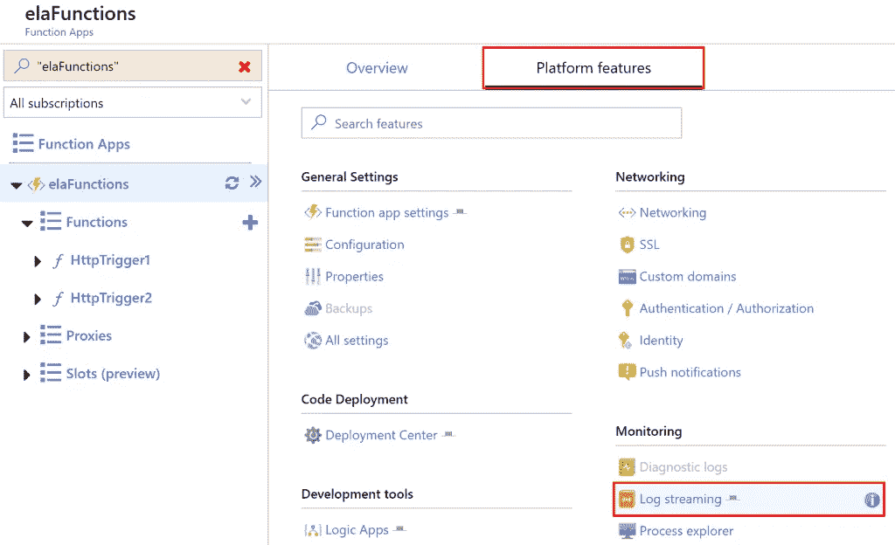
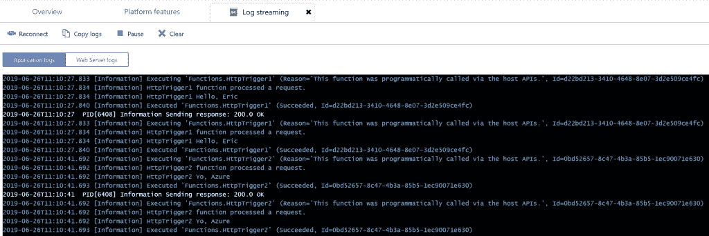

# Azure 功能应用程序日志流

> 原文：<https://itnext.io/azure-function-app-log-streaming-8ec57286496b?source=collection_archive---------10----------------------->

我在探索 Azure Function 应用时注意到的一件事是，找到跟踪执行过程中发生了什么的方法非常重要。在探索我的一个功能应用的 Azure 门户时，我注意到了一个流日志的选项。这篇文章将展示如何获得一个功能应用的流日志。

## 日志流位置

从 Azure 门户打开你的功能应用，选择**平台功能**，然后点击**日志流**链接。

## 日志流视图

下面的截图来自我的示例应用程序，列出了两个不同的函数执行。

## 包扎

对于这个小样本应用程序来说，这个特性并不重要，但是对于一个较大的应用程序来说，它会变得更加重要。日志流是了解正在发生的事情的一种快速方法，但只是了解正在发生的事情的一部分。

*原载于***。**