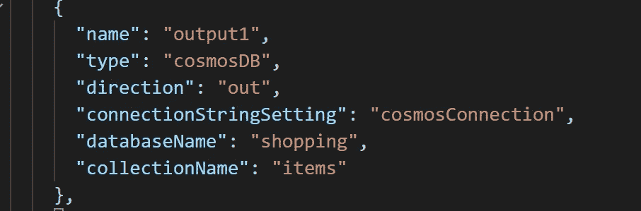

# Azure 函数 HTTP Worker /自定义处理程序:绑定和模式

> 原文：<https://itnext.io/azure-functions-http-worker-bindings-and-schemas-f32f126a3654?source=collection_archive---------4----------------------->



我最近一直在关注 Azure Functions 团队的新 HTTP Worker 特性——参见[这篇文章](https://medium.com/@damoo/write-azure-functions-in-any-language-with-the-http-worker-34d01f522bfd)的概述和入门。

这篇文章着眼于用你选择的语言编写非 http 触发的函数。我们将看到一个非常常见的场景:*一个函数被一个队列触发，然后将输出存储在另一个队列和一个 cosmos 集合中。*

这里看一个工作样本:[https://github.com/damoodamoo/azure-func-go-java](https://github.com/damoodamoo/azure-func-go-java)。

## 您需要做的事情:

*   创建`function.json`文件来配置绑定
*   创建一个 API 端点来接收输入绑定对象
*   对我们获得的数据做“一些事情”(对于我们的示例来说，做什么并不重要)
*   创建一个新的输出对象发送回函数宿主。

我们将用 Java 来做这件事——但是你也可以使用你自己选择的语言。

# 输入和输出绑定

当使用 HTTP Worker 时，我们不再使用任何代码注释进行绑定，只使用 json。你可以在文档[这里](https://docs.microsoft.com/en-us/azure/azure-functions/functions-triggers-bindings#supported-bindings)找到所有支持绑定的例子。

## 函数. json

让我们看一个 function.json，它将导致存储队列触发一个函数，并将其结果发送到另一个队列和一个 cosmos 集合:

## 绑定->对象

对于 HTTP Worker，所有的函数输入绑定都包装在一个`InvokeRequest`对象中，所有发送回函数主机的输出绑定都需要包装在`InvokeResponse`对象中。这些是看起来像这样的普通物体:

**InvokeRequest - >数据进入您的函数**

```
{
  "data": {... some data...}
  "metadata": {...}
}
```

在 Java 中，这看起来像:

InvokeRequest.java

**调用响应- >数据流出您的函数**

下面是函数宿主期望从您那里返回的对象的形状:

```
{
  "outputs": { 
    "output1": {..some data..},
    "output2": {..some data..},
  },
  "logs": {
    "Log message 1",
    "Log message 2",
  },
  "returnValue": {..some data..}
}
```

在 Java 中，这看起来像:

# 我们的 API

现在让我们创建 API 端点来接收`InvokeRequest`并返回`InvokeResponse`对象:

在上面的代码中，我们简单地获取请求中给我们的`.Data`有效负载(队列项数据)，并将其传递给输出绑定(名为`output1`和`output2`)。显然，你可能想对这里的数据做点什么:)

注意输出绑定与`function.json`的关系:

```
{
  "name": "**output1**", 
  "type": "cosmosDB",     
  ...
},
{ "name": "**output2**",
  "type": "queue",
  ...
}
```

# 更高级的 HTTP 绑定

因为 HTTP 响应也是一个输出绑定，所以您可以使用这种方法来提供更加定制的响应。*注意*:如果你的函数是 http in 和 out，你不需要*这样做(你可以返回任意的有效载荷)，但是它给了你更多的控制，比如状态代码和响应。

注意在上面的代码中，我们现在可以在返回 HTTP 时指定一个状态代码和自定义头。