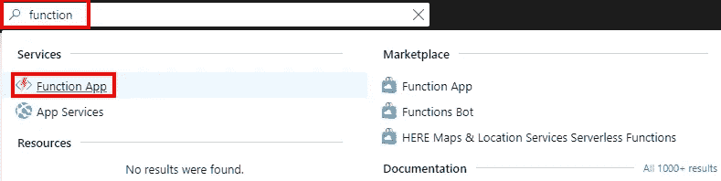
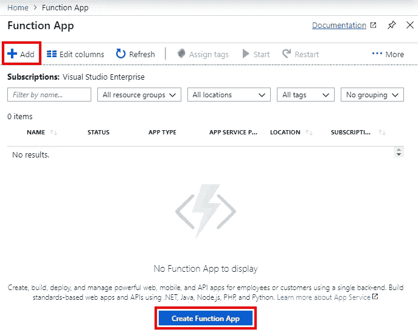
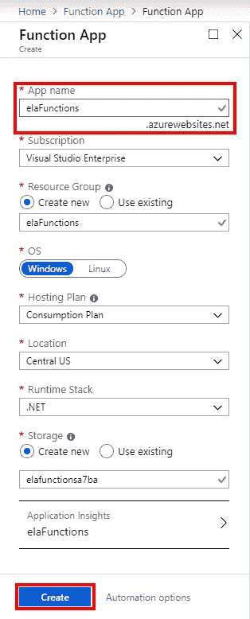
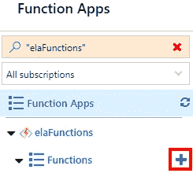
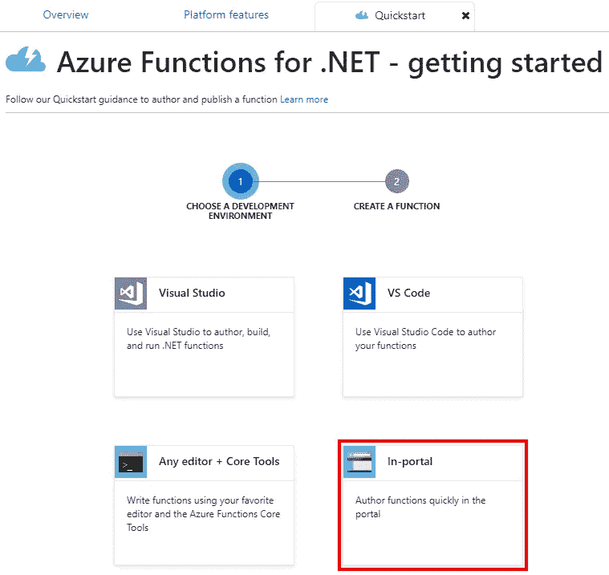
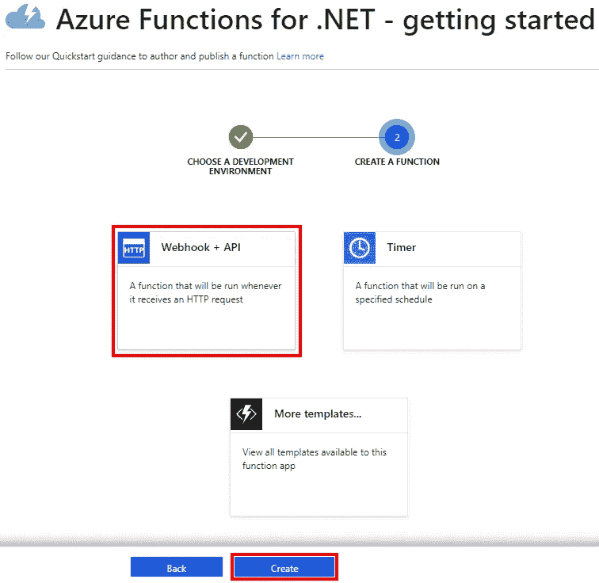
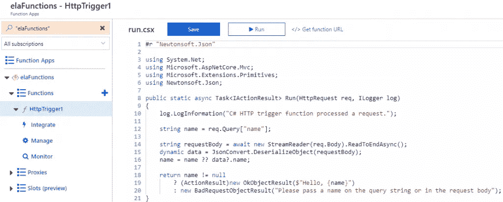
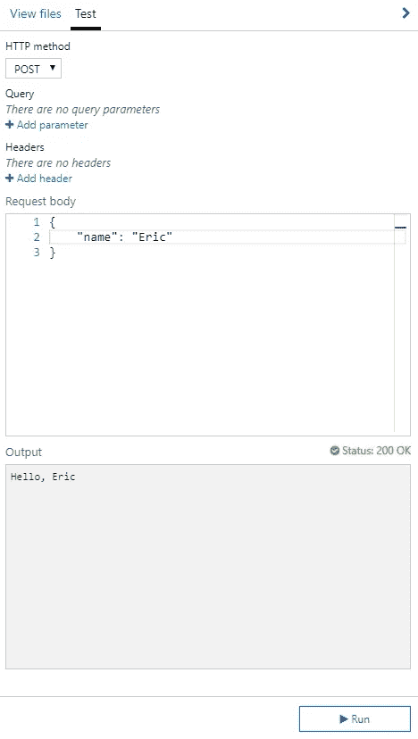

# Azure 功能介绍

> 原文：<https://itnext.io/azure-functions-introduction-4fbec65ecedc?source=collection_archive---------5----------------------->

最近无服务器似乎很流行。每个主要的云提供商都有一个无服务器的产品，带有 [Azure 功能](https://azure.microsoft.com/en-us/services/functions/)、 [AWS Lambda](https://aws.amazon.com/lambda/) 和[谷歌云功能](https://cloud.google.com/functions/)。无服务器功能的一大卖点是基于您的工作负载的自动扩展和低成本。

例如，Azure 使用消费计费，你可以免费获得 100 万次执行，每增加 100 万次执行只需花费 0.20 美元。它确实变得更加复杂，因为根据执行时间和资源消耗混合收费，但是您可以查看[定价页面](https://azure.microsoft.com/en-us/pricing/details/functions/)了解详细信息。

这篇文章将涉及创建和调用一个非常简单的函数。注意，你需要一个 Azure 账户，如果需要，你可以[注册一个免费账户](https://azure.microsoft.com/free)。

## 功能应用程序创建

从 Visual Studio 到 Azure CLI，有很多选项可以用来创建一个新函数。在这篇文章中，我们将使用 Azure 门户来创建我们的功能。进入门户网站，使用顶部的搜索框搜索**功能**，并在结果中选择**功能应用**。

以上将带你到你的功能应用列表。点击页面顶部的**添加**按钮或者**创建功能 App** 按钮，创建一个新的功能 App。

下一步有很多选项，但首先，我们将输入一个名为的**应用程序，并采用其余选项的默认值，然后单击**创建**。**

单击创建将会对新功能应用的部署进行排队，并返回到您帐户上的功能应用列表。几分钟后，你的新应用应该会显示在列表中，这花了我将近 3 分钟的时间。一旦你的应用程序出现在列表中，选择它。

## 添加功能

现在我们有了一个函数应用程序，是时候添加一个函数了。在菜单上点击功能旁边的 **+** 。

下一个屏幕将要求您选择一个开发环境。我将使用**入口内**选项。做出选择后，点击**继续**。

下一页将询问如何触发该函数。我们将使用 **Webhook + API** 选项。触发器有很多选项，我建议选择更多模板选项，并在某个时候进行探索。完成后点击**创建**按钮。

创建完成后，您将看到新函数的代码，默认情况下，它接受一个带有名称的请求，并使用提供的名称用 hello 进行响应。

在上面的页面中，您可以对您的函数进行更改并保存它们。要尝试该功能，点击**运行**按钮。点击运行按钮将显示**测试**区域，您可以根据需要更改并运行函数请求，并使用**运行**按钮发送请求。

## 包扎

虽然我们只触及了 Azure Function 应用表面的一小部分，但我明白为什么人们会对它们能提供的价值感到兴奋。开始使用非常简单。

如果您对函数感兴趣，请继续关注我的游戏，以便对这个主题进行更多的探索。

*最初发表于* [*埃里克·安德森*](https://elanderson.net/2019/06/azure-functions-introduction/) *。*