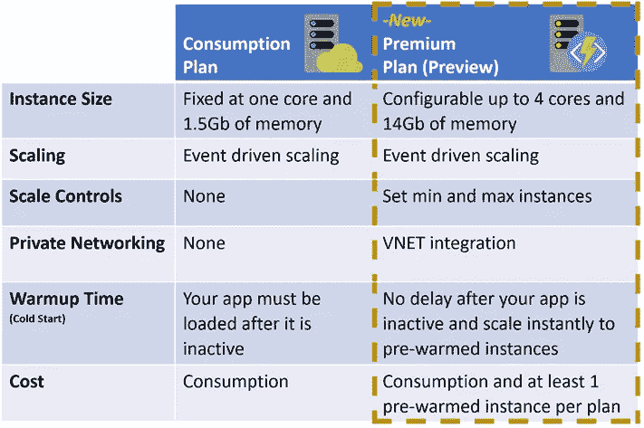
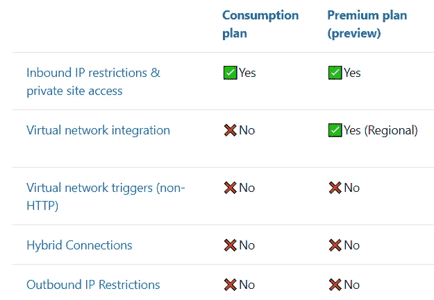
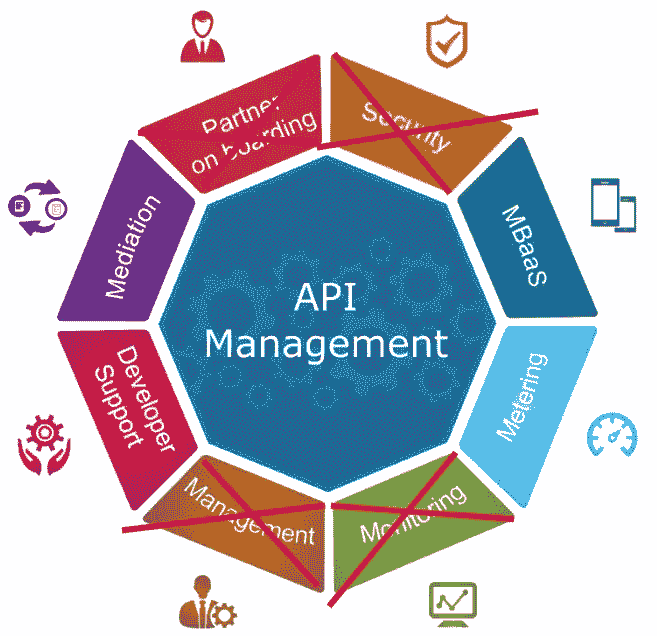

# Azure 功能代理与 API 管理

> 原文：<https://itnext.io/azure-functions-proxy-vs-api-management-or-what-to-choose-for-your-serverless-api-c563b9fd3a0b?source=collection_archive---------3----------------------->

## 关于如何用用例在它们之间进行选择的权威指南。

[https://www.pexels.com/@gratisography](https://www.pexels.com/@gratisography)

在我看来，几乎任何项目都可以撕裂 Azure 函数使用的好处。我将深入探讨两个可用选项的细节，这两个选项可用于构建基于 Azure 函数的 API。

> TL；DR；对于高负载的企业解决方案，我会选择 API 管理和高级方案，因为无服务器消费方案只提供基本功能。对于低/中等负载的解决方案，最好的选择是带有两个可用使用计划的 Azure Functions 代理。虽然对于公共 API 应用程序消费计划非常好，但对于受限的企业 API，使用 VNet 的高级计划是更好的选择。

## 关键术语

**Azure Functions Proxy** 是一个统一的 API 层(facade ),位于应用服务容器内部托管的 Azure Functions 之上。代理作为一组附加的 HTTP 端点存在于基于功能的应用程序之前。重要的一点是，代理调用的计费方式和 Azure 函数一样。因为代理本质上是另一个功能，它被预热并总是准备好接收请求。

**Azure API 管理**是一个网关，负责 API 管理、安全、请求转换和路由、API 版本控制和策略执行。本质上，它是一个优秀的企业级 API 管理和保护工具，具有出色的分析能力。

> **无服务器**也可以指服务器端逻辑仍然由应用程序开发人员编写的应用程序，但与传统架构不同，它运行在无状态计算容器中，这些容器是事件触发的、短暂的(可能只持续一次调用)，并且完全由第三方管理。一种思考方式是“功能即服务”或**“FaaS”，**参考- [无服务器架构文章](https://martinfowler.com/articles/serverless.html)。

## Azure 功能代理

它提供了非常基本的功能，包括基本的管理功能、反向代理功能，但没有集中的管理面板、Azure AD 集成等等。

对于无服务器计划，代理功能是相同的。

*   基本路由功能。
*   后端请求和响应的调整。
*   通过应用程序设置或请求/响应中的变量进行动态代理配置。
*   本地函数可以在同一个 App Service app 内部引用。
*   附加跟踪和调试信息。
*   代理的使用将引入额外的执行成本。

消费与高级层(仍在预览中)

## 保费计划功能

Hurray、VNet 以及 Azure firewall 终于可以用于 Azure 无服务器应用了:)。以及不同的虚拟机大小(P1、P2、P3)和最少数量的预热实例以及限制横向扩展的可配置选项。该计划使用最低配置为 3.5 GB、210 ACU 的 D 系列计算虚拟机。顺便说一句，我完全错过了定价从 1 VCore 变为 100 ACU 的时刻:)。

无服务器计划网络功能比较

## 使用消费计划的 Azure API 管理。

尽管很多人都在期待这个无服务器的计划，但事实证明，目前它的功能还很基本。它非常适合具有 Azure 功能和特定时期峰值负载的场景，但是缺乏来自其他层的 VNet 支持是一个严格的限制。

重要的是，它提供了一种按需付费的定价模式，适合任何无服务器架构。本质上，定价模式与消费应用服务计划相同，100 万次请求免费，下 100 万次请求收费 3.5 美元。此外，它还具有动态分配的资源、99.9 的 SLA 和自动扩展功能。

API 管理的利弊清单。

*   它提供了 API 管理的入门级模型。
*   无限(接近)规模。
*   自定义域。
*   传入流量的客户端证书身份验证。
*   没有集成的 Azure 广告支持，通过代码中的 OIDC 验证。
*   没有管理门户。
*   不支持虚拟网络。
*   没有多区域部署。
*   没有静态 IP。
*   不包括 REDIS 缓存，你应该自己创建和集成它(BYOC)。
*   每个订阅限制 5 个实例，每个实例 50 个 API。

但是 API 管理正在发展，并且有希望从高级计划中带来许多特性。

> 但是等等，什么叫高负荷？你可以从 Azure API 管理[定价页面](https://azure.microsoft.com/en-us/pricing/details/api-management/)获取数字，根据它，Premium 层每单位每秒可以处理大约 4000 个请求。但是更好的方法是对应用程序进行负载测试，在我看来，每秒 1000 个 post/put 请求可以被认为是一个很重的负载。

## 总结。

对于繁重的工作负荷。

*   私有(企业)API——使用高级计划的 API 管理。
*   公共 API -保费计划的函数代理。

适用于轻度/中度工作负载。

*   private API-Premium 计划的函数代理。
*   带有消费计划和[定制预热解决方案](https://medium.com/@staslebedenko/how-to-tackle-the-cold-start-problem-of-azure-function-serverless-app-e90030cdb0c7?source=friends_link&sk=da5d79f26e03c12c322669619a937207)的公共 API-函数代理。

就是这样。当优惠计划上市时，我会更新文章。干杯:)。

附:有用的链接。

*   [StackOverflow 讨论](https://stackoverflow.com/questions/1319965/how-many-requests-per-minute-are-considered-heavy-load-approximation)
*   [。净核心茶隼限制](https://docs.microsoft.com/en-us/dotnet/api/microsoft.aspnetcore.server.kestrel.core.kestrelserverlimits)
*   [。净核心请求饱和](https://www.ageofascent.com/2019/02/04/asp-net-core-saturating-10gbe-at-7-million-requests-per-second/\)