# Azure Kubernetes 服务(AKS)与 Istio 服务网格的可观察性

> 原文：<https://itnext.io/azure-kubernetes-service-aks-observability-with-istio-service-mesh-4eb28da0f764?source=collection_archive---------2----------------------->

## 使用 Jaeger、Prometheus、Grafana 和 Kiali 在 Azure 的 AKS 和 Istio 服务网格上观察分布式系统

在上一篇由两部分组成的文章[中，我们将 Istio 及其观察工具 Prometheus、Grafana、Jaeger 和 Kiali 部署到 Google Kubernetes 引擎(GKE)中。在那篇帖子之后，我收到了几个关于在其他流行的托管 Kubernetes 平台上使用 Istio 的可观察性工具的问题，主要是](/kubernetes-based-microservice-observability-with-istio-service-mesh-part-1-bed3dd0fac0b) [Azure Kubernetes 服务](https://azure.microsoft.com/en-us/services/kubernetes-service/) (AKS)。在大多数情况下，包括 AKS，Istio 和可观察性工具都是兼容的。

在上一篇文章的后续文章中，我们将替换上一篇文章第一部分中的 GKE 集群设置命令，用新的命令在 Azure 上提供类似的 AKS 集群。新的 AKS 集群将运行 Istio 1.1.3，[2019 年 4 月 15 日发布的](https://istio.io/about/notes/1.1.3/)，以及 AKS (Kubernetes)的最新可用版本 1.12.6。我们将用 Azure Monitor 日志取代 Google 的 Stackdriver 日志。我们将保留外部 MongoDB Atlas 集群和外部 CloudAMQP 集群依赖关系。

之前关于 AKS 的文章包括[AKS 的第一印象，Azure 的新托管 Kubernetes 容器服务](https://programmaticponderings.com/2017/11/20/first-impressions-of-aks-azures-new-managed-kubernetes-container-service/)(2017 年 11 月)和[用 AKS (Azure 的托管 Kubernetes)、Azure 服务总线和 Cosmos DB](https://programmaticponderings.com/2017/12/10/architecting-cloud-optimized-apps-with-aks-azures-managed-kubernetes-azure-service-bus-and-cosmos-db/) 架构云优化的应用(2017 年 12 月)。

# 源代码

这篇文章的所有源代码都可以在 GitHub 的两个项目中找到。基于 Go 的微服务源代码、所有 Kubernetes 资源和所有部署脚本都位于[k8s-istio-observe-back end](https://github.com/garystafford/k8s-istio-observe-backend)项目存储库中。

```
git clone \
  --branch master --single-branch \
  --depth 1 --no-tags \
  [https://github.com/garystafford/k8s-istio-observe-backend.git](https://github.com/garystafford/k8s-istio-observe-backend.git)
```

基于 Angular UI [类型脚本的](https://en.wikipedia.org/wiki/TypeScript)源代码位于[k8s-istio-observe-frontend](https://github.com/garystafford/k8s-istio-observe-frontend)库中。对于本文的演示，您不需要克隆 Angular UI 项目。

# 设置

这篇文章假设你有一个注册了必要资源提供者的 Microsoft Azure 帐户，并且已经安装了 [Azure 命令行界面](https://docs.microsoft.com/en-us/cli/azure/?view=azure-cli-latest)(CLI)`az`，并且可以用于你的命令 shell。你还需要安装和配置[头盔](https://helm.sh/)和 [Istio 1.1.3](https://github.com/istio/istio/releases/tag/1.1.3) ，这将在上一篇文章中介绍。

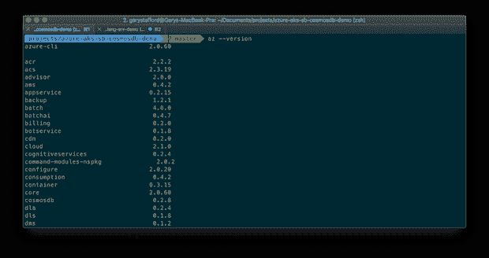

首先，从您的命令 shell 登录 Azure。

```
az login \
  --username {{ your_username_here }} \
  --password {{ your_password_here }}
```

# 资源提供者

如果你是 Azure 或 AKS 的新手，你可能需要注册一些额外的[资源提供者](https://docs.microsoft.com/en-us/azure/azure-resource-manager/resource-manager-supported-services)来完成这个演示。

```
az provider list --output table
```

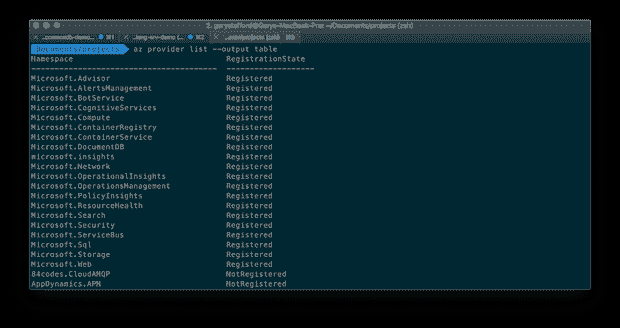

如果您缺少必需的资源提供程序，您将会看到类似下面所示的错误。只需激活与错误对应的特定提供程序。

```
Operation failed with status:'Bad Request'. 
Details: Required resource provider registrations 
**Microsoft.Compute**, **Microsoft.Network** are missing.
```

要注册必要的提供者，请使用 Azure CLI 或 Azure Portal UI。

```
az provider register --namespace Microsoft.ContainerService
az provider register --namespace Microsoft.Network
az provider register --namespace Microsoft.Compute
```

# 资源组

AKS 需要一个 [Azure 资源组](https://docs.microsoft.com/en-us/azure/azure-resource-manager/resource-group-overview)。根据 Azure 的说法，资源组是一个容器，保存 Azure 解决方案的相关资源。资源组包括那些要作为一个组来管理的资源。我选择使用 Azure CLI 创建一个与我最近的地理位置 [Azure 区域](https://azure.microsoft.com/en-us/global-infrastructure/regions/)美国东部相关联的新资源组。

```
az group create \
  --resource-group aks-observability-demo \
  --location eastus
```

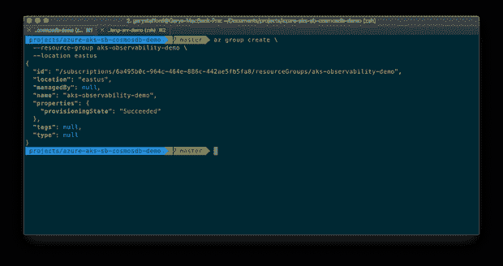

# 创建 AKS 集群

在创建 GKE 集群之前，请检查 AKS 的最新版本。在这篇文章发表时，AKS 的最新版本是 1.12.6。

```
az aks get-versions \
  --location eastus \
  --output table
```

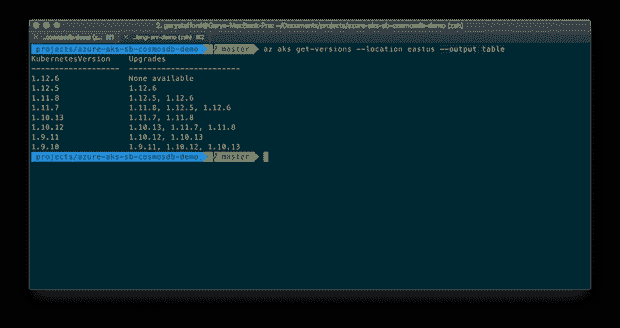

使用最新的 GKE 版本，创建 GKE 管理的集群。`az aks create`命令有许多可用的配置选项。在这篇文章中，我将使用 Azure [Standard_DS3_v2](https://docs.microsoft.com/en-us/azure/virtual-machines/windows/sizes-general#dsv2-series) VM 类型创建三个 worker 节点，这将为我们提供总共 12 个 vCPUs 和 42 GB 的内存。任何更小的和所有的 pod 可能都是不可调度的。我将让 Azure 创建一个新的 SSH 密钥，而不是提供现有的 SSH 密钥。您应该不需要 SSH 到工作节点。我还启用了[监控插件](https://docs.microsoft.com/en-us/azure/azure-monitor/insights/container-insights-onboard)。根据 Azure 的说法，该插件为容器设置了 [Azure Monitor](https://azure.microsoft.com/en-us/services/monitor/) ，于 2018 年 12 月宣布，它可以监控部署到 AKS 上托管的 Kubernetes 环境的工作负载的性能。

```
time az aks create \
  --name aks-observability-demo \
  --resource-group aks-observability-demo \
  --node-count 3 \
  --node-vm-size Standard_DS3_v2 \
  --enable-addons monitoring \
  --generate-ssh-keys \
  --kubernetes-version 1.12.6
```

使用`time`命令，我们观察到集群需要大约 5 分 48 秒的时间来进行配置；我见过长达 10 分钟的时间。AKS 资源调配不如 GKE 快，根据我的经验，对于类似规模的群集，后者至少比 AKS 快 2-3 倍。

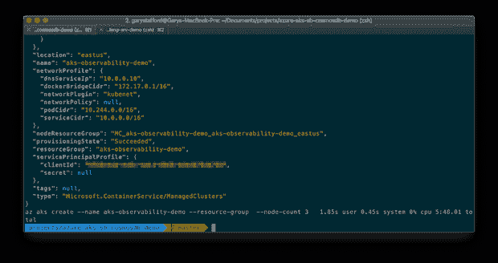

集群创建完成后，检索您的 AKS 集群凭据。

```
az aks get-credentials \
  --name aks-observability-demo \
  --resource-group aks-observability-demo \
  --overwrite-existing
```

# 检查集群

使用以下命令，通过检查三个工作节点的状态来确认集群准备就绪。

```
kubectl get nodes --output=wide
```

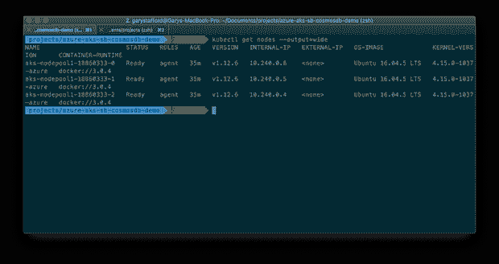

注意 Azure 目前使用 [Ubuntu 16.04.5 LTS](http://releases.ubuntu.com/16.04/) 作为 worker 节点的主机操作系统。如果你还记得的话，GKE 提供了 Ubuntu 和谷歌的容器优化操作系统。

## Kubernetes 仪表板

不像 [GKE](https://cloud.google.com/kubernetes-engine/docs/concepts/dashboards) ，没有定制的 AKS 仪表盘。因此，我们将使用[Kubernetes Web UI](https://kubernetes.io/docs/tasks/access-application-cluster/web-ui-dashboard/)(dashboard)，它默认与 AKS 一起安装，不像 GKE。根据 [Azure](https://docs.microsoft.com/en-us/azure/aks/kubernetes-dashboard#for-rbac-enabled-clusters) 的说法，为了充分利用仪表盘，由于 AKS 集群使用 [RBAC](https://kubernetes.io/docs/reference/access-authn-authz/rbac/) ，所以必须先创建一个 ClusterRoleBinding，才能正确访问仪表盘。

```
kubectl create clusterrolebinding kubernetes-dashboard \
  --clusterrole=cluster-admin \
  --serviceaccount=kube-system:kubernetes-dashboard
```

接下来，我们必须在本地端口`8001`上创建一个代理隧道，连接到运行在 AKS 集群上的仪表板。这个 CLI 命令在您的本地系统和 Kubernetes API 之间创建一个代理，并打开您的 web 浏览器到 Kubernetes 仪表板。

```
az aks browse \
  --name aks-observability-demo \
  --resource-group aks-observability-demo
```

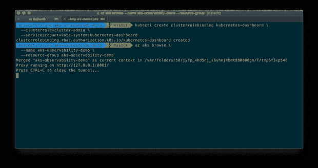

尽管您应该使用 Azure CLI、PowerShell 或 [SDK](https://azure.microsoft.com/en-us/downloads/) 来完成所有 AKS 配置任务，但使用仪表板来监控集群和其上运行的资源是非常宝贵的。

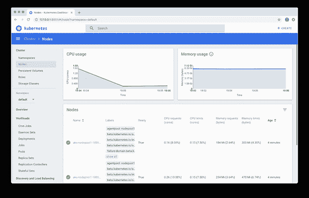

Kubernetes 仪表板还提供对原始容器日志的访问。Azure Monitor 提供了构建复杂日志查询的能力，但为了快速排除故障，您可能只想从仪表板中查看特定容器输出的原始日志。

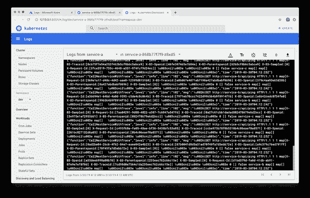

## Azure 门户

登录到 [Azure 门户](https://azure.microsoft.com/en-us/features/azure-portal/)，我们可以观察到新资源组中的 AKS 集群。

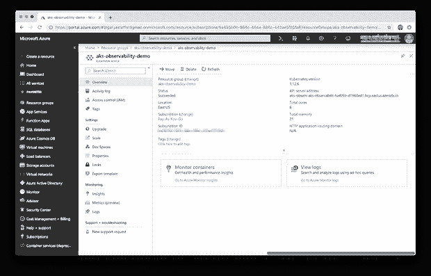

除了我们创建的 Azure 资源组之外，在 AKS 集群的创建过程中还会自动创建第二个资源组。该组包含组成 AKS 集群的所有资源。这些资源包括三个工作节点虚拟机实例，以及它们对应的存储磁盘和网卡。该组还包括网络安全组、路由表、虚拟网络和一个[可用性集](https://social.technet.microsoft.com/wiki/contents/articles/51828.azure-vms-availability-sets-and-availability-zones.aspx#Availability_Set)。

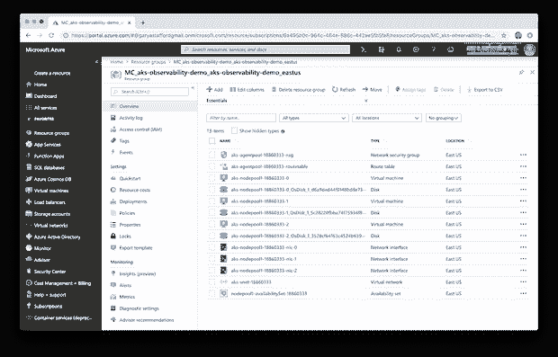

# 部署 Istio

从这一点开始，部署 Istio 服务网格和基于 Go 的微服务平台的过程遵循上一篇文章，并使用完全相同的脚本。修改 Kubernetes 资源文件后，要部署 Istio，使用 bash 脚本， [part4_install_istio.sh](https://github.com/garystafford/golang-srv-demo/blob/master/part4_install_istio.sh) 。我在脚本中添加了更多的停顿，以解释 AKS 相对于 GKE 明显较慢的响应时间。在 AKS 上启动 Istio 资源肯定要比在 GKE 上花费更长的时间，如果您不在部署过程的每个阶段之间暂停，这可能会导致错误。

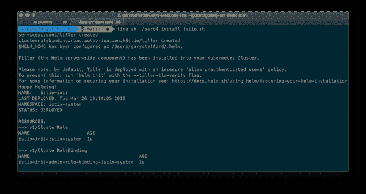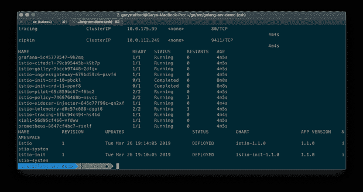

使用 Kubernetes 仪表板，我们可以查看在`istio-system`名称空间中运行的 Istio 资源，如下所示。在部署基于 Go 的微服务平台之前，请确认所有的资源容器都在运行并且状况良好。

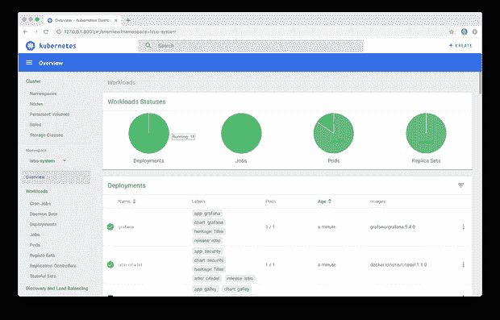

# 部署平台

使用 bash 部署脚本[part5a _ deploy _ resources . sh](https://github.com/garystafford/golang-srv-demo/blob/master/part5a_deploy_resources.sh)部署基于 Go 的微服务平台。

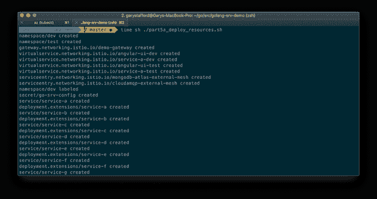

该脚本将八个微服务(Service-A 到 Service-H)和 Angular UI 中的每一个的两个副本(pod)部署到`dev`和`test`名称空间，总共 36 个 pod。每个 Pod 都将有一个 [Istio sidecar 代理](https://istio.io/docs/concepts/what-is-istio/#envoy)(特使代理)注入其中，与微服务或 UI 放在一起。

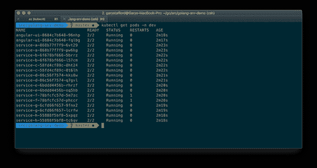

## Azure 负载平衡器

如果我们返回到创建 AKS 集群时自动创建的资源组，我们现在将看到两个额外的资源。现在有了一个 [Azure 负载平衡器](https://azure.microsoft.com/en-us/services/load-balancer/)和公共 IP 地址。

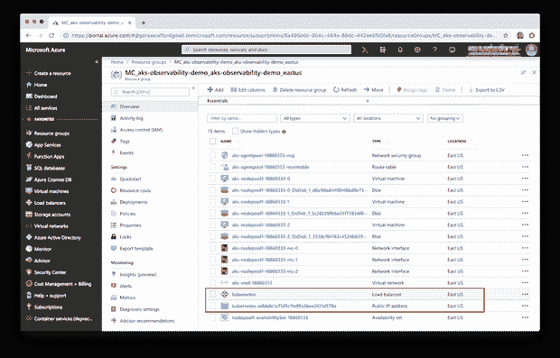

类似于上一篇文章中的 GKE 集群，当 Istio 入口网关作为平台的一部分部署时，它被具体化为一个 [Azure 负载平衡器](https://azure.microsoft.com/en-us/services/load-balancer/)。负载平衡器的前端是新的公共 IP 地址。负载平衡器的后端是一个包含三个 AKS 工作节点虚拟机的池。负载平衡器与一组规则和健康状况探测器相关联。

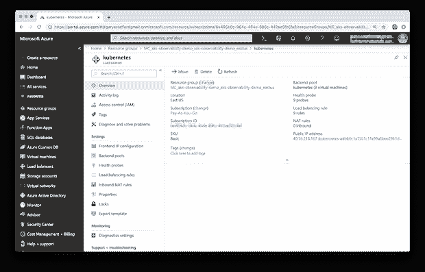

# 域名服务器(Domain Name Server)

我已经将新的 Azure 公共 IP 地址(连接到负载平衡器的前端)与四个子域相关联，我使用这四个子域来表示两个名称空间中的 UI 和边缘服务 Service-A。如果 Azure 是你的主要云提供商，那么 [Azure DNS](https://docs.microsoft.com/en-us/azure/dns/) 是管理你的域名 DNS 记录的好选择。对于此演示，您将需要自己的域。

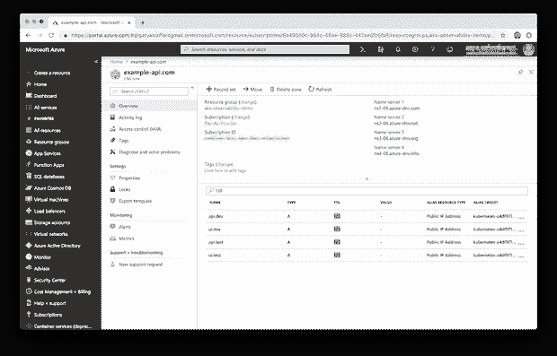

# 测试平台

部署好所有东西后，测试平台是否响应，并生成 HTTP 流量供可观察性工具记录。和上次一样，我选择了 [hey](https://github.com/rakyll/hey) ，一个现代的负载生成器和基准测试工具，也是 Apache Bench ( `ab`)的一个值得替代的工具。与`ab`不同，`hey`支持 HTTP/2。下面，我直接从 [Azure 云壳](https://azure.microsoft.com/en-us/features/cloud-shell/)运行`hey`。该工具模拟 10 个并发用户，向服务 a 总共生成 500 个 HTTP GET 请求。

```
# quick setup from Azure Shell using Bash
go get -u github.com/rakyll/hey
cd go/src/github.com/rakyll/hey/
go build

./hey -n 500 -c 10 -h2 http://api.dev.example-api.com/api/ping
```

我们获得了 100%的成功，所有 500 个调用都产生了 HTTP 200 OK 成功状态响应代码。根据结果，我们可以观察到该平台每秒能够处理大约 4 个请求，平均响应时间为 2.48 秒，平均时间为 2.80 秒。正如细节所示，几乎所有的时间都是等待响应的结果。

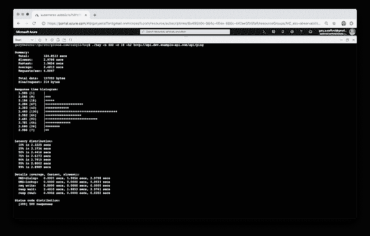

# 记录

在这篇文章中，我们用 Azure Monitor 日志代替了 GCP 的 Stackdriver 日志。据微软称，Azure Monitor 通过提供一个全面的解决方案来收集、分析和处理来自云和内部环境的遥测数据，从而最大限度地提高应用程序的可用性和性能。在我看来，Stackdriver 是搜索和关联运行在 Kubernetes 上的分布式应用程序的日志的优秀解决方案。我发现 Stackdriver 的界面和查询语言比 Azure Monitor 更容易、更直观，Azure Monitor 虽然功能强大，但需要大量的查询知识才能获得有意义的结果。例如，这里有一个查询，用于查看最近一天内来自`dev`名称空间中的服务的日志条目。

```
let startTimestamp = ago(1d);
KubePodInventory
| where TimeGenerated > startTimestamp
| where ClusterName =~ "aks-observability-demo"
| where Namespace == "dev"
| where Name contains "service-"
| distinct ContainerID
| join
(
    ContainerLog
    | where TimeGenerated > startTimestamp
)
on ContainerID
| project LogEntrySource, LogEntry, TimeGenerated, Name
| order by TimeGenerated desc
| render table
```

下面，我们看到了带有搜索查询和日志条目结果的日志界面。

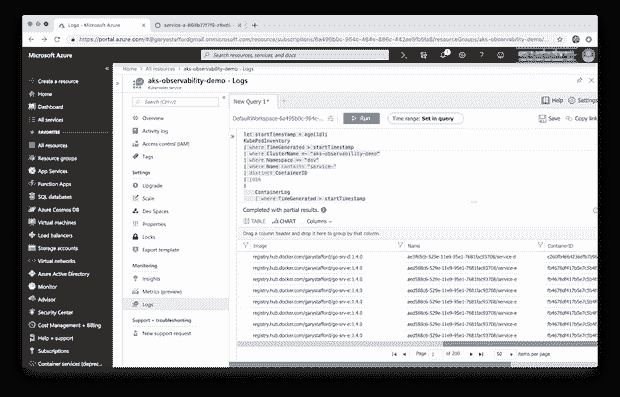

下面，我们看到了服务 a 的单个日志条目的详细视图。

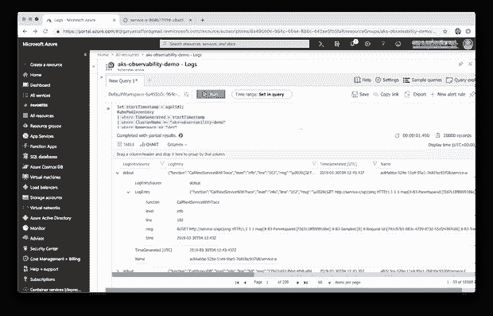

# 可观察性工具

前一篇文章更详细地介绍了 Istio 提供的每个可观测性工具的特性，包括 Prometheus、Grafana、Jaeger 和 Kiali。

我们可以使用与在 GKE 上完全相同的`kubectl port-forward`命令来连接 AKS 上的工具。根据 Google 的说法，Kubernetes [端口转发](https://kubernetes.io/docs/tasks/access-application-cluster/port-forward-access-application-cluster/)允许使用一个资源名，比如一个服务名，来选择一个匹配的 pod 进行端口转发，从 Kubernetes v1.10 开始。我们将一个本地端口转发到工具 pod 上的一个端口。

```
# Grafana
kubectl port-forward -n istio-system \
  $(kubectl get pod -n istio-system -l app=grafana \
  -o jsonpath='{.items[0].metadata.name}') 3000:3000 &

# Prometheus
kubectl -n istio-system port-forward \
  $(kubectl -n istio-system get pod -l app=prometheus \
  -o jsonpath='{.items[0].metadata.name}') 9090:9090 &

# Jaeger
kubectl port-forward -n istio-system \
$(kubectl get pod -n istio-system -l app=jaeger \
-o jsonpath='{.items[0].metadata.name}') 16686:16686 &

# Kiali
kubectl -n istio-system port-forward \
  $(kubectl -n istio-system get pod -l app=kiali \
  -o jsonpath='{.items[0].metadata.name}') 20001:20001 &
```

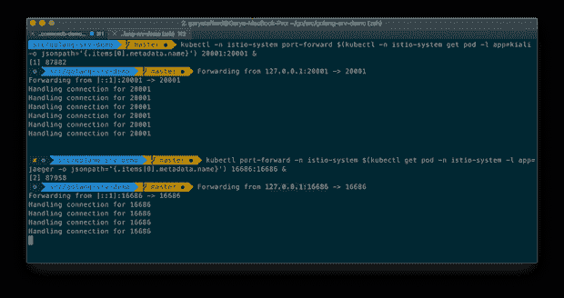

## 普罗米修斯和格拉夫纳

[Prometheus](https://prometheus.io/) 是一个完全开源的社区驱动的系统监控和警报工具包，最初于 2012 年左右在 SoundCloud 创建。有趣的是，普罗米修斯在 2016 年加入了[云原生计算基金会](https://cncf.io/) (CNCF)，作为继 [Kubernetes](http://kubernetes.io/) 之后主持的第二个项目。

Grafana 称自己是领先的时间序列分析开源软件。根据 [Grafana Labs 的说法，](https://grafana.com/grafana) Grafana 允许您查询、可视化、提醒和了解您的指标，无论它们存储在哪里。您可以轻松创建、浏览和共享视觉效果丰富的数据驱动仪表板。Grafana 还允许用户为他们最重要的指标可视化地定义警报规则。Grafana 将不断评估规则，并可以发送通知。

根据 [Istio](https://istio.io/docs/tasks/telemetry/using-istio-dashboard/#about-the-grafana-add-on) ，Grafana 附加组件是 Grafana 的预配置实例。Grafana Docker 基本映像已经过修改，可以在安装了 Prometheus 数据源和 Istio 仪表板的情况下启动。下面，我们看到一个预配置的控制面板，Istio 服务控制面板。

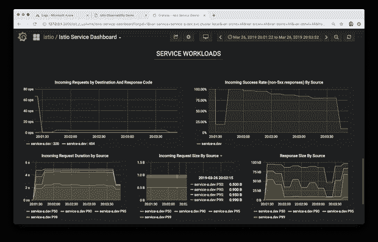

## 贼鸥

根据他们的网站介绍， [Jaeger](https://www.jaegertracing.io/docs/1.10/) 受 [Dapper](https://research.google.com/pubs/pub36356.html) 和 [OpenZipkin](http://zipkin.io/) 的启发，是由[优步科技](http://uber.github.io/)开源发布的分布式追踪系统。它用于对基于微服务的分布式系统进行监控和故障排除，包括分布式上下文传播、分布式事务监控、根本原因分析、服务依赖性分析以及性能和延迟优化。Jaeger [网站](https://www.jaegertracing.io/docs/1.10/architecture/)包含了 Jaeger 架构和一般追踪相关术语的良好概述。

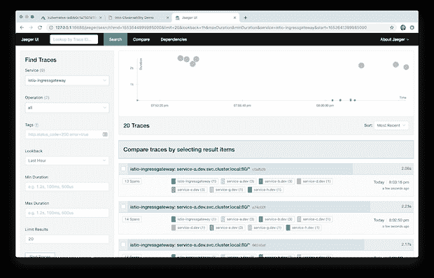

下面，我们看到一个典型的分布式服务跟踪，从入口网关开始，经过上游服务依赖关系。

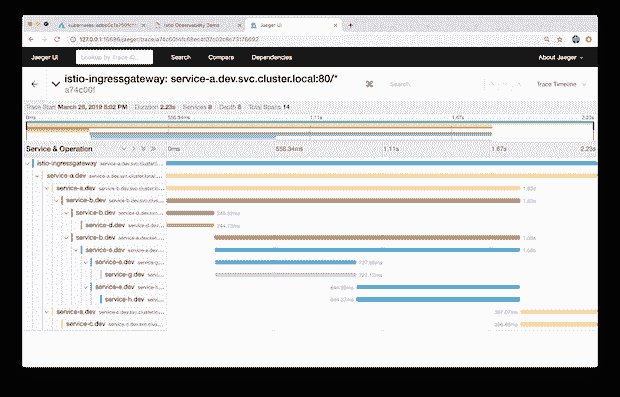

## 凯里

根据他们的[网站](https://www.kiali.io/documentation/overview/)，Kiali 提供了以下问题的答案:我的 Istio 服务网格中有哪些微服务，它们是如何连接的？Kiali 在 OpenShift 或 Kubernetes 中与 Istio 合作，以可视化服务网状拓扑，提供对断路器、请求率等功能的可见性。它提供了从抽象应用程序到服务和工作负载的不同级别的网格组件的见解。

有一个共同的 Kubernetes [秘密](https://istio.io/docs/tasks/telemetry/kiali/#before-you-begin)控制着对 Kiali API 和 UI 的访问。默认登录名为`admin`，密码为`1f2d1e2e67df`。

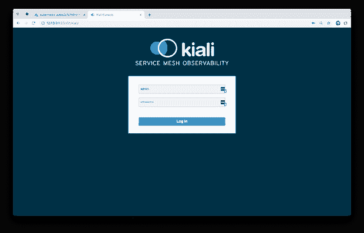

下面，我们看到了我们平台的详细视图，它运行在 AKS 上的`dev`命名空间中。

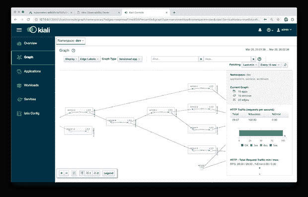

# 删除 AKS 群

完成本演示后，使用以下两个命令拆除 AKS 集群，并从本地配置中删除集群上下文。

```
time az aks delete \
  --name aks-observability-demo \
  --resource-group aks-observability-demo \
  --yeskubectl config delete-context aks-observability-demo
```

# 结论

在这篇简短的后续文章中，我们探讨了当前的可观察性工具集(Istio Service Mesh 最新版本的一部分)如何与 Azure Kubernetes Service (AKS)集成。

*本文表达的所有观点都是我个人的，不一定代表我现在或过去的雇主或他们的客户的观点。*