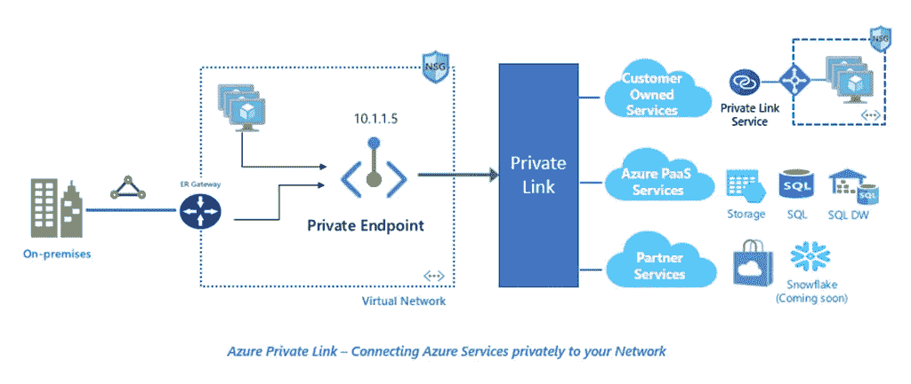
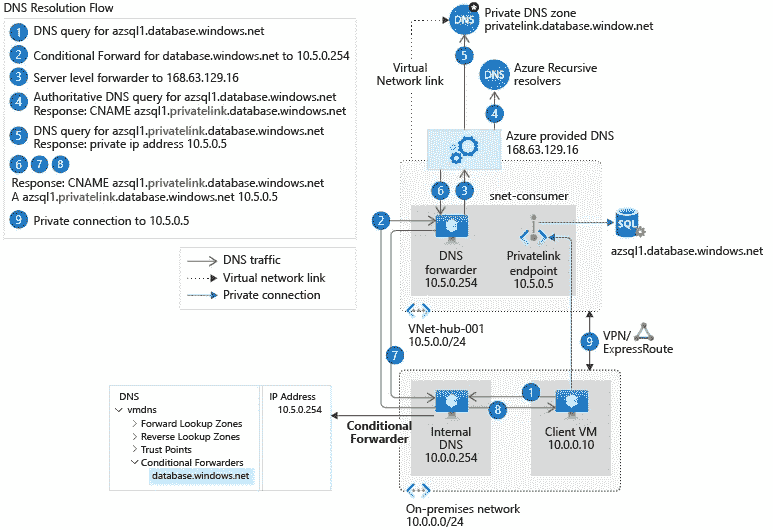

# Azure Kubernetes 服务—处理私有集群的自定义私有 DNS 区域

> 原文：<https://itnext.io/azure-kubernetes-service-handling-the-custom-private-dns-zone-for-private-clusters-8f0a79f2efc2?source=collection_archive---------2----------------------->



Azure 一直在增强许多 PaaS 服务，以使用私有端点。私有端点是一种确保服务的所有流量都通过您的网络结构而不是通过互联网传输的方法。

在过去，当从内部网络访问时，大多数服务将通过互联网从公司位置路由到公共可访问的 URL。虽然使用 IP 规则来限制访问是可能的，但是这种方法在有安全意识的组织中引起了争议。

当使用私有端点时，Azure 通常需要一个 Azure 私有 DNS 区域来插入端点的 DNS 记录，并让您的 DNS 基础架构解析该记录。对于大多数服务，需要一个特定于该服务的区域，如这里所记录的[。](https://docs.microsoft.com/en-us/azure/private-link/private-endpoint-dns#azure-services-dns-zone-configuration)

例如，当使用 Azure 容器注册中心(ACR)的私有端点时，客户需要使用区域名称创建一个私有 DNS 区域: *privatelink.azurecr.io* 。则该区域需要链接到 DNS 服务器所在的虚拟网络；您可以解析端点的主机名。有关混合 DNS 拓扑的更多详细信息，请参考此[文档](https://docs.microsoft.com/en-us/azure/private-link/private-endpoint-dns#on-premises-workloads-using-a-dns-forwarder)。概括地说，它看起来是这样的:



具有转发器的混合 DNS 基础设施

使用 AKS 时，方法会有所不同，并且更难集成到您的环境中。当创建一个私有集群时，API masters 变成一个私有端点，并与 nodes & pods 放在同一个子网上。

> Azure 将在托管资源组中自动创建一个托管专用 DNS 区域。该区域名称由系统生成，不具有确定性。

区域名称的不确定性使得将它集成到您的 DNS 基础架构和链接虚拟网络变得更加困难。区域名称如下所示:

> *1565 c3fb-ddf 7–4310-ab3e-b 5070 dxx 1b 10 . private link . Canada central . azmk 8s . io*

受 Pavel tuz ov[的启发，我决定发挥创意，确保私有 DNS 区域在集群创建期间链接到我的 DNS 转发器所在的虚拟网络。](https://medium.com/@paveltuzov/create-a-fully-private-aks-infrastructure-with-terraform-e92358f0bf65)

# 解决办法

该解决方案需要剖析*azure RM _ kubernetes _ cluster*资源的 *private_fqdn* 成员。使用局部变量，很容易执行逻辑，然后使用输出导出所需的数据元素以支持虚拟网络链接

```
# Magic to generate the Private DNS zone information that is automatically created by Microsoft.
# Used for creation of a Private DNS zone link
locals {
  private_dns_zone_name = join(".", slice(split(".", azurerm_kubernetes_cluster.aks_cluster.private_fqdn), 1, length(split(".", azurerm_kubernetes_cluster.aks_cluster.private_fqdn))))
  private_dns_zone_id   = "${data.azurerm_subscription.current.id}/resourceGroups/${azurerm_kubernetes_cluster.aks_cluster.node_resource_group}/providers/Microsoft.Network/privateDnsZones/${local.private_dns_zone_name}"
}resource "azurerm_kubernetes_cluster" "aks_cluster" {
  # Content omitted for brevity
}# Supports the configuration of private dns zone links.
# May perform the linking as an opinion in this module in the future.
output "managed_rg_name" {
  value       = azurerm_kubernetes_cluster.aks_cluster.node_resource_group
  description = "Resource Group name managed by Microsoft when creating the cluster"
}
output "private_dns_zone_name" {
  value       = local.private_dns_zone_name
  description = "Zone Name for the Private DNS Zone generated by private AKS"
}
output "private_dns_zone_id" {
  value       = local.private_dns_zone_id
  description = "Resource Id for the Private DNS Zone generated by private AKS"
}# This is to perform the network link from the module
resource "azurerm_private_dns_zone_virtual_network_link" "zone_link_cac_cluster" {
  name                  = "hub_link"
  resource_group_name   = module.cac_aks.managed_rg_name
  private_dns_zone_name = module.cac_aks.private_dns_zone_name
  virtual_network_id    = azurerm_virtual_network.hub.id // The Hub needs to reach the zone
}
```

我猜可以修改 Terraform 模块来导出这些数据。在此期间，这是一个非常好的解决方法。

我希望微软会让 AKS 遵循与其他支持私有端点的服务相同的方法。