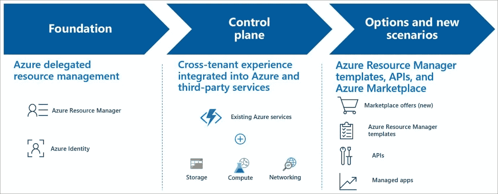
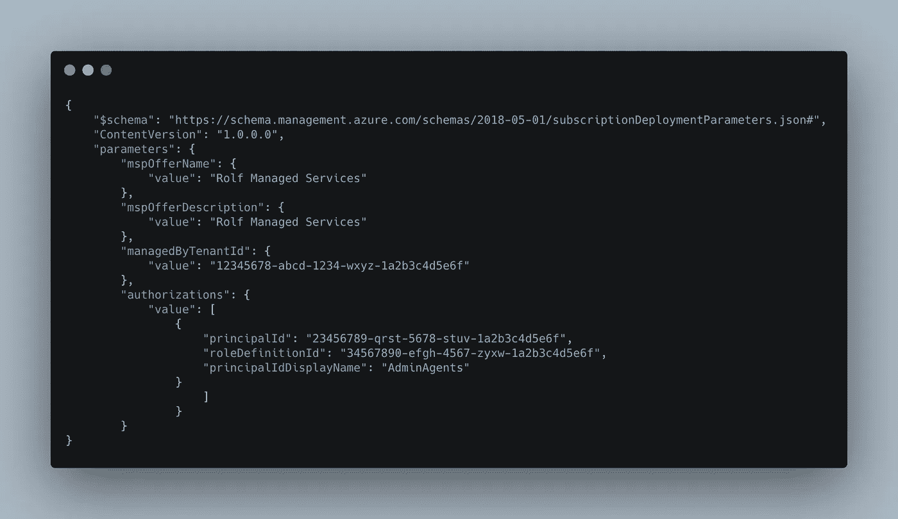
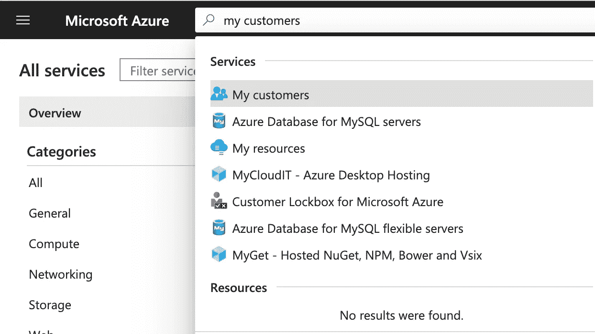

# 蔚蓝灯塔:MSP 的，要有光！

> 原文：<https://itnext.io/azure-lighthouse-msps-let-there-be-light-3da060717b09?source=collection_archive---------2----------------------->

我们都知道从一个租户切换到另一个租户的困难，无尽的保管库和凭据注册，在不同的环境中一遍又一遍地执行相同的(管理)活动，以及缺少所有(客户)环境的集中视图。使用 Azure Lighthouse，可以管理、自动化和扩展多个租户，并改善资源和租户的治理。

在这篇博客中，我将大致解释什么是 Azure Lighthouse，为什么你想使用它，并提供一个如何实现它的快速入门。

# 蔚蓝灯塔是什么？

> Azure Lighthouse 为服务提供商提供了一个单一的控制平面，以更高的自动化、规模和增强的治理来查看和管理他们所有客户的 Azure。有了 Azure Lighthouse，服务提供商可以使用内置于 Azure 平台的全面而强大的管理工具来交付托管服务。该产品还可以让管理多个租户资源的企业 it 组织受益。— [蔚蓝灯塔是什么？— Azure Lighthouse |微软文档](https://docs.microsoft.com/en-us/azure/lighthouse/overview)

上面的引用听起来很棒，但还是有点隐晦。它试图告诉我们的是，Azure Lighthouse 提供了几种方法来简化管理并提高与客户的互动。
通过委托管理，可以从服务提供商的租户安全地管理客户的 Azure 资源，而不必切换上下文和控制平面。客户订阅和资源组可以委托给管理租户中的指定用户和角色，必要时可以选择删除访问权限。Lighthouse 提供了收集一个 Azure AD 租户下的资源并将它们投射到另一个租户的能力。



图片由[微软](https://www.microsoft.com/en-us)在[微软文档](https://docs.microsoft.com/en-us/azure/lighthouse/overview)上提供

Azure 门户与 Lighthouse 的集成在 Azure 门户的“我的客户”页面上提供了跨租户信息。对于客户，有一个关联的服务提供商页面，他们可以在其中查看和管理服务提供商的访问权限。

# 为什么要用 Azure Lighthouse？

这个博客的“什么”部分涵盖了一些你应该为使用 Azure Lighthouse 而激动的原因。Azure Lighthouse 帮助服务提供商(或共享服务中心)高效地构建和交付托管服务。

Azure Lighthouse 无需在客户的 Azure Active Directory 中添加访客用户帐户。由于安全性、隐私和法规遵从性要求，客户通常反对这样做。利用委托的资源管理功能，服务提供商仍然能够访问和管理环境。这也使得从一个视图进行管理成为可能，而不需要在租户之间切换。

此外，它使现有的 API、管理工具和工作流能够与委托资源一起使用，包括托管在 Azure 之外的机器，而不管它们在哪个区域。这使得管理客户资源的客户参与和生命周期活动变得更简单、更具可扩展性。

通过 Azure Lighthouse，客户可以从一个中心点方便地查看服务提供商对客户订阅的访问权限。客户保持可见性，并精确控制他们委托管理的范围和允许的权限。他们可以监控服务提供商的行为，并在需要时完全删除访问权限。

还有一些其他优势，例如，通过市场透明地提供应用程序，其中必须保留管理和支持的责任。对于这些和其他详细功能，最好在这里查阅微软文档[。](https://azure.microsoft.com/en-us/services/azure-lighthouse/#features)

最重要的是:使用 Azure Lighthouse 管理 Azure 资源不需要额外的成本。任何 Azure 客户或合作伙伴都可以使用 Azure Lighthouse！


[艾伦蔡](https://unsplash.com/@aycai?utm_source=unsplash&utm_medium=referral&utm_content=creditCopyText)在 [Unsplash](https://unsplash.com/s/photos/beacon?utm_source=unsplash&utm_medium=referral&utm_content=creditCopyText) 上的照片

# 如何开始使用 Azure Lighthouse？

在这个快速入门中，您将使用 PowerShell 和 Azure 资源管理(ARM)模板(JSON)来设置 Azure Lighthouse。

## 开始之前，这里有一些要求:

*   您需要在管理租户中进行有效的订阅。
*   您需要一个本地用户帐户，在您想要管理的租户中具有“所有者”角色。
*   你需要 Azure AZ PowerShell 模块。

## **步骤 1:从您的管理员租户处检索信息。**

首先，我们将打开一个 PowerShell 提示符，导入 AZ 模块，连接到 Azure，并登录到我们的 Azure 租户，使用以下命令:

```
Import-Module Az
Connect-AzAccount
```

稍后，我们将需要租户 ID。为了检索它，我们使用以下命令并保存输出供以后使用:

```
Get-AzTenant
```

我们现在将设置一个组，该组将获得管理客户订阅的权限。我将使用默认的 Azure 组“AdminAgents”作为例子，但是你可以创建自己的组。执行以下命令并保存输出，因为稍后我们将需要这个 PrincipalId。

```
(Get-AzADGroup -DisplayName 'AdminAgents').id
```

如果您考虑添加多个角色，可以对要添加的每个组运行此命令。

我们现在将为想要管理的订阅设置角色。该角色将应用于目标订阅中的所有资源。执行以下命令并保存输出，因为我们稍后将需要这个 roleDefinitionId。

```
(Get-AzRoleDefinition -Name 'Contributor').id
```

如果您考虑添加多个角色，您可以为每个要添加的角色运行此命令。

***须知:*** *不允许使用“所有者”和“用户访问管理员”角色！*

## 步骤 2:连接并选择客户订阅。

我们现在已经完成了管理租户，将继续使用以下 Azure PowerShell 命令连接到客户:

```
Connect-AzAccount
```

在我们注册资源提供者之前，我们应该确保我们选择了正确的订阅。执行以下命令:

```
Get-AzContext
```

如果返回值不是您想要管理的订阅，那么我们需要首先选择正确的订阅。如果您选择了正确的订阅，您可以跳过下面的部分。

首先，我们需要使用第一个命令在这个租户中查找当前订阅。其次，我们将使用第二个命令，用第一个命令的输出(subscriptionId)选择它。

```
# First command, lookup current subscriptions in this tenant
Get-AzSubscription# Second command, select the right subscription in this tenant
Set-AzContext -Subscription <subscriptionId>
```

我们现在已经选择了正确的订阅，可以继续委托资源管理了。

## 步骤 3:链接和委托资源管理。

现在我们将需要 2 个文件；模板文件和参数文件。

将这些文件复制或下载到您的下载文件夹或您选择的文件夹。

***注意事项:*** [*微软在 GitHub*](https://github.com/Azure/Azure-Lighthouse-samples) *上发布了这个包含模板/示例的存储库，帮助您使用 Azure Resource Manager 来配置*[*Azure delegated Resource management*](https://docs.microsoft.com/azure/lighthouse/concepts/azure-delegated-resource-management)*，以及配置对客户环境的监控和管理。这些模板可以用来让客户登陆 Azure Lighthouse，并且可以手动部署，或者通过点击按钮直接在 Azure 门户中部署。*

在参数文件中，我们需要编辑以下字段:

*   您的公司名称。这对客户来说是可见的。
*   对你的公司或服务的描述。
*   **managedByTenantId:** 您在步骤 1 中的(管理员)Azure 租户 Id。
*   **PrincipalId:** 您在步骤 1 中的 PrincipalId。
*   **PrincipalIdDisplayName:** 您在第一步中的群组名称。
*   **rolefinitionid:**您在步骤 1 中的 rolefinitionid。

应用更改后，参数文件应如下所示:



现在终于到了用参数文件部署模板文件的时候了。只需在 PowerShell 中运行以下命令。如果您将文件保存在不同的文件夹中，不要忘记更改路径。

```
New-AzDeployment `-Name LightHouse `-Location westeurope `-TemplateFile "<your folder>\delegatedResourceManagement.json" `-TemplateParameterFile "<Your folder>\DelegatedResourceManagement.parameters.json" `-Verbose
```

## 第四步:验证和管理！

我们应该验证链接是否已经成功建立。我们可以在 Azure 门户的“我的客户”部分使用搜索栏进行搜索。您可以在这里验证连接。



您现在可以开始管理了！您可以通过转到 Azure 门户右上方的目录+订阅按钮来选择您想要管理的订阅，并选择所需的订阅。