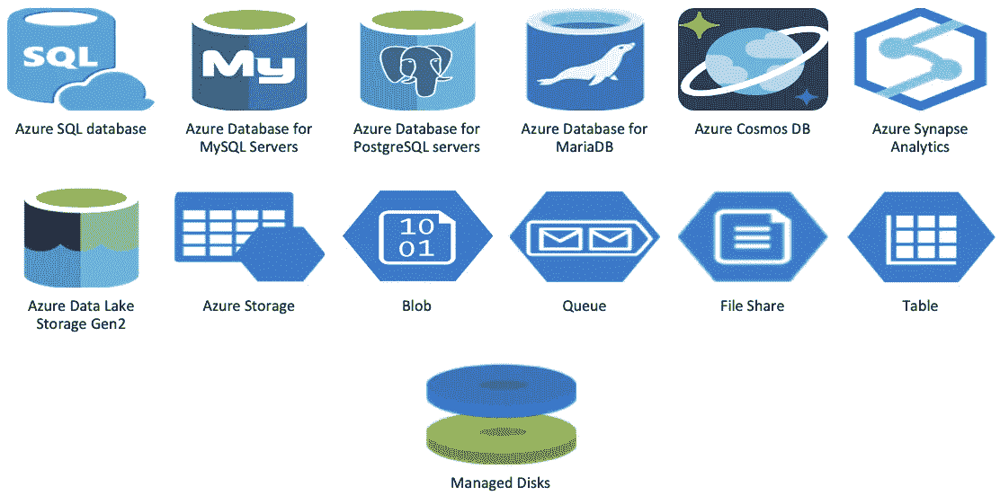
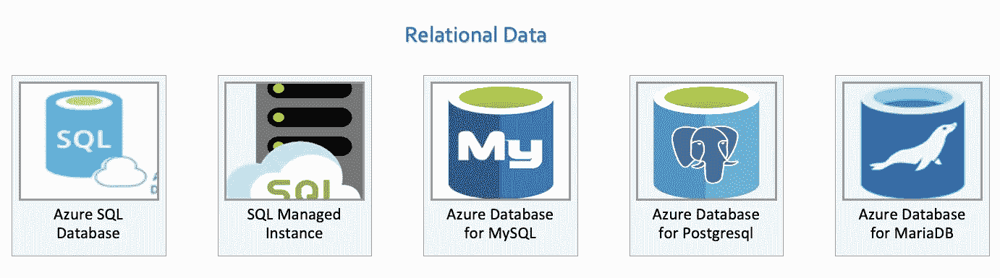
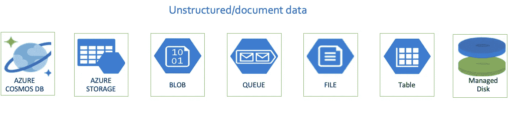
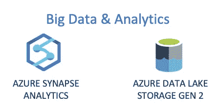
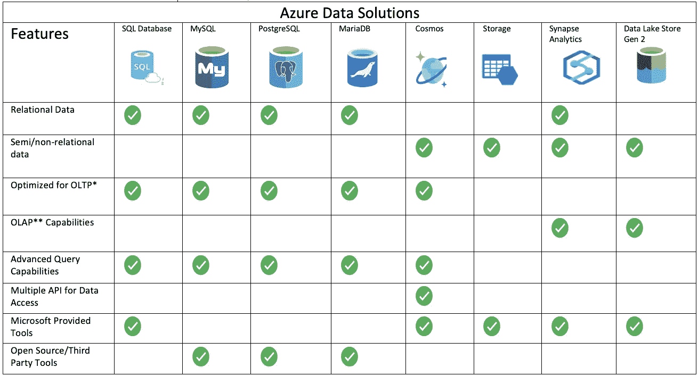
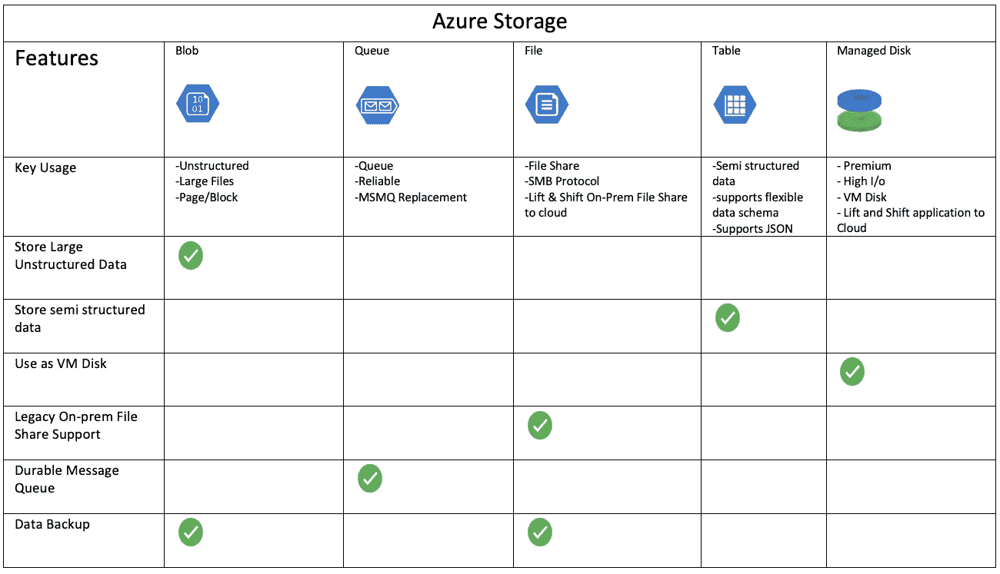

# Azure PaaS 数据存储解决方案-何时使用什么？

> 原文：<https://itnext.io/azure-paas-data-storage-solutions-when-to-use-what-9a70bf077004?source=collection_archive---------2----------------------->

在我们生活的世界里，大量数据以各种形式和大小生成，并可用于不同的目的。大规模管理和存储这种数据是一个挑战。

幸运的是，Azure 拥有丰富的基于数据的产品。在本文中，我将总结作为 PaaS 产品的 Azure 数据存储解决方案及其理想的用例。

# **Azure PaaS 中的数据存储选项**

在 **Azure Storage** 下提供 Blob、队列、文件、表格和托管磁盘。但是因为它们都存储/保存数据，所以我将它们包含在这个列表中。

为简单起见，我将这些服务分为 3 类:

1.  关系数据

2.非结构化/文档数据

3.大数据和分析

# **关系数据**

# **非结构化/文档化数据**

# **大数据&分析**

# **总结—何时使用什么**

* OLTP -在线事务处理

**OLAP -在线分析处理

SQL Server 数据库和 SQL 托管实例是两个独立的产品，但它们具有相同的功能。

存储帐户提供多种服务。我创建了一个单独的功能集来与存储客户服务产品进行比较。

