# Azure Pipelines:发布到 Azure 应用服务

> 原文：<https://itnext.io/azure-pipelines-release-to-azure-app-service-9068a7236d6?source=collection_archive---------4----------------------->

这篇文章将使用上周 [Azure Repos 和 Azure Pipelines](https://elanderson.net/2018/11/azure-repos-and-azure-pipelines/) 文章中使用的相同 Azure DevOps 项目，该项目有一个构建管道，并添加了一个部署到 Azure 应用服务的发布管道。

本演练将假设您已经使用与 Azure DevOps 相同的电子邮件地址设置了一个 Azure 帐户。如果你没有 Azure 账户，就注册一个 [Azure 免费账户](https://azure.microsoft.com/en-us/free/)。

## 构建更改

在上周的帖子中建立的构建证明了代码已经构建，但是它实际上并没有对构建的结果做任何事情。为了使用构建的结果，我们需要发布结果文件。稍后在设置发布管道时需要用到它。

为了得到我们正在寻找的结果，一些步骤必须添加到我们的建设。所有的变化都发生在 **azure-pipelines.yml** 中。以下是我关于新任务的完整 yaml 文件。

```
pool:
  vmImage: 'Ubuntu 16.04'

variables:
  buildConfiguration: 'Release'

steps:
- task: DotNetCoreCLI@2
  displayName: Build
  inputs:
    projects: '**/EfSqlite.csproj'
    arguments: '--configuration $(BuildConfiguration)'
- task: DotNetCoreCLI@2
  displayName: Publish
  inputs:
    command: publish
    publishWebProjects: True
    arguments: '--configuration $(BuildConfiguration) --output $(build.artifactstagingdirectory)'
- task: PublishBuildArtifacts@1
  displayName: 'Publish Artifact'
  inputs:
    PathtoPublish: '$(build.artifactstagingdirectory)'
```

正如您在上面的 yaml 中看到的，这个构建现在有三个不同的步骤。构建(这相当于上周的帖子所做的)和发布(这将所有文件放在正确的位置)任务都是使用 **DotNetCoreCLI@2** 任务来处理的。最后， **PublishBuildArtifacts@1** 获取发布的结果，并将它们压缩到工件暂存目录中，在那里可以在发布管道中使用它们。

## 创建 Azure 应用服务

如果您有现有的应用程序服务可以使用，请随意跳过这一部分。要创建新的应用服务，请打开 [Azure 门户](https://portal.azure.com)并从左侧导航中选择**应用服务**。

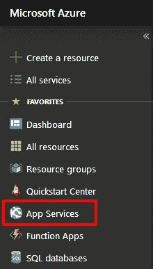

接下来，点击**添加**按钮。

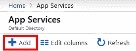

在下一页，我们将选择 **Web App** 。

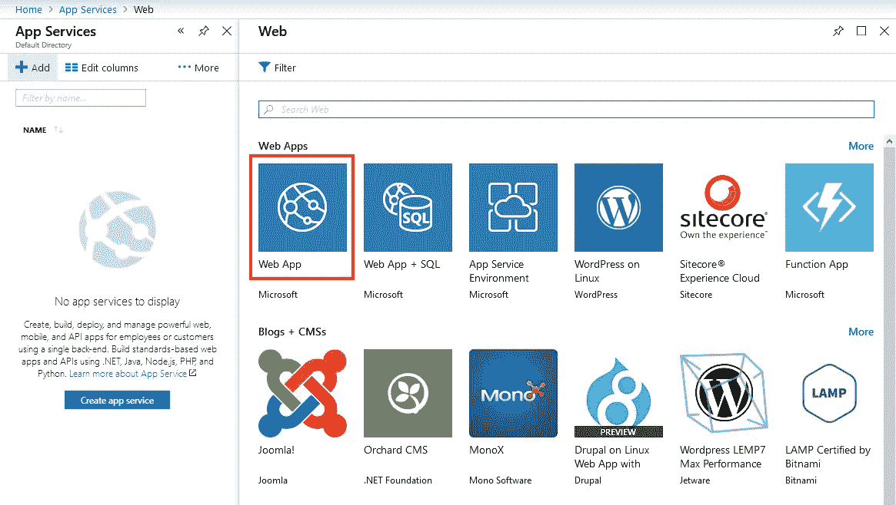

现在点击**创建**按钮。

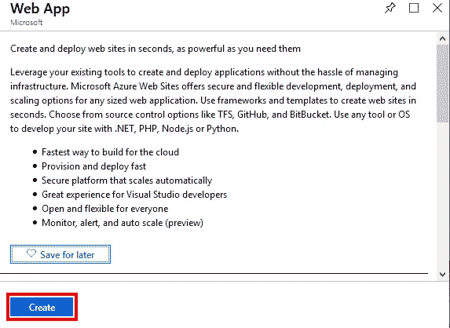

下一页你需要输入一个**应用名**，选择**操作系统**，以及**运行时堆栈**，然后点击**创建**按钮。操作系统和运行时堆栈应该与应用程序的目标相匹配。

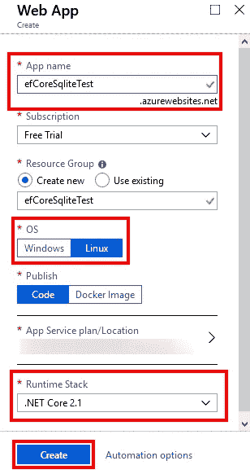

## 创建发布管道

在您的项目上，从左侧导航中选择**管道>释放**，然后点击**新建管道**按钮。如果您已经有一个发布管道设置，此页面将看起来不同。

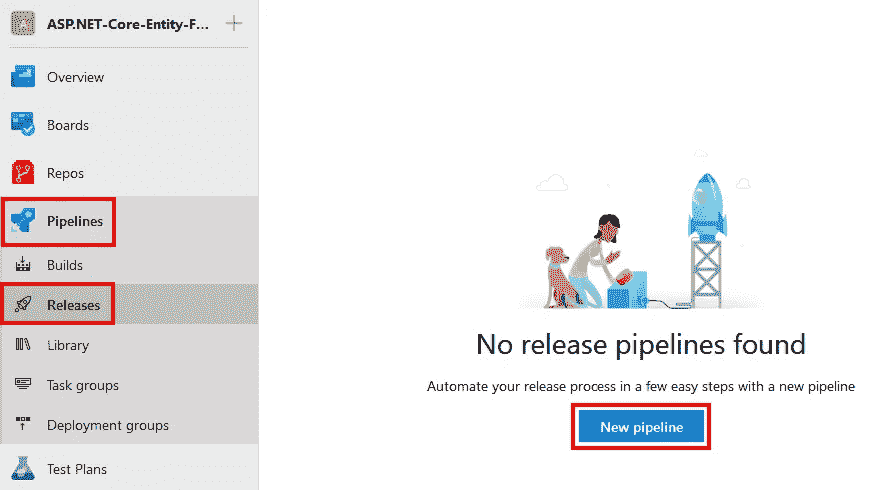

下一页有一个模板列表，您可以从中选择。在本例中，我们将选择 **Azure App 服务部署**，然后单击**应用**按钮。

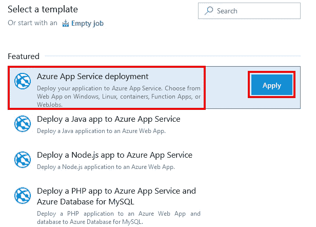

## 神器设置

点击**应用**后，您将进入包含多组信息的管道概览页面。第一个是**工件**，对我们来说，这将是我们在上周的帖子中建立的构建管道的结果。点击**添加工件**框。

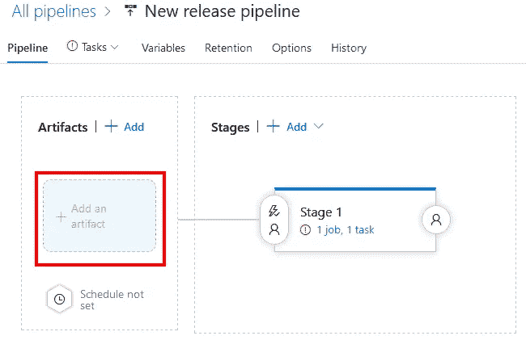

在 Add an artifact 对话框中，您可以选择发布将在哪里获得它的构建工件表单。我们将使用构建的源类型，并选择我们现有的构建管道。

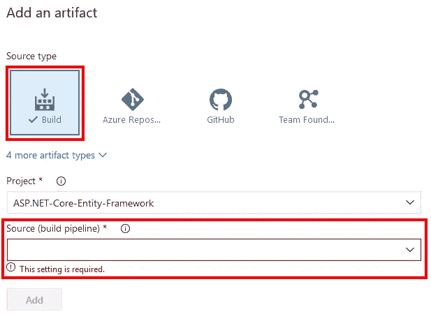

一旦您选择您的构建管道作为**源**，就会出现更多的控件。我接受了所有的默认值。请注意截图中突出显示的框，因为如果您的构建缺少工件，它会向您发出警告。点击**添加**按钮完成。

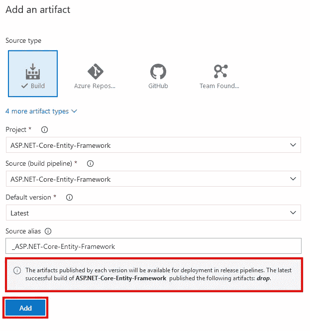

## 舞台设置

上面我们选择了 Azure 应用服务模板，它现在是我们的第一阶段。请注意红色的感叹号，这意味着 stage 在使用之前有一些问题需要解决。单击舞台框将其打开。

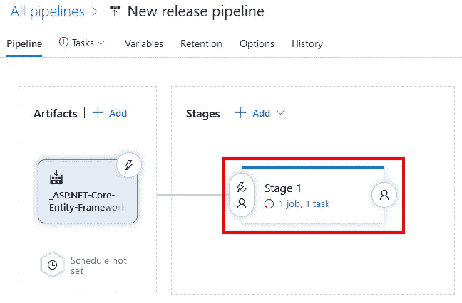

正如你在下面的截图中看到的，在**部署 Azure 应用服务**任务中缺少的设置以红色突出显示。在阶段 1 点击**解除所有**按钮并确认。这样做意味着在**部署 Azure 应用服务**任务上有更多的设置，但这是唯一可以使用的方法。NET Core 2.1。出于某种原因，Linux 在 Stage 级别可用的最高版本是。网芯 2.0。

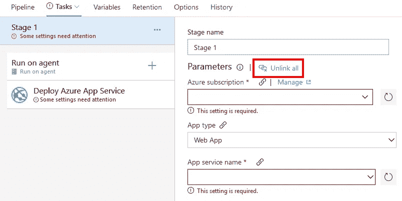

单击“取消链接”后，除阶段名称之外的所有选项都将被删除。接下来，点击 **Deploy Azure App Service** 任务，该任务处理将为该管道放置的大量工作。这项任务有很多设定。这是我的设置的截图，我会在后面标出重要的部分。

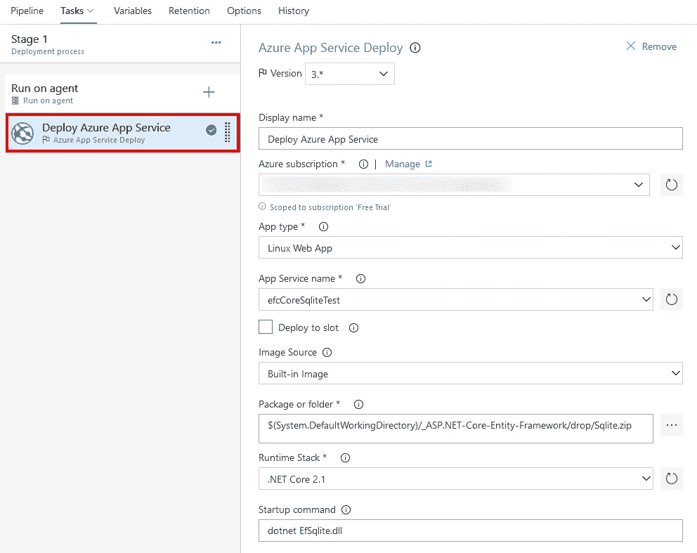

首先，选择您的 **Azure 订阅**。您可能需要授权您的帐户，因此如果您看到一个**授权**按钮，请单击它并完成您的 Azure 帐户的登录步骤。

特别注意 **App 类型**。在本例中，我们使用的是 Linux，因此从下拉列表中选择 **Linux 应用**很重要，而不仅仅是使用 Web 应用。

选择 Azure 订阅和应用类型后，**应用服务名称**下拉列表应仅允许您选择订阅中存在的基于 Linux 的应用服务。

对于**图像源**，我选择了内置图像，但是如果内置图像不能满足您的需求，它可以选择从注册表中输入使用容器。

对于**包或者文件夹**，如果你只有一个单独的项目，默认应该可以。由于这一点，我有两个项目，我使用文件浏览器(……按钮)来选择我想要部署的特定 zip 文件。

**运行时栈**需要被。此应用程序的 NET Core 2.1。

**需要设置启动命令**来告诉。NET CLI 来运行作为应用程序入口点的程序集。在这个例子中，这个结果是**网络 EfSqlite.dll**。

输入所有设置后，点击屏幕右上角的**保存**按钮。

## 执行发布管道

导航回管道>发布，并选择要运行的发布。然后点击**创建释放**按钮。

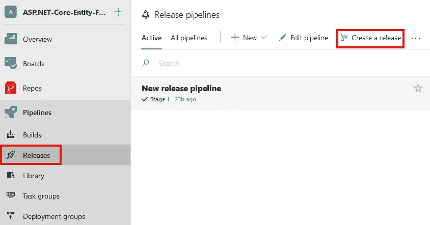

在下一页，您所要做的就是选择您想要部署的工件，然后点击 **Create** 按钮。

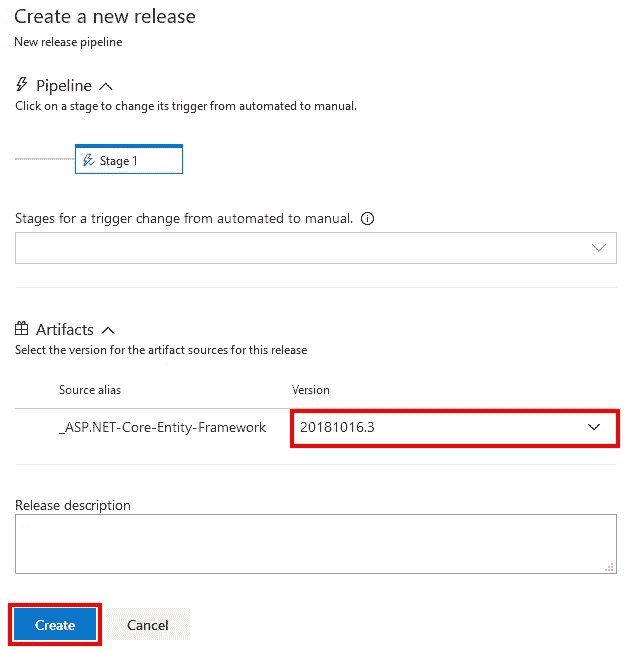

“创建”将启动发布过程，并返回到主发布页面。在发布页面的顶部会有一个链接，你可以点击它来查看发布的状态。

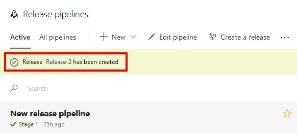

以下是我发布完成后的结果。

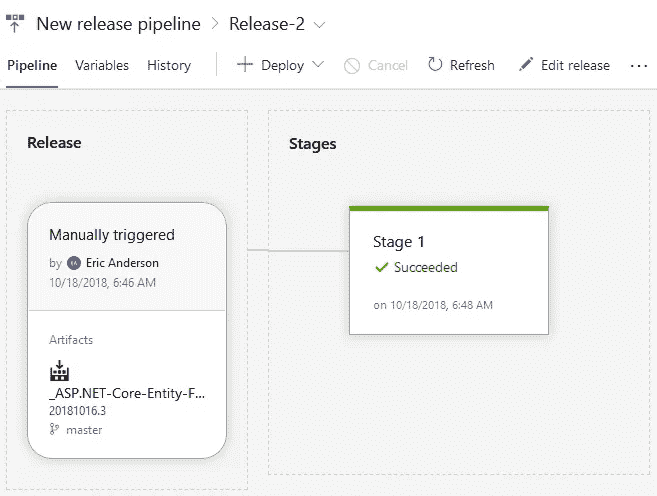

## 包扎

我花了更多的试验和错误来让这个设置运行起来，这是我所希望的，但是一旦所有的部分都运行起来，结果是令人敬畏的。最起码，我建议花时间至少建立一个当代码被签入到你的 repos 时触发的构建。当代码一进入回购阶段，就有一个构建被破坏的反馈，而不是发现你什么时候需要一个可交付的产品，这将为你内心的平静创造奇迹。

*原载于*[](https://elanderson.net/2018/11/azure-pipelines-release-to-azure-app-service/)**。**