# Azure Repos 和 Azure 管道

> 原文：<https://itnext.io/azure-repos-and-azure-pipelines-cab0d58b5843?source=collection_archive---------1----------------------->

上周的帖子着眼于将 [GitHub 与 Azure Pipelines](https://elanderson.net/2018/10/github-and-azure-pipelines/) 结合使用。本周，我将带着同一个项目，将它添加到 Azure Repos，并使用 Azure Pipelines 进行构建。我将使用来自这个 [GitHub repo](https://github.com/elanderson/ASP.NET-Core-Entity-Framework) 的代码，减去上周帖子中添加的 azure-pipelines.yml 文件。

## 创建项目

我不会带你完成注册过程，但是如果你没有帐户，你可以在这里注册[Azure devo PS](https://azure.microsoft.com/en-us/services/devops/)。点击右上角的**创建项目**按钮。

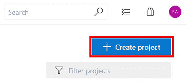

在显示的对话框中输入项目名称。我用的是 GitHub repo 上代码来源的同一个名字。点击**创建**继续。

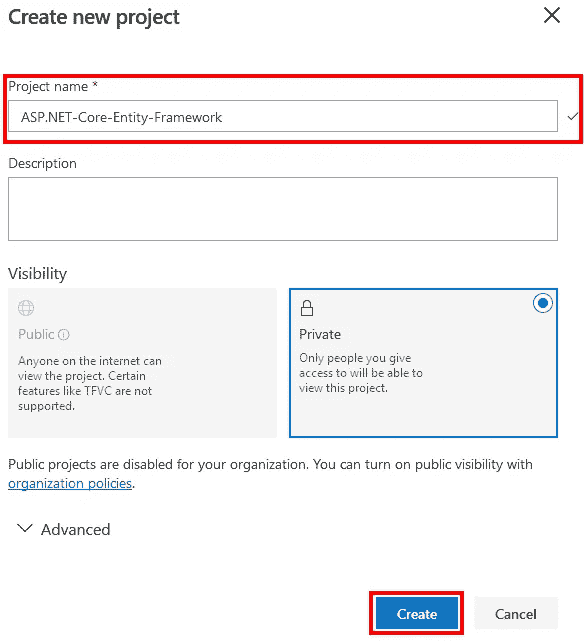

## 增加回购

项目完成创建过程后，使用左侧菜单并选择 **Repos** 。

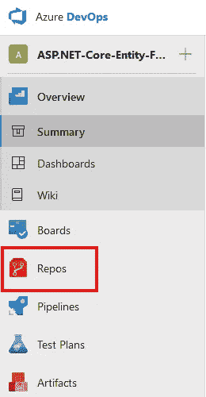

由于该项目目前没有任何文件，因此 **Repos** 页面列出了许多添加文件的选项。我将使用在 VS 代码中克隆选项，然后从我的 GitHub repo 中复制文件。如果我不想避免包含管道 yaml 文件，一个更简单的选择是使用 **Import** 函数并直接克隆 repo。

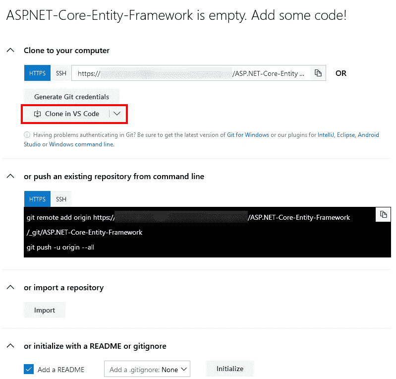

我不打算详细介绍如何使用上述方法之一将示例代码放入 Azure Repos。这是一个基于 git 的回购，上传代码的选项在上面的页面中有概述。

## 建立一个构件

现在我们有了回购中的代码，您应该看到视图更改为类似于下面的屏幕截图。点击**设置构建**开始为新的回购创建构建管道。这应该非常接近上周帖子的后半部分，但我想把它放在这里，这样这篇帖子就可以独立存在了。

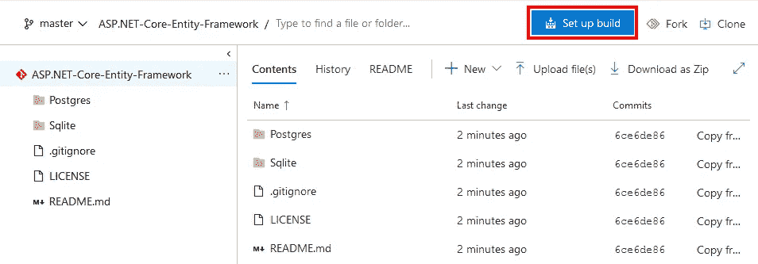

在下一页，选择 **Azure Repos** 作为源代码。

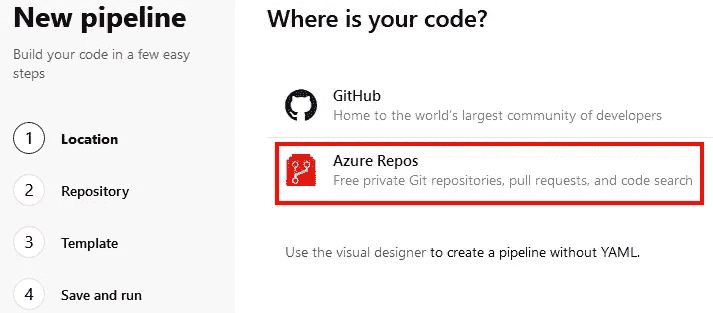

接下来，选择需要为新管道构建的 repo。

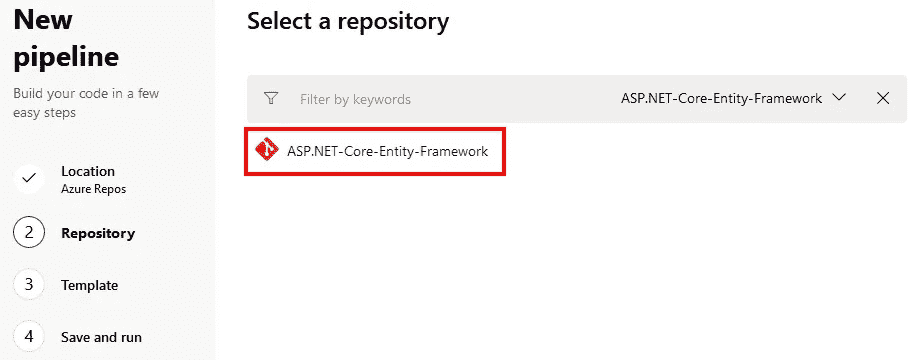

接下来是模板选择。基于你的代码，一个模板将被建议，但不要只是采取默认。不管出于什么原因，它建议我的示例使用一个. NET 桌面模板，这个模板实际上是基于 ASP.NET 核心的。选择您的模板，进入下一步。

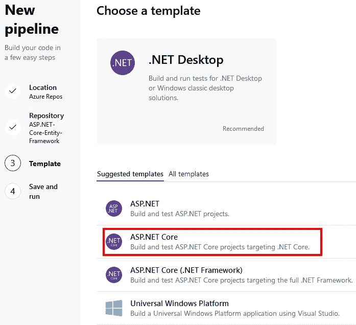

下一个屏幕将显示用于构建代码的 YAML。我的回购协议包含两个项目，所以我必须调整 YAML 来告诉它要构建哪个项目，否则，默认设置会有效。完成项目所需的任何更改后，点击**保存并运行**。

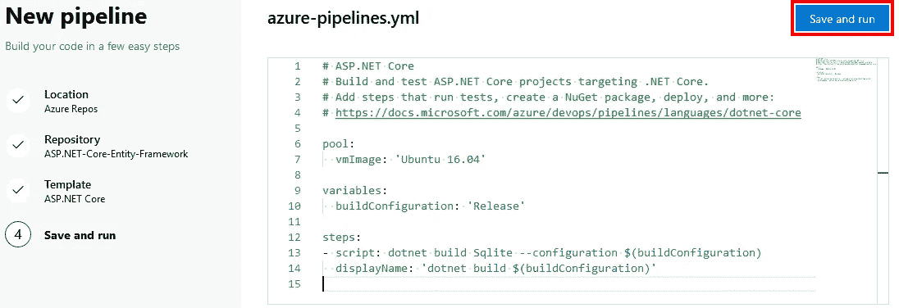

实际构建之前的最后一步是将构建 YAML 文件提交给 Azure Repo。在对话框中做任何你需要的修改，然后点击**保存并运行**开始你的项目的第一次构建。

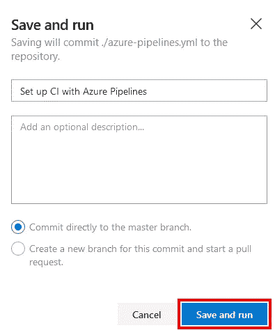

下一页将向您实时展示构建的状态。构建完成后，您应该会看到类似下面这样的结果。

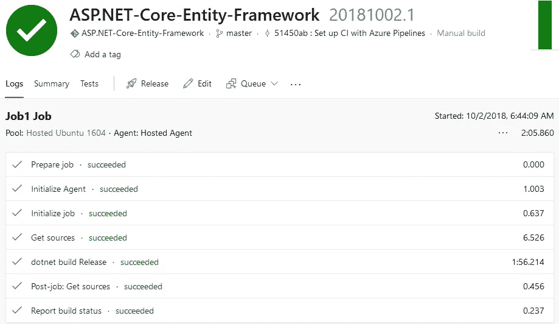

## 包扎

正如所料，使用 Azure Repos 和 Azure Pipelines 效果很好。如果你还没有尝试 Azure DevOps。微软提供了大量的这一系列产品，并且一直在变得越来越好。

*原载于***。**