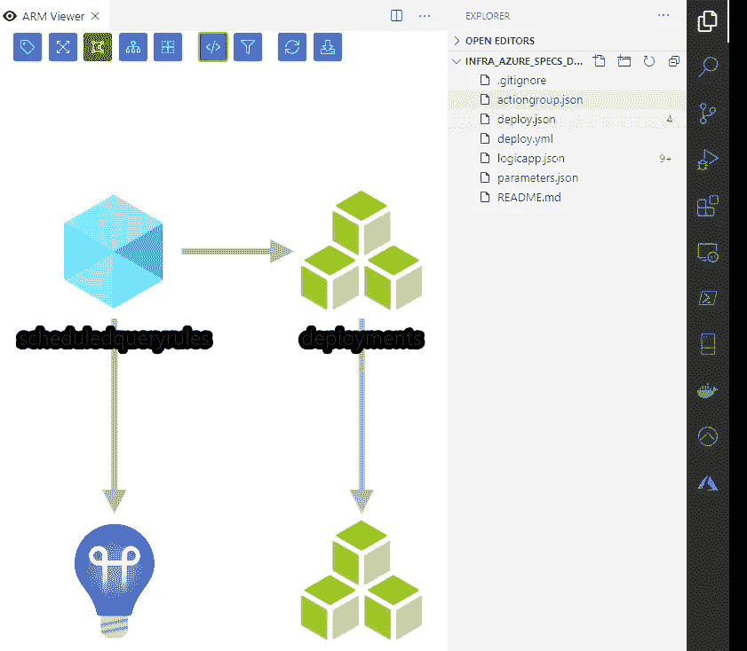
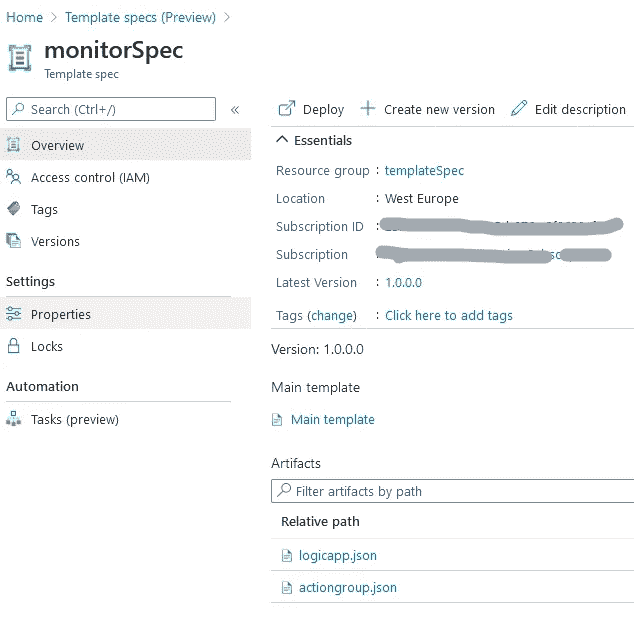
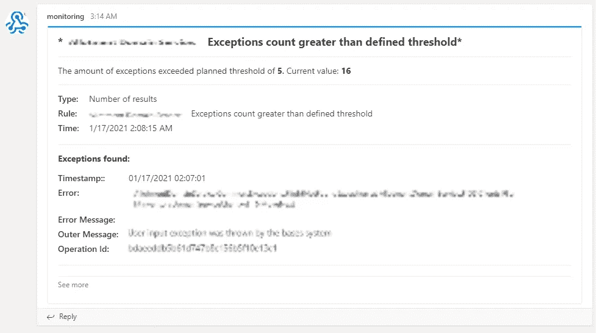

# Azure 资源管理器模板规范。使用 Azure alerts 进行主动应用程序监控。

> 原文：<https://itnext.io/azure-resource-manager-template-specs-proactive-application-monitoring-using-azure-alerts-bc09099c5e81?source=collection_archive---------3----------------------->


在这篇文章中，我想告诉你关于 **Azure 资源管理器模板规格**——Azure 中的一个新功能，它允许你存储 ARM 模板供以后部署，轻松修改它们，并使用 Azure RBAC 在你的团队/组织内共享。我们还假设你熟悉 Azure 资源管理器模板。为了让这篇文章更实际一点，我还将分享一个工作 Arm 模板，它允许将主动应用程序监控与通知消息一起部署到 MS 团队或您可能选择的任何其他渠道，作为 Azure Resource Manager 模板规范的工作演示。

那么，Azure 资源管理器模板规范，我们为什么要关心呢？我很确定，每个使用 ARM 模板的 DevOps 工程师迟早都会遇到这样的问题，当有一个巨大的 ARM 模板时，它很难维护，因为它有很多参数、变量和依赖项。这个问题的显而易见的答案是模块化，将一个巨大的模板分割成多个较小的模板，这里微软友好地为我们提供链接和嵌套的模板，将我们的 ARM 模板分割成许多相关的模板，然后通过一个主模板将它们部署在一起。这是一个非常强大的工具，它很有效，很多人都在使用它。然而，我自己和我的同事们经历过的一个缺点是，链接模板必须总是在外部可用。这时，共享访问签名(SAS)令牌的所有麻烦就开始了，因为您希望模板是安全的，而且对于团队或您的组织也是可访问的。

但是我们谈论 Azure [模板规范](https://docs.microsoft.com/en-us/azure/azure-resource-manager/templates/template-specs)是有原因的，对吗？在上述情况下，我们可以做的是创建一个模板规范，而不是搞乱 SAS 令牌。template-spec 真正酷的地方在于它允许使用相对路径将子模板链接到主模板。在我看来，这将模板管理带到了不同的层次。我们可以在一个 repo 中使用模板，而不必担心本地或远程存储副本最终会偏离原始模板。

> 记住:`*Microsoft.Resources/deployments*`资源的 apiVersion 必须是 2020-06-01 或更高版本，才能使用相对路径选项

查看下面的 JSON，在`templateLink`属性中，我们只指定了我们驱动器上本地文件夹中文件的`relativePath`:

我们的整个监控和警报解决方案由几个组件组成，例如:`Logic app`解析来自动作的数据，并调用具有必要负载的 webhook 端点，`Action group`负责在警报规则触发时通知或动作，`Alert rules`本身，以及`Application Insights`实例，在该实例中，我们从应用程序和服务收集日志&跟踪信息。仅部署这 4 种资源的 monolith 模板占用了 497 行，当我们将 logic app 和操作组拆分为子模板时，主模板就变成了 148 行，非常小，对吗？另一个优点是，你仍然可以在本地看到所有的子模板，并用 [Azure template viewer](https://marketplace.visualstudio.com/items?itemName=bencoleman.armview) 构建可视化效果。



当我们的主模板和子模板被细化并准备好时，我们可以用 azure cli 或 powershel 命令创建我们的模板规范。

```
**az ts create** --name monitorSpec --version "1.0.0.0" --resource-group templateSpec --location "westeurope" --template-file .\deploy.json
```

> 模板规格目前正在预览中。要配合 Azure PowerShell 使用，必须安装[5 . 0 . 0 版或更高版本](https://docs.microsoft.com/en-us/powershell/azure/install-az-ps)。要在 Azure CLI 中使用它，请使用[2 . 14 . 2 版或更高版本](https://docs.microsoft.com/en-us/cli/azure/install-azure-cli)。

创建模板规范后，您可以在 Azure 门户中查看*(需要在预览功能中启用)*并从访问控制选项卡管理对模板规范的访问。



门户中的模板规范示例

我们可以看到，我们已经创建了一个名为`monitorSpec`的模板规范，它保存了我们的主模板和两个子模板— `logicapp.json`和`actiongroup.json`。

现在您可以部署模板规范了。部署模板规范就像部署它所包含的模板一样，只是您要传入模板规范的资源 ID。您使用相同的部署命令，如果需要，为模板规范传入参数值。例如:

```
**$id** = $(az ts show --name monitorSpec --resource-group templateSpec --query "id" --version '1.0.0.0')az deployment group create --resource-group monitorRG --template-spec **$id** --parameters .\parameters.json
```

就是这样—非常类似于使用标准的链接模板，对吗？。

# 监控和警报设置是如何工作的？

监控算法本身相当简单:我们创建一个 Azure alert，它每 5 分钟在 Application insights 实例上执行一次特定的日志查询，如果满足警报条件，那么我们调用一个动作，将查询结果发送到逻辑应用程序。逻辑应用程序根据传入的数据*(在本例中，我们有两种类型的查询:超出异常计数和检测到慢速请求)*决定将什么类型的有效负载发送给 MS Teams，并使用必要的有效负载调用 MS Teams webhook。下面您可以看到一个在微软团队中收到的警报示例。



监控 MS 团队中的警报

一如既往，你可以在[我的 Github 库](https://github.com/f1xxxer/infra_azure_specs_demo)找到 ARM 模板的完整版本。在部署了来自存储库的 ARM 模板之后，您的订阅中应该有功能齐全的监控和警报基础设施，只是不要忘记用正确的值替换 parameters.json 文件中的`WebHookUrl`。

在下一篇文章中，我们将把整个模板规范管理与 Azure 管道集成在一起。

**GL & HF！**