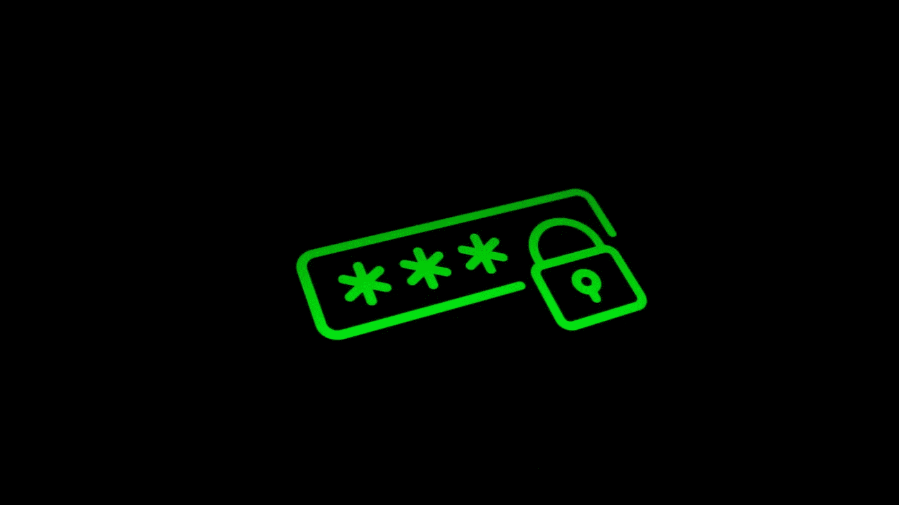
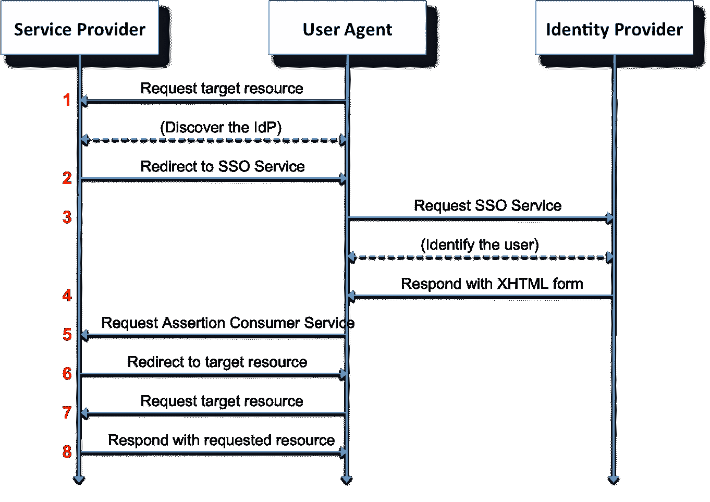
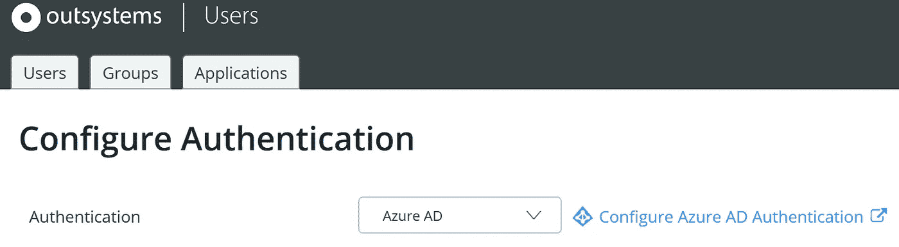

# 外部系统中的 Azure / SAML2.0 身份验证

> 原文：<https://itnext.io/azure-saml2-0-authentication-in-outsystems-1b94d11b196d?source=collection_archive---------4----------------------->

从版本[11 . 0 . 542 . 0](https://www.outsystems.com/downloads/ScreenDetails.aspx?MajorVersion=11&ReleaseId=19322&ComponentName=Platform+Server)(2019 . 7 . CP2)开始，OutSystems 支持最终用户使用 SAML 通过 Azure AD(以下简称为 AAD)登录 web 应用程序。这将是我们在现实基础设施中实现基于 SAML 的认证之旅的第 1 部分。首先，让我们简单讨论一些基本原则。

身份验证和授权通常组合在一起。这篇文章是关于认证的，因此我们想要定义这两个术语之间的区别。此外，理解本文中描述的变化如何影响用户维护和应用程序访问的处理是至关重要的。这些更改适用于所有(web)应用程序，不包括服务中心和 service studio 等外部系统模块。

认证是指提供证据(如密码)来验证身份的过程。
另一方面，授权是指验证某人或某物(身份)是否被允许访问屏幕或完成任何其他特定动作。

在我们的设置中，AAD 将用于认证用户，授权由[外部系统](https://www.outsystems.com)的“用户”模块处理。
这意味着您的用户或用户团队的角色分配仍然是在系统外完成的。因此，您可以通过向注册用户授予访问权限而不是授予他们特定于应用程序的角色来简化访问管理。

## 使用外部身份认证的优点和缺点

与在“用户”模块中使用标准方法相比，使用 AAD 认证用户有几个优点。

*   从用户的角度来看，最大的优势是他们不必记住特定于外部系统应用程序的密码，而这是最终用户经常抱怨的。例如，通过使用外部认证提供者，用户可以使用他们用于登录他们的工作站和/或电子邮件的相同密码。
*   从管理的角度来看，通过一个集中点进行身份验证的优势在于，他们可以更轻松地建立一个强大的密码策略，并确保遵守该策略。除此之外，它还减轻了管理员的工作量，减少了上下车过程中跳过步骤的机会。此外，它还简化了登机和离机过程的审计。

## 技术背景

为了保持简洁，我们将集中讨论与 SAML 认证相关的核心概念。任何基于 SAML 的身份验证方法都有 3 个共享的核心概念。它们如下:

*   校长。主体是试图访问资源的某人/某物。这通常是用户试图登录应用程序。
*   在我们的例子中，服务提供者是向委托人(即用户)提供应用程序的外部系统服务器。
*   身份提供者，在本例中，身份提供者可以理解为 AAD。它是一个接收来自服务提供商的延期请求并作为认证方的系统。成功认证主体后，它将响应发送给服务提供者。

在下面的例子中，*主体的*部分是由用户代理表示的流的开始。用户代理通常是浏览器/网络客户端。

SAML 认证流程 wiki

## 外部系统实施步骤

现在我们已经定义了 SAML 的一些基础知识，我们将介绍如何在您的外部系统环境中实现它。在 OutSystems 云中实现这一点也是可能的，但是对于这个例子，我们使用了一个简单的设置，包括一个开发、测试和生产环境。其中每个环境都有自己的前端服务器。生存期服务器超出范围。所有这些都作为 AWS 中的本地安装运行。我们将使用 OutSystems 版本[11 . 0 . 606 . 0](https://www.outsystems.com/downloads/ScreenDetails.aspx?MajorVersion=11&ReleaseId=19341&ComponentName=Platform+Server)(2019 年 10 月发布)。
所有的步骤在每个环境中都是一样的，OutSystems 确实提供了足够的[文档](https://success.outsystems.com/Documentation/11/Developing_an_Application/Secure_the_Application/End-User_Management/End-Users_Authentication/Configure_Azure_AD_Authentication?utm_source=ost-outsystems%20tools&utm_medium=ost-users&utm_campaign=ost-docrouter&utm_content=ost-helpid-30209&utm_term=ost-contextualhelp)来说明如何实现这些改变。

一般来说，在外部系统端切换到通过 AAD 认证只需要三个步骤。
这方面的所有步骤都是通过“用户”模块完成的。
转到您的环境用户模块，点击“配置认证”。然后，在下拉选项中，切换到“Azure AD”

对于大多数设置来说，保留默认设置是一个很好的起点。您可以离开“高级选项”并跳到
“下载 SP 元数据 XML”按钮。您需要将结果文件发送给 Azure 基础架构的管理员。作为回报，他们可以向您发送另一个 xml 文件，您可以通过“从 IDP/联盟元数据 XML 上传”
上传该文件。完成这些步骤后，所有使用默认“用户”模块进行用户验证的(web)应用程序会将用户重定向到外部登录提供商。

## 潜在的陷阱

在开始使用这些设置测试应用程序之前，您必须考虑一些潜在的陷阱。
最重要的问题是，在添加端，用户需要在适当的组/应用程序中才能登录。然而，不能从外部系统方面建立直接控制来实施这一点。这使得测试成为推出这些变化的重要部分。因此，它们应该完全按照您部署应用程序的方式来完成。首先在开发环境中，然后向前。
同样需要注意的是，这些变化仅适用于传统的 web 应用，不适用于移动或反应式应用。对于这些，您需要使用单独的 IDP 模块。有关更多信息，请参见下一节。
最后，在撰写本文时，还不支持通过相同的途径认证终身用户。我们预计这将在未来实现。现在，检查[熔炉](https://www.outsystems.com/forge/)中的组件可能会有用。

## **接下来的步骤**

虽然这些步骤集中在基础设施部分，但在应用程序级别仍有一些步骤要做。其中一些是强制性的，而另一些可以提高应用程序的可用性。还将深入了解移动设备的具体步骤。我的同事[威廉·安图内斯](https://medium.com/u/fc1ad0dcfa97?source=post_page-----1b94d11b196d--------------------------------)将在本文的[第二部分](https://medium.com/@william.antunes/azure-saml2-0-authentication-in-outsystems-part-2-e145f31f4420?source=friends_link&sk=d587058be2be233f7b860316d5615599)中解释这一点以及更多。