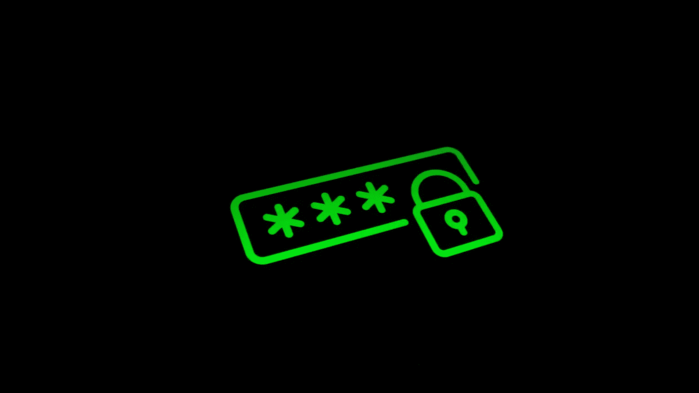
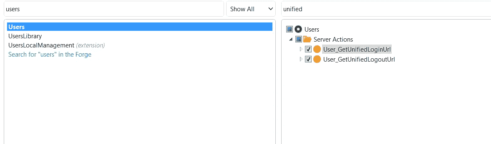
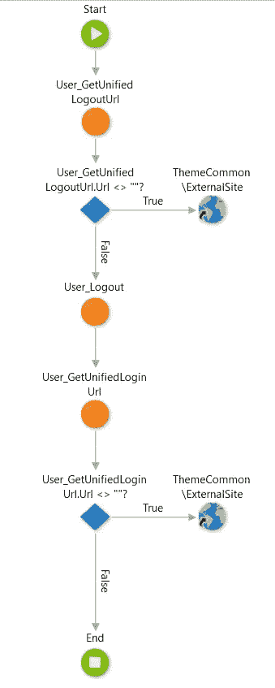

# 外部系统中的 Azure / SAML2.0 身份验证—第 2 部分

> 原文：<https://itnext.io/azure-saml2-0-authentication-in-outsystems-part-2-e145f31f4420?source=collection_archive---------5----------------------->

**挑战**

在使用多个应用程序的组织中，用户最常见的抱怨之一是需要为每个应用程序设置不同的密码，并且这些密码不能相同。因为存在不同的安全规则，例如，确定应用 A 的用户必须具有 8 个字符的密码，不允许有一个大写字母和任何符号，而应用 B 需要具有相同规则加一个符号的密码。也就是说，使用相同的密码可能具有挑战性。

**接近**

这是我们决定在组织中实施 Azure/SAML2.0 身份验证的原因之一。 [Michael De Ruijter](https://medium.com/@michaeldr1992) 作为系统工程师来设置所有系统，我作为软件工程师来实现从应用程序获取连接的能力，我们决定分享我们的实现经验。

这是实现系列的第二部分，你可以在这里阅读第一部分。在那里你可以找到我们正在谈论的解释，以及你需要做什么来开始实施它。

**我们做了什么？**

因此，正如我们之前已经说过的，OutSystems 从版本[11 . 0 . 542 . 0](https://www.outsystems.com/downloads/ScreenDetails.aspx?MajorVersion=11&ReleaseId=19322&ComponentName=Platform+Server)(2019 年 7 月，CP2)开始原生支持 Azure/SAML2.0 认证。但是这仅适用于传统的 web 应用程序，还不适用于反应式 web 应用程序。

对于移动应用程序，您需要做的更改将在本系列的下一篇文章中讨论。

对于登录过程，不需要额外的开发，只要您设置了使用 SAML 消息的用户模块，它就会自动为所有使用用户模块作为用户提供者的传统 web 应用程序使用 Azure 身份验证。

很简单，对吧？

不要太快，耐心等待，因为我们需要做一些开发，让你的登录和注销流程完全工作并与 Azure 集成。

[OutSystems 文档](https://success.outsystems.com/Documentation/11/Developing_an_Application/Secure_the_Application/End_User_Management/End_Users_Authentication/Configure_SAML_2.0_Authentication)描述了我们需要做什么来使注销流程按预期工作。这些步骤是必需的，因为登录是自动更改的，但是默认的注销流只是注销外部系统环境的内部用户，然后执行到登录页面的重定向。

在这一点上，Azure 不知道任何关于请求注销的事情，所以基本上我们需要做的是获得统一的 URL，该 URL 是 IdP 注销 URL。当调用那个 URL 时，我们将告诉 Azure 我们想要注销一个用户，如果统一的 URL 为空，我们只需要通过使用标准的 User_Logout 动作注销内部 OutSystems 用户，然后将用户重定向到统一的登录 URL。

我们可以找到在用户模块中获取统一 URL 的两个操作:

因此，如果您遵循文档中的步骤，传统 web 应用程序的注销流程应该如下所示:

我强烈建议您考虑一下这种流程的集中化，以避免在您已经拥有或将来将要拥有的每个传统 web 应用程序中重新实现这种流程的需要。

需要再次强调的一点是，只有当您的应用程序将默认的 users 模块作为用户提供者时，集成才会如所描述的那样工作。如果你有一个自定义用户提供者，另一种方法将是必要的。

如您所见，这并不是一场噩梦，但您需要遵循所有步骤，以便在您的环境中拥有适当的身份认证流程，并保证这将使用户受益，而不是给他们带来更多麻烦。