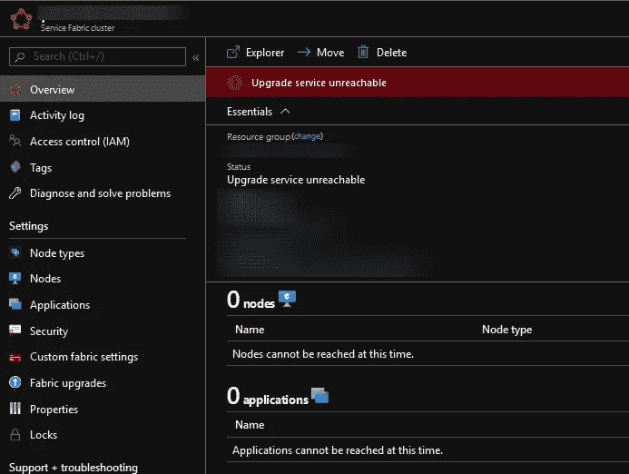
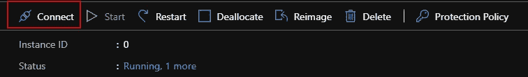
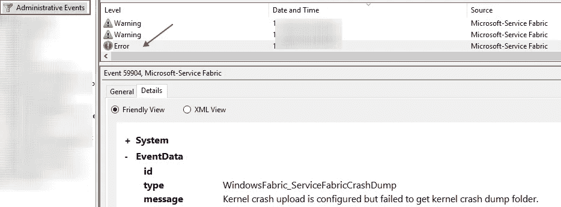
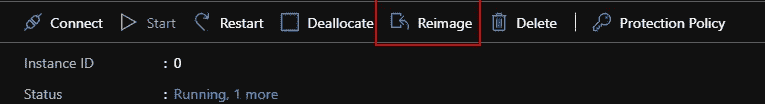
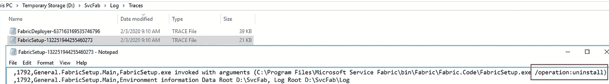
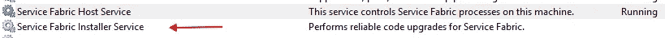
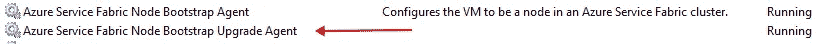
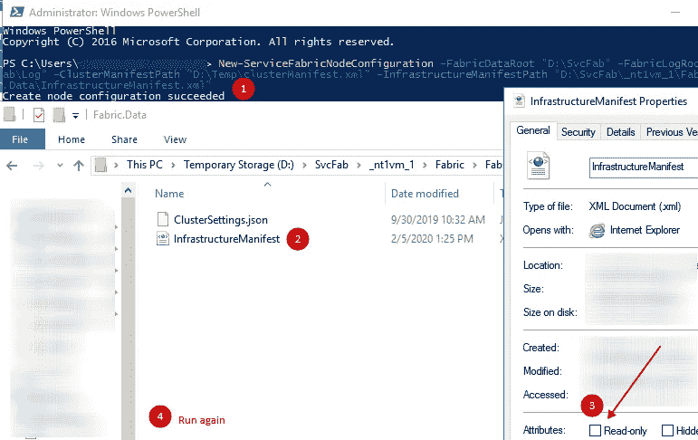
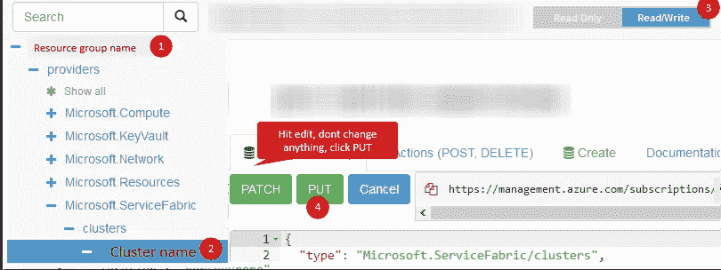

# 如何恢复出现故障的 Azure 服务结构群集。

> 原文：<https://itnext.io/azure-service-fabric-cluster-recovery-33886f1bf44f?source=collection_archive---------3----------------------->

## 群集证书到期后。


来自[皮克斯拜](https://pixabay.com/?utm_source=link-attribution&utm_medium=referral&utm_campaign=image&utm_content=362150)的赖安·麦奎尔的图像

发生了一些事情，尤其是在证书过期的情况下。这种情况最近发生在我身上，我得到了恢复故障集群的任务。本文致力于恢复具有无状态工作负载的基于 Windows 的 Azure 服务结构(ASF)集群。

> 最快的恢复方法是创建一个新的集群并在那里部署无状态服务☺，但是…


Azure 服务结构群集的手动恢复正在进行中()。

> TL；灾难恢复；您将获得一个逐步的操作计划，以使用新的主证书来恢复失败的无状态的基于 Windows 的 Azure 服务结构群集。群集恢复后，您可以继续 KeyVault 集成和辅助证书配置。

事实证明，ASF 可以在管理证书过期的情况下生存一段时间。因为这些证书(一个主证书和一个辅助证书)用于保护集群通信(升级服务和管理访问)——下一次 ASF 升级展期将会非常失败。

虽然微软的文档很好，但有些地方明显缺失，所以我决定填补这个空白。有两种官方方式来解决这个问题- [自动](https://github.com/Azure/Service-Fabric-Troubleshooting-Guides/blob/master/Security/How%20to%20recover%20from%20an%20Expired%20Cluster%20Certificate.md)和[半手动](https://github.com/Azure/Service-Fabric-Troubleshooting-Guides/blob/master/Security/Fix%20Expired%20Cluster%20Certificate%20Manual%20Steps.md)两种方式对我都不起作用。

第一课是使用证书通用名称创建一个 ASF 集群。不要使用在 Azure Key Vault 中使用自动生成的证书创建群集的 Azure CLI 命令。

这里的第二个教训是，您必须使用 PowerShell 脚本自动执行证书过期验证。您还应该将配置参数 accept expired pinnedcluster certificate 设置为 trues，这样即使证书过期，ASF 群集也能正常工作。

> 警告！不要为有状态服务这样做。

## 找到根本原因。

但首先，让我们深入探讨症状诊断。出现问题的第一个线索是以下 Azure Portal 视图，该视图显示了一个包含零个节点和零个应用程序的故障集群。



Azure 门户中的服务结构群集失败。

需要以下步骤来检测根本原因。

*   打开群集资源组，导航到带有种子节点的虚拟机规模集。通常，它被命名为`nt1vm_0`。
*   打开`nt1vm_0`并通过连接按钮下载 RDP 连接。节点的示例路径是`*your-cluster\nt1vm | Instances\nt1vm_0*`。



在虚拟机门户刀片中单击此按钮。

*   使用集群虚拟机管理员登录名和密码连接到一台计算机。如果出现连接问题，请仔细检查 ASF 负载平衡器是否有打开的端口。
*   如果 VM 非常慢，并且 CPU 使用率很高，那么打开任务管理器，将空闲优先级设置为抑制性最强的进程。
*   打开服务器事件日志，导航到管理事件部分并搜索 ASF 错误。



包含管理事件的 Windows server 事件日志

*   查找位于以下文件夹中的服务结构状态和日志。

```
"C:\WindowsAzure\Logs\AggregateStatus\aggregatestatus.json""C:\WindowsAzure\Logs\Plugins\Microsoft.Azure.ServiceFabric.ServiceFabricNode\[extension version]\CommandExecution.log"
```

*   尝试在此虚拟机上重新安装群集时，服务结构可能处于死循环中。主要症状是服务结构安装程序和引导代理系统服务消耗大量 CPU。

## 短期计划。

我将从一个没有截图的简短计划开始，并在下一节继续详细的计划。我将用粗体突出显示微软官方文档 [GitHub 文档](https://github.com/Azure/Service-Fabric-Troubleshooting-Guides/blob/master/Security/Fix%20Expired%20Cluster%20Certificate%20Manual%20Steps.md)中缺失的部分。

我的建议是先修复零种子节点，测试是否有效，再进行剩下的。

*   修复“死循环”,打开任务管理器，按 CPU 使用率对进程进行排序，将最高进程优先级改为空闲，然后立即停止。
*   官方文档中的上述步骤对我不起作用，所以我必须重新分配种子节点，一次一个。ASF Windows 服务器安装过程大约需要 15 分钟，另外还需要 20 分钟。
*   停止目标机器上的以下服务`FabricInstallerService, FabricHostService, ServiceFabricNodeBootstrapAgent`。
*   将新的群集证书安装到虚拟机根目录。
*   更改文件中的证书指纹`D:\SvcFab\_sys_0\Fabric\ClusterManifest.current.xml`
*   将该文件备份到驱动器上的新文件夹`C:\ClusterFix`
*   替换文件`D:\SvcFab_sys_0\Fabric\Fabric.Data\InfrastructureManifest.xml`中的证书指纹
*   在命令提示符下运行以下 Powershell 命令(不是在 PS ISE 中)。

```
New-ServiceFabricNodeConfiguration -FabricDataRoot "D:\SvcFab" -FabricLogRoot "D:\SvcFab\Log" -ClusterManifestPath "C:\ClusterFix\clusterManifest.xml" -InfrastructureManifestPath "D:\SvcFab\_sys_0\Fabric\Fabric.Data\InfrastructureManifest.xml"
```

*   打开文件`D:\SvcFab\_sys_0\Fabric\Fabric.Package.current.xml`并寻找`ManifestVersion`属性，它将指向带有活动集群配置的文件夹。
*   在我的例子中，它是下面的文件夹:`D:\SvcFab\_sys_0\Fabric\Fabric.Config.4.131473098266979018`
*   从文件夹中删除只读属性。
*   打开该文件夹中的`Settings.xml`，用新的证书指纹条目替换所有证书指纹条目。
*   从 Windows 服务启动服务结构主机和代理。
*   打开 Azure 资源管理器，找到一个群集，单击编辑和更新以重置 Azure 门户中的 ASF 群集状态。
*   使用正确的证书 URL 连接到 ASF 管理门户。

`[https://your-cluster.northeurope.cloudapp.azure.com:19080/Explorer](https://your-cluster.northeurope.cloudapp.azure.com:19080/Explorer)`

## 详细的行动计划。

现在让我们深入了解细节。

*   修复“死循环”的方法是打开任务管理器，按 CPU 使用率对进程进行排序，将最高进程优先级改为空闲优先级，然后完全停止。为了终止进程，使用以下 CMD 命令获取 PID 和 kill。

```
sc queryex FabricHostSvc
taskkill /pid 5364 /f
```

*   重新分配种子节点，一次一个。ASF 设置过程大约需要 15 分钟到 20 分钟。



重新成像按钮



如果您没有看到服务结构主机正在运行，并看到以下跟踪错误，请让虚拟机保持 20 分钟。

*   通过 RDP 连接到目标虚拟机，并检查以下服务是否正在运行。那就阻止他们。
    T3。



停止安装程序。然后是织物主机。



停止节点引导升级，然后停止引导代理。

*   将新的群集证书安装到虚拟机根目录。
*   更改文件中的证书指纹`D:\SvcFab\_sys_0\Fabric\ClusterManifest.current.xml`
*   将该文件复制到新文件夹`C:\ClusterFix`
*   用新的证书指纹条目替换证书指纹条目`D:\SvcFab_sys_0\Fabric\Fabric.Data\InfrastructureManifest.xml`
*   在 PS 命令提示符下(不是在 PS ISE 中)运行以下 Powershell 命令。由于目标基础结构清单文件上的旧 Powershell 版本或只读访问属性，该命令可能会失败。

```
New-ServiceFabricNodeConfiguration -FabricDataRoot "D:\SvcFab" -FabricLogRoot "D:\SvcFab\Log" -ClusterManifestPath "C:\ClusterFix\clusterManifest.xml" -InfrastructureManifestPath "D:\SvcFab\_sys_0\Fabric\Fabric.Data\InfrastructureManifest.xml"
```



导航到目标文件夹并删除只读属性。

使用脚本安装最新的 PowerShell 版本:

```
iex “& { $(irm [https://aka.ms/install-powershell.ps1](https://aka.ms/install-powershell.ps1)) } -UseMSI”
$PSVersionTable.PSVersion
```

*   打开文件`D:\SvcFab\_sys_0\Fabric\Fabric.Package.current.xml`并寻找`ManifestVersion`属性，它将指向带有活动集群配置的文件夹。要小心，要选择正确的文件夹来编辑。
*   在我的例子中，它是下面的文件夹:`D:\SvcFab\_sys_0\Fabric\Fabric.Config.4.131473098266979018`
*   打开此文件夹内的`Settings.xml`，用新的证书指纹条目替换所有证书指纹条目。
*   从 Windows 服务启动服务结构主机和代理:

```
net start FabricHostSvc 
net start ServiceFabricNodeBootstrapAgent
```

*   10 分钟后使用以下 PowerShell 脚本测试连接，确保证书安装在您的计算机上。

```
$ClusterName= "your-cluster.northeurope.cloudapp.azure.com:19000"$Certthumprint = "AAAAAAAAAAAAAAAAAAAAAAA"Connect-ServiceFabricCluster -ConnectionEndpoint $ClusterName -KeepAliveIntervalInSec 10 `-X509Credential `-ServerCertThumbprint $Certthumprint  `-FindType FindByThumbprint `-FindValue $Certthumprint `-StoreLocation CurrentUser `-StoreName My
```

*   打开 Azure 资源管理器，找到一个群集，单击编辑和更新以重置 Azure 门户中的 ASF 群集状态。



*   使用正确的证书 URL 连接到 ASF 管理门户。

`[https://your-cluster.northeurope.cloudapp.azure.com:19080/Explorer](https://your-cluster.northeurope.cloudapp.azure.com:19080/Explorer)`

## 总结。

因此，最简单的解决方案是创建一个集群副本，忘记恢复，下一个乐观的场景是使用 PowerShell 脚本进行自动恢复。而如果你有我这种极其不幸的案例，那么这篇文章就达到了目的。

我知道这是一个无聊的教程，但它可以拯救你的一天:)。

**就这样，感谢阅读。干杯！**

# 有用的链接。

*   [如何从过期的集群证书中自动恢复](https://github.com/Azure/Service-Fabric-Troubleshooting-Guides/blob/master/Security/How%20to%20recover%20from%20an%20Expired%20Cluster%20Certificate.md)。
*   [如何修复过期的集群证书？手动步骤](https://github.com/Azure/Service-Fabric-Troubleshooting-Guides/blob/master/Security/Fix%20Expired%20Cluster%20Certificate%20Manual%20Steps.md)。
*   [在 ASF 中添加或删除证书。MS docs。](https://docs.microsoft.com/en-us/azure/service-fabric/service-fabric-cluster-security-update-certs-azure)
*   [Azure 服务架构集群安全场景。](https://docs.microsoft.com/en-us/azure/service-fabric/service-fabric-cluster-security)