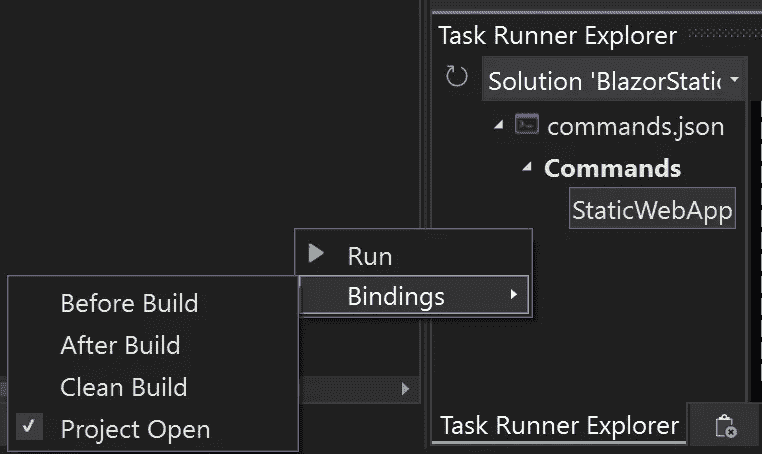
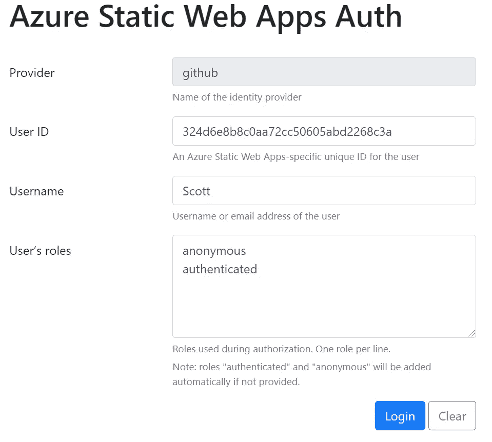
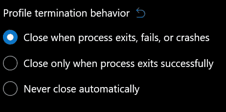

# Azure 静态 Web 应用、Blazor、认证和 Visual Studio 2022

> 原文：<https://itnext.io/azure-static-web-apps-blazor-authentication-and-visual-studio-2022-40364cc543b7?source=collection_archive---------1----------------------->

Azure Static Web Apps 是一种非常简单的方式来创建一个安全的 [Blazor Web Assembly](https://docs.microsoft.com/en-us/aspnet/core/blazor/) 应用程序，其后端 API 基于 [Azure 函数](https://docs.microsoft.com/en-us/azure/azure-functions/functions-overview)。我将指导您使用 Visual Studio 2022 在本地工作站上完成所有设置和运行。


Azure 应用服务

> 我有一个[公开回购](https://github.com/scottkuhl/StaticBlazorAuth)正在运行，但我建议你自己走一遍，这样你可以更好地理解它。

您将需要以下内容来完成这些步骤:

1.  Visual Studio 2022 安装在您的工作站上，具有 Azure 开发和 ASP.NET 以及 web 开发工作负载。
2.  GitHub 账户。
3.  [Node.js](https://nodejs.org/en/) 安装在您的工作站上。
4.  将您的解决方案部署到 web 的 Azure 帐户。

# 起始模板

微软有一个 GitHub 库，你可以用它来快速启动和运行 Blazor 和 Azure 静态 Web 应用。

1.  **使用** [**Blazor Starter 模板**](https://github.com/staticwebdev/blazor-starter) **创建自己的 GitHub 资源库。**
2.  **遵循回购中的入门步骤。**

# Azure 静态 Web 应用程序 CLI

自述文件建议将 API 项目和客户端都设置为启动项目。当您运行应用程序并通过端口 5000 访问站点时，它将一直工作，直到您尝试对用户进行身份验证。为此，我们需要运行上面的 CLI 作为代理监听端口 4280。

**3。通过运行**来全局安装 Azure 静态 Web Apps CLI

```
npm install -g @azure/static-web-apps-cli
```

# 配置项目

让我们更新客户端项目设置，以便在正确的端口上打开浏览器。

**4。更新客户端 launchSettings.json 文件，改为在端口 4280 上启动浏览器。**

```
"BlazorApp.Client": {
  "commandName": "Project",
  "dotnetRunMessages": true,
  "launchBrowser": true,
  "**launchUrl": "http://localhost:4280/",**
  "inspectUri": "{wsProtocol}://{url.hostname}:{url.port}/_framework/debug/ws-proxy?browser={browserInspectUri}",
  "applicationUrl": "http://localhost:5000",
  "environmentVariables": {
    "ASPNETCORE_ENVIRONMENT": "Development"
  }
}
```

# 配置 Visual Studio

您可以手动运行 CLI，但我们可以使用 Visual Studio 简化这一过程。

**5。安装** [**命令任务运行器(64 位)**](https://marketplace.visualstudio.com/items?itemName=MadsKristensen.CommandTaskRunner64) **扩展。**

**6。将名为 StaticWebApp.cmd 的文件添加到您的解决方案文件夹中，并在其中包含以下命令。**

```
swa start http://localhost:5000 --devserver-timeout=6000000
```

(超时以毫秒为单位，设置超时是为了在项目打开和首次启动之间留出足够的时间。可以随意调整。)

7 .**。在 Visual Studio 中打开任务运行器资源管理器窗口。找到您的 StaticWebApp 命令，并将其设置为在项目打开时打开。**



任务运行器浏览器

或者，您可以手动将 commands.json 文件添加到解决方案文件夹中，并包括以下内容:

```
{
  "commands": {
    "StaticWebApp": {
      "fileName": "cmd.exe",
      "workingDirectory": ".",
      "arguments": "/c StaticWebApp.cmd"
    }
  }
, "-vs-binding":{"ProjectOpened":["StaticWebApp"]}
}
```

现在，当您打开项目并让它在后台运行时，将会启动 SWA CLI。

现在，只需点击开始按钮，您就可以使用身份验证来使用 Visual Studio 和 Azure 静态 Web 应用程序了。

# 添加身份验证代码

在本地运行应用程序时，您不需要管理任何用户或角色。CLI 为开发和测试的登录提供了一个模拟界面。



模拟安全提供者 UI

本视频将指导您更新用户界面，以添加登录页面、保护用户界面和 API。

如何使用 Azure Static Web Apps 视频保护您的 C# API

## 可选项:Windows 终端

该功能应用程序将启动一个终端窗口，在您停止调试后，该窗口将保持打开状态。解决这个问题的一种方法是将 Windows 终端中的设置更改为在进程退出、失败或崩溃时关闭。你可以在默认>高级下找到这个设置。



Windows 终端设置

# **总结**

我的目标是让您的 Blazor Azure 静态 Web 应用程序在 Visual Studio 中本地启动和运行，并通过身份验证和单击运行，尽可能减少摩擦。希望这能给你一个开发体验，就像 Azure 静态 Web 应用的部署体验一样简单。