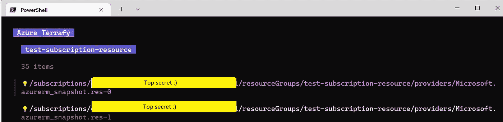
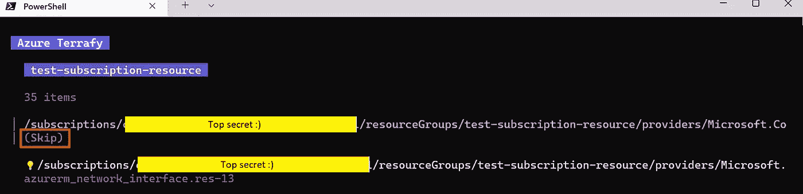
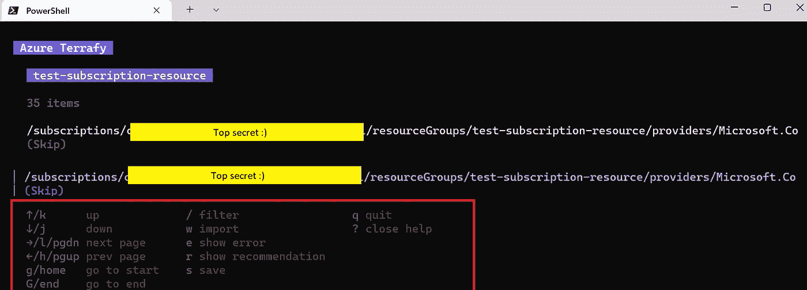
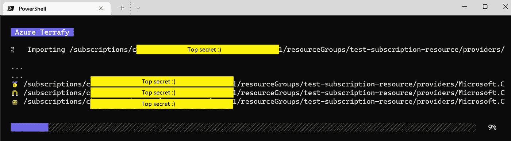
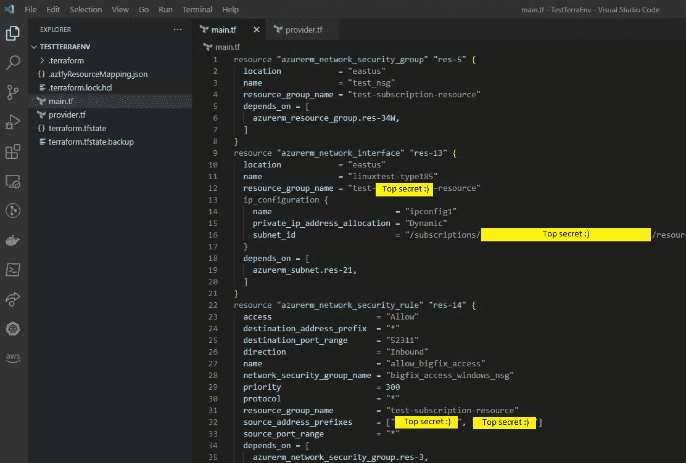
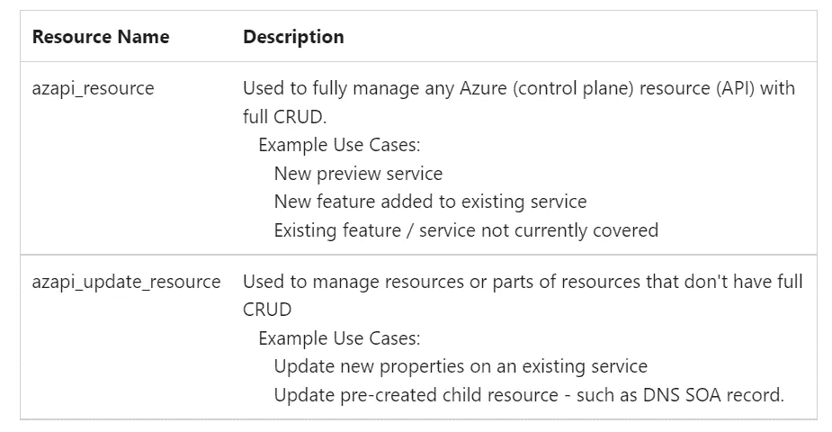

# Azure Terrafy- Azure 的最佳 Terraform 伙伴

> 原文：<https://itnext.io/azure-terrafy-azures-best-terraform-buddy-74211194ddee?source=collection_archive---------2----------------------->


整个 DevOps 世界都在向 IAC (infrastructure as a code，基础设施即代码)转移，这早已是一个**“既成事实”**的事实，这意味着通过确定性代码在云中对组织中的整个环境和流程进行建模。
在复杂环境下工作时，例如:

*   不均匀
*   多工具/供应商
*   多个云提供商

这种需求正在急剧增加。

在我过去作为顾问的经历中，我能够就如何进入 IAC 世界向组织提供建议，并帮助 DevOps 人员通过 Terraform 认证，这实际上是 IAC 世界的默认语言。

这种态度上的转变在高科技世界中并不总是容易消化的，尤其是在大型组织中。
现有环境(主要是遗留环境)使得对现有计算实体进行建模并将其转移到基于 IAC 的工作形式变得非常困难。

同一个月(2022 年 5 月)，Azure 生态系统的一个奇妙工具被引入，它被称为——**“Azure Terrafy”**
这个工具可以在教育人和建模准确性方面，解决向 IAC 熟练水平更平滑过渡过程中的许多问题。这个工具的功能令人印象深刻，我将在本文中向您简单介绍一下。

如果是这样，我们已经写得够多了。让我们从介绍这个工具开始

# 安装 Terrafy

安装很简单，尽管您需要安装 GO 语言作为先决条件。

*(我将在本文中使用 PowerShell，因为，你知道，微软*😜 *)*

```
PS:| go install github.com/Azure/aztfy@latest
```

请刷新您的终端会话。

# 了解一下考试的环境。

*值得注意的是，****aztfy****目前只支持资源组级别的导入，但在不久的将来也会支持订阅。*

1.当 ***aztfy*** 最终安装完成后，请运行 ***aztfy*** 命令，并指定想要导入的 Azure RG(资源组)。

```
PS:| Aztfy *<RG name>*
```

2.一旦初始导入完成， ***aztfy*** 将向您显示在订阅中检测到的所有资源(在我们的例子中，只有 35 个项目。在**【现实世界】**场景中，会比那个大很多)



3.现在，您将在一个交互式列表中看到所有的资源，您可以手动调查这些资源。



4.在此阶段，您可以执行以下操作:

> a.通过显示错误进行调试
> 
> b.查看建议或导入
> 
> c.筛选要导入的资源
> 
> d.显示依赖关系



5.当您准备好所需的导入状态时，通过向下并输入“W”来启动最终的导入过程。
(如果已经不明显，那就需要一段时间；因此，这是你延长休息时间的时间😁)



6.还有“**凯西·卡达布拉**”你所有的资源都在 Terrafrom 的 HCL 文件中定义好了，包括**的依赖**。



从现在开始，你的创造力就是你最好的朋友！

GitHub 上项目资源库的链接:

> 【https://github.com/Azure/aztfy 

# 要考虑的事情

由于这是一个相对较新的项目，有一些东西还没有“烤好”。

1.  导入任务仅适用于资源组。
2.  导入任务仅导出整体结构。如果你想要一个更灵活或更抽象的设计，你将需要在它上面做更多的工作。
3.  如果您计划使用状态文件，您只有一个选择，那就是将其保存在本地。试图将状态文件存储在远程位置并不简单。

# Terraform AzAPI 提供者 Terrafy 背后的机制

AzAPI 提供者是位于 Azure ARM REST APIs 之上的一个薄层。AzAPI 提供程序使您能够使用任何 API 版本管理任何 Azure 资源类型。该提供程序通过允许管理新的 Azure 资源和属性(包括私有预览)来补充 AzureRM 提供程序。

# AzAPI 提供者资源

为了让您无需更新即可管理所有 Azure 资源和功能，AzAPI 提供程序包括以下通用资源:



有关 AzAPI 提供者的更多信息，请参考此处的链接