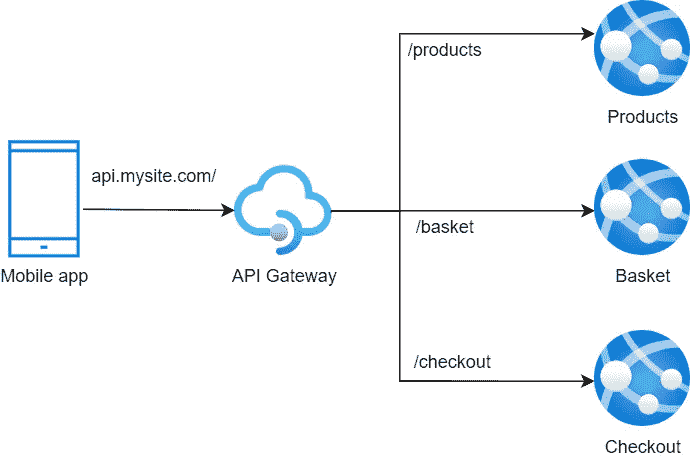
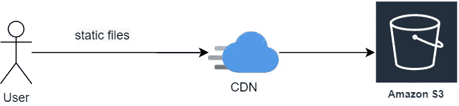
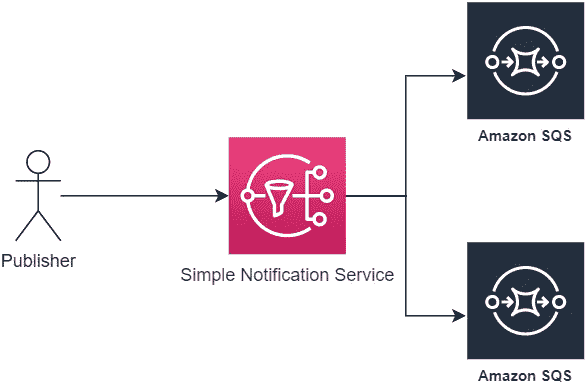
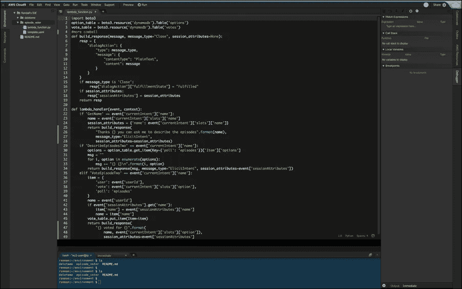
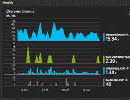

# Azure 到 AWS 地图

> 原文：<https://itnext.io/azure-to-aws-map-70d4c56f55a7?source=collection_archive---------0----------------------->

Azure VS AWS — [来源](https://stackify.com/azure-vs-aws-comparison/)

多年来，你可能作为云提供商与 AWS 或 Azure 合作过，两者都提供相当类似的服务，所以只要你知道基本知识，其中一个的体验可以适度地转化为另一个。这是另一个母亲的服务和他们的兄弟的地图。

这是对主要服务的一个粗浅的比较，包括我能想到的服务目的和主要区别，所以一旦你知道了服务名称，你就可以做一个全面的调查。

# 计算

## Azure 虚拟机/ EC2(弹性计算云)

当您想要管理自己的虚拟机 IaaS 时，这就是您正在寻找的服务。

## Azure 函数/ Lambda

有时候你只需要执行一点代码，但是你不需要一个专用的虚拟机来完成。你可以不用服务器，使用 Azure 函数或 Lambda。

## Azure 应用服务/弹性豆茎

用于在云中运行应用程序，而不必太担心它们正在运行的服务器。他们将拥有专用的虚拟机。

一个关键的区别是，Elastic Beanstalk 可以很容易地添加到 VPC(虚拟网络)中，因此更容易在网络级别控制流量。Azure 应用服务通过隔离层支持这一点，但它很快变得昂贵。

## 容器执行

*   **AWS Fargate —** 无服务器容器编排。
*   **AWS ECS 弹性容器服务-** PaaS 全托管容器编排服务。您仍将拥有虚拟机集群。
*   **AKS (Azure Kubernetes 服务)/ EKS (Elastic Kubernetes 服务)——**Kubernetes 即服务，具有专用虚拟机集群。

# 储存；储备

## 存储帐户/ S3(简单存储服务)

当您需要存储文件时，您可以使用存储帐户。这项服务对两家云提供商都很关键，因为其他服务依赖于他们。

这个服务在 AWS 中是无区域的，在 Azure 中是特定区域的。

# 安全性

照片由[克里斯·巴尔巴利斯](https://unsplash.com/@cbarbalis?utm_source=unsplash&utm_medium=referral&utm_content=creditCopyText)在 [Unsplash](https://unsplash.com/s/photos/padlock?utm_source=unsplash&utm_medium=referral&utm_content=creditCopyText) 上拍摄

## 服务主体/ IAM 角色

对于访问控制，在 Azure 中，您将在 Azure Active Directory 中注册服务主体，在 AWS 中，您将在 IAM 中配置角色。两者都支持相似的权限模型。

## Azure AD B2C / AWS Cognito

当您希望从外部提供商(如 Twitter、脸书或 Active Directory)实现单点登录时。

额外收获:第三方解决方案是 Auth0。

## 密钥库/ KMS(密钥管理系统)

您的应用程序将拥有敏感的配置，如密钥和证书。您可以将它们添加到 Azure Key Vault 中，并制定关于谁可以检索该秘密的策略，而不是将它们留在源代码中(有风险)。

例如，您可以添加秘密，并且只允许 Azure 服务主体读取。

默认情况下，AWS KMS 支持密钥轮换。

## Azure 活动日志/云轨迹

相当于“git 责备”,它存储对资源所做的操作的日志，例如当一个新的虚拟机启动时。

# 数据库

## Azure 数据库/ RDS(关系数据库服务器)

仅仅为了获得 PaaS 关系数据库服务器，示例引擎:

*   SQL Server
*   关系型数据库
*   亚马逊极光

## 文档数据库/发电机数据库

NoSql 由两个云提供商完全管理实例，两者都作为键值或文档存储。

两者都提供如下功能:

*   自动备份
*   多区域复制
*   最终或强一致性的概念

## 用于 Redis /弹性缓存的 Azure 缓存

当您的应用程序可以使用低延迟的分布式缓存层时。这就是 PaaS，所以你不需要担心维护缓存集群。

弹性缓存提供 Redis 和 Memcached。

# 建立工作关系网

## 虚拟网络/ VPC(虚拟私有云)

在 Azure 中，你有 VNet 的概念，主要区别是在 AWS 中大多数服务可以很容易地添加到 VNet 中。而 Azure 中的一些服务你可能需要支付额外费用。

## Azure 交通管理-53 号公路

用于在 DNS 级别设置路由的服务。

## API 管理— API 网关

对于 API 网关的概念，您可以添加一个 API 网关层，而不是让一个客户端知道许多后端服务，如下所示:

API 网关示例

它简化了移动应用程序的生命周期，而且由于它是一个间接层，它还提供了:

*   集中日志的能力。
*   费率限制。
*   SSL 终止。
*   Web 应用防火墙。
*   认证/授权。

## Azure CDN /云前沿

当性能对您的 web 应用程序至关重要时，内容交付网络非常重要。我们可以使用专用资源来处理内容分发和缓存，而不是将静态文件留在应用虚拟机中。

这两种服务遵循相似的方法，它们都位于存储帐户或 S3 中的文件前面。

S3 的 CDN 示例

# 长队

## 蔚蓝队列/ SQS

当你有一个简单的队列，一个发布者和一个消费者。

## Azure 通知中心/ SNS(简单通知服务)

当您需要发布通知时，例如:

*   短信
*   SQS
*   电子邮件
*   移动推送通知
*   超文本传送协议
*   调用 lambda/Azure 函数

AWS SNS 以发布者/订阅者模式工作，所以你可以说它也等同于 Azure Service Bus，因为你可以有多个订阅者，他们有自己的 SQS 队列。

使用 AWS SNS 和 SQS 实现服务总线

## Azure 事件中心/ AWS Kinesis

当您处理高吞吐量队列时。

# 开发者工具

## Azure DevOps

这项服务是过去所谓的 VisualStudio online 的发展。通过这项服务，您可以:

*   用 GIT 或 TFS 托管你的代码。AWS 对此进行了代码提交。
*   构建您的代码> AWS 代码构建。
*   部署应用程序> AWS 代码管道。
*   管理团队积压工作。
*   测试执行报告> AWS 代码管道。

## ARM 模板/云形成

在云中手动创建用于测试目的的资源是好的，但是对于生产资源来说不是一个好的实践。因为:

*   它是不可重复的
*   不可扩展。
*   如果出现问题，数十甚至数百项服务需要痛苦的手动灾难恢复。

因此，你可以通过脚本来自动化它，而不是手动供应，对于 Azure，你可以使用 ARM 模板和 AWS 的云形成。

额外收获:Terraform 两者都支持。

## Azure 控制台/ AWS 云 9

虽然在 Azure 中你可以选择使用 bash/Powershell 来编写命令，但我发现 AWS Cloud 9 为我们提供了一个完整的迷你 IDE 环境。

AWS Cloud9 示例

微软正在用 GitHub Codespaces 改进他们的游戏，所以这是一个值得关注的领域。

# 监视

## Azure monitor /云观察

您的服务需要报告指标，例如，正在运行的虚拟机的 CPU 百分比。在 Azure 中，你可以预期这些指标和基本日志会被传到 Azure Monitor 和 AWS 中的 Cloud Watch。

## 应用洞察/ X 射线

App insights 仪表板示例

对你的应用程序有基本的了解，能够看到被调用的请求、响应时间、成功率和依赖调用。

APM(应用程序性能监控)，您还可以深入到每个单独的请求，并查看每个依赖关系调用所用的时间。

额外收获:跨云解决方案可以是 Datadog。

# 结论

两家云提供商在许多方面相似，他们都是云提供商，所以他们都必须解决相同的问题，都必须考虑区域(数据中心位置)以及如何将这些区域划分为多个可用性区域。所以你可以期待高度的相似性。

一旦你掌握了 AWS 的缩写，你就能理解和 AWS 一起工作的开发人员在谈论什么。

# 进一步的想法

这个列表是我创建的，但它可能会增长，而且对于一个人来说很大，需要编辑和更新。我希望我给出了最重要的服务，有几个违反直觉的点。

更完整的列表: [AWS/Azure 对比](https://docs.microsoft.com/en-us/azure/architecture/aws-professional/services)