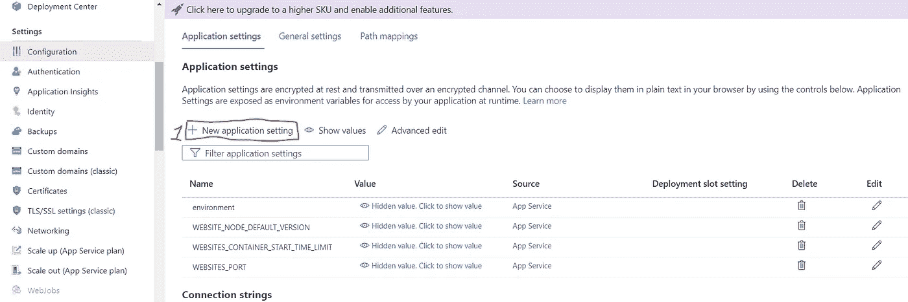
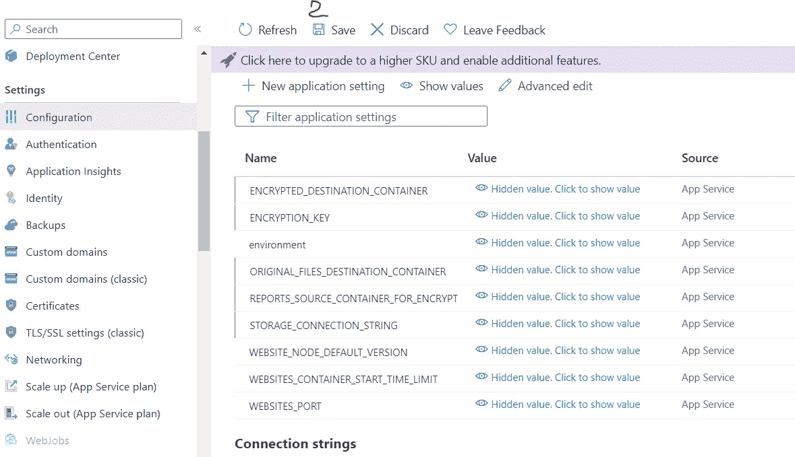
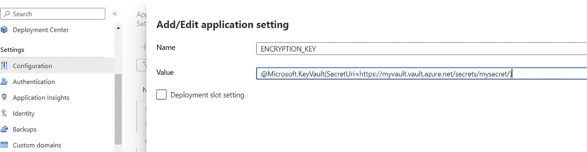
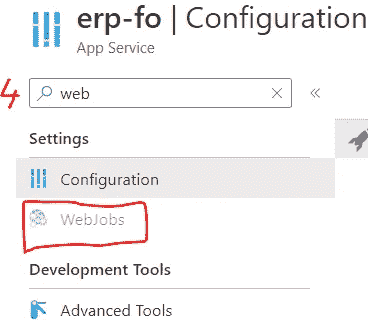

# 使用 Node.js 将 blobs 加密到存储帐户的 Azure WebJob

> 原文：<https://itnext.io/azure-webjob-to-encrypt-blobs-into-storage-account-with-node-js-90a0e43c6230?source=collection_archive---------3----------------------->


作者图片:Parodi Ligure 周围

前段时间我在工作中接到一个任务。来自我的 Microsoft Azure DevOps 板的用户故事要求用 PGP 标准加密银行要求的报告。

因此，我开始像其他开发人员一样四处寻找和研究。

为了做到这一点，我使用了微软的 [@azure/storage-blob 库](https://www.npmjs.com/package/@azure/storage-blob)和 [openpgp](https://www.npmjs.com/package/@azure/storage-blob) 库，除此之外，你还应该留意一下 [dotenv](https://www.npmjs.com/package/dotenv) ，这对于参数化我们的小脚本会有很大的帮助。

# 动手操作:

1.  在您的驱动器上选择您的项目目录，并通过运行命令 *npm init* 来启动一个新的 NPM 包，然后按照不言自明的说明进行操作。
2.  安装所需的库(我们将使用特定的版本，但您可以自由安装最新的版本，并告诉我它是否仍然有效，或者最新的 npm 包是否正在破坏应用:) )、用于 blob 操作的 [@azure/storage-blob 库](https://www.npmjs.com/package/@azure/storage-blob)、用于加密的 [openpgp](https://www.npmjs.com/package/@azure/storage-blob) 和 [dotenv](https://www.npmjs.com/package/dotenv) ，方法是将命令运行到您的 CLI 中，您的 *package.json* 文件应如下所示:

```
npm i @azure/storage-blob@12.0.0
npm i openpgp@5.0.0–3
npm i dotenv@6.0.0
```

```
{
  "name": "encrypt-webjob",
  "version": "1.0.0",
  "description": "",
  "main": "index.js",
  "scripts": {
    "test": "echo \"Error: no test specified\" && exit 1"
  },
  "author": "",
  "license": "ISC",
  "dependencies": {
    "@azure/storage-blob": "^12.0.0",
    "dotenv": "^6.0.0",
    "openpgp": "^5.0.0-3"
  }
}
```

3.如果你的 app 主入口文件是如上的 index.js，那么创建 *index.js* 文件并粘贴如下，这将在文章中进一步解释。

```
const { BlobServiceClient } = require('@azure/storage-blob');
require('dotenv').config()
const openpgp = require('openpgp');
const streamToString = require('./streamProcessor');

function decryptBase64(paramEncodedAsBase64) {        
    return  Buffer.from(paramEncodedAsBase64,'base64').toString();
}
function modifyExtension(string) {
    let fileName;
    fileName = string + ".pgp";    
    return fileName;
}

async function main() {    
    var publicKey = decryptBase64(process.env.ENCRYPTION_KEY) 

    const blobServiceClient = BlobServiceClient.fromConnectionString(process.env.STORAGE_CONNECTION_STRING)
    const containerClient = blobServiceClient.getContainerClient(process.env.REPORTS_SOURCE_CONTAINER_FOR_ENCRYPTION)
    const containerEncryptedFiles = blobServiceClient.getContainerClient(process.env.ENCRYPTED_DESTINATION_CONTAINER)
    const containerOriginalFiles = blobServiceClient.getContainerClient(process.env.ORIGINAL_FILES_DESTINATION_CONTAINER)
    const matchBlobByName = process.env.MATCH_REPORT_FILES
    await containerEncryptedFiles.createIfNotExists(process.env.ENCRYPTED_DESTINATION_CONTAINER)
    await containerOriginalFiles.createIfNotExists(process.env.ORIGINAL_FILES_DESTINATION_CONTAINER)
    for await (const blob of containerClient.listBlobsFlat()) {
        if (blob.name.match(matchBlobByName)) {
            const blockBlobClient = containerClient.getBlockBlobClient(blob.name);
            const encryptedBlockBlobClient = containerEncryptedFiles.getBlockBlobClient(modifyExtension(blob.name))
            const originalBlockBlobClient = containerOriginalFiles.getBlockBlobClient(blob.name)
            blockBlobClient.download(0)
            .then(downloadBlockBlobResponse => streamToString(downloadBlockBlobResponse.readableStreamBody))
            .then(blobAsString => {
                return Promise.all([openpgp.createMessage({ text: blobAsString }), openpgp.readKey({ armoredKey: publicKey.toString() }), originalBlockBlobClient.upload(blobAsString, blobAsString.length)])
                .then(([message, encryptionKeys])=>{
                    return openpgp.encrypt({
                        message,
                        encryptionKeys,
                    })                   
                })                
                .then(encrypted => {encryptedBlockBlobClient.upload(encrypted, encrypted.length)})              
                .then(containerClient.deleteBlob(blob.name))                
            })           
        }
    }

}       

main().then(() => console.log('Done')).catch((ex) => console.log(ex.message)); 
```

**脚本解释:**

我们导入我们需要的库。

```
const { BlobServiceClient } = require('@azure/storage-blob');
require('dotenv').config()
const openpgp = require('openpgp');
```

我们定义一个引用流处理器脚本的常量(将在下一步中创建)。

```
const streamToString = require('./streamProcessor');
```

我们定义了一个函数，它将从 base64 解码存储在 Azure Key Vault 中的加密密钥——由于未知的原因，如果密钥不是以 base64 形式存储的,则无法正确检索到密钥**,因此在密钥以字符串形式生成后，您可以使用 *window.btoa()* 浏览器内置函数来生成 base64 字符串密钥，该密钥将作为秘密存储在 Azure Key Vault 中，并将作为环境变量被引用。**

```
function decryptBase64(paramEncodedAsBase64) {        
    return  Buffer.from(paramEncodedAsBase64,'base64').toString();
}
```

我们定义一个函数来将结果 blob 的扩展变成*。pgp*

```
function modifyExtension(string) {
    let fileName;
    fileName = string + ".pgp";    
    return fileName;
}
```

我们定义了*主*函数来完成所有的魔术。它将检索环境变量的值(加密密钥为[process.env.ENCRYPTION_KEY]，存储帐户连接字符串为[process . env . Storage _ CONNECTION _ STRING]，源容器名称为[process . env . reports _ SOURCE _ CONTAINER _ FOR _ ENCRYPTION]，加密 blob 的目标容器为[process . env . encrypted _ DESTINATION _ CONTAINER]，加密后原始文件的副本，因为我们可能需要在加密后移动它们，这样我们就不会在 web 作业上再次加密它们，重新运行为[process . env . original _ FILES _ DESTINATION _ CONTAINER

然后我们动态地创建容器，如果它们不存在

```
 await containerEncryptedFiles.createIfNotExists(process.env.ENCRYPTED_DESTINATION_CONTAINER)
    await containerOriginalFiles.createIfNotExists(process.env.ORIGINAL_FILES_DESTINATION_CONTAINER)
```

接着我们在斑点上做一个循环

```
for await (const blob of containerClient.listBlobsFlat()) {...}
```

在这个循环中，我们在尖括号<<<*/blobNameVirtualFolder/>>>*blob name . extension 之间的模式之后过滤斑点，如下所示

```
if (blob.name.match(matchBlobByName)) {...}
```

我们实例化了 *blockBlobClient、encryptedblockblocbclient*和 *originalBlockBlobClient* ，并且我们下载了过滤后的 blobs，以便通过使用*blockBlobClient . download(0)*进行加密来“改变”它们

```
 const blockBlobClient = containerClient.getBlockBlobClient(blob.name);
            const encryptedBlockBlobClient = containerEncryptedFiles.getBlockBlobClient(modifyExtension(blob.name))
            const originalBlockBlobClient = containerOriginalFiles.getBlockBlobClient(blob.name)
            blockBlobClient.download(0)
```

在*blockblobclient . download(0)*上，这是一个从系统中读取或下载 blob(包括其元数据和属性)的承诺，我们应用以下逻辑将 blob 下载为字符串流并返回一个**承诺。all** 使用 *openpgp* 库，一旦完成此承诺，加密的 blob 将被上传到为加密的 blob 指定的容器中，并且……旧的原始 blob 将被删除，因为 blob 在承诺开始时被移动。

```
 .then(downloadBlockBlobResponse => streamToString(downloadBlockBlobResponse.readableStreamBody))
            .then(blobAsString => {
                return Promise.all([openpgp.createMessage({ text: blobAsString }), openpgp.readKey({ armoredKey: publicKey.toString() }), originalBlockBlobClient.upload(blobAsString, blobAsString.length)])
                .then(([message, encryptionKeys])=>{
                    return openpgp.encrypt({
                        message,
                        encryptionKeys,
                    })                   
                })                
                .then(encrypted => {encryptedBlockBlobClient.upload(encrypted, encrypted.length)})              
                .then(containerClient.deleteBlob(blob.name))                
            }) 
```

在最后一段中，我们调用主*函数*来执行

```
main().then(() => console.log('Done')).catch((ex) => console.log(ex.message));
```

也就是说，我们创建文件 *streamProcessor.js* 并粘贴微软提供的以下代码——不难“猜测”它的目的是什么；)

```
const streamToString = async function (readableStream) {  
    return new Promise((resolve, reject) => {
        const chunks = [];
        readableStream.on("data", (data) => {
            chunks.push(data.toString());
        });

        readableStream.on("end", () => {
            resolve(chunks.join(""));
        });
        readableStream.on("error", reject);
    });
}

module.exports = streamToString;
```

此刻，应用程序已经完成，我们需要转移到云阶段。

首先，将整个项目文件夹压缩为 Azure WebJobs 接受的 zip 格式。

登录你的 Azure 账户，进入你的 web 应用，然后导航到*配置*部分，按照下图创建环境变量并添加变量。



最后，您的配置应该是这样的(不要忘记保存配置)。



**关于保存加密密钥值的密钥库引用**的语法的小注意事项——在您的密钥库中，您需要提供对您的 web 应用程序的访问权限来访问这些秘密(不幸的是，我无法在此介绍这一点，因为这不在本文的讨论范围之内),然后您复制密钥的引用，并将其添加到环境变量的值中，如下例所示。

```
@Microsoft.KeyVault(SecretUri=https://myvault.vault.azure.net/secrets/mysecret/)
```



转到 WebJobs 部分，按照简单的流程，将压缩代码添加为计划的或手动触发的 webjob。



我们已经完成了我们的小应用程序，它使用行业标准的 PGP 强加密来加密文本 blobs(不仅如此)。
如有错误或建议，欢迎给我留言。

```
More about the author on [https://techdocs.ro](https://techdocs.ro)
```