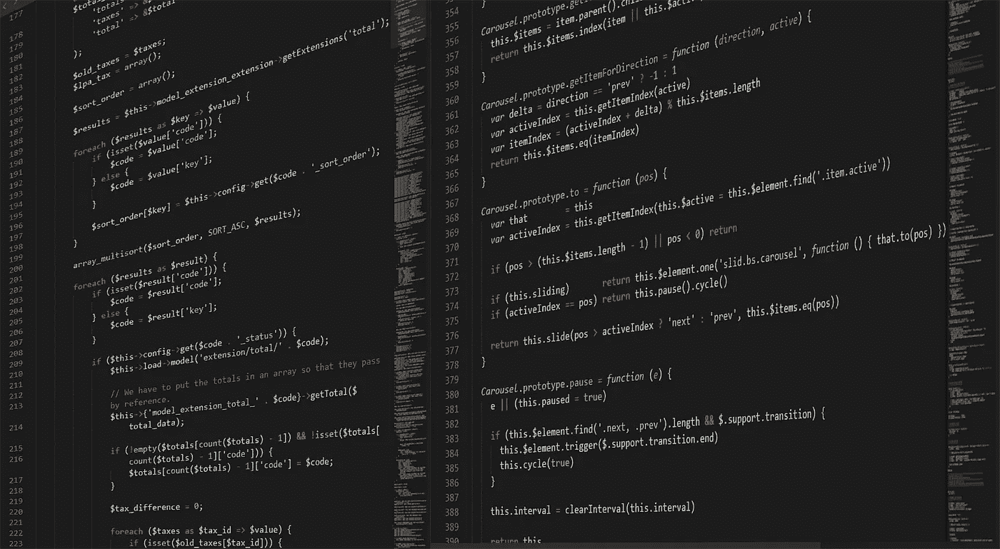
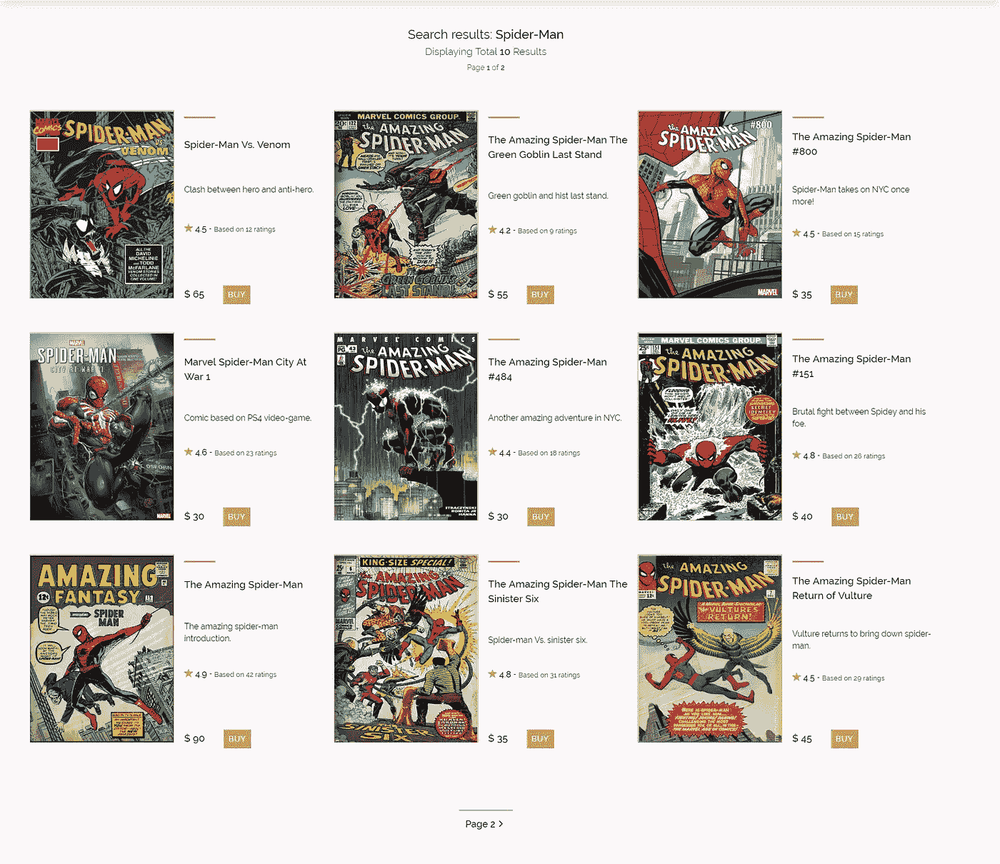
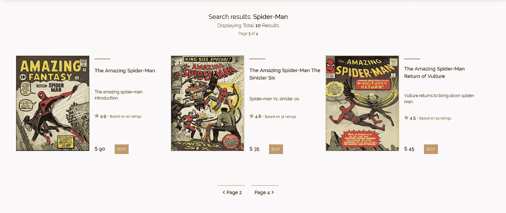

# 用 NodeJS，ExpressJS，MongoDB，Mongoose，eJS 进行后端分页

> 原文：<https://itnext.io/back-end-pagination-with-nodejs-expressjs-mongodb-mongoose-ejs-3566994356e0?source=collection_archive---------0----------------------->



做电商 web app？自己做项目来提高自己的技能？需要实现分页？并且可能正在努力寻找实现分页的最佳方式。

在本文中，我将向您展示如何在后端实现分页。我们将使用下一个堆栈:

*   **NodeJS** - JavaScript 运行时环境
*   **ExpressJS** - NodeJS 框架
*   **MongoDB** - NoSQL 数据库
*   **mongose**-MongoDB 对象建模
*   **嵌入式 JavaScript 模板(EJS)** -查看引擎

除了这些要素，我使用 express router 来提高代码可读性和组织性，使用 body-parser 来解析传入的请求体。

**注意:**我将跳过基本环境启动设置。没有 NPM 软件包安装，没有目录树创建等。

我们将通过在一个单独的文件中构建一个**助手函数**来开始创建分页，我们将在后面使用它。这个功能将用于我们的搜索系统。函数使用正则表达式(RegEx ),并且它对许多字符进行转义。我不会在本文中讨论正则表达式。但是，如果你想了解更多关于 RegEx 的信息，这是一个非常好的“工具”,请查看[这个](https://developer.mozilla.org/en-US/docs/Web/JavaScript/Reference/Global_Objects/RegExp)链接。

## **辅助函数(regex-escape.js)**

```
// Regex function for search functionality
const escapeRegex = (string) => {
  return string.replace(/[-[\]{}()*+?.,\\^$|#\s]/g, "\\$&");
};// Exporting Function
module.exports = escapeRegex;
```

# **步骤 1 -设置 MongoDB 产品模式(Products.js)**

首先，我们需要为产品设置 MongoDB 模式/模型。
产品将有数据，如:名称，描述，价格，图像。

```
// - Importing Mongoose - \\
const mongoose = require('mongoose');// * ------------- * \\
// - MongoDB Schema - \
// * ------------- * \\// - Creating Schema for database - \\
const prodSchema = new mongoose.Schema({
 name: String,
 description: String,
 price: Number,
 image: String
});// - Compiling mongoose Schema to a Model - \\
const Product = mongoose.model('Product', prodSchema);// Exporting Products Model
module.exports = Product;
```

好的，在我们完成这项工作后，我们将确保该模型确实被导出，这样我们就可以在其他文件中使用它。

**注意:**我使用**字符串**作为图片属性的原因是因为我要存储图片的链接。如果你愿意，你可以设置 blobs 二进制文件或类似的文件。

# **步骤 2 -设置店铺路线(shop.js)**

接下来，我们将设置一个车间路线文件(shop.js)。商店路线将包括获取显示索引商店页面和产品页面的请求。同样，我们将编码我们的小型搜索系统。

1.**需要依赖:**

```
// - Setting Up Dependencies - \\
const express = require('express'),
                router = express.Router();
// - Importing MVC files (Model-View-Controller design pattern) - \\
const Product = require('../models/Products');
// - Importing Other JS Files - \\
const escapeRegex = require('../../js/utilities/regex-escape');
```

2.**设置商店索引页面的获取请求:**

```
// GET - Shop Index Page | - Displaying shop index page - \\
router.get('/shop', async (req, res) => {
try {
  // Rendering EJS Shop Index File
  res.render('shop-index.ejs');
} catch (err) {
  throw new Error(err);
 } 
});
```

**→** 基本获取请求路线设置，呈现 EJS 店铺索引页面。它使用异步/等待。虽然，我们可以使用普通的回调，但这不会有什么不同，因为我们所做的只是渲染 EJS 文件。

3.**设置获取产品请求页面:**

```
// GET - Shop Product Page | - Displaying demanded product page with page numbersrouter.get('/shop/:page', async (req, res, next) => {
// Declaring variable
const resPerPage = 9; // results per page
const page = req.params.page || 1; // Page try {
 if (req.query.search) {
// Declaring query based/search variables
   const searchQuery = req.query.search,
   regex = new RegExp(escapeRegex(req.query.search), 'gi');// Find Demanded Products - Skipping page values, limit results       per page
const foundProducts = await Product.find({name:regex})
      .skip((resPerPage * page) - resPerPage)
      .limit(resPerPage);
// Count how many products were found
const numOfProducts = await Product.count({name: regex});
// Renders The Page
res.render('shop-products.ejs'), {
   products: foundProducts, 
   currentPage: page, 
   pages: Math.ceil(numOfProducts / resPerPage), 
   searchVal: searchQuery, 
   numOfResults: numOfProducts
  });
 }
} catch (err) {
  throw new Error(err);
}
});
```

**→** 这个有点麻烦，但是如果你仔细看看，它并不复杂。
——首先，我们为产品页面设置一个 GET 请求路径。它以**:页面**为参数，指出我们所在的页面。
-接下来，我们声明一些变量。第一个变量( **resPerPage** )决定了我们希望每页显示多少产品。在这种情况下，它是 9。第二个变量( **page** )决定用户所在的页面。默认情况下是第一页。
-接下来我们打开了新的 try 块，它以 if 语句开始。它说:只有在有搜索查询的情况下，才执行下面的代码。
-我们将搜索查询(req.query.search)保存在一个名为 **searchQuery** 的变量中。除此之外，我们将助手正则表达式转义函数应用于保存的查询变量 **searchQuery。因此我们的助手函数提取了 searchQuery 变量的内容，我们可以将它应用于下一个方法！ **req.query.search** 来自我们将在 shop-index.ejs 文件中构建的表单提交。
-在下一个方法 **Product.find({name: regex})中，**我们搜索产品。那个 **regex** 变量包含使用 regex-escape 函数提取的 req.search.query 数据。除此之外，我们跳过这一页，所以使用**，第一页实际上计算为第 1 页。**跳过()”的方法。最后，我们将每页的结果限制为 9 个。
-之后，我们使用**统计找到了多少产品。**计数()方法。
-最后我们渲染**填充了变量的 shop-products.ejs** 页面！**

4.**导出店铺路由器:**

```
// Exporting Shop Router
module.exports = router;
```

→简单导出 shop.js 路由器。

## **shop.js 文件结尾应该是这样的:**

```
// - Setting Up Dependencies - \\
const express = require('express'),
                router = express.Router();
// - Importing MVC files (Model-View-Controller design pattern) - \\
const Product = require('../models/Products');
// - Importing Other JS Files - \\
const escapeRegex = require('../../js/utilities/regex-escape');// GET - Shop Index Page | - Displaying shop index page - \\
router.get('/shop', async (req, res) => {
try {
  // Rendering EJS Shop Index File
  res.render('shop-index.ejs');
} catch (err) {
  throw new Error(err);
 } 
}); // GET - Shop Product Page | - Displaying demanded product page with page numbersrouter.get('/shop/:page', async (req, res, next) => {
// Declaring variable
const resPerPage = 9; // results per page
const page = req.params.page || 1; // Pagetry {
 if (req.query.search) {
// Declaring query based/search variables
   const searchQuery = req.query.search,
   regex = new RegExp(escapeRegex(req.query.search), 'gi');// Find Demanded Products - Skipping page values, limit results       per page
const foundProducts = await Product.find({name:regex})
      .skip((resPerPage * page) - resPerPage)
      .limit(resPerPage);
// Count how many products were found
const numOfProducts = await Product.count({name: regex});
// Renders The Page
res.render('shop-products.ejs'), {
   products: foundProducts, 
   currentPage: page, 
   pages: Math.ceil(numOfProducts / resPerPage), 
   searchVal: searchQuery, 
   numOfResults: numOfProducts
  });
 }
} catch (err) {
  throw new Error(err);
}
});// Exporting Shop Router
module.exports = router;
```

# **第 3 步-构建 EJS 索引商店页面(shop-index.ejs)**

在我们完成后端的所有工作后，我们可以创建我们的第一个 EJS 文件。我们将它命名为 shop-index.ejs.
跳过填充了元数据和所有链接、标题等的头部分。我们将直接进入它的主要内容。

```
<div class="standard-wrapper">
  <header>
   <div>
     <h1>PLACEHOLDER TEXT</h1>
     <h2>Search For Products</h2>
   </div>
  <div class="header-form">
    <form action="/shop/1/">
      <input type="text" name="search" placeholder="Search">
      <button type="submit"></button>
    </form>
  </div>
 </header>
</div>
```

**注意:**确保表单中的 action 参数等于您在 shop.js 中的 GET 请求。在这种情况下，由于我们使用了**router . GET('/shop/:page ')**我们必须将数字 1 添加到表单中的 action param (action='/shop/1 ')，因此它从第 1 页开始。

# **第 4 步-构建 EJS 店铺产品页面(shop-products.ejs)**

真正的部分来了。我们将建立我们的实际产品页面。我们将这个文件命名为 shop-products.ejs.
我们将再次跳过头部分，直接进入它的主要部分。

**1。构建结果容器/部分页面|显示产品数据(产品数量、页面数量、搜索查询)**

```
<!-- SEARCH RESULTS | START -->
<div class="results">
 <h3>Search results: <span><%= searchVal %></span></h3>
 <h4>Displaying Total <span><%= numOfResults %></span> Results</h4>
 <h4>
   Page 
   <span><%= currentPage %></span> // 1
   of 
   <span><%= pages %></span> // 2
 </h4> // Displays: Page 1 of 2, depends on how many pages there are
</div>
<!-- SEARCH RESULTS | END -->
```

→这是我们构建的一个简单的容器/页面的一部分，显示用户搜索了什么，向用户显示了多少结果，搜索到的产品有多少页面。

**2。渲染产品**

```
<!-- SHOP | START -->
 <section class="shop">
  <div class="shop-container"><!-- Rendering Products using EJS -->
<% products.forEach(product => { %>
 <div class="item">
  <div class="shop-row shop-row--1">
   " class="cover-img">
  </div>
 <div class="item-desc">
  <h2 class="item-desc__name"><%= product.name %></h2>
  <p class="item-desc__text"><%= product.description %></p>
  <h3 class="item-desc__price">&dollar; <%= product.price %>
 </div>
</div>
<% }); %>
</div>
```

→我们使用 EJS 和 forEach 循环来呈现产品。对于我们数据库中的每个产品，我们呈现填充有其他 div 的新 div，这些 div 填充有特定数据，如名称、描述、价格、图像。

**3。建筑分页**

```
<!-- PAGINATION -->
<div class="shop-pagination">
 <div class="pagination">
<% if (currentPage == 1 && pages > 1) { %> 
<a 
href="/shop/<%= parseInt(currentPage) + 1 %>/?search=<%=searchVal%>" <span>
  Page <%=  parseInt(currentPage) + 1 %>
  <i class="icon ion-ios-arrow-forward"></i>
</span>
</a><% } else if (currentPage < pages) { %>
<a 
href="/shop/<%= parseInt(currentPage) - 1 %>/?search<%=searchVal%>"><span>
  <i class="icon ion-ios-arrow-back"></i>
  Page <%= parseInt(currentPage) - 1 %>
</span>
</a><a 
href="/shop/<%= parseInt(currentPage) + 1 %>/?search<%=searchVal%>"><span>
 Page <%= parseInt(currentPage) + 1 %>
 <i class="icon ion-ios-arrow-forward"></i>
</span>
</a><% } else if (currentPage == pages && pages > 1) { %>
<a 
href="/shop/<%= parseInt(currentPage) - 1 %>/?search<%=searchVal%>"><span>
  <i class="icon ion-ios-arrow-back"></i>Page 
  <%=parseInt(currentPage) - 1 %>
</span>
</a><% } %>
</div>
```

**→** 这里我们构建实际的分页。首先，如果 currentPage 为 1，只有渲染按钮才能前进。否则，如果当前页面少于实际页面数量(这意味着我们在中间的某个地方，例如:第 5 页，共 9 页)，渲染两个按钮，向前和向后。最后，在最后，如果 currentPage 等于总页数，并且有超过 1 页(我们是在最后一页)，只呈现按钮返回。
如果结果小于 9 或 9，分页将不会呈现。

## **最终的 shop-products.ejs 文件应该是这样的:**

```
<!-- SEARCH RESULTS | START -->
<div class="results">
 <h3>Search results: <span><%= searchVal %></span></h3>
 <h4>Displaying Total <span><%= numOfResults %></span> Results</h4>
 <h4>
   Page 
   <span><%= currentPage %></span> // 1
   of 
   <span><%= pages %></span> // 2
 </h4> // Displays: Page 1 of 2, depends on how many pages there are
</div>
<!-- SEARCH RESULTS | END --><!-- SHOP | START -->
<section class="shop">
 <div class="shop-container"> <!-- Rendering Products using EJS -->
 <% products.forEach(product => { %>
  <div class="item">
   <div class="shop-row shop-row--1">
    " class="cover-img">
   </div>
  <div class="item-desc">
   <h2 class="item-desc__name"><%= product.name %></h2>
   <p class="item-desc__text"><%= product.description %></p>
   <h3 class="item-desc__price">&dollar; <%= product.price %>
  </div>
 </div>
<% }); %>
</div><!-- PAGINATION -->
 <div class="shop-pagination">
  <div class="pagination">
   <% if (currentPage == 1 && pages > 1) { %> 
    <a 
      href="/shop/<%= parseInt(currentPage) + 1 %>
           /?search=<%=searchVal%>" 
      <span>
       Page <%=  parseInt(currentPage) + 1 %>
       <i class="icon ion-ios-arrow-forward"></i>
      </span>
    </a> <% } else if (currentPage < pages) { %>
   <a 
     href="/shop/<%= parseInt(currentPage) - 1 %>
          /?search<%=searchVal%>">
     <span>
       <i class="icon ion-ios-arrow-back"></i>
       Page <%= parseInt(currentPage) - 1 %>
     </span>
   </a> <a 
     href="/shop/<%= parseInt(currentPage) + 1 %>
          /?search<%=searchVal%>">
     <span>
      Page <%= parseInt(currentPage) + 1 %>
      <i class="icon ion-ios-arrow-forward"></i>
     </span>
   </a> <% } else if (currentPage == pages && pages > 1) { %>
  <a 
    href="/shop/<%= parseInt(currentPage) - 1 %>
         /?search<%=searchVal%>">
    <span>
     <i class="icon ion-ios-arrow-back"></i>Page 
     <%=parseInt(currentPage) - 1 %>
    </span>
  </a> <% } %>
  </div>
 </div>
<% } %>
</section>
```

# **我用同样的代码创建了什么**



我的个人项目。与漫画相关的 Web app(基于电子商务)！



它的另一个例子显示每页 3 个结果

# 一切都搞定了！

官方说法，就是这样。分页已经完成并正常工作。这确实需要几行后端代码，但另一方面，EJS 占用了更大一部分。

请注意，我从 EJS 文件的特定元素中删除了类，因为我想保持代码整洁，并在实际编写代码时获得更多空间。我在一些元素上留下了一些类，这样您就可以看到我是如何结合 SASS 实现 BEM 方法的，即使我在本文中没有涉及 SASS，也值得一提。

# **结论**

我花了超过 24 个小时来为我的个人项目建立这个，我想我可以通过写这篇文章来节省别人的时间，如果有人正在寻求实现这样的东西。
当然，这并不是你能找到的唯一一篇关于后端分页的文章，我敢打赌还有更多不同的文章，值得一读。你知道的解决特定问题或类似问题的方法越多越好。就我而言，我找不到我真正想要的，所以我做了研究，写下几个例子，然后这样做。

我确实从这篇关于后端分页的文章中得到了一些代码！

祝你创造惊人的东西！

另外，你现在可以在 twitter 上关注我！