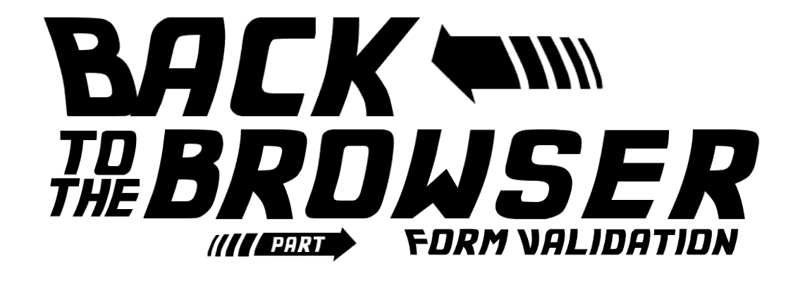
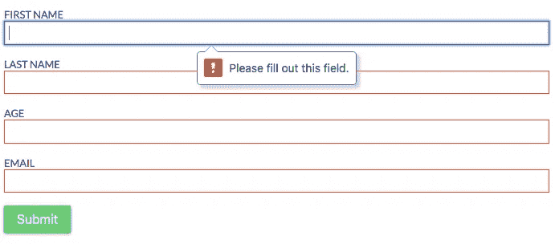
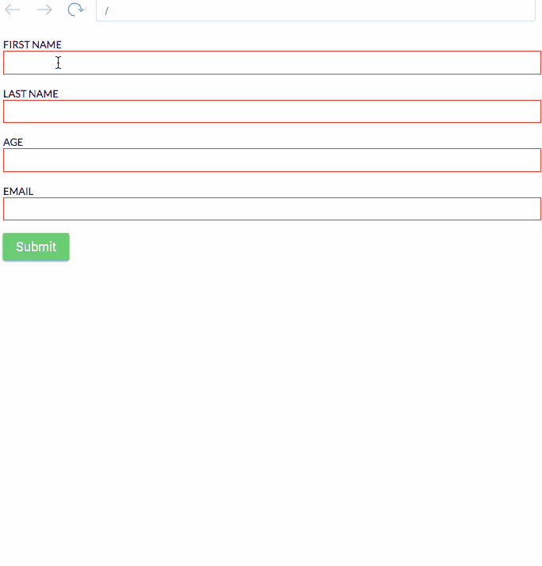

# 回到浏览器:用 DOM API 进行表单验证

> 原文：<https://itnext.io/back-to-the-browser-form-validation-d32dd01802c0?source=collection_archive---------5----------------------->



上周，我写了一篇关于如何用 React 钩子构建表单验证钩子的文章(这里有更多关于它的内容)

但是就在完成这篇文章之后，我开始想“好吧，但是我们知道这个例子中几乎所有的验证都可以使用 DOM API 来完成”，这就是这篇文章是如何诞生的故事。

由于我们现在拥有的所有花哨和令人敬畏的技术，我们忘记了检查浏览器的最新版本中实现了什么(我指的是我自己)。

我们有像 web 组件这样的功能，但我们没有利用这些功能，因为我们喜欢这些框架/库(Vue.js、React、Angular、Polymer 等)。我这里有一些关于 web 组件[的幻灯片](http://slides.com/highercomve/web-components#/)，但是这篇文章不是关于那个的，是关于浏览器今天能为我们做什么关于表单验证。

浏览器现在支持表单验证，也许你以前用过。大约



```
<input type='text'
       name='firstName'
       id='firstName'
       minlength='2'
       pattern='[a-zA-Z]*'
       required 
/>
```

这是一个非常简单的验证，其中验证字符串的最小长度、输入值的存在性，并根据正则表达式模式搜索从“a”到“z”的小写或大写字符进行验证。

这很好，但我们如何将这与…我不知道…反应？好吧，我们开始吧！

## 首先，让我们删除这些错误的浏览器界面

因为它们有点丑。

```
<form id="my-super-form" novalidate>
  <input type='text'
       name='firstName'
       id='firstName'
       minlength='2'
       pattern='[a-zA-Z]*'
       required 
  />
</form>
```


**重要吗**提到把" **novalidate"** 属性放到 **form** 标签并不意味着你可以使用浏览器验证，只意味着你需要为它编写一小段代码。

# 检查有效性方法和报告有效性

如果我们采用这种形式并运行方法 **checkValidity** 我们实际上是在运行浏览器的验证。该方法适用于所有与表单相关的标签:表单、输入、选择、文本区域等。

**reportValidity** 方法是相同的，可用于相同的标记。它们之间唯一的区别是副作用。当我们使用 **checkValidity** 方法时，它将返回一个**布尔值**(如果有效则为真，如果无效则为假)而没有任何副作用，但是当我们使用 **reportValidity** 时，我们得到相同的**布尔值**，但是同时浏览器使用本机浏览器方式显示错误(在我们放置 **novalidate** 属性之前也是如此)。

# 我们如何使用它？

拥有这个 HTML

```
<form id="my-super-form" novalidate>
  <input type='text'
       name='firstName'
       id='firstName'
       minlength='2'
       pattern='[a-zA-Z]*'
       required 
  />
  <button type="submit">Submit this form</button></form>
```

我们可以写这段 Javascript 代码

```
var form = document.querySelector("#my-super-form")
form.addEventListener("submit", (event) => {
    event.preventDefault()
    const isValid = form.checkValidity()
    if (!isValid) {
      return alert("the form is not valid") }
    const formData = new FormData(form)
    // Do something with the formData, example send it via a ajax})
```

这将以糟糕的用户体验告终，因为用户永远不知道什么是失败，什么是错误。

但好的一面是，我们可以读取浏览器通常放在界面中的错误，并利用这些错误，这可以通过使用属性 **validationMessage** 来实现。该方法可用于表单的输入，而不是表单本身。我们有另一个属性可以用来查看输入的验证状态，这个属性叫做**有效性**，它返回这样一个对象:

```
{
  badInput: false
  customError: false
  patternMismatch: false
  rangeOverflow: false
  rangeUnderflow: false
  stepMismatch: false
  tooLong: false
  tooShort: false
  typeMismatch: false
  valid: true
  valueMissing: false
}
```

描述是否存在任何类型的错误，以便在需要时对错误进行分类。

我们可以访问那些获取表单元素并读取这些属性的方法，比如:

```
const submit = (event) => {
    event.preventDefault()
    const form = event.target
    const isValid = form.checkValidity() // returns true or false
    const formData = new FormData(form)
    const validationMessages = Array
      .from(formData.keys())
      .reduce((acc, key) => {
        acc[key] = form.elements[key].validationMessage
        return acc
      }, {})
    console.log(validationMessages)
}
```

这将安慰类似于:

```
{
  "firstName": "Please fill out this field.",
  "lastName": "Please fill out this field.",
  "age": "Please fill out this field.",
  "email": "Please fill out this field."
}
```

现在我们对原生表单验证的工作原理有了更多的了解。让我们试着让内心有所反应

这是一个活生生的例子

[](https://frontarm.com/demoboard/?id=f18f6c0a-bb26-4962-93e6-5c32a5dc3187) [## 演示板

### 快速创建 Javascript 和 Markdown 演示。导入 npm 上的任何包。

frontarm.com](https://frontarm.com/demoboard/?id=f18f6c0a-bb26-4962-93e6-5c32a5dc3187) 

我没有在 React 代码中挖掘太多，因为它几乎与上一篇文章相同。但是我使用了一些钩子来保存验证，以便打印验证错误。

我希望这些信息对你有用！

如果您想了解我们如何使用相同的 API 创建自定义消息或其他内容，我创建了另一个示例:)

[](https://frontarm.com/demoboard/?id=4c92231f-f327-4ed1-8fe4-d8a6e8563779) [## 演示板

### 快速创建 Javascript 和 Markdown 演示。导入 npm 上的任何包。

frontarm.com](https://frontarm.com/demoboard/?id=4c92231f-f327-4ed1-8fe4-d8a6e8563779) 

现在返回代码编辑器:)