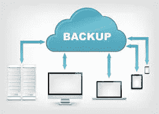
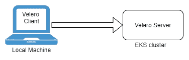

# 备份和恢复 EKS Kubernetes 集群资源

> 原文：<https://itnext.io/back-up-and-restore-eks-cluster-resources-5926f24d15e5?source=collection_archive---------4----------------------->



备份至关重要。在集群上执行重要任务之前，最好备份 Kubernetes 集群资源。有一个名为 Velero 的工具，它允许您以一种简单的方式备份 Kubernetes 集群资源。在这篇博客中，我将向您展示如何使用 Velero 工具备份您的 EKS 集群资源。

Velero 是一个备份和恢复 Kubernetes 集群资源和持久卷的工具。Velero 可用作以下工具:

*   灾难恢复
*   数据迁移
*   数据保护

**先决条件**

1.  AWS CLI 需要在执行 Velero 命令的机器上进行配置。
2.  Kubectl 需要配置 EKS 集群，您需要在那里进行备份。

**安装 Velero 客户端**

要使用 Velero，我们需要将 Velero 客户机安装到本地机器上，并将 Velero 服务器安装到 Kubernetes 集群上。



1.  下载[最新发布的](https://github.com/vmware-tanzu/velero/releases/tag/v1.3.2) tarball。
2.  提取 tarball。

`1 tar -xvf <RELEASE-TARBALL-NAME>.tar.gz`

3.将提取的 **Velero** 二进制文件移动到$PATH 中的某个位置。(例如:/usr/local/bin)

我们可以使用 S3 来保存 EKS 集群的所有备份。因此，让我们用 Velero 工具配置 AWS S3。

4.在客户机中设置一个 bucket 名称和 AWS 区域作为环境变量。

```
BUCKET=<YOUR_BUCKET_NAME> 
REGION=<YOUR_REGION>
```

5.在给定区域创建 s3 存储桶。

```
aws s3api create-bucket \    
--bucket $BUCKET \     
--region $REGION \     
--create-bucket-configuration LocationConstraint=$REGION
```

6.创建以下策略，以附加到 EKS 集群中的 **worker-node-role** 。以便 Velero 服务器可以与 s3 存储桶通信来备份资源。

```
cat > velero-policy.json <<EOF
{
    "Version": "2012-10-17",
    "Statement": [
        {
            "Effect": "Allow",
            "Action": [
                "ec2:DescribeVolumes",
                "ec2:DescribeSnapshots",
                "ec2:CreateTags",
                "ec2:CreateVolume",
                "ec2:CreateSnapshot",
                "ec2:DeleteSnapshot"
            ],
            "Resource": "*"
        },
        {
            "Effect": "Allow",
            "Action": [
                "s3:GetObject",
                "s3:DeleteObject",
                "s3:PutObject",
                "s3:AbortMultipartUpload",
                "s3:ListMultipartUploadParts"
            ],
            "Resource": [
                "arn:aws:s3:::${BUCKET}/*"
            ]
        },
        {
            "Effect": "Allow",
            "Action": [
                "s3:ListBucket"
            ],
            "Resource": [
                "arn:aws:s3:::${BUCKET}"
            ]
        }
    ]
}
EOF
```

7.将上述策略附加到 worker-node-role。(在应用之前，您需要找到与您需要进行备份的 EKS 集群相对应的 worker 节点角色)

```
aws iam put-user-policy \   
--user-name <worker-node-role> \   
--policy-name velero \   
--policy-document file://velero-policy.json
```

8.在 Kubernetes 集群中安装 Velero 服务器。

在客户端机器上运行下面的命令，它将在配置了 kubectl 上下文的 Kubernetes 集群中安装 Velero。

用适当的信息替换 AWS-ACCOUNT-ID 和 WORKER-NODE-ROLE。

```
velero install \     
--provider aws \     
--plugins velero/velero-plugin-for-aws:v1.0.1 \     
--bucket $BUCKET \     
--backup-location-config region=$REGION \     
--snapshot-location-config region=$REGION \     
--pod-annotations iam.amazonaws.com/role=arn:aws:iam::**<AWS-ACCOUNT-ID>**:role/**<WORKER-NODE-ROLE>** \     
--no-secret
```

**备份集群数据**

运行以下命令来备份集群命名空间的数据。您可以备份每个命名空间、每个应用程序或每个群集的资源。在这里，我将备份每个命名空间的资源。有关备份策略的更多信息，请使用 [Velero 官方文档](https://velero.io/docs/master/index.html)。

`1 velero backup create <backup-name> --include-namespaces <namespace>`

这将在配置的 S3 存储桶中创建一个备份数据对象。

**恢复集群数据**

运行以下命令，从现有备份中还原数据。

`1 velero restore create <restore-name> --from-backup <backup-name>`

希望现在你能清楚地了解如何备份你的 Kubernetes 资源并上传到 AWS S3。干杯！！