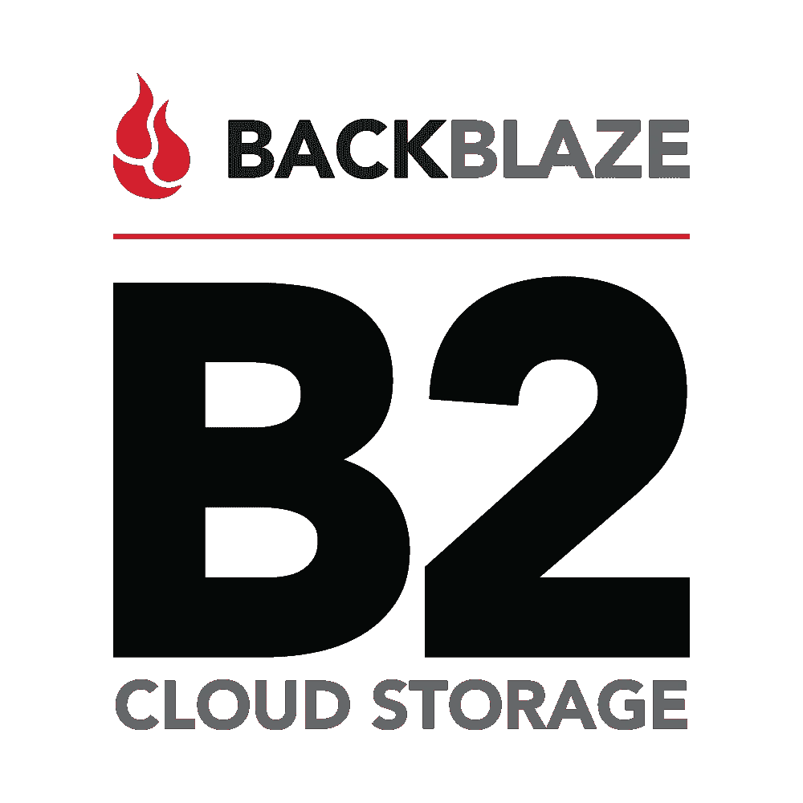

# Backblaze B2:利与弊以及如何使用 Javascript

> 原文：<https://itnext.io/backblaze-b2-pros-cons-and-how-to-use-it-with-javascript-8c2d2a9a69d9?source=collection_archive---------0----------------------->



[*点击这里在 LinkedIn* 上分享这篇文章](https://www.linkedin.com/cws/share?url=https%3A%2F%2Fitnext.io%2Fbackblaze-b2-pros-cons-and-how-to-use-it-with-javascript-8c2d2a9a69d9)

本文是**“云存储提供商，选择哪一个？”**。您可以在这里查看其他文章:

1.  [亚马逊 S3:利与弊以及如何使用 Javascript](https://medium.com/@javidgon/amazon-s3-pros-cons-and-how-to-use-it-with-javascript-701fffc89154)
2.  [谷歌云存储:利弊以及如何使用 Javascript](https://medium.com/@javidgon/google-cloud-storage-pros-cons-and-how-to-use-it-with-javascript-ea9ce60a94c0)
3.  [微软 Azure Blob 存储:利与弊以及如何与 Javascript 一起使用](https://medium.com/@javidgon/microsoft-azure-blob-storage-pros-cons-and-how-to-use-it-with-javascript-ca5aaf5d5ffd)
4.  Backblaze B2:利与弊以及如何使用 Javascript
5.  [数字海洋空间:利与弊以及如何使用 Javascript](https://medium.com/@javidgon/digital-ocean-spaces-pros-cons-and-how-to-use-it-with-javascript-1802559ce2bd)
6.  [Wasabi 热存储:利弊以及如何与 Javascript 一起使用](https://medium.com/@javidgon/wasabi-pros-cons-and-how-to-use-with-javascript-fa528c3779a2)

Backblaze B2 可能不如亚马逊 S3 或谷歌云存储等其他服务知名，但与价格相比，其功能使其成为一个出色的选择。事实上，我还没有找到一个价格更低的供应商来存储“常用”数据。我告诉你，Backblaze B2 是最好的供应商之一。

免责声明:价格和功能随时都在变化。如果有错误请告诉我:)

## 赞成的意见

*   **无敌价格**。任何数据每月每 0,005 美元。就是这样；没有不同的存储类别
*   **每天前 1 GB 的下载是免费的**。之后，每 GB 0.01 美元
*   你上传的每个文件都可以立即下载。这大大简化了其他提供商提供的服务(例如，“额外费用”或“检索时间”)
*   **耐久性高。** Backblaze B2 在给定的一年内提供 99.999999% (8 个 9)的物体耐用性。它利用 Backblaze Vaults 体系结构将数据均匀分布在 20 个不同的存储单元中。
*   **他们提供了一个命令行工具(b2)** 用于从终端上传/下载数据
*   如果您需要在本地恢复您的文件， **Backblaze 提供了通过邮件接收包含您所有数据的外部磁盘的可能性**(可能会产生额外费用)
*   作为免费层的一部分，**用户永远免费获得 10GB 的空间**

## 骗局

*   **它没有大量的文档**。他们有一个 API 参考，但与亚马逊 S3 或谷歌云存储相比有点欠缺
*   **怀念不同编程语言的 SDKs】。对于下面的实现，我必须进行手动请求，这并不理想**
*   截至今天， **Backblaze 在北美只有两个数据中心**，尽管他们计划建造更多的数据中心

## 不错，但是我为什么要在比赛中使用它呢？

*   **如果你是一个只想在云中存储备份的用户，**由于成本和简化的定价，Backblaze B2 和 Wasabi 是最佳选择之一
*   **如果你是一名开发人员或一家只想在云中存储数据的公司**，Backblaze B2 正好可以满足你的需求。无需设置额外的服务或添加复杂的用户权限

# 如何在 Javascript 中使用它

1.  如何安装你需要的库

```
npm install axios
```

2.如何认证

3.如何创建存储桶

4.如何删除存储桶

5.如何上传文件

6.如何下载文件

7.如何删除文件

8.如何列出存储桶中的所有文件

我希望这篇文章足以让你了解 Backblaze B2。如果你错过了什么，请告诉我！

祝您愉快！