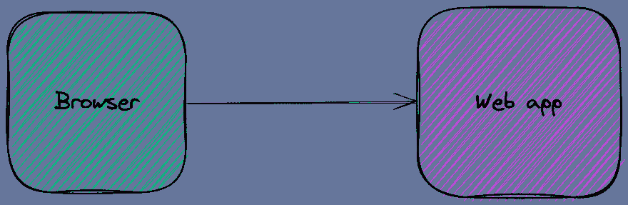
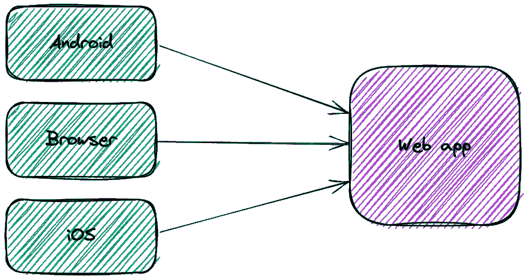
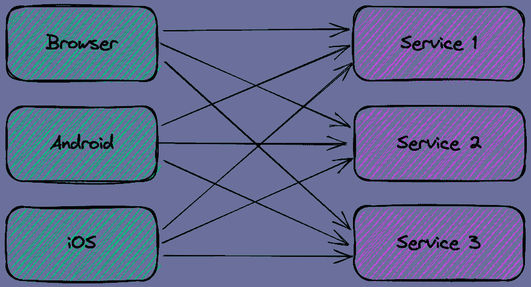
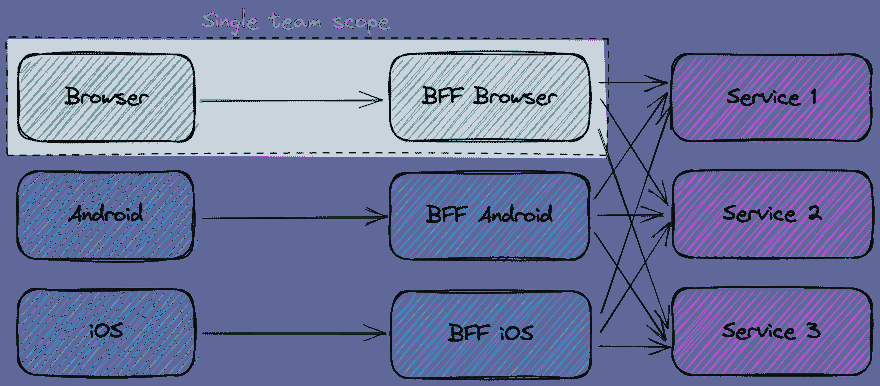
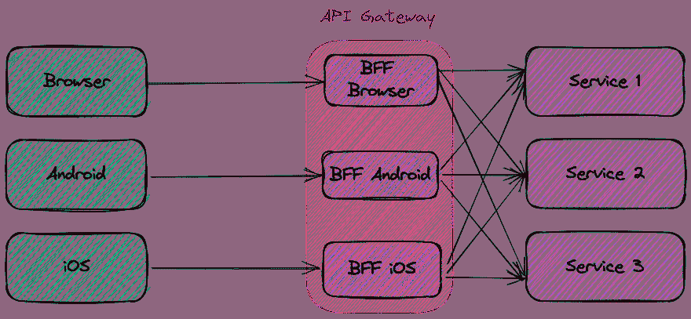

# 讨论前端的后端

> 原文：<https://itnext.io/backend-for-front-end-66d62319f0ae?source=collection_archive---------3----------------------->

在过去，应用程序很简单。浏览器向 webapp 端点发送了请求；后者从数据库获取数据并返回响应。

移动客户端的兴起以及与其他应用程序的集成打破了这种简单性。我想在这篇文章中讨论一个解决复杂性的方法。

# 系统架构日益增加的复杂性

让我们首先对上面的简单架构进行建模。

移动客户端改变了这种方式。移动客户端的显示区域更小:平板电脑的显示区域更小，手机的显示区域更小。

一个可能的解决方案是返回所有数据，让每个客户端过滤掉不必要的数据。不幸的是，电话客户端的带宽也很差。不是每部手机都有 5G 功能。即使是这种情况，如果它位于偏僻的地方，连接点只提供 H+,也没有用。

因此，过度提取不是一个选项。每个客户端需要不同的数据子集。借助 monoliths，可以根据每个客户端提供多个端点。

人们可以在最前面设计一个特定层的 web 应用程序。这种层检测发出请求的客户端，并过滤掉响应中不相关的数据。web 应用程序中的过量提取不是问题。

如今，微服务风靡一时。每个人和他们的邻居都想实现微服务架构。

微服务的背后是双披萨团队的理念。每个团队都是独立的，负责单个微服务或单个前端应用。为了避免开发工作之间的耦合，每个微服务团队都发布其 API 合同，并非常小心地处理变更。

每个微服务都需要为每种类型的客户端提供严格必要的数据，以避免上述的过度获取问题。对于少量的微服务，让每个微服务根据客户端过滤数据是不方便的；人数众多的话，这是不可能的。*因此*，微服务数量和不同客户端数量之间的笛卡尔因子使得每个微服务上的专用数据端点的成本呈指数级增长。

# 解决方案:后端对前端

BFF 背后的想法是将逻辑从每个微服务移动到一个专用的可部署端点。后者负责:

*   从每个所需的微服务中获取数据
*   提取相关部分
*   聚集它们
*   最后以与特定客户端相关的格式返回它们

同一个团队开发了客户端**和**及其关联的 BFF。BFF 提供了与微服务相同的权衡:通过增加系统复杂性来提高开发速度。

# 独立部署单元与 API 网关

关于 BFF 的文献暗示了专门的部署单位，如上图所示。有些帖子，像这个 [one](https://www.manuelkruisz.com/blog/posts/api-gateway-vs-bff) ，用 API 网关反对 BFF。但是概念图不应该与部署图一一对应。

像在许多领域一样，人们应该更多地关注事物的组织方面，而不是技术方面。在这种情况下，最关键的一点是负责前端的团队也要对 BFF 负责。无论是单独的部署单元还是 API 网关配置的一部分，都是实现细节。

例如，使用 Apache APISIX，每个团队可以将他们的 BFF 代码作为一个单独的插件独立部署。

# 性能考虑因素

对于独石，情况如下:

*   从客户端到 monolith 的请求需要一个特定的时间 *T* 。它是通过互联网的， *T* 大概就是长。
*   与 *T* 相比，对数据库的不同内部调用可以忽略不计。

一旦迁移到微服务，客户端需要依次调用每个微服务。因此，对于顺序调用，时间变为*σ(T1，T2，Ti，Tn)* 。因为这是不可接受的，所以客户端通常使用并行调用。时间变成 *max(T1，T2，Ti，Tn)* 。注意，即使这样，客户端也需要执行 *n* 个请求。

在 BFF 案例中，我们回到一个请求，在 *T* 时间内，无论实现如何。与整体相比，BFF 对微服务有额外的请求`t1`、`t2`、`ti`、`tn`，但它们可能位于一起。因此，总的时间会比一整块长，但由于每个`t`比`T`短得多，它不会对用户体验产生太大影响。

# 结论

你可能不应该实现微服务。如果你这样做，微服务不应该返回全部数据，让客户端负责清理它们。因此，微服务需要返回所需的确切数据，这取决于客户端。它在微服务和它的客户端之间引入了强耦合。

你想去掉这个耦合。为了实现这一点，后端对前端的方法将清理逻辑从每个服务提取到一个专用的组件中，该组件也负责聚合数据。**每个客户团队还负责他们专用的 BFF** :当客户改变其数据需求时，团队可以部署适应新需求的新 BFF 版本。

BFF 是一个概念性的解决方案。没有什么要求提取/清理/聚集逻辑必须位于特定的位置。它可以是专用的部署单元，也可以是 API 网关中的插件。

在以后的文章中，我将演示这篇文章中描述的不同步骤。

**更进一步:**

*   [模式:后端对前端](https://samnewman.io/patterns/architectural/bff/)
*   [API 网关模式与客户端到微服务的直接通信](https://docs.microsoft.com/en-us/dotnet/architecture/microservices/architect-microservice-container-applications/direct-client-to-microservice-communication-versus-the-api-gateway-pattern)
*   [API 网关对前端对后端](https://www.manuelkruisz.com/blog/posts/api-gateway-vs-bff)

*原载于* [*一个 Java 极客*](https://blog.frankel.ch/backend-for-frontend/)*2022 年 7 月 23 日*