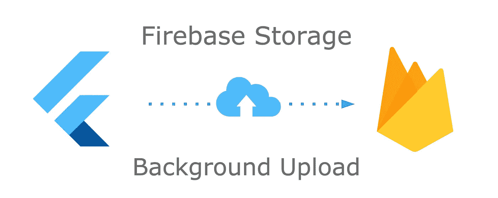
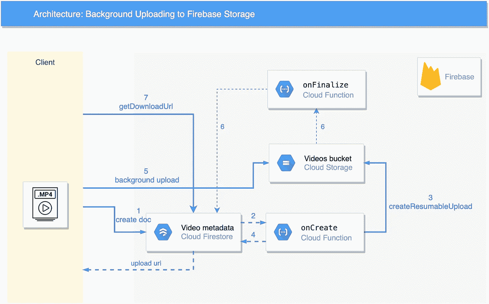
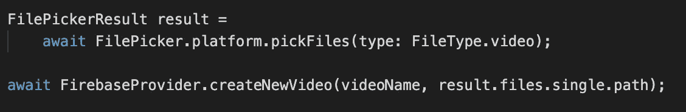
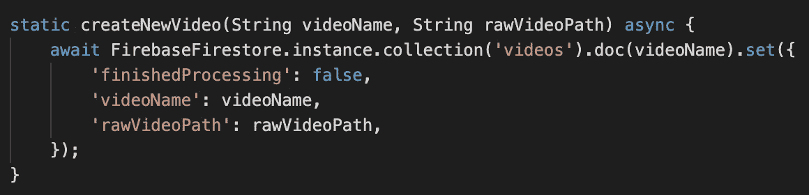
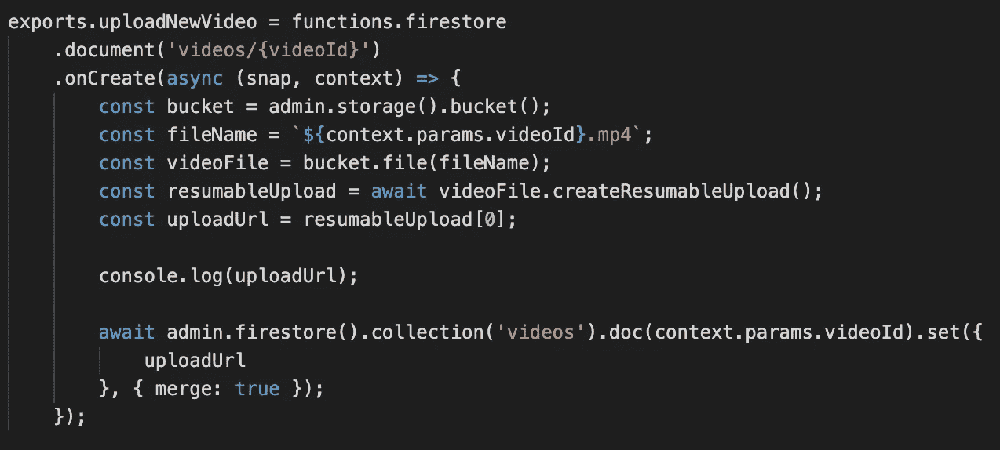
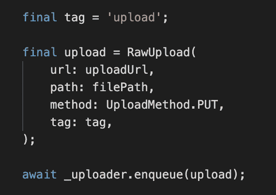
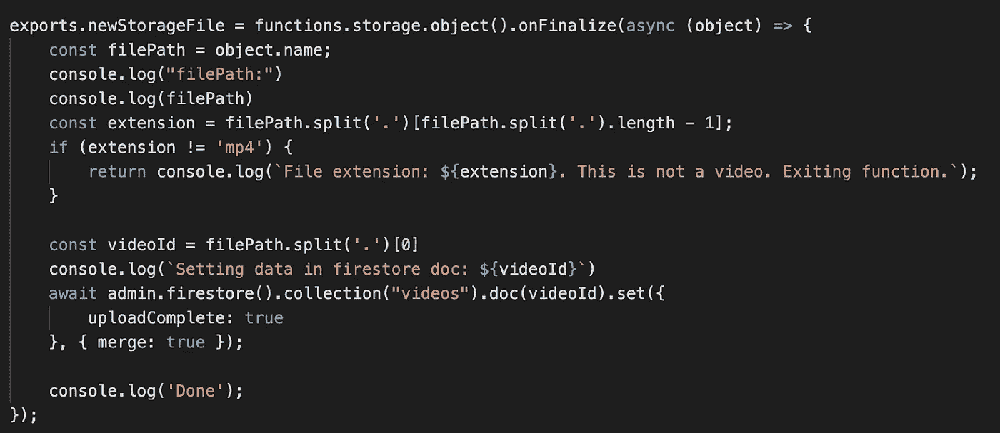
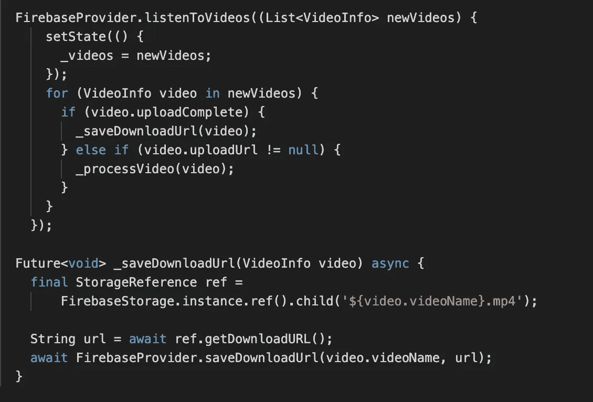
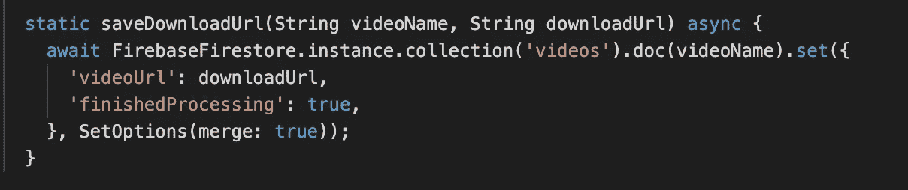

# 使用 Flutter 将背景视频上传到 Firebase 存储

> 原文：<https://itnext.io/background-video-upload-to-firebase-storage-with-flutter-ee398b796656?source=collection_archive---------5----------------------->

# **我们正在建造的东西**

我写过几篇关于从 Flutter 上传视频到 Firebase 存储的帖子。

我发现真正缺失的一点是后台上传——一种上传大型视频文件的方式，即使应用程序关闭，这些文件也会继续上传。

看起来 Firebase 团队正计划在[中增加这个功能](https://github.com/firebase/firebase-ios-sdk/issues/147)，但是同时，这里有一个替代的方法来完成它。

我们将使用 [flutter_uploader](https://pub.dev/packages/flutter_uploader) 插件来执行后台上传。它基于 Android 中的 *WorkManager* 和 iOS 中的 *NSURLSessionUploadTask* ，这是执行上传任务的平台特定方法，这些任务在后台继续，即使在退出应用程序后也是如此。

该插件只能通过 URL 上传，这是 Firebase 客户端 SDK 所不提供的。因此，我们将把生成上传 URL 的工作外包给一个云功能。

# **系统设计**

以下是每个视频将经历的步骤:

1.客户在 Firestore 中创建一个新文档，带有原始视频路径。

2.“上传新视频”云功能由文档创建触发。

3.云函数生成指向云存储中的新文件的可恢复上传 url。

4.云功能用上传 url 更新 Firestore 文档。

5.客户端接收带有上传 url 的更新文档，生成缩略图，并在后台上传视频。

6.上传完成后，触发 *newStorageFile* 云功能，将 Firestore 中的 *uploadComplete* 字段设置为 *true* 。

7.客户端生成一个永久下载 url，并将其保存到 Firestore。

# **主要步骤**

让我们一个接一个地浏览主要的上传步骤。我会尽量把重点放在重点上，略去细枝末节。

**1。创建新的 Firestore 文档(步骤 1)**

我们将使用 [file_picker](https://pub.dev/packages/file_picker) 插件来获取视频文件:

主.镖

一旦我们选择了一个视频，我们就创建一个新的 Firestore 文档，它基本上是一个占位符，用于触发第一个云功能。

firebase_provider.dart

**Firestore onCreate Cloud 功能(步骤 2-4)**

我们将把 firestore *onCreate* 方法添加到我们的云函数的 *index.js* 文件中。这将在创建每个新文档时触发。

> 关于如何在你的项目中设置云功能的指导，你可以查看我的[上一篇文章](/serverless-video-upload-and-encoding-with-firebase-storage-cloud-functions-and-publitio-a4b2997b1508)

索引. js

这里的关键是调用 Firebase 管理存储 SDK 上的[createrusemableupload](https://googleapis.dev/nodejs/storage/latest/File.html#createResumableUpload)函数。这将创建一个新的 Firebase 存储对象和一个 url，我们可以用它向对象上传数据。上传也是可恢复的，所以我们可以在我们的客户端上传器中利用这一点。

一旦我们有了上传的 url，我们就把它保存到同一个 Firestore 文档中，从而把它同步回客户端。

> 注意:在实际场景中，您可能希望将此 url 保存在只有上传用户才能访问的 Firestore 路径中。

**使用 flutter_uploader 后台上传(步骤 5)**

在我们的 *initState* 方法中，我们收听我们的 Firestore 集合。当视频发生变化时，我们会检查 uploadUrl 字段。如果它存在，我们知道我们可以开始上传。

主.镖

*_processVideo* 方法包括使用 *ffmpeg* 生成缩略图(如[以前的帖子](/how-to-make-a-serverless-flutter-video-sharing-app-with-firebase-storage-including-hls-and-411e4fff68fa)中所述)，将视频元数据保存到 Firestore，最后使用 *flutter_uploader* 启动后台上传任务:

主.镖

> 注意:可以添加更精细的后台任务处理，比如在 flutter 中显示成功/失败/进度状态，清除已完成的任务等。这是我们刚刚启动的任务，等待 Firestore 更新客户端状态。

**存储最终化的云功能(步骤 6)**

上传完成后，触发 *newStorageFile* 云函数，其作用只是将 Firestore 文档中的 *uploadComplete* 字段设置为真。这可以在上传完成后从客户端完成，但我认为从服务器端完成更健壮，因为客户端应用程序可能会在上传完成前关闭。

索引. js

> 注意:我们在这里使用了两个完成标志:uploadComplete 和 finishedProcessing。这个函数设置第一个，客户端设置最后一个。

**生成永久下载网址**

理想情况下，一旦上传完成，我们可以在云功能上为文件生成一个永久的下载 URL。唉，管理 SDK[缺少这个能力](https://github.com/googleapis/nodejs-storage/issues/697)，所以我们必须让客户端来做这个。

一旦上传完成，我们客户端的 Firestore 监听器将获得一个更新的文档，状态为 *uploadComplete* 。然后下载 url 可以保存到 Firestore 文档，并且*完成处理*状态设置为真。

主.镖

firebase_provider.dart

现在我们的视频已经可以通过下载网址在客户端上观看了！

**完整来源**

感谢阅读！完整的源代码可以在 [GitHub](https://github.com/syonip/flutter_fbstorage_background_upload) 上找到

如果您有任何问题，请留下您的评论！