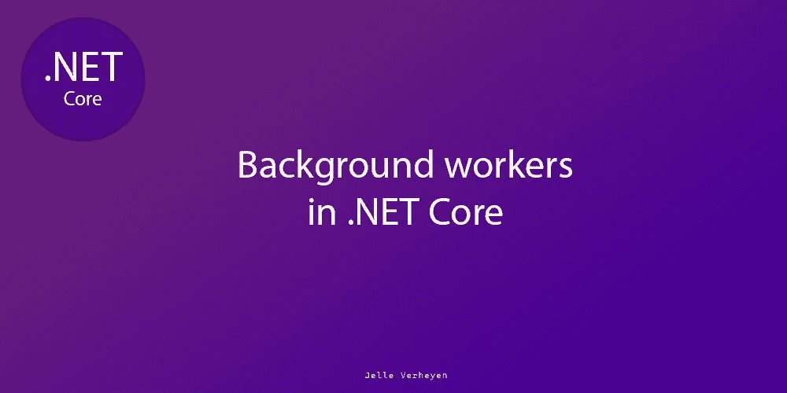
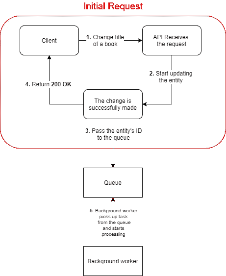

# 背景工人在。网络核心

> 原文：<https://itnext.io/background-workers-in-net-core-api-f6fac7a5477f?source=collection_archive---------0----------------------->



# 介绍

您是否曾经测试过一个端点，并且您对自己说:“……这个代码很慢”？

不用担心后台队列和`202 Accepted`都在这里！

玩笑归玩笑，有时会发生这样的情况，一个端点必须做很多工作，而用户并不立即需要这些工作的结果，然而，应用程序会被阻止，直到 API 返回一个响应，导致你*和*你的用户不高兴！

对此的解决方案之一是将工作交给后台工作人员，并直接将`202 Accepted`返回给客户端。
这样，他们几乎可以立即看到类似**“我们正在努力”**的消息，并继续使用应用程序。

# 现实生活中的例子

另一个例子，我最近不得不自己处理并通过*后台工作人员*解决的，是当用户对某个*实体*进行更改时，需要做一点工作来查看*到底是谁通知*这个更改(通过 [*SignalR*](https://dotnet.microsoft.com/apps/aspnet/signalr) )。这根本不需要花半分钟来找出要通知哪些组，但是可能要花 2-3 秒来完成这个计算，足以让用户非常恼火。

这样做的问题(除了速度慢之外)是，这对最初请求更改的用户来说并不真正有用，他们为什么要关心通知的是谁呢？他们最终不得不多等几秒钟，因为 API 正忙于通知人们。

我解决这个问题的方法如下:



表示将一些工作卸载到队列的请求流的图表。

在本例中，我们看到客户端发送了一个请求，请求更改书名 **(#1)** 。API 接收这个请求并更新实体 **(#2)** 。
然后，从我们的[动作](https://docs.microsoft.com/en-us/aspnet/core/mvc/controllers/routing?view=aspnetcore-3.1#action-definition)，我们**将一个**实体的** **Id (#3)** 入队**。一旦入队，我们返回一个 **200 OK** 给客户端 **(#4)** 。

现在，客户端会收到更新后的实体的响应，并可以继续使用该应用程序。
现在，我们想*通过 SignalR 通知*用户这个变化*。*

后台工作者**是** **每隔 X 时间**检查一些工作要做。它将使任务出队并开始处理它。 **(#5)**

# 翻译成代码

"这一切都很好，但如何转化为一个实际的项目？"，我听到你说。

好吧，让我们建立一个简单的例子，它遵循与上图相同的流程。

假设我们在`/books/publish`有一个端点，它获取一本书，将其写到数据库，然后通知全世界的每个人这本书已经出版了。
这里肯定有一些繁重的工作要做，我们不希望我们可怜的发布者刚刚按下了“*Submit”*就必须等待半个小时才能完成所有这些工作。

因此，让我们将这项工作卸载到一个队列中！

我们可以通过运行:
`dotnet new mvc -o BackgroundQueue/`
来生成一个示例项目。这将生成一个新的项目，我们可以在其中设置我们的*队列*。

## 队列

首先，我们将实现一个专门用于这些后台任务的队列。

我们将制作一个接口`IBackgroundQueue<T>`，它可以在我们的应用程序中注入。

IBackrgoundQueue <t>接口</t>

随着其实施:

背景队列<t>实现</t>

如你所见，这是一个非常简单的实现，只有`Enqueue`和`Dequeue`任务，这对我们来说很好。使用
并发队列< T > 是因为该队列将被多个线程访问，并将为我们提供一些线程安全。

我们已经可以将这个`IBackgroundQueue<T>`注册为一个服务，在`Startup.ConfigureServices`内部，其中`T`属于`Book`类型，如下所示:

将队列注册为单例队列

## 工人

为了设置 worker，我们可以创建一个继承自`[Microsoft.Extensions.Hosting.BackgroundService](https://docs.microsoft.com/en-us/dotnet/api/microsoft.extensions.hosting.backgroundservice?view=dotnet-plat-ext-3.1)`的新类`BackgroundWorker`。

我们使用`BackgroundService`而不是`[IHostedService](https://docs.microsoft.com/en-us/dotnet/api/microsoft.extensions.hosting.ihostedservice?view=dotnet-plat-ext-3.1)` ，因为 BackgroundService 是继承自 **IHostedService** 的**基类**，专门为 IHostedService 的**长期运行的**实现而设计。

让我们从服务的构造器开始。

我们将需要:
1。访问我们包含将要出版的书籍的队列
2。处理书籍出版的服务。一些日志，只是为了让我们可以看到屏幕上发生的奇迹。

工人的构造者

这里你可以看到我们想要我们的`IBackgroundQueue<Book>`、一个`IServiceScopeFactory`和一个`ILogger<BackgroundWorker>` 被注入。

我们稍后将进入 *IServiceScopeFactory* 。

服务的实际实现将是这样的:

1.  进入一个循环，只要*取消*没有被请求，该循环就一直运行
2.  等待 *n* 秒，然后检查*队列*中是否有图书等待出版。
3.  如果找到了一本书，把它交给*出版服务*。

完整 worker 的实现如下所示:

后台工作人员

我们实现了`ExecuteAsync(CancellationToken)`和`StopAsync(CancellationToken)`，其中 *ExecuteAsync* 简单地调用后台处理循环，而 *StopAsync* 调用基础方法。
**注:** *主机启动时调用 ExecuteAsync* ，发生*主机关机*时调用 *StopAsync* 。

你可能想知道为什么我们调用`Task.Delay`，这是因为如果不进行这个调用，即使只是等待 0.1 秒，我们也会每隔几纳秒检查一次队列，很可能会导致你的 API 冻结。当然，这个等待时间可以更长或更短，这取决于您的需要。

在 BackgroundProcessing 内部，一切都像上面描述的那样发生。除了在**第 45 行，**我们在 using-block 内部创建了一个`IServiceScope`。
我们这样做的原因是`IBookPublisher`是一个*作用域服务*(每个请求一个实例)，而我们的后台工作者是一个*单体*(整个应用程序中一个实例)。例如，BookPublisher 使用一个实体框架 *DbContext。*在这种情况下，我们希望每次发布图书时都创建一个作用域，以避免我们的 DbContext 使用陈旧的数据或其他作用域服务可能出现的任何奇怪行为。
当我们调用`scope.ServiceProvider.GetRequiredService<IBookPublisher>()`时，我们不仅创建了一个新的`IBookPublisher`，我们还创建了图书出版商所依赖的所有服务，以及这些服务所依赖的所有服务等等……(自上而下)

我们现在可以像这样在`Startup.cs`中添加 BackgroundService:

将 BackgroundWorker 注册为托管服务。

## 让工人完成工作

写完所有这些代码后，我们将想让我们的工人做一些实际的*工作*，我们将不得不添加一些书到队列中！

因此，让我们创建一个端点为`Publish`的`BooksController`，它获取一本书并将其传递给队列！

这里有一个非常简单的控制器，它注入我们的*队列*，有一个 *HttpPost* 动作，如上所述。

现在，当张贴到队列中时，500 毫秒后，工作人员将拿起这本书并出版它！

```
info: BackgroundWorker is now running in the background.
info: Book found! Starting to process ..
info: Doing heavy publishing logic ...
info: "Background Queues in .NET Core by Jelle Verheyen" has been published!
```

# 结论

非常感谢你阅读这个故事！如果你喜欢它，请随意给这篇文章鼓掌和/或给我一个关注！
这里 的 Github [**上有一个资源库，里面有源代码。
克隆: ***git 克隆*****](https://github.com/jelleverheyen/backgroundqueue-example)**[***https://github . com/jelleverheyen/background queue-example . git***](https://github.com/jelleverheyen/backgroundqueue-example.git)**

你可以随意看看我的其他故事！

*   [同**不断融合。NET Core 和 Gitlab**](https://medium.com/faun/continuous-integration-with-net-core-and-gitlab-5cd51161c072)
*   [**用 Gitlab CI 和构建 docker 映像。网芯**](https://medium.com/faun/building-a-docker-image-with-gitlab-ci-and-net-core-8f59681a86c4)
*   [**自动处理异常。NET 核心 API**](https://medium.com/@jelleverheyen/automatically-handle-exceptions-in-dotnet-core-api-2090d2e574dd)