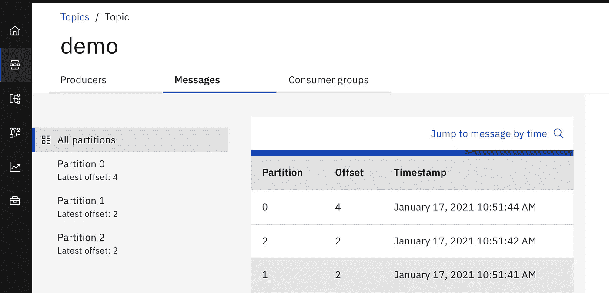

# 使用 CSI 卷快照备份和恢复 Kubernetes 有状态应用程序数据

> 原文：<https://itnext.io/backup-and-restore-of-kubernetes-stateful-application-data-with-csi-volume-snapshots-14ce9e6f3778?source=collection_archive---------1----------------------->


随着卷快照的[正式发布](https://kubernetes.io/blog/2020/12/10/kubernetes-1.20-volume-snapshot-moves-to-ga/)，用于有状态应用程序数据备份和恢复的 CSI 卷快照更加成熟。本文探讨了我们如何使用标准的 Kubernetes 快照资源来备份和恢复位于 PV 上的数据。

让我们使用 IBM 事件流作为测试目标。它基于 Strimizi 运算符运行 Kafka 的 statefulset K8s 资源。假设我们有 statefulset 的 3 个副本，数据保存在 PVC 中，分别命名为 data-es-kafka-0、data-es-kafka-1、data-es-kafka-2。PVC 由 Rook Ceph 提供。

## 卷快照类

正如 PVC 可以通过 storage 类动态创建 PV 一样，当请求卷快照资源时，可以通过 snapshot 类动态创建卷快照内容，即实际的快照数据。

在 Rook operator 的情况下，如果 RBD 快照类还没有创建，我们需要应用来自 GitHub source 的 YAML 文件，`rook/cluster/examples/kubernetes/ceph/csi/rbd/snapshotclass.yaml`这将允许快照通过 CSI 驱动程序动态创建。快照类名定义为`csi-rbdplugin-snapclass`

## 申请的状态

在我们拍摄 PVC 上的数据快照之前，让我们通过在 UI 上显示演示主题的消息来记录应用程序的当前状态。



屏幕截图中显示了每个分区的偏移量。当我们此时使用快照进行恢复时，预计会出现相同的数据。

## 卷快照

创建快照类后，我们可以动态请求快照。对于每个 Kafka 代理的 PVC，使用以下 YAML 文件创建快照，

```
apiVersion: snapshot.storage.k8s.io/v1beta1
kind: VolumeSnapshot
metadata:
  name: snapshot-data-es-kafka-0-1610889673
spec:
  volumeSnapshotClassName: csi-rbdplugin-snapclass
  source:
    persistentVolumeClaimName: data-es-kafka-0
```

如上面的 YAML 所示，我们要求快照类`csi-rbdplugin-snapclass`根据 PVC `data-es-kafka-0`为第一个状态集的副本创建一个快照。为所有的 PVC 创建 YAML。

应用 YAML 文件后，我们可以验证快照内容是否已创建，

```
oc get volumesnapshotcontent | grep snapshot-data-es-kafka**snapcontent-6c3cf764-2ebd-4788-a5bd-296b0544689a**   true         4294967296    Delete           rook-ceph.rbd.csi.ceph.com   csi-rbdplugin-snapclass   snapshot-data-es-kafka-2-1610889673   3h20m
snapcontent-7b1202d6-8b8e-49bb-975d-a3a741d11457   true         4294967296    Delete           rook-ceph.rbd.csi.ceph.com   csi-rbdplugin-snapclass   snapshot-data-es-kafka-0-1610889673   3h20m
snapcontent-ddad6d12-c930-4bb3-9b85-61cb427fc930   true         4294967296    Delete           rook-ceph.rbd.csi.ceph.com   csi-rbdplugin-snapclass   snapshot-data-es-kafka-1-1610889673   3h20m
```

我们可以进一步转到 Rook Ceph 工具箱来检查快照是否已创建，

```
oc -n rook-ceph exec -it rook-ceph-tools-78cdfd976c-wqvl4 -- rbd ls replicapoolcsi-snap-091267a8-586f-11eb-9e04-0a580a830011
csi-snap-0c1e1883-586f-11eb-9e04-0a580a830011
csi-snap-0f255227-586f-11eb-9e04-0a580a830011
```

## 灾难…

让我们模拟一个灾难，PVC 的文件系统对于所有三个副本都是满的。(PVC 创建时只有 4GB 大小)

```
oc exec -i es-kafka-0 -- sh -c "fallocate -l 5G /var/lib/kafka/data/huge"oc exec -i es-kafka-1 -- sh -c "fallocate -l 5G /var/lib/kafka/data/huge"oc exec -i es-kafka-2 -- sh -c "fallocate -l 5G /var/lib/kafka/data/huge"
```

卡夫卡经纪人然后陷入崩溃的循环。

## 从快照恢复

在我们恢复 PVC 的数据之前，让我们通过将副本缩放到零来停止 operator 和 statefulset。这是为了确保在恢复过程中 PVC 不会中断。

```
oc scale deploy eventstreams-cluster-operator --replicas=0oc scale sts es-kafka --replicas=0
```

让我们删除原始的 PVC，因为我们已经从快照中获得了备份，因此我们可以安全地删除损坏的数据

```
oc delete pvc data-es-kafka-0 pvc data-es-kafka-1 data-es-kafka-2
```

使用相同的名称创建 PVC，但是这次我们通过定义数据源从快照中恢复它。

```
apiVersion: v1
kind: PersistentVolumeClaim
metadata:
  name: data-es-kafka-0
spec:
  storageClassName: rook-ceph-block
 **dataSource:
    name: snapshot-data-es-kafka-0-1610889673
    kind: VolumeSnapshot** apiGroup: snapshot.storage.k8s.io
  accessModes:
    - ReadWriteOnce
  resources:
    requests:
      storage: 4Gi
```

注意，对于 PVC `data-es-kafka-0`，dataSource 指向一个名为`snapshot-data-es-kafka-0–1610889673` 的 VolumeSnapshot 对象，这是我们在灾难发生前拍摄的。新的 PVC 将从该快照中恢复。

一旦绑定了新的 PVC，我们就可以将运营商部署规模调整回 1。并观看 Kafka 应用程序正常运行，状态恢复如下所示，


## 使用 Velero 自动执行快照备份

实际上，通过手动创建 YAML 来拍摄快照有点麻烦。Velero 能够帮助我们实现流程自动化。

## Minio 依赖

假设我们使用 OpenShift 集群在本地环境中设置 Velero。首先，我们安装并配置 Minio 以满足对象存储的 Velero 需求。

因为我们需要运行一些特权操作，所以用特权 SCC 创建一个服务帐户，

```
oc new-project minio
oc create sa minio-privileged
oc adm policy add-scc-to-user privileged -z minio-privileged
```

通过舵图安装 Minio，添加 minio repo，

```
helm repo add minio [https://helm.min.io](https://helm.min.io)
```

创建以下 values.yaml 文件，

```
persistence:
  enabled: true
  size: 100Gi
defaultBucket:
  enabled: true
  name: bucket
serviceAccount:
  name: minio-privileged
makeBucketJob:
  podAnnotations:
  annotations:
  securityContext:
    enabled: true
    runAsUser: 0
    runAsGroup: 0
    fsGroup: 1000
```

然后展开迷你头盔图，

```
helm install minio -n minio -f values.yaml minio/minio
```

将 S3 服务公开为 OpenShift 路由，

```
oc expose svc/minio
```

同时，记下登录的 accesskey 和 secretkey 的 minio 秘密。准备一个文件，`minio.secret`，如下所示，

```
[default]
aws_access_key_id = xxxxxxxxxxxxx
aws_secret_access_key = xxxxxxxxxxxxx
```

## Velero 的安装

Velero 的安装很简单，下载客户端，

```
curl -LO [https://github.com/vmware-tanzu/velero/releases/download/v1.5.2/velero-v1.5.2-linux-amd64.tar.gz](https://github.com/vmware-tanzu/velero/releases/download/v1.5.2/velero-v1.5.2-linux-amd64.tar.gz)tar zxvf velero-v1.5.2-linux-amd64.tar.gz
sudo cp velero-v1.5.2-linux-amd64/velero /usr/local/bin
```

然后安装 Velero 服务器端组件，

```
velero install \
 --provider aws \
 --plugins velero/velero-plugin-for-aws:v1.1.0,velero/velero-plugin-for-csi:v0.1.2  \
 --bucket bucket  \
 --secret-file minio.secret  \
 **--use-volume-snapshots=true** \
 --backup-location-config region=default,s3ForcePathStyle="true",s3Url=[http://minio-minio.apps.dev3-ocp46.ibmcloud.io.cpak](http://minio-minio.apps.dev3-ocp46.ibmcloud.io.cpak)  \
 --snapshot-location-config region=default \
 **--features=EnableCSI**
```

请注意，我已经启用了 CSI 和卷快照。

此外，我们需要注释 Velero 的 snapshot 类，以使用它来创建快照，

```
oc label VolumeSnapshotClass csi-rbdplugin-snapclass velero.io/csi-volumesnapshot-class=true oc label VolumeSnapshotClass csi-cephfsplugin-snapclass velero.io/csi-volumesnapshot-class=true
```

## Velero 在行动

一旦安装了 Velero，我们就可以对名称空间进行备份(创建基于计划的备份或临时备份)

```
velero backup create evs-backup-2021-01-18-14-51-47 --include-namespaces eventstreams --wait
```

这个命令将以 json 格式创建所有 Kubernetes 对象的备份，并将它们保存到 S3 对象存储中。同时，还使用相应的快照类来拍摄快照。

例如，如果我们在 Velero backup 调用后检查快照，

```
oc get volumesnapshotsNAME                               READYTOUSE   SOURCEPVC             SOURCESNAPSHOTCONTENT   RESTORESIZE   SNAPSHOTCLASS             SNAPSHOTCONTENT                                    CREATIONTIME   AGE
velero-data-es-kafka-0-7fb7f       true         data-es-kafka-0                               4Gi           csi-rbdplugin-snapclass   snapcontent-4ec929ef-3868-427b-a7b5-dc1dbcc6537a   2m47s          2m49s
velero-data-es-kafka-1-gszdn       true         data-es-kafka-1                               4Gi           csi-rbdplugin-snapclass   snapcontent-7ebc61a1-b2de-4fa2-8591-49e2f45b83d1   2m42s          2m44s
velero-data-es-kafka-2-7hbcm       true         data-es-kafka-2                               4Gi           csi-rbdplugin-snapclass   snapcontent-b620a877-7bca-4b74-92f7-67e249d2b381   2m37s          2m39s
velero-data-es-zookeeper-0-4k782   true         data-es-zookeeper-0                           2Gi           csi-rbdplugin-snapclass   snapcontent-ecffa6a6-463e-4463-a3ae-10fdf48a19e7   2m32s          2m34s
velero-data-es-zookeeper-1-c9fcg   true         data-es-zookeeper-1                           2Gi           csi-rbdplugin-snapclass   snapcontent-08658983-3143-4fdf-a3e4-bd43e41fadda   2m27s          2m28s
velero-data-es-zookeeper-2-ngw67   true         data-es-zookeeper-2                           2Gi           csi-rbdplugin-snapclass   snapcontent-0016b15b-5c8d-4c91-86f7-fd0b954a3c1c   2m22s          2m23s
```

所有 PVC 都将在备份过程中创建其快照。如果我们描述其中一个，

```
oc describe volumesnapshot velero-data-es-kafka-0-7fb7f | head -10Name:         velero-data-es-kafka-0-7fb7f
Namespace:    eventstreams
**Labels:       velero.io/backup-name=evs-backup-2021-01-18-14-51-47**
Annotations:  <none>
API Version:  snapshot.storage.k8s.io/v1beta1
Kind:         VolumeSnapshot
Metadata:
  Creation Timestamp:  2021-01-18T06:52:17Z
  Finalizers:
    snapshot.storage.kubernetes.io/volumesnapshot-as-source-protection
```

快照标有 Velero 备份名称。这就是 Velero 在调用恢复时如何找到要使用的正确快照。

现在，万一发生灾难，我们可以恢复 PVC 数据。在实际恢复之前，让我们停止所有潜在的中断，如本文开头部分的手动方法所示，

```
oc scale deploy eventstreams-cluster-operator --replicas=0oc scale sts es-kafka --replicas=0oc delete pvc data-es-kafka-0 data-es-kafka-1 data-es-kafka-2
```

我们删除 PVC，因为 Velero 恢复不会覆盖任何现有的 K8s 资源。用 Velero 修复，

```
velero restore create evs-restore-test --from-backup **evs-backup-2021-01-18-14-51-47** --wait
```

输入 Velero 的备份名称，通过标签找到正确的快照。然后可以恢复 PVC，并且可以恢复 statefulset 应用程序。

## 讨论

因为快照是由 Rook Ceph snapshot 类执行的，所以快照内容实际上存储在 Rook 集群中。如果您打算备份 PVC 数据并在不同的 Kubernetes 集群中恢复它，这里描述的方法不适用。您将需要有 Velero 的 restic 备份和恢复选项。