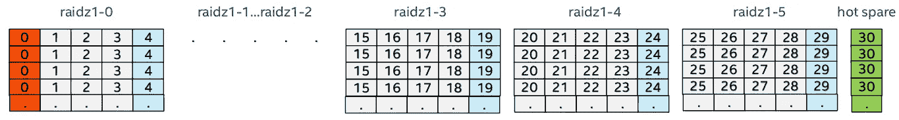
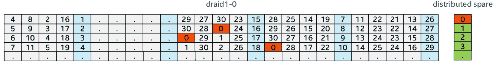
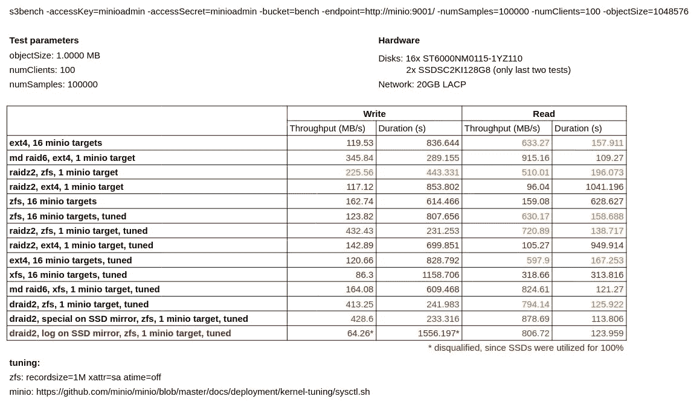
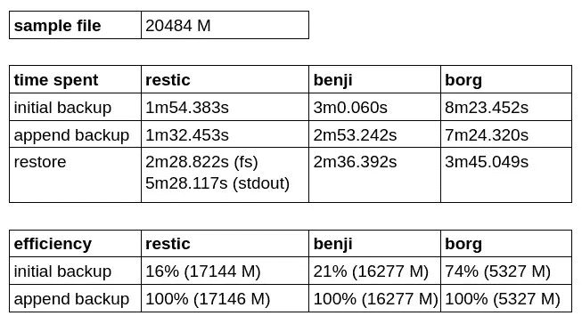

# 使用免费工具备份数千台虚拟机的存储

> 原文：<https://itnext.io/backup-storage-for-thousands-of-virtual-machines-using-free-tools-b3909004bef2?source=collection_archive---------0----------------------->


大家好，最近我遇到了一个有趣的任务，那就是设置一个存储服务器来备份大量数据块设备。

每周我们都会备份云中的所有虚拟机，因此需要能够处理成千上万的备份，并尽可能快速高效地完成备份。

不幸的是，标准的 **RAID5** 、 **RAID6** 级别并不合适，因为像我们这样的大型磁盘上的恢复过程会非常漫长，而且很可能永远不会成功完成。

让我们考虑一下有哪些选择:

[**擦除编码**](https://docs.min.io/docs/minio-erasure-code-quickstart-guide.html) —类似于 RAID5、RAID6，但具有可配置的奇偶校验级别。此外，容错不是针对整个块设备，而是针对每个对象单独执行的。尝试擦除编码最简单的方法是部署 [minio](https://min.io/) 。

[**DRAID**](https://openzfs.github.io/openzfs-docs/Basic%20Concepts/dRAID%20Howto.html) 是 ZFS 目前尚未发布的特性。与 RAIDZ 不同，DRAID 具有分布式奇偶校验块，并在恢复过程中使用阵列中的所有磁盘，这使其能够更好地应对磁盘故障，并提供比标准 RAID 级别更快的恢复。



RAIDZ



德雷德

对于这个设置，我准备了一台服务器**富士通 Primergy RX300 S7** ，配备了**英特尔至强处理器 E5–2650 l 0 @ 1.80 GHz**处理器、九个 RAM 模块**三星 DDR 3–1333 8Gb PC3L-10600 r ECC 注册(M393B1K70DH0-YH9)** 、磁盘架**Supermicro SuperChassis 847 e 26-rjbod**

在做出任何决定之前，我们首先需要适当地测试一切。

为此，我准备并测试了各种配置。我使用了 minio，它充当了一个 S3 网关，并以不同的模式启动它，目标数量也不同。

基本上，我在具有擦除编码的 minio 和具有相同磁盘数量和奇偶校验级别的软件 raid 配置之间进行选择，它们是:RAID6、RAIDZ2 和 DRAID2。

> 供参考:当您只在一个目标上运行 minio 时，它就像一个 S3 网关，将您的本地文件系统表示为 S3 存储。如果您对多个目标运行 minio，则擦除编码模式将自动打开，在这种情况下，它将在您的目标之间传播数据，并为您的对象提供容错。
> 
> 默认情况下，minio 将目标分成 16 个磁盘的组，每个组有 2 个奇偶校验。两个磁盘同时发生故障也不会丢失数据。

为了执行基准测试，我使用了 16 个磁盘，每个磁盘 6TB，我正在编写 1MB 大小的小对象，这非常准确地描述了我们未来的负载，因为所有现代备份工具都将数据划分为几兆字节的块，并以这种方式编写它们。

我使用了运行在远程服务器上的 [s3bench](https://github.com/igneous-systems/s3bench) 实用程序，并在数百个流中向 minio 发送数万个这样的对象。后来，它试图用同样的方式读回它们。

基准测试结果如下表所示:



正如我们所看到的，与运行在相同配置的软件 RAID6、RAIDZ2 和 DRAID2 之上的 minio 相比，采用擦除编码模式的 minio 在写入方面表现更差。

此外，还要求在 ext4 和 XFS 上测试 minio。令人惊讶的是，对于我的负载类型，XFS 明显比 ext4 慢。

在第一批测试中，mdadm 显示出了对 ZFS 的优势，但后来[乔治·梅利科夫](https://github.com/gmelikov)给了我几个选项，这大大提高了 ZFS 的性能:

```
xattr=sa atime=off recordsize=1M
```

在应用它们之后，ZFS 的测试变得更好了。

在最后两个测试中，我还尝试将元数据(`special`)和 ZIL ( `log`)移动到 SSD 的镜像中。但是移动元数据并没有给写速度带来多少好处，当 ZIL 被移动时，我的 SSDSC2KI128G8 的利用率为 100%，所以我认为这个测试失败了。然而，我不排除，如果我有更快的 SSD 磁盘，那么这可能会大大提高我的结果，但不幸的是，我没有它们。

最后，我决定停止使用 DRAID，尽管它是 alpha 版本，但在我们的情况下，它是最快、最有效的存储解决方案。

> **警告**:我们正在使用 DRAID 进行短期操作备份，我们可以承受短期数据丢失，但您的情况可能不同，使用它需要您自担风险！

我在配置中创建了一个简单的 DRAID2，其中包含三个组和两个分布式备盘:

```
# zpool status data
  pool: data
 state: ONLINE
  scan: none requested
config:

    NAME                 STATE     READ WRITE CKSUM
    data                 ONLINE       0     0     0
      draid2:3g:2s-0     ONLINE       0     0     0
        sdy              ONLINE       0     0     0
        sdam             ONLINE       0     0     0
        sdf              ONLINE       0     0     0
        sdau             ONLINE       0     0     0
        sdab             ONLINE       0     0     0
        sdo              ONLINE       0     0     0
        sdw              ONLINE       0     0     0
        sdak             ONLINE       0     0     0
        sdd              ONLINE       0     0     0
        sdas             ONLINE       0     0     0
        sdm              ONLINE       0     0     0
        sdu              ONLINE       0     0     0
        sdai             ONLINE       0     0     0
        sdaq             ONLINE       0     0     0
        sdk              ONLINE       0     0     0
        sds              ONLINE       0     0     0
        sdag             ONLINE       0     0     0
        sdi              ONLINE       0     0     0
        sdq              ONLINE       0     0     0
        sdae             ONLINE       0     0     0
        sdz              ONLINE       0     0     0
        sdan             ONLINE       0     0     0
        sdg              ONLINE       0     0     0
        sdac             ONLINE       0     0     0
        sdx              ONLINE       0     0     0
        sdal             ONLINE       0     0     0
        sde              ONLINE       0     0     0
        sdat             ONLINE       0     0     0
        sdaa             ONLINE       0     0     0
        sdn              ONLINE       0     0     0
        sdv              ONLINE       0     0     0
        sdaj             ONLINE       0     0     0
        sdc              ONLINE       0     0     0
        sdar             ONLINE       0     0     0
        sdl              ONLINE       0     0     0
        sdt              ONLINE       0     0     0
        sdah             ONLINE       0     0     0
        sdap             ONLINE       0     0     0
        sdj              ONLINE       0     0     0
        sdr              ONLINE       0     0     0
        sdaf             ONLINE       0     0     0
        sdao             ONLINE       0     0     0
        sdh              ONLINE       0     0     0
        sdp              ONLINE       0     0     0
        sdad             ONLINE       0     0     0
    spares
      s0-draid2:3g:2s-0  AVAIL   
      s1-draid2:3g:2s-0  AVAIL   

errors: No known data errors
```

好了，我们选择了存储，现在我们需要选择备份解决方案。在此，我想向大家介绍我尝试过的三种解决方案，它们是:

[**Benji 备份**](https://benji-backup.me/)—[back 2](http://backy2.com/)的分支，专门针对块设备备份的解决方案，与 Ceph 紧密集成。它可以获取两个快照之间的差异，并从中执行增量备份。它支持大量的存储后端，其中既有本地后端，也有 S3 后端。它需要一个单独的数据库来存储重复数据删除哈希表。用 python 写的，有一个稍微没有反应的命令行界面。

[**Borg Backup**](https://borgbackup.readthedocs.io/en/stable/) —是 [Attic](https://attic-backup.org/) 的一个分支，这是一个众所周知且经过验证的备份工具，可以很好地备份数据并进行重复数据删除。它能够使用 scp 在本地和远程服务器上保存备份。如果指定了`--special`标志，它可以备份块设备。缺点:创建备份时，存储库完全被阻塞，因此建议为每个虚拟机创建一个单独的存储库，原则上这不成问题，因为创建它们非常容易。

[**Restic**](https://restic.net/) —是一个正在积极开发的项目，用 go 编写，它足够快，支持大量的存储后端，其中有 local、scp、S3 等等。我还想补充一点，有一个专门为 restic 创建的 [rest-server](https://github.com/restic/rest-server) ，它真的很快，可以让你轻松地导出远程存储。Restic 能够从标准输入中备份。和其他人相比，我最喜欢 restic。它几乎没有缺点，但有几个特点:

*   首先，我尝试将 restic 与所有虚拟机的单个存储库一起使用(就像 Benji 做的那样),它甚至工作得很好，但是恢复操作花费了很长时间，因为在开始任何恢复操作之前，restic 会尝试读取存储库中所有快照的元数据。就像在 borg 案例中一样，通过为每个虚拟机创建一个单独的存储库，这一问题得到了简单的解决。

    无论如何，重复数据删除仅相对于以前的快照执行，父快照由指定备份目标的路径决定，因此，如果您将不同的对象从标准输入备份到单个存储库，请确保您指定了`--stdin-filename`选项，或者在每次运行时明确指定了`--parent`选项。
*   其次，恢复到 stdout 比恢复到文件系统花费的时间长得多，因为此操作可以并行执行。未来计划增加对块设备操作的更好支持。
*   第三，目前推荐 master 的版本，因为 0.9.6 版本有一个大文件恢复时间长的 bug。

为了检查存储效率以及从备份创建和恢复的速度，我为每个解决方案创建了一个单独的存储库，并尝试备份一个小型虚拟机映像(21 GB)。每个解决方案都为我创建了两个备份，它们之间的原始拷贝没有发生变化，以检查经过重复数据消除的数据的拷贝速度是快了还是慢了。



正如我们所看到的，Borg 备份对于初始备份来说效率最高，但是对于创建和恢复操作来说速度较慢。

在权衡所有利弊之后，我决定停止使用 restic，将 rest-server 作为最方便、最有前途的备份解决方案。

[](https://asciinema.org/a/333393) [## restic + draid

### 我们新的备份存储

asciinema.org](https://asciinema.org/a/333393) 

在此截屏中，您可以看到在同时运行的多个备份操作中，10gb 通道是如何得到充分利用的。值得注意的是，磁盘利用率不会超过 30%。

我对最终的解决方案非常满意。