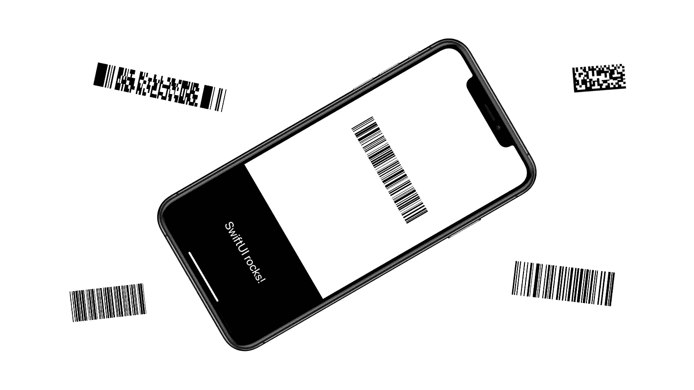
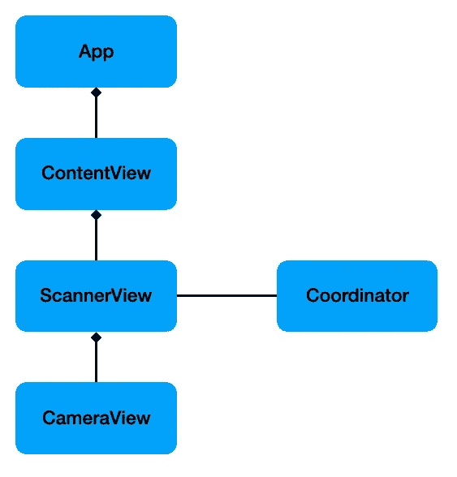
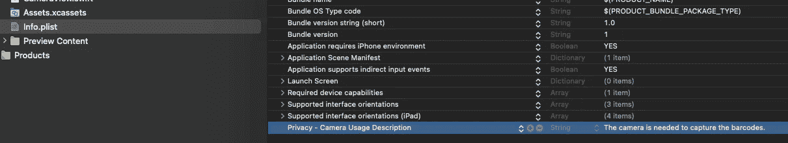
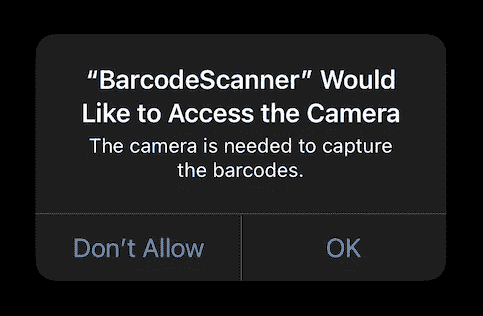
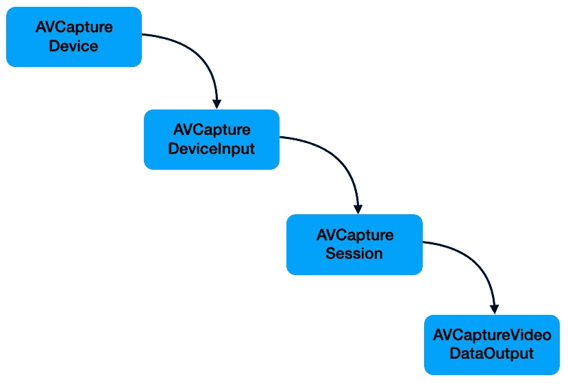
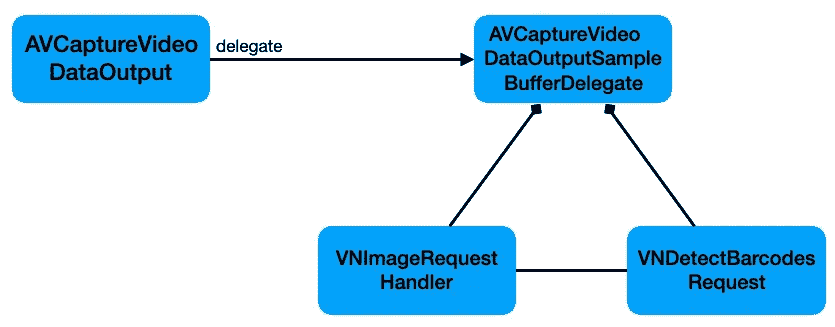

# SwiftUI 中的条形码扫描仪

> 原文：<https://itnext.io/barcode-scanner-in-swiftui-c6d5fc35cf60?source=collection_archive---------3----------------------->

## 将条形码扫描仪集成到您的 SwiftUI 应用程序中



条形码无处不在，由于苹果广泛的框架，我们有一切使条形码处理成为一项简单的任务。

本文提供了将条形码扫描纳入基于 SwiftUI 的 iOS 应用程序所需的一切。

除了 SwiftUI 应用程序之外，本教程还使用了另外两个框架。

首先是 **AVFoundation** ，在苹果开发者文档中描述如下:

> 使用视听资产、控制设备摄像机、处理音频和配置系统音频交互。

其次，我们将使用**愿景**框架:

> 应用计算机视觉算法对输入图像和视频执行各种任务。

本文将介绍连接所有相关类的所有步骤，以获得一个显示扫描条形码的 SwiftUI 应用程序。

**在这里** **可以下载到** [**带有全工作应用的 Xcode-workspace。**](https://www.buymeacoffee.com/twissmueller/e/33853)

查看运行中的应用程序:

## 应用架构

首先，我将快速概述一下在这个应用程序中创建的所有类。

下面是一个显示所有相关元素的基本类图。



应用程序结构

`App`:这是 Xcode 创建的基本应用程序模板，保持原样。

`ContentView`:持有显示条码扫描结果的`ScannerView`和`Text`。它有一个被传入`ScannerView`的`@State`-变量(见下文),当它改变时自动更新`Text`。你一定会喜欢 SwiftUI 的。

`ScannerView`:没有原生的 SwiftUI 来做我们想要的事情，因此我们需要在`UIViewRepresentable`中包装一个`UIView`来显示我们的摄像机视频馈送，正如我在文章[“在 SwiftUI 中使用 UIView 和 UIViewController”](/using-uiview-in-swiftui-ec4e2b39451b)中解释的那样。这个视图的任务是通过它的`@Binding`-变量将扫描结果暴露给它的父视图。

`CameraView`:这就是我上面提到的被“扫描视图”包装的`UIView`。它本身包装了一个`AVCaptureVideoPreviewLayer`，这个层显示 iPhone 或 iPad 内置摄像头正在捕捉的内容。

`Coordinator`:这个班级是`UIViewRepresentable`的一部分，大部分事情都发生在这里。首先，我们请求相机许可，然后我们设置一个管道来获取相机输出，最后我们将它输入到执行条形码识别的代码中。

## 询问相机用法

为了能够使用摄像机，需要首先在`Info.plist`中设置“摄像机使用说明”。



相机使用说明

稍后，当应用程序第一次启动时，将弹出以下窗口，询问用户是否允许使用相机。



请求拍摄许可

在代码中，我们请求允许

```
AVCaptureDevice.requestAccess(for: .video)`
```

## 设置摄像机馈送

现在，我们可以访问摄像机，我们可以设置整个管道来获取视频帧，然后将这些视频帧输入算法，以提取条形码中的信息。

这些是我们需要的元素以及苹果公司提供的描述:

> `AVCaptureDevice` -为捕获会话提供输入(如音频或视频)并为硬件特定的捕获功能提供控制的设备。
> 
> `AVCaptureDeviceInput`‌——从捕获设备向捕获会话提供媒体的捕获输入。
> 
> `AVCaptureSession` -管理捕获活动并协调从输入设备到捕获输出的数据流的对象。
> 
> `AVCaptureVideoDataOutput` -记录视频并提供视频帧访问以进行处理的采集输出。



加工流水线

虽然`AVCaptureSesssion`是负责收集和处理必要视频帧的中心，但我们最终感兴趣的是运行条形码检测算法的视频帧本身。

`AVCaptureVideoDataOutput`有一个接收采集输出和样本缓冲的代表。

我们的`Coordinator`将通过继承`AVCaptureVideoDataOutputSampleBufferDelegate`并实现`captureOutput(_:didOutput:from:)`来充当这个委托。

## 处理捕获的图像

为了接收条形码信息，还需要采取一个步骤:处理从手机摄像头接收的图像。

有两个主要负责的类:

> `VNImageRequestHandler` -处理与单个图像相关的一个或多个图像分析请求的对象。
> 
> `VNDetectBarcodesRequest` -在图像中查找和识别条形码的图像分析请求。

他们是这样合作的:



处理条形码图像

当实例化`VNDetectBarcodesRequest`时，我们需要提供一个处理结果的处理器。

```
let request = VNDetectBarcodesRequest(completionHandler: self.barcodeRequestHandler)
```

这个处理程序然后接收观察到的结果，我们可以进一步处理并提取最终的`String`

```
func barcodeRequestHandler(request: VNRequest, error: Error?) {
        guard let results = request.results as? [VNBarcodeObservation],
              let payloadStringValue = results.last?.payloadStringValue else {
            return
        }
        self.scanResult = payloadStringValue
    }
```

## 结论

在这篇文章中，我概述了创建一个 SwiftUI-app 来扫描条形码的必要条件。

**在这里** **可以下载到 Xcode-workspace 的** [**。**](https://www.buymeacoffee.com/twissmueller/e/33853)

感谢您的阅读！

*   如果你喜欢这个，请[跟我上 Medium](https://twissmueller.medium.com/)
*   给我买杯咖啡让我继续前进
*   支持我和其他媒体作者[在这里注册](https://twissmueller.medium.com/membership)

[https://twissmueller.medium.com/membership](https://twissmueller.medium.com/membership)

## 资源

*   AVFoundation
*   [视觉](https://developer.apple.com/documentation/vision)
*   [如何扫描条形码](https://www.hackingwithswift.com/example-code/media/how-to-scan-a-barcode)
*   [iOS 愿景框架:基础知识](https://medium.com/academy-eldoradocps/vision-framework-for-ios-an-introduction-78d02c3e1ef)
*   [在线条形码生成器](https://www.barcode-generator.de/V2/en/index.jsp)