# AKS 第 1 部分中的基准应用程序性能

> 原文：<https://itnext.io/baseline-application-performance-in-aks-part-1-b6d10c87985a?source=collection_archive---------3----------------------->

> 了解应用程序的资源消耗对于确保 Kubernetes 集群的正常性能至关重要。这是第 1 部分，也是第 3 部分，我们将重点关注静态应用程序，以了解应用程序在没有任何负载的情况下对资源的影响

优化集群性能并不是 Azure Kubernetes 服务所独有的。本文中的所有概念和想法不仅适用于每个云提供商和 K8 应用程序，也适用于所有应用程序。

我写的另外三篇文章将帮助您理解为什么这些概念在 Kubernetes 中很重要。如果您没有见过它们，它们是:

> **请求和限制**

[AKS 性能:资源请求和限制| Chase over mir | 2020 年 11 月| ITNEXT](/aks-performance-resource-requests-and-limits-f76ac255fae1)

> **资源配额**

[AKS 性能:资源配额。限制…的资源消耗|由 Chase over mire | 2020 年 12 月| ITNEXT](/aks-performance-resource-quotas-2934ce468be7)

> **极限范围**

[AKS 性能:极限范围。控制你的……资源数量|通过追逐超额| 2020 年 12 月|下一次](/aks-performance-limit-ranges-8e18cbebe351)

这篇文章将作为一个起点，比接下来的文章更简单一些。这里的想法是向您介绍**一般**性能分析，并向您展示如果您不得不或需要学习如何使用**如何手动** **完成它。**

为什么手动？我想先手动操作一下，向你展示我们如何*查看重要资源。我不建议在生产中使用这种方法，但是这些信息将帮助您了解如何收集重要信息。这旨在帮助您立即找到哪些资源是重要的。说到资源，让我们定义一下我们真正想要完成的是什么，好吗？*

在这篇文章中，我们有三个资源，我们现在想关注一下。从技术上来说，网络 IO 也是我们关心的问题，但是在本文中，我们不会重点讨论这个问题。

1.  中央处理器
2.  记忆
3.  磁盘 IO

这些资源中的每一个都在确保集群实际可用方面发挥着关键作用。这些资源中的任何一个资源过度饱和都会导致应用程序的糟糕性能，并对用户产生潜在的负面影响。我们希望收集足够的数据，以确保我们不会对其中任何一项征税。

我将创建**这些文章中的三个**。静态应用程序(本文)、负载应用程序、应用程序爆发/耗尽。我们将使用这些数据来确定我们的要求和限制应该/需要是什么，并讨论一段时间内的有机增长以及我们如何保持领先于我们的消费。

# 入门指南

> 您将需要一个集群

> 这将被推广(目前)，以确保尽可能多的人可以消费这个。根据您的设置，您可能需要进行更全面的测试，但这些概念同样适用

> 我的集群

我将在较旧的集群版本 1.17.11 上完成所有这些工作。我有 **2 个**节点相当小， [Standard_D2s_v3](https://docs.microsoft.com/en-us/azure/virtual-machines/dv3-dsv3-series) 也就是 2 个 CPU 8GB Mem **。**我有骨股票 **P10** 500 眼内压磁盘重视。

由于资源有限，了解应用程序对资源的影响以防止节点饱和对我来说非常重要。在本系列文章结束之前，我有一些需要完成的目标:

1.  了解应用程序的静态资源需求*(我们在本文中了解到)*
2.  了解应用程序的低/中/高资源需求
3.  了解应用程序的高峰负载资源需求
4.  了解潜在的请求影响

如果我能在本系列结束时检查所有这些，那么我将能够正确地设计资源和请求限制、命名空间配额和限制范围，如果我选择使用这些工具的话。这些信息将确保我了解我的应用程序的能力，并允许我适当地利用我所拥有的资源。

> 应用程序

我将使用 K8s pod 作为官方 K8s 文档中[水平 pod 自动缩放](https://kubernetes.io/docs/tasks/run-application/horizontal-pod-autoscale-walkthrough/)的示例。所有人都可以使用它，我想要概述的核心概念也很容易实现。你当然不一定要用这个。我希望每个人都能轻松使用，不管他们的集群大小如何。

# 部署工作负载

游戏时间。我将运行`kubectl apply -f [https://k8s.io/examples/application/php-apache.yaml](https://k8s.io/examples/application/php-apache.yaml)`，然后等待使用`kubectl get pod --watch`创建它。

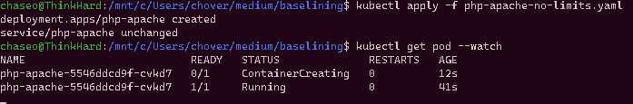

使用—观察以监视状态变化。

一旦我的应用程序开始运行，我们就可以开始考虑第一个需求，了解应用程序的静态资源需求。有一堆*不同的*方法可以做到这一点，所以我将只专注于其中一种。在此之前，我想核实几件事。

让我们从运行 **exec** 开始，进入 pod 并以传统方式看待事物。我将运行`kubectl exec -it php-apache-5546ddcd97-cvkd7 bash`让自己进入 pod，然后检查以确保 CPU 和内存符合我的预期。

运行`cat /proc/cpuinfo | grep "model name"`向我展示了基于我的标准 B2 Sku 的预期。

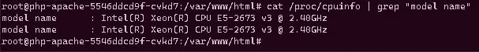

2 vCPU，果然不出所料。

接下来我将运行`free -m`来感受一下 pod 是如何思考内存的。这里需要记住的是，您不能使用这个命令来确定内存需求，因为 Linux 会将未使用的内存用于磁盘缓存。不要担心，虽然这是故意的。

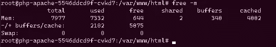

不要慌！Linux 认为未使用的内存是浪费的内存。当应用程序需要时，它是免费的。

现在，我们已经确保 pod 拥有我们期望的资源，让我们将注意力集中在实际应用程序的需求上。如果你想知道的话，这一点是为了表明 pod 目前不受任何限制。在后面的文章中，这个未绑定的 pod 将成为集群的末日，这是许多人经常遇到的问题。

# 了解休息资源需求

现在是时候开始思考我上面提到的**三**资源了。

1.  中央处理器
2.  记忆
3.  磁盘 IO

我们希望了解我们的应用程序在 **rest** 的使用模式，这要求我们首先收集每个模式的信息。记得我说过我们将手动进行这个**。手动收集这些信息将帮助您了解如何收集数据本身的基本知识(如果您还不知道的话),并让我们跳出框框思考如果没有其他选择，我们该如何做。我们需要收集所有这些信息**和**我们需要能够随着时间的推移**对其进行分析**以确保我们了解休息需求。**

> **疯狂的人做疯狂的事，这是一件疯狂的事。在以后的文章中，我们将自动完成这项工作，或者使用令人敬畏的工具来完成这项工作，这将更符合逻辑，但信息量较少。一般来说，这种类型的收集背后的想法将用于实时调查，而不是用于历史分析的收集**

**通常你会同时收集所有这些，然后一点一点地分析。在这篇文章中，我们不打算用那种方式*来做，因为我们想用强硬的方式来做。取而代之的是，我们将从托管节点收集分组或一次性的东西，然后将其聚合，以便于我们分析。***

**这是游戏计划。我将创建一个可怜的 mans 数据收集器，它在托管节点上每秒运行一次，收集排名前三的资源的统计信息，并将它们重新编码到一个文件中，供我们以后使用。我将只收集 5 分钟左右的数据，然后将它们汇总在一起并查看数据。**

**在这篇文章中，我不打算花超过 5 分钟的时间，主要是因为我们使用的方法不需要太多的数据就能表达清楚。要明白，在一个真正的应用程序中，你需要比 5 分钟更多的数据。简而言之，你会得到这个数据集的要点，它将是非常平坦的减去一个指标。**

**我要做的是使用名为[的节点外壳](https://github.com/kvaps/kubectl-node-shell)访问我的托管节点，并直接从中收集数据。**

> **确定托管节点并获得访问权限**

**我将运行`kubectl get pods -o wide`并查看我的托管节点**

**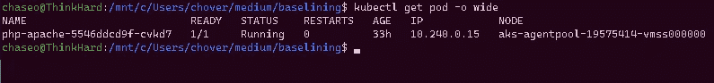**

**我们可以看到我的托管节点是 aks-agent pool-19575414-vmss 000000**

**在进入我的节点之前，我想对我的 PHP pod 运行一个 describe，这样我就可以获得容器 ID。我将运行`kubectl describe pod php-apache-5546ddcd9f-cvkd7`，我们可以看到我的 id。**

**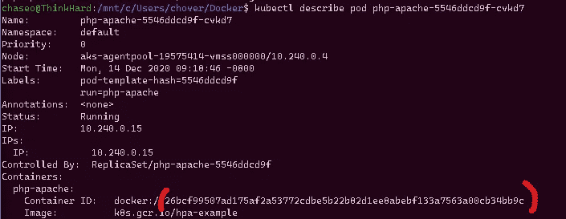**

**我们稍后将对此进行研究**

**现在，我将继续运行`kubectl node-shell aks-agentpool-19575414-vmss000000`来访问我的节点。**

**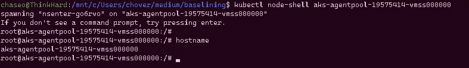**

**一个额外的 pod 启动并用于 SSH 到托管节点，而您不需要做任何其他事情。**

**获得访问权，游戏时间。我们现在可以找到容器的 PID，并开始收集数据。有很多方法可以做到这一点，我会很懒，只运行`docker inspect -f '{{.State.Pid}}' <container id>`。**

> **要明白，在一个真正的应用程序中，你需要比 5 分钟更多的数据。简而言之，仅用这个数据集，您就能得到要点。**

> **收集数据**

**我们有很多方法可以手动完成这项工作。总的来说，如果你要收集 CPU、内存和磁盘，你通常需要比单个应用程序更多的东西。大多数人都在想什么？我会打赌命令像 PS，TOP，HTOP，IFTOP，IOTOP，可能还有 SAR。**

**如果可能的话，我想每秒钟至少收集一次数据。从技术上来说*大多数*云提供商计算资源节流在 1 分钟以下，我相信在 Azure Disk 的情况下是 10ms，所以我们需要确保我们至少有 1 秒。**

**如果你正在收集数据> 1 秒，你需要确保小心*为你平均*数据的任何事情。如果你收集数据，比如说每 10 秒钟平均 5 个 IOPS，但是仅仅一秒钟就达到 10 个，那么这个平均值就不能正确反映这个巨大的峰值。我们将在后面的文章中详细讨论这一点。**

> **CPU +内存**

**我们可以试试配料陀螺..**

**`**/var/lib/docker/containers# top -d 1 -b -p 26380 >> output.txt**`**

**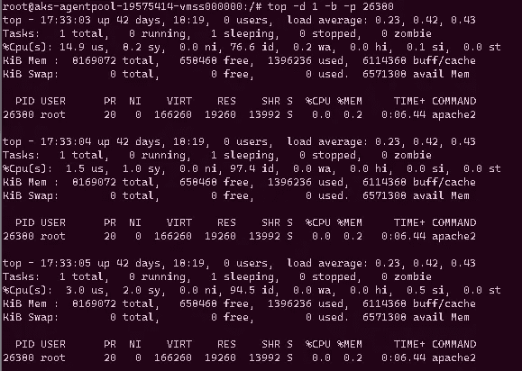**

**批处理 top 并解析输出…**

**老实说，如果你说“嘿，你需要用内置工具从头开始做这个！”我可能不会这么做。另一个选择可能是运行 ps aux 对吗？我们可以这样做:**

```
ps aux | awk -v date="$(date +"%Y-%m-%d %r")" '{print date "\t\t" $11 "\t\t" $3 "\t\t" $6/1024 " MB\t\t" "\t" $2}'| grep 26380
```

> **请注意，以这种方式收集数据**在技术上确实有**的资源开销，尽管它可能很小。**

> **磁盘 IO**

**我最喜欢的路线是一整天都不休息。我们知道我的 pid *26380* 是我想关注的人。很简单，我可以跑`iotop -b -q -d 1 -p 26380`**

**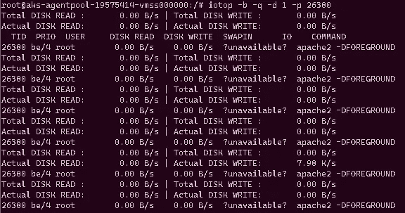**

**不太干净，但我们可以用这个**

**但是这里有一个小问题…我们根本没有时间戳。我们不能像用 ps aux 那样 awk 它，因为我们是在批处理模式下运行的，它只会在命令开始时显示第一个实例…让我们重新考虑一下。如果我们看一下 IOTOP 手册页，我们可以看到有一些方法可以控制它以批处理方式运行的时间。所以让我们这样来代替:`iotop -q -d 1 -n 300 -p 26380`**

**现在 IOTOP 将只运行 5 分钟，`n`是开关，`300`是秒数。这将让我们做一些更简单的计算…尽管它们可能很傻…以后。让我们称之为“暂时没问题”,并把它们缝合在一起。**

> **把它放在一起**

**我们知道 iotop 命令在设计上已经运行了五分钟，所以我们只需要写一些东西来确保 ps aux one 也能运行。很简单。我会制作世界上最糟糕的剧本…**

```
#!/bin/bash
n=0
iotop -q -d 1 -n 300 -p 26380 >> ioResults.txt & #background thiswhile [ $n -le 301 ]
 do
 ps aux | awk -v date="$(date +"%Y-%m-%d %r")" '{print date "\t\t" $11 "\t\t" $3 "\t\t" $6/1024 " MB\t\t" "\t" $2}' >> cpumemResults.txt
 sleep 1
 n=$(( n+1 )) # increments $n
 done
```

**对于专业开发人员来说，是的，这是热垃圾，将完成工作的热垃圾。当你启动它的时候，它会把 iotop 推入一个后台进程，同时 ps aux 循环也会运行 5 分钟。现在我可以运行`./MyScript.sh`并等待它完成。**

> **替代方法**

**总是有很多方法可以做到这一点，我可能会故意选择一个最可笑的可怕的方法。让我们看看我们可以用 AKS 中我的特定设置来完成这个*的其他方法。***

> **使用 Docker**

**Docker 有一个内置的`stats`命令，可以收集我们关心的几乎所有重要的东西，但是没有时间元素。我将从上面的 pod 中获取容器 ID，然后运行`docker stats 26bcf99507ad175af2a53772cdbe5b22b82d1ee8abebf133a7563a00cb34bb9c — format “table {{.ID}}\t{{.CPUPerc}}\t{{.MemUsage}}\t{{.BlockIO}}\t{{.NetIO}}”` theb 观看魔术。**

**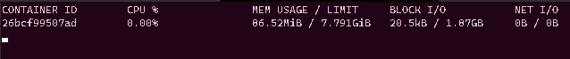**

**好吃的数据！**

**太好了！关于集装箱使用的大量精彩信息…然而，它只是一遍又一遍地刷新屏幕，并没有给我们提供任何实际的时间框架，这使得它非常适合于目前的调查，而不是真正的长期分析…不过，如果我们想的话，我们可以绕过它。**

**让我们考虑一下 docker stats 命令……它显然是从某个地方的*提取数据的。稍微研究一下 cgroups 是如何工作的，就可以得到 cgroups 资源数据。我们也许可以想出一种手动收集数据的方法…然后做一些研究，找出数据是如何收集和整理的，然后创建一种历史收集这些数据的方法…***

**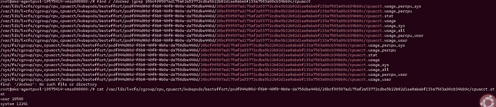**

**选项选项如此多的选项…**

**数据就在那里，只需要提取/分析数据。如果你好奇的话，这是一个不错的选择。如果你准备接受挑战，去看看 Kubernetes API 如何收集统计数据，然后看看 Prometheus 这样的收集应用程序如何收集相同的统计数据。**

**也许我们可以向 Docker API 请求统计数据？当然，我们也可以通过卷曲袜子来做到这一点**

**`curl — unix-socket /var/run/docker.sock [http://localhost/containers/26bcf99507ad175af2a53772cdbe5b22b82d1ee8abebf133a7563a00cb34bb9c](http://localhost/containers/26bcf99507ad175af2a53772cdbe5b22b82d1ee8abebf133a7563a00cb34bb9c)/stats`**

**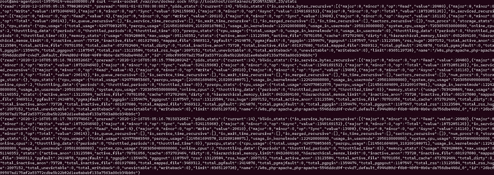**

**很多数据需要解析…我为我的容器 ID 创建了一个变量来缩短命令。**

**如你所见，你有很多选择。一般来说，人们不想走这些路线，这就是为什么像 Prometheus 这样的应用程序存在的原因——我们将在以后的文章中讨论。**

> **分析**

> **预计这个数据是平的，没有负载。**

**在运行了这个非常棒但显然并不可怕的脚本之后，我们只剩下两个文件，ioResult.txt 和 cpumemResult.txt。**

**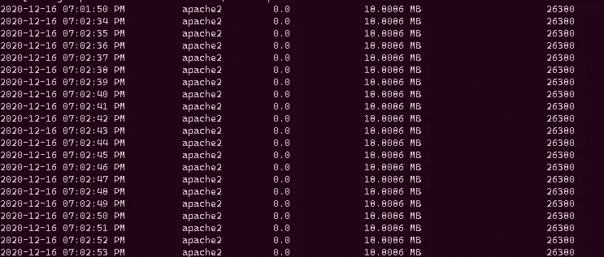**

**第二次迭代，没有真正的变化**

**现在坏消息是…我们知道我们的 ps aux 每秒钟运行 5 分钟，但它实际上排成一行了吗？这是人们通常不这样手动操作的原因之一。在我们的情况下，我们可以相对有信心，他们的球停在足够接近我们的需求。当我开始分析这个的时候会发生什么呢？**

**基本上，我在这里要做的就是将这些数据复制到 excel 中，将我想要的数据文本化到列中，然后将其绘制到图表上以供查看。这让我可以快速轻松地获取大量数据并将其可视化。**

> **CPU 和内存**

**我们希望这个数据相当平坦，因为我们的应用程序还没有真正做任何事情。我们做一些快速简单的 excel-fu 并规划出我们的用法。**

**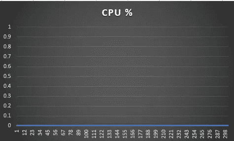**

**她平衬船长！**

**我们几乎没有 CPU 来维持应用程序的运行。我们现在没有限制，所以如果需要的话，这个应用程序可以在整个 CPU 上运行。我们在这里可以看到，它甚至没有为任何静态工作注册 1%的 CPU 时间。**

**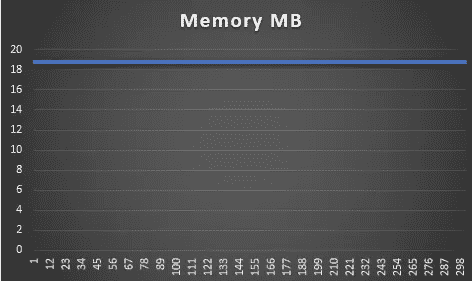**

**平平！**

**我们也希望如此。我们的应用程序没有命中它，所以我们在这里有一个相当平坦的内存足迹。18MB 也不算太寒酸。那么我们学到了什么？我们只需要很少的 CPU 和大约 18MB 的内存。**

> **磁盘分析**

**我要跳过阅读，因为没有。相反，让我们看看这 300 秒内的写入数据。**

**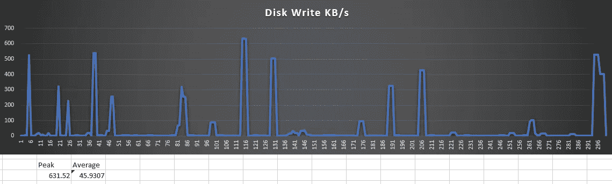**

**捕获时间越长=数据越多=模式分析越好**

**我修改了数据来绘制峰值、平均值和每秒钟，这样我们就可以看到一个趋势。现在，在 5 分钟内，除了写入活动中的短暂峰值，我们看不到太多模式。同样，对于真实的模式，你需要更多的样本来观察。我们学到了什么？我们的读取要求不是，而我们的写入平均约为 45KBps，峰值高达 631.5KBps **休息时**。**

**我们可以使用 iotop 之类的东西来更好地理解这些书写模式，但是我们将在另一篇文章中讨论这个问题。记住，性能分析就像洋葱，通常需要抽象。哦，我的虚拟机太慢了…我看到我的 CPU 被限制了…是什么限制了它…哦，一个容器…是什么导致容器加盖…等等。**

> **摘要**

**在本文中，我谈到了理解应用程序性能足迹的重要性。从 CPU 和内存到磁盘 IO，了解您的应用程序如何使用您的重要资源非常重要，以确保您可以正确构建和限制应用程序来保持其性能。**

**此外，我一步一步地研究了一种可能的方法，其中可以手动收集一些数据。使用 Excel 或其他工具，您可以轻松地将数据绘制出来，并将其可视化，以帮助您了解使用模式。我们只查看了 5 分钟的数据，在休息时，我们预计使用量持平，我们没有理由收集 24 小时的数据。采样时间越长，您对分析结果就越有信心。**

**在本系列的下一部分中，我将模拟应用程序上的各种用户负载，并再次执行相同的过程，显示应用程序在静态和各种负载下的资源消耗差异，以帮助我们了解用户请求的影响，从而允许我们智能地设置请求和限制，以防止可能导致性能下降的过饱和。**

**现在我专注于手动收集数据，这样那些不知道如何做的人可以看到你如何*可以*收集这些数据并将其可视化。除了学习之外，我不建议你使用这种方法，你也不应该依赖如此不完善的产品。在后面的文章中，我将使用产品级资源再次展示所有这些。**