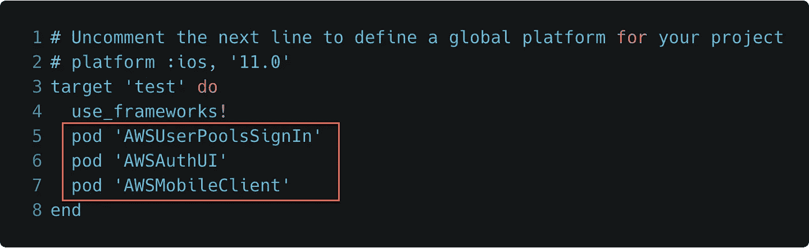

# 使用 AWS Amplify 和 Amazon Cognito 的 iOS 基本认证

> 原文：<https://itnext.io/basic-authentication-for-ios-using-aws-amplify-and-amazon-cognito-233b943222d4?source=collection_archive---------0----------------------->

*更新(2018 年 12 月 6 日):更新了客户端代码，以反映针对 iOS (2.7.0+)和 AWS Amplify 的 AWS SDK 的最新 auth 更改。嵌入的视频以一步一步的方式通过这个博客，但它没有随着 AWSMobileClient 的变化而更新。*

在我之前的[文章](/unauthenticated-access-to-aws-for-ios-apps-using-aws-amplify-cb87222eb5d)中，我谈到了 iOS 对 AWS 的未认证访问。在这种情况下，移动用户从不使用用户名/密码进行身份验证。让我们回顾一下上一篇文章中的三个概念。

**1。大多数 AWS 服务要求客户端请求用 AWS 凭证(AWS 访问密钥 ID &秘密访问密钥)签名，而不是用户名&密码。**

**2。**[Amazon cogn ITO Identity Pools](https://docs.aws.amazon.com/cognito/latest/developerguide/identity-pools.html)(联合身份)提供唯一的身份 Id(针对设备，而不是真正的用户)，并生成所需的临时、有限权限的 AWS 凭据，供 AWS SDK 用来签署对 AWS 服务的请求。

**3。**用于 iOS 的[AWS Mobile SDK](https://github.com/aws/aws-sdk-ios)在使用 Amazon Cognito Identity Pool 处理用于检索、存储和更新 AWS 凭证的身份认证令牌时，为移动开发人员完成所有工作。

这可能会让你感到惊讶，但是 app store **中的大多数移动应用并不要求**用户在使用他们的应用之前进行身份验证。

**为什么首先要强制用户进行身份验证？**

嗯，有很多原因。对每个用户的资源进行精细的访问控制，为拥有多台设备的用户提供独立的云存储/设置，在用户数据被秘密存储和访问时增加安全性，以及共享私人内容。另一方面，开发者可能不关心上述内容，而只是想在用户下载应用并注册为新用户时收集用户的个人信息，如电子邮件地址、电话号码、地址等。应用程序开发人员随后可以使用这些收集的属性，通过各种渠道(如短信和电子邮件)来吸引和留住这些应用程序用户。否则，如果用户不提供任何注册或个人信息，用户就是匿名的，除了应用内消息或推送通知，没有其他方式吸引用户。

**验证用户身份的方法**

作为移动开发人员，您有许多支持身份验证的选择。最常见的是通过用户目录提供基本的用户名/密码认证，或者通过第三方社交网络(如脸书、谷歌或 Twitter)提供认证。对于社交网络，用户直接向这些服务认证。我将在以后的文章中介绍如何使用脸书和谷歌集成 auth。

**什么是基本认证？**

基本身份验证是指用户通过提供唯一的用户名(也可以是电子邮件或电话号码)和相关密码来注册应用程序或服务，应用程序在向后端服务发出的每个签名请求中使用这些凭据。

**在你的应用中内置基本认证**

作为开发人员，在提供基本身份验证时，您必须为这些用户维护一个用户目录服务，并安全地存储密码和个人属性(电子邮件、电话等)。此外，您需要一种方法让用户重置他/她的密码，并允许管理忘记的电子邮件/用户名和/或密码的机制。幸运的是，我们有[亚马逊 Cognito 用户池](https://docs.aws.amazon.com/cognito/latest/developerguide/cognito-user-identity-pools.html)来为我们管理这一切，它可以扩展到数百万用户。千万不要自建用户目录，不值得。

**介绍 Amazon Cognito 用户池**

用户池是 Amazon Cognito 中的一个用户目录。使用用户池，您的用户可以注册并使用基本身份验证登录，用户池的所有成员都有一个目录配置文件，作为开发人员，您可以通过 AWS SDK 访问该文件。

Cognito 用户池提供:

*   注册和登录服务。
*   一个内置的、可定制的 UI，用于注册和登录用户(mobile SDK 的一部分)
*   基本身份验证，使用脸书、谷歌进行社交登录，使用亚马逊进行登录，以及从您的用户池中使用 SAML 身份提供商进行登录。
*   用户目录管理和用户配置文件。
*   多因素身份验证(MFA)、检查受损凭据、帐户接管保护以及电话和电子邮件验证等安全功能。

**从基本认证到 AWS 凭证**

在通过用户名/密码成功认证用户池用户后，Amazon Cognito 用户池发布 JSON web 令牌(JWT ),这些令牌可用于交换 Amazon Cognito 身份池(或 Cognito 联合身份)提供的 AWS 凭证。下面是从基本身份验证到访问 AWS 资源的流程。注意:作为一名 iOS 开发人员，您不需要担心会话令牌和/或 JWT，因为面向 iOS 的 AWS SDK 会为您完成所有这些工作。因此，当您听到开发人员谈论传递 JWT 时，他们可能是 JavaScript 开发人员:)


请记住，我们的移动照片共享应用程序正在连接到 AWS 后端资源，要向 AWS 发出请求，您必须提供 [AWS 凭据](https://docs.aws.amazon.com/sdk-for-java/v1/developer-guide/credentials.html)。用于基本认证的 Amazon Cognito 用户池和 Amazon Cognito 身份池允许我们采用传统的认证方法，并为那些通过认证的移动用户生成临时 AWS 凭据，以访问您的 AWS 资源。

**使用 Cognito 用户池设置电子邮件/密码认证**

在本节中，我们将使用 Amplify CLI 从本地 Xcode 项目文件夹中初始化和配置 AWS 后端资源。

**安装 Amplify CLI**

在开始之前，我们将使用 AWS Amplify CLI，它是 [AWS Amplify 工具链](https://aws-amplify.github.io/media/toolchain?utm_source=da&utm_medium=blog&utm_campaign=denhills&utm_term=ios_native)的一部分。

```
$ npm install -g @aws-amplify/cli$ amplify configure
```

这是一次性安装。查看[入门教程](https://aws-amplify.github.io/media/get_started?utm_source=da&utm_medium=blog&utm_campaign=denhills&utm_term=iOS_native)了解更多详情。

**使用 Amplify CLI 从本地项目文件夹初始化云后端**

从您的本地环境中，创建或使用您选择的现有 Xcode iOS Swift 项目(Xcode 10 和 Swift 4 是不错的选择)，然后在您的 iOS 项目文件夹的根目录中启动 Mac 终端。现在，我们将使用下面的 Amplify 命令初始化我们的 AWS 后端项目。

```
$ amplify init
```

将指导您完成设置项目的过程。**确保在适当的时候选择 iOS**。

默认情况下，Amplify CLI 会在代表您初始化后创建以下内容:

1.未设置权限的空的未经身份验证的 IAM 角色

2.未设置权限的空已验证 IAM 角色

接下来，让我们向移动项目添加经过身份验证的访问。我们将遵循 AWS 文档中的[电子邮件&密码](https://docs.aws.amazon.com/aws-mobile/latest/developerguide/add-aws-mobile-user-sign-in.html)选项选项卡中概述的相同流程。

```
$ amplify add auth
```

通过**默认**配置返回。

“ ***amplify add auth*** ”的默认配置是使用自以为是的“默认”配置设置创建一个 Cognito 用户池和 Cognito 身份池。如果你选择设置你自己的身份验证配置，选择**否**并浏览各种选项，如 MFA、验证码、短信、密码长度等。非默认选项不在本文讨论范围内，但你可以随意使用许多配置选项。

将本地配置更改推送到您的 AWS 帐户

```
$ amplify push
```

通过将此功能"***Amplify add auth****"*集成到我们的 Xcode 项目中，Amplify CLI 暂存了一个本地 Amazon CloudFormation 模板，并将其作为 CloudFormation 堆栈部署到您的 AWS 帐户，该堆栈在您的帐户上提供以下 AWS 资源:

AWS 帐户中的一个新的 **Cognito 身份池**，并将该池与现有项目的已验证和未验证 IAM 角色相关联。

您的 AWS 帐户中的一个新的**认知用户池**，并将该用户池与上述用于临时 AWS 凭证的身份池相关联。

一个新的 **awsconfiguration.json 文件**，通过“CredentialsProvider”引用您新创建的 Cognito 身份池，通过“CognitoUserPool”设置引用 Cognito 用户池。

注意:此时，经过身份验证和未经身份验证的 IAM 角色仍然没有任何关联的访问策略，因此即使您的应用程序用户通过用户名和密码注册并向 Cognito 用户池提供基本身份验证，他们也无法在您的 AWS 帐户中访问 AWS 资源。

# **在我们的 iOS 应用程序中设置授权**

我们现在将通过添加 AWS Mobile SDK 依赖项、集成 AWSMobileClient for auth 来支持我们的移动应用程序，然后实现由移动 SDK 提供的 auth UI。

**设置 AWS Mobile SDK 依赖项(Cocoapods)**

在这个例子中，我将使用 Cocoapods 进行依赖管理，因为这是目前推荐的将 AWS SDK 集成到 iOS 项目中的方法。更多关于[椰子的信息。如果你的应用程序中还没有 pod，你可以简单地运行一个 *$ pod init* ，它会为你创建一个新的 Podfile。有了 Podfile 之后，向该文件添加以下依赖项。](https://cocoapods.org/)



将 SDK 库引入您的项目:

```
$ pod install --repo-update
```

**将 *awsconfiguration.json* 文件集成到您的 iOS 项目**

当使用 AWS Amplify CLI 供应后端资源时，它会在 iOS Xcode 项目的根目录中生成一个名为 *awsconfiguration.json* 的文件。该文件包含可通过应用程序访问的资源的描述，并在 Amplify 工具链添加、更新或删除资源时与项目同步。这种配置文件的自动更新是使用 Amplify CLI 从您的本地移动开发环境中提供 AWS 资源的巨大好处之一。

> 您只需要将 awsconfiguration.json 文件添加到 Xcode 项目中一次。您可以通过将它拖到 Xcode 项目管理器中的 Finder 来完成此操作。

如果要复制文件，系统会提示您。**取消勾选复制项目框**。当情况发生变化时，AWS Amplify CLI 会更新该文件。如果您选中目标框，那么您的项目在被复制时可能不会收到更新。如果取消选中该框，则每当您通过 Amplify CLI 修改项目资源时，该文件都会更新。

**初始化视图控制器中的 AWSMobileClient**

在您希望用户注册或登录的根 UIViewController 或相关屏幕中，添加下图中引用的以下代码:

> 1.添加第 2 行的导入
> 
> 2.将**initializeAWSMobileClient()**调用添加到 viewDidLoad()的底部，如**第 9 行**所示
> 
> 3.将第 12–45 行的新函数**initializeAWSMobileClient()**添加到视图控制器中。

注意:showSignIn()函数尚不存在。我们将在下一步中添加它。


[https://gist . github . com/dennisAWS/8 FBA 1d 9 DC 738141452 ceeb 9 f 98992 f 40](https://gist.github.com/dennisAWS/8fba1d9dc738141452ceeb9f98992f40)

**实现您的注册/登录界面**

在您希望用户注册或登录的根 UIViewController 或相关屏幕中，添加下图中引用的以下代码:

> 将第 12–23 行的新函数 **showSignIn()** 添加到视图控制器中。


[https://gist . github . com/dennisAWS/30 e 43 e 3 ba 8 ab 7 df 79 a5 Fe 85973d 7543 e](https://gist.github.com/dennisAWS/30e43e3ba8ab7df79a5fe85973d7543e)

警告。需要 UINavigationController:auth UI 是 AWS Mobile SDK 的一部分，它要求您的应用程序具有 UINavigationController。

若要将 UINavigationController 添加到您的应用程序(如果不存在):

> 将 UINavigationController 添加到您的 iOS 应用程序:从您的 Xcode 项目中，选择 Storyboard 中的 ViewController，然后选择菜单选项:
> 
> *编辑*->-*嵌入*->-*导航控制器。*

**构建并运行你的应用**

您应该看到 AWS SDK 为您的应用程序预建的登录 UI，因为用户最初没有经过身份验证。iOS SDK 提供了一个标准的默认 UI，允许用户**注册(注册)**，触发“**忘记密码**功能，当然还有内置的**登录**功能以及默认用户名/电子邮件和密码字段。对于测试，注册一个新用户，然后使用注册的用户名(或电子邮件)和密码验证该用户。一旦用户通过了身份验证，UI 对话框将会消失，您现在应该会看到视图控制器屏幕。

此时，应用程序用户已经通过身份验证。恭喜你！

等等，还记得与我们的 Cognito 身份池相关联的未经身份验证和经过身份验证的 IAM 角色吗？好了，现在用户已经过身份验证，用户**承担了经过身份验证的 IAM 角色**，并被授予了与该角色相关的权限，但是，该角色仍然有一个空的访问策略。应用程序中的 *showSignIn()* 函数有一个 print 语句，其中包含确认成功或失败登录的详细信息，因此即使您没有调用除 Cognito 之外的 AWS 服务，您仍然可以验证所有设置是否正确。了解更多关于[编辑 IAM 策略](https://docs.aws.amazon.com/IAM/latest/UserGuide/access_policies_manage-edit.html)的信息。

**最终想法**

如果您选择强制移动用户进行身份验证或不进行身份验证，Amazon Cognito 是连接到 AWS 资源的所有移动应用程序的已验证和未验证流的默认选择。如果您不需要登录，请使用 Cognito 联合身份( **Cognito 身份池**)，如果您通过用户名(或电子邮件)和密码进行身份验证，即基本身份验证，请使用 **Amazon Cognito 用户池**。对于经过身份验证的用户，用户池会将经过身份验证的用户令牌传递到您的 Cognito 身份池，以换取该用户调用您的 AWS 资源的临时 AWS 凭据。然后，用户访问由 **IAM 认证角色**定义。如果用户不进行身份验证，Cognito 身份池仍然授予 AWS 凭证，并且用户的访问由 **IAM 未验证角色**定义。

在接下来的文章中，我们将通过脸书和谷歌讨论社交认证。我们仍将使用 Cognito 身份池，但将 Cognito 用户池替换为社交身份提供者。无论是哪种情况，AWS Mobile SDK 都会处理将 auth 令牌传递给我们的身份池。

**资源**

[AWS 放大器](https://aws-amplify.github.io/media/toolchain?utm_source=da&utm_medium=blog&utm_campaign=denhills&utm_term=ios_native)

[亚马逊认知用户群](https://docs.aws.amazon.com/cognito/latest/developerguide/cognito-user-identity-pools.html)

[亚马逊认知身份池](https://docs.aws.amazon.com/cognito/latest/developerguide/cognito-identity.html)(又名认知联合身份)