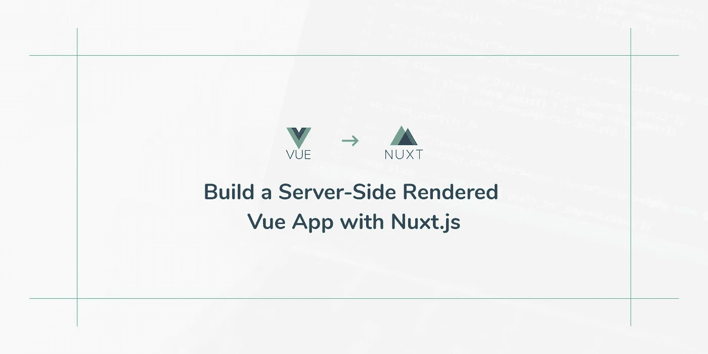
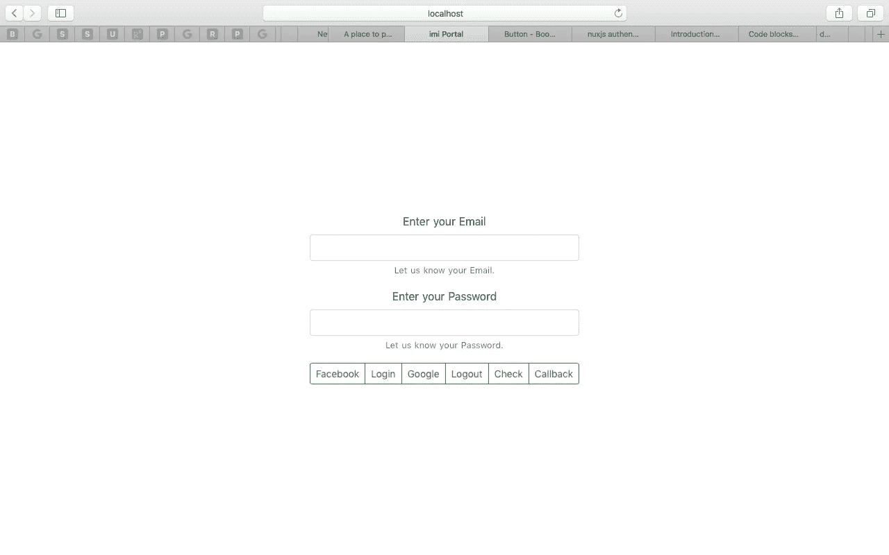
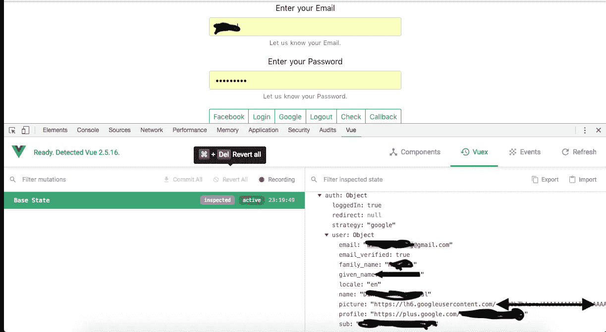
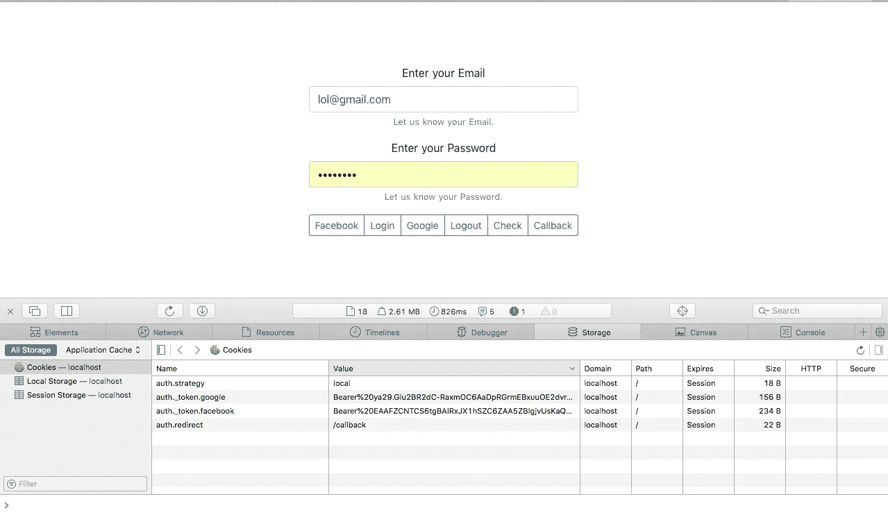
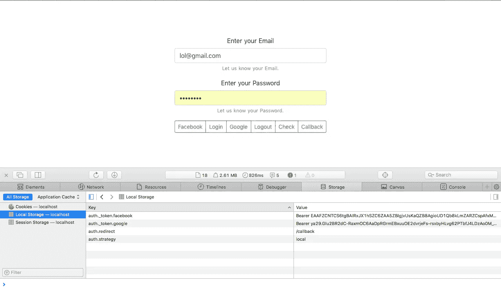

# 使用 auth.nuxt.js 的基本身份验证

> 原文：<https://itnext.io/basic-authentication-using-auth-nuxt-js-e140859ab4c3?source=collection_archive---------0----------------------->



[来源](https://cdn.scotch.io/38945/g8Bvdn8RQDxUZ2YTTZwC_Build%20a%20Server-Side%20Rendered%20Vue%20App%20with%20Nuxt.js.png.jpg)

# 介绍

最近，我知道了一种使用 nuxt js 提供的“auth-module”通过认证的简单方法。你可以在 https://auth.nuxtjs.org[的](https://auth.nuxtjs.org)看看这个模块。他们提供了一些例子，但这是我如何实现。

要开始，您必须安装几个模块，包括 vue-cli 模块。

```
npm install -g vue-cli
```

安装 vue-cli 后，您可以从 nuxtjs 提供的样板代码开始。只需输入下面的命令，并改变项目的名称。

```
vue init nuxt-community/starter-template <project-name>
```

CD 放入项目目录，然后进行 npm 安装或 yarn 安装。要开始这个项目，你可以做一个 npm 运行开发。所有可以使用的命令在 package.json 文件中的“scripts”下有明确的说明

```
{
 "scripts": {
     "dev": "nuxt",
     "build": "nuxt build",
     "start": "nuxt start",
     "generate": "nuxt generate",
     "lint": "eslint --ext .js,.vue --ignore-path .gitignore .",
     "precommit": "npm run lint"
  }
}
```

现在我们的基础项目设置已经完成。

## auth.nuxtjs 入门

要开始，您需要安装以下软件包。

```
npm install --save [@nuxtjs/auth](http://twitter.com/nuxtjs/auth) [@nuxtjs/axios](http://twitter.com/nuxtjs/axios) [@nuxtjs/toast](http://twitter.com/nuxtjs/toast) bootstrap-vue
```

我为这个教程选择了 [boostrap-vue](https://bootstrap-vue.js.org) ()。如果你需要，你可以使用 [vuetify](https://vuetifyjs.com/en/) 或者任何其他的 UI 框架。记得用基于 [@nuxtjs](http://twitter.com/nuxtjs) 版本的 axios。

好的。现在我们必须配置每个包来使用 nuxt js。所以我们从 auth 开始吧。转到项目根目录下的 nuxt.config.js。

1.  添加相关模块

```
modules: [
    '[@nuxtjs/axios](http://twitter.com/nuxtjs/axios)',
    '[@nuxtjs/auth](http://twitter.com/nuxtjs/auth)',
    '[@nuxtjs/toast](http://twitter.com/nuxtjs/toast)',
    'bootstrap-vue/nuxt'
],
```

2.添加 toast 消息配置

```
toast: {
    position: 'top-right',
    duration: 2000
  }
```

3.添加 axios baseURL。这将是您的 API 基本 url

```
axios: {
 baseURL: ‘[http://192.168.8.141:5000/api/v1'](http://192.168.8.141:5000/api/v1')
 },
```

4.让我们开始装货吧

```
loading: {
    name: 'chasing-dots',
    color: '#ff5638',
    background: 'white',
    height: '4px'
 },
```

5.最后，添加最重要的授权模块配置

```
auth: {
    strategies: {
      local: {
        endpoints: {
          login: {url: '/user/login', method: 'post', propertyName:    'token' },
          logout: false,
          user: {url: '/user/user', method: 'get', propertyName: 'data'},
        },
        tokenRequired: true,
        tokenType: 'Bearer'
      },
      facebook: {
        client_id: 'your facebook app id',
        userinfo_endpoint: '[https://graph.facebook.com/v2.12/me?fields=about,name,picture{url},email'](https://graph.facebook.com/v2.12/me?fields=about,name,picture{url},email'),
        scope: ['public_profile', 'email']
      },
      google: {
        client_id: 'your gcloud oauth app client id'
      },
    },
    redirect: {
      login: '/?login=1',
      logout: '/',
      user: '/profile',
      callback:'/'
    }
```

好了，我们来一个一个的过一遍上面的配置。[ local，facebook，google，twitter，github oAuth ]是 auth.nuxtjs 模块中包含的身份验证策略。除此之外，您还可以向配置中添加自定义策略。请参考 [*auth.nuxtjs*](http://auth.nuxtjs.org) 配置。

如果你看一下*本地策略，*有一个字段叫做**端点**。**登录**端点指的是您的 API 的认证路由。**方法**参数是一个 POST，**属性名**表示访问令牌出现在响应中的位置。作为参考，这是在 auth.nuxtjs 模块中设置 **propertyName** 的方式。

```
// Taken from the nuxt-authreturn this.ctx.app.$axios
      .request(_endpoint)
      .then(response => {
        if (_endpoint.propertyName) {
          return getProp(response.data, _endpoint.propertyName)
        } else {
          return response.data
        }
      })
```

我遇到了一个问题。auth token 是作为一个头参数出现的，我想不出解决这个问题的方法。所以我改了 API。如果你找到了解决这个问题的方法，请在评论中提及。

然后，您可以使用 **logout** 字段来定义 API 的注销 url。因为 REST 是无状态的，所以我们不需要它。**用户**参数帮助检索登录时的用户信息。您还可以定义**令牌类型**“载体”，然后它将被添加到 auth 令牌的前面。

然后我们来过一遍 **facebook** auth 策略。这里你只需要定义**范围**、 **clientId** 和 **loginurl** 。我用过 facebook API 版，但它很快就会被弃用。谷歌、推特和 github 也是如此。

然后你必须指定*重定向*URL。因此，在那里，您可以指定注销页面 url、用户资料 url 和将在社交登录中使用的回拨 url。因此，如果你有自己的授权流，回调 url 将帮助你用 API 生成的令牌交换社交登录令牌。Nuxt 可以使用下面的代码监听 url 参数。

```
watch: {
    $route() {
      //do something with the url params set
    }
  },
```

最后，我将在 github 中包含 soucecode，这样您就可以看到我对 url 参数做了什么。哦！还有最后一件事，别忘了在***/store***director 下创建 index.js 文件来激活 Vuex 商店。

# 示例用户界面



我们在做什么

让我们构建一个示例 ui 来测试配置。删除内页 *index.vue* 中的所有默认代码，现在你的 *index.vue* 应该是这样的。

```
<template>
  <section class="container">
    <div></div>
  </section>
</template>
```

然后让我们创建一个**漂亮的** ***窗体*** 。只需*复制并粘贴*下面给出的代码。

```
<template>
 <section class="container">
     <div>
       <b-form>
         <b-form-group  description="Let us know your Email." label="Enter your Email" label-for="username">
           <b-form-input id="username" v-model="email" type="email" required></b-form-input>
         </b-form-group>
         <b-form-group  description="Let us know your Password." label="Enter your Password" label-for="pw">
           <b-form-input id="pw" v-model="password" type="password"> </b-form-input>
         </b-form-group>
         <b-button-group size="sm">
             <b-button [@click](http://twitter.com/click)="facebook" variant="outline-success">Facebook</b-button>
             <b-button [@click](http://twitter.com/click)="login" variant="outline-success">Login</b-button>
             <b-button [@click](http://twitter.com/click)="google" variant="outline-success">Google</b-button>
             <b-button [@click](http://twitter.com/click)="logout" variant="outline-success">Logout</b-button>
             <b-button [@click](http://twitter.com/click)="check" variant="outline-success">Check</b-button>
             <b-button to="/callback" variant="outline-success">Callback</b-button>
           </b-button-group>
       </b-form>
     </div>
    </section>
</template><script>export default {
 data() {
     return {
       email:'',
       password:''
     }
   },
  mounted() {},
  watch: {},
  components: {},
  methods: {
   google(){},
   facebook(){},
   login(){},
   logout(){},
   check(){},
  } 
}</script><style>.container {
   min-height: 100vh;
   display: flex;
   justify-content: center;
   align-items: center;
   text-align: center;
 }</style>
```

下面给出了方法定义

```
google()- Google Login
facebook()- Facebook Login
login()- Local Authentication
logout() — Logout function
check() — Check whether the user is logged in or now. Check the console for the output
```

注意，我已经使用 bootstrap-vue 构建了表单。现在我们到了最后一步。让我们创建登录所需的方法。

```
async google(){
      await this.$auth.loginWith('google').catch(e => {
        this.$toast.show('Error', {icon: "fingerprint"});
      })
    },
    async facebook(){
       await this.$auth.loginWith('facebook').catch(e => {
        this.$toast.show('Error', {icon: "fingerprint"});
      })},
    async login() {
      try {
        this.$toast.show('Logging in...', {icon: "fingerprint"});
        await this.$auth.loginWith('local', {
          data: {
            "email": this.email,
            "password": this.password
          }
        }).catch(e => {
          this.$toast.error('Failed Logging In', {icon: "error_outline"});
        });if (this.$auth.loggedIn) {
          this.$toast.success('Successfully Logged In', {icon: "done"});
        }
      } catch (e) {        
          this.$toast.error('Username or Password wrong', {icon: "error"});
      }
    },
    check(){
      console.log(this.$auth.loggedIn)
    },
    logout() {
      this.$toast.show('Logging out...', {icon: "fingerprint"});
      this.$auth.logout()
    },
```

我曾使用谷歌材料图标作为吐司图标。您只需将材料图标 cdn 放在标题字段的**链接**下。现在我们差不多完成了。要检查您是否已登录，请使用控制台。检查**cookie**、**本地存储**。设置所有这些事情都是由 nuxt-auth 模块本身自动完成的。



使用 Gmail 登录后的 Vuex 商店



饼干



使用 Gmail 登录后的本地存储

在页面内创建一个名为 **callback.vue** 的页面，并添加以下代码。

```
<template>
  <div>
    <h1>You are Secure</h1>
    <b-button to="/" variant="success">Callback</b-button>
  </div>
</template>
<script>export default {
    middleware: ['auth']
  }</script><style scoped></style>
```

请注意，我添加了一个名为['auth']的新中间件。Nuxt-auth 模块会自动为你创建一个中间件，这样你就不用自己写中间件在重定向到页面之前检查你是否通过了身份验证。本教程到此结束。当我有时间的时候，我会做更多的 nuxt 教程。保持联系，❤。特别感谢 [Rooshan Akthar](https://medium.com/u/e226e30be934?source=post_page-----e140859ab4c3--------------------------------) 向我介绍 auth.nuxt.js