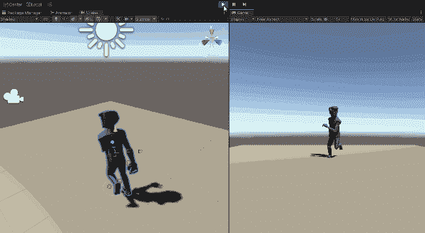
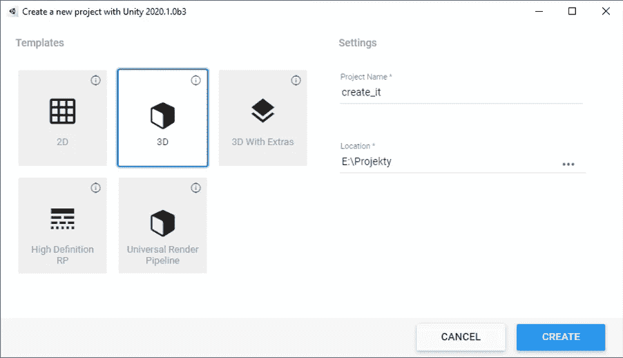
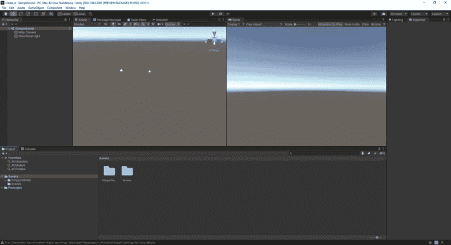
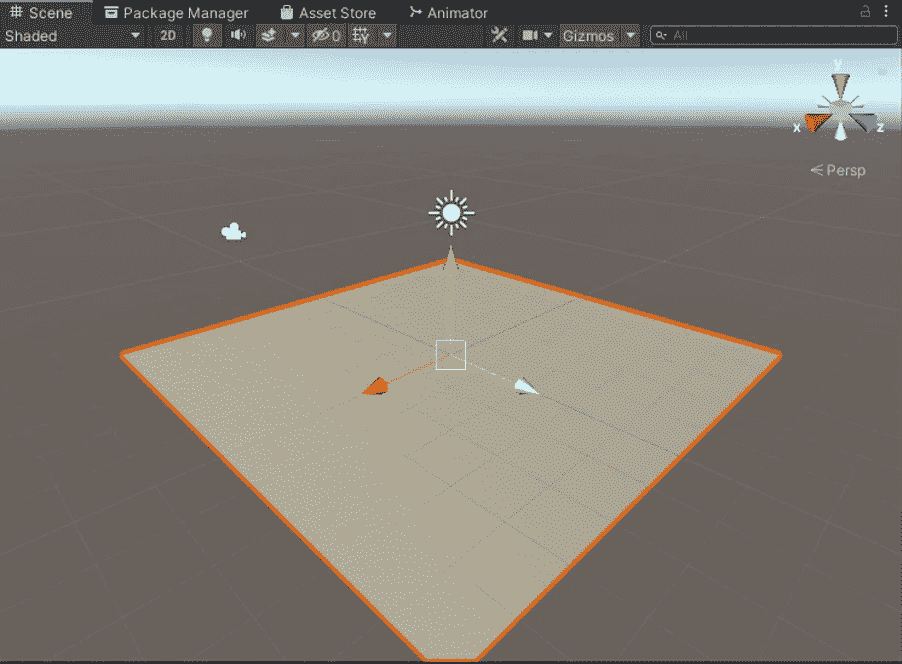
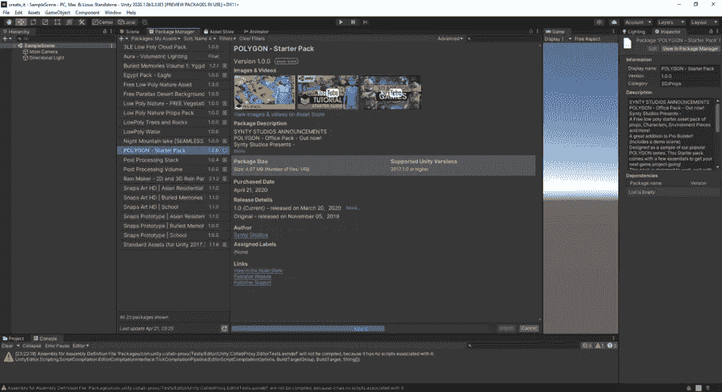
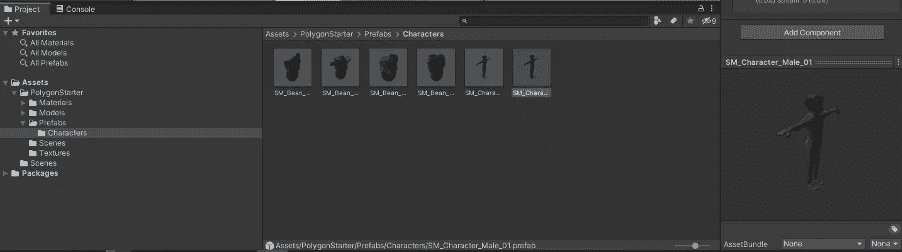
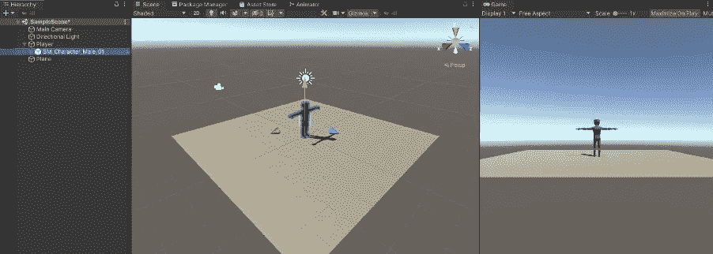
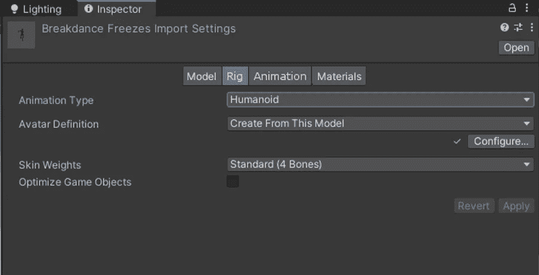
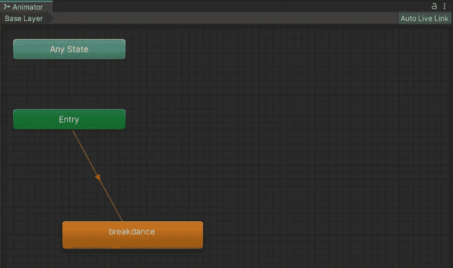
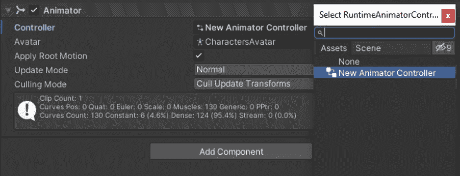

# (第一部分)Unity 中 3D 动画的基础

> 原文：<https://itnext.io/basics-of-3d-animation-in-unity-tutorial-d2d6ff3bc6b7?source=collection_archive---------2----------------------->

这是一个新游戏开发系列的开始。我将向你展示使用 Unity 游戏引擎的基础知识。Unity 主要用于游戏开发(如 Inside、Cuphead 和 Hollow Knight 等游戏)、电影 CGI 场景和动画电影。

这一部分是关于为你的模型使用动画的基础。我们将创造这个场景:

首先，我创建一个新的 3D 项目:

Unity 有以下默认布局。左侧窗口用于 3D 操作，右侧窗口显示摄像机投影。在左边的面板中你可以操作所有的游戏对象，右边的面板用于配置。您可以找到导入的源、模型、动画、声音等。在底部面板中。

首先我创建一个三维物体，所谓的“平面”(*游戏物体——三维物体——平面)。*

它将作为 3D 模型的“地板”,因此它不会在无限的游戏空间中掉落。Unity 利用经典的 3D 操作控件进行移动、旋转和缩放。

现在我需要得到一些三维模型。我将使用免费的[多边形启动包](https://assetstore.unity.com/packages/3d/props/polygon-starter-pack-156819)，它包含了基本的模型和环境。可以通过*包管理器导入 unity。*所有添加到网络界面的包都通过你的账户同步到 Unity。

接下来，我创建一个空对象，它将作为 3D 动画模型的父对象。对象将被粘贴在空间的正中央，坐标(0，0，0)，游戏空间的中心。

为了保持整洁，我将该对象重命名为“Player”。在资产浏览器窗口中，我在多边形启动包中搜索 *SM_Character_Male_01* 。

然后我将这个模型拖到左边的对象浏览器中，右边的是玩家*对象。*

我现在需要做的就是添加动画。我没有设备或时间自己制作这个模型的动画，所以我使用网络[mixamo.com](https://www.mixamo.com/)，在那里我下载了一个[霹雳舞动画](https://www.mixamo.com/#/?page=1&query=breakdance)。你可以在这里找到各种游戏动画——玩家死亡、行走、奔跑、出拳等。

下一步是将动画导入 Unity。在资源管理器中，我*(右击* - *导入新资源)*，我还创建了*动画控制器* ( *右击-创建-动画控制器*)。

然后，我选择动画，并改变其参数，所以我可以操纵它。我将类型设置为*人形*和*应用*。我还将其重命名为*霹雳舞(在*的*动画*标签中)。

然后我只要选择新的*动画控制器*，把*霹雳舞*动画拖到刚刚弹出的*动画师*窗口。它自动连接到*入口*状态。

你现在需要做的就是把这个*动画控制器*附加到角色对象上( *Animator 组件*)，按下 Play，动画就完成了！

这个系列的下一部分是关于在 Unity 中控制 3D FPS 角色的基础知识。

如果你刚刚开始学习如何开发游戏，你可以关注我的关于 Unity 初学者开发的 Skillshare 课程:

 [## 完整指南:Unity 2020 中的动作恐怖 3D 游戏

### 解锁无限制访问此技能共享课程以及由来自世界各地的创作者讲授的数千门课程…

www.skillshare.com](https://www.skillshare.com/tedx?teacherRef=896200912&via=teacher-referral&utm_campaign=teacher-referral&utm_source=ShortUrl&utm_medium=teacher-referral&t=Complete-guide-Action-horror-3D-game-in-Unity-2020&sku=418230537)