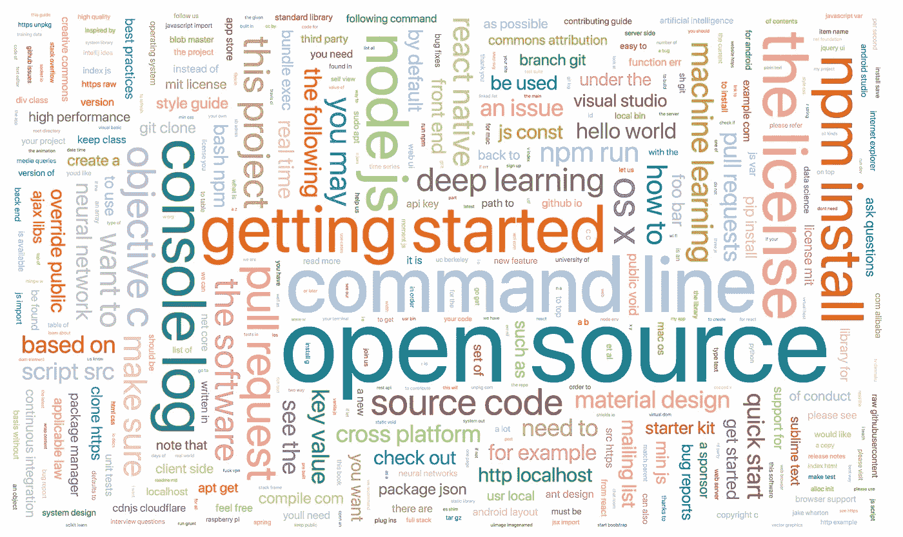
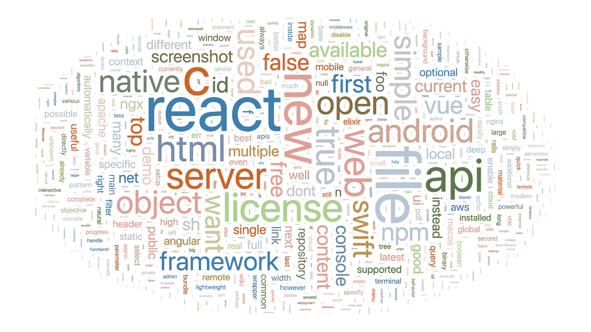
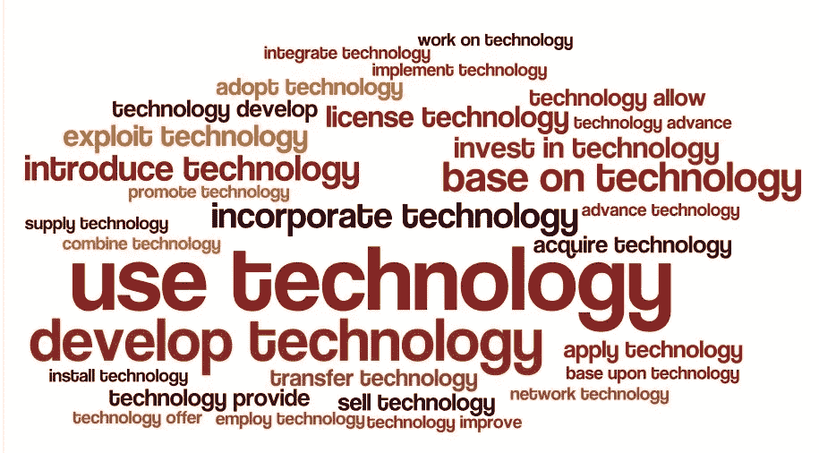
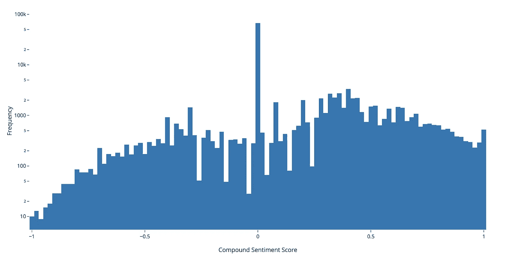

# 文本分析和可视化基础

> 原文：<https://itnext.io/basics-of-text-analysis-visualization-1978de48af47?source=collection_archive---------0----------------------->



由前 2000 个 GitHub 存储库的 READMEs 组成的二元标记云

> 好的软件是平易近人的、一致的、自我解释的、可教人的，并且是为人类服务的——[**迈克·博斯托克**](https://medium.com/@mbostock/what-makes-software-good-943557f8a488)

作为一名 UX 工程师，我为用户考虑了很多。当编写软件时，用户的需求是最重要的。然而，我经常使用、贡献和编写开源软件。**开源项目在设计时也需要考虑到他们的用户、*其他开发者*。**

先前，我讨论了一个旨在调查软件工程师描述他们工作的方式的项目。目标是通过理解如何描述好的软件来理解是什么造就了好的软件。我对“好”的定义是评价很高或者盯着看。

我搜集了 GitHub 上前 2000 个知识库的阅读材料，并可视化了出现频率最高的单词。虽然我不是数据科学家，但我经常分析和可视化数据集，并希望分享这个项目的结果和发现。

关于初始结果和上下文，请参见[开源单词](https://medium.com/@tbarrasso/open-source-words-part-2-ce1077305a32) [—](https://medium.com/@tbarrasso/open-source-words-part-1-72f059c2730) [第 3 部分](https://medium.com/@tbarrasso/open-source-words-part-2-ce1077305a32)

有关提取和清理的更多信息，请参见[开源单词—第 1 部分](https://medium.com/@tbarrasso/open-source-words-part-1-72f059c2730)

# 标签云

最简单和最常见的文本可视化形式是[标签(或单词)云](https://en.wikipedia.org/wiki/Tag_cloud)。它们描绘了根据标签频率、分类或重要性在空间中排列的不同大小、颜色和位置的**标签**。



来自 2000 个 GitHub 知识库的 READMEs 的 Word cloud

在这个简单的例子中，颜色和位置是任意的，但是字体大小根据词频而变化。因为即使计数也很复杂，更具体地说，这些单词的大小根据**总词频**而非唯一词频(每个文档计数一次)而变化。

```
import ntlkunique_frequencies = dict()
total_frequencies = dict()for readme in reasmes:
    words = nltk.word_tokenize(readme)
    fdist = nltk.FreqDist(words)
    for word, freq in fdist.most_common(50):
        total_frequencies[word] += freq # total count
        unique_frequencies[word] += 1 # unique count
```

这是一个统计数据集中单词的总频率和唯一频率的示例。Tim Strehle 有一个更加全面的例子，包括大小写规范化、标记化、词性标注，以及删除 T2 停用词、标点符号等。在分析之前，这种类型的清理通常是必要的。

# 搭配云



[Wordle](http://www.wordle.net/) 来自 [Nik 的 QuickShout](https://quickshout.blogspot.com/2011/11/on-surface-of-it-just-word-looks-just.html) 的双字母云

搭配云是标签云的另一种变体，它将经常搭配的特定单词可视化(发现它们紧挨着彼此)。它们属于 N 元问题的一般类别，最常见的例子是二元问题(两个)和三元问题(三个)。

n 元语法在基因组学中有许多应用，并用于语法校正和文本压缩的算法中。上面的英雄图像是 README 数据集中最常见的单词对的双字母组合。

```
import nltk
from nltk.collocations import BigramCollocationFinder, BigramAssocMeasuresbi_dict = dict()
bg_measures = BigramAssocMeasures()for readme in readmes:
    words = nltk.word_tokenize(readme)
    bi_finder = BigramCollocationFinder.from_words(words)
    bi_collocs = bi_finder.nbest(bg_measures.likelihood_ratio, 10) for colloc in bi_collocs:
        bi_dict[colloc] += 1
```

上面是一个使用 [nltk](https://www.nltk.org/) (自然语言工具包)将文本数据集处理成二元语法的例子。

# 情感分析



[VADER 情感分析](https://github.com/cjhutto/vaderSentiment)，来自 2000 个阅读量的句子的复合得分分布；1 为正，-1 为负

情感分析是基于作者对主题的态度对文本进行计算分类的过程。在评论线程等社交媒体上，这对于了解用户对产品的评价是正面的、负面的还是中性的非常有用。它广泛适用于机器学习分类算法，并且在使用相关数据集进行训练时效果最佳。

出于学习的目的，我使用了 VADER 情感分析，因为它与 nltk 打包在一起。“VADER”是一个词汇和基于规则的情绪分析工具，专门针对社交媒体中表达的情绪以下是在 Python 中使用 VADER 的示例:

```
import nltk
from nltk.sentiment.vader import SentimentIntensityAnalyzersid = SentimentIntensityAnalyzer()
sentiment_summary = dict()for readme in readmes:
    sentences = nltk.tokenize.sent_tokenize(readme)
    for sentence in sentences:
        sentiment_score = sid.polarity_scores(sentence) if sentiment_score["compound"] == 0.0:
            sentiment_summary["neutral"] += 1
        elif sentiment_score["compound"] > 0.0:
            sentiment_summary["positive"] += 1
        else:
            sentiment_summary["negative"] += 1
```

在上图中，将近 2，000 个 READMEs 被标记为超过 120，000 个句子，综合得分为 0.143。一种解释可能是，**平均来说，开发人员积极地谈论他们的库和项目。**然而，将近一半的复合得分是中性的，这表明开发者在写作时没有归因于情感。

值得注意的是，这些结果远非结论性的，特别是在缺乏相关训练集和依赖社交媒体语料库的情况下。这只是为了说明的目的。虽然我不认为这个分析是正确的，但我确实觉得它很有趣。这是一个带有强烈否定句(`compound < -0.95`)的例句:

> 如果问题仍未解决，请参阅常见问题指南:屏蔽无法安装:卷曲错误权限被拒绝错误校验和不匹配错误来源不存在错误参数数量错误未列出原因卸载错误地将屏蔽报告为未安装错误:未知命令:屏蔽错误我的问题未列出请求屏蔽请求将自动关闭。

我的假设是，像*失败、*和*错误*这样的词负责将这个例子归类为强烈否定。

更多信息，请参见[NLTK/VADER 的情感分析](https://medium.com/@sharonwoo/sentiment-analysis-with-nltk-422e0f794b8)

# 其他分析

本文没有涉及[主题建模](https://en.wikipedia.org/wiki/Topic_model)、[总结](https://machinelearningmastery.com/gentle-introduction-text-summarization/)、[主题识别](https://medium.com/@acrosson/extract-subject-matter-of-documents-using-nlp-e284c1c61824)、[词干提取](https://en.wikipedia.org/wiki/Stemming)、[实体识别](https://en.wikipedia.org/wiki/Named-entity_recognition)等诸多主题。

无论是使用这个 README 数据集，还是其他数据集，我都打算继续探索数据科学和可视化的其他领域。随着我的学习，我会在[媒体](https://medium.com/@tbarrasso)上分享我的过程和结果，以及在 [GitHub](https://github.com/Tombarr) 上分享数据和源代码。

对于自然语言处理方法、可视化和示例的全面概述，我推荐以下资源:

*   [文本挖掘和可视化](https://doc.lagout.org/Others/Data%20Mining/Text%20Mining%20and%20Visualization_%20Case%20Studies%20using%20Open-Source%20Tools%20%5BHofmann%20%26%20Chisholm%202015-12-18%5D.pdf)
*   [理解终极指南&实现自然语言处理](https://www.analyticsvidhya.com/blog/2017/01/ultimate-guide-to-understand-implement-natural-language-processing-codes-in-python/)
*   [维基百科:自然语言处理](https://en.wikipedia.org/wiki/Natural_language_processing)