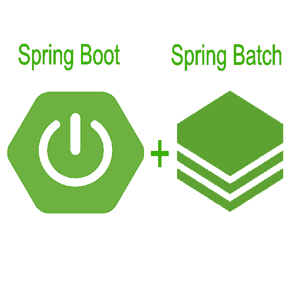
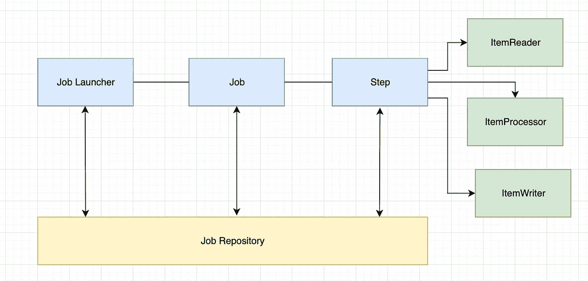
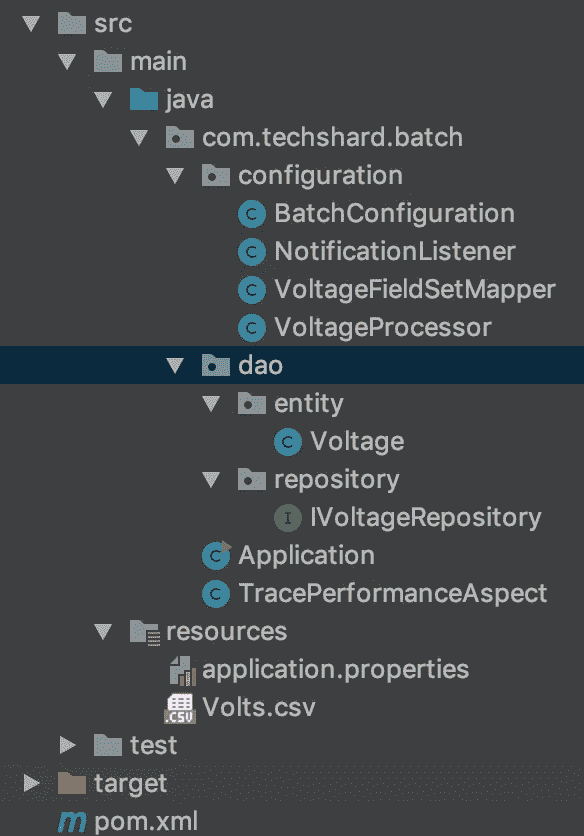
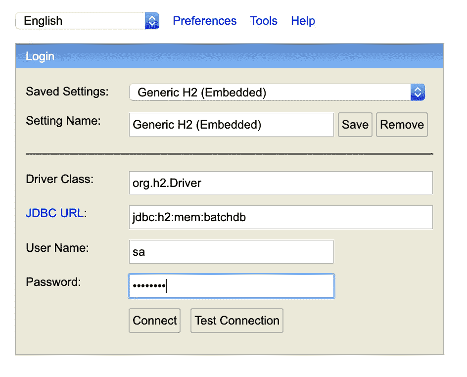
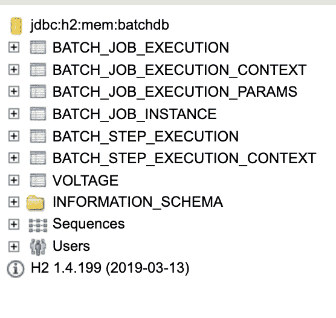

# 用 Spring Boot 和 Spring 批处理大数据集

> 原文：<https://itnext.io/batch-processing-large-data-sets-with-spring-boot-and-spring-batch-80b8f8c2411e?source=collection_archive---------0----------------------->

数据的批处理是处理大量数据的有效方式，其中数据被收集、处理，然后产生批处理结果。批处理可以应用在许多用例中。批处理的一个常见用例是将大量的平面、CSV 或 JSON 文件转换成结构化格式，以便于进一步处理。



Spring Boot 和春季批次

在本文中，我将使用 Spring 的一个项目 Spring Batch 来演示批处理。Spring Batch 提供了在批处理作业中处理大量数据的功能。这包括日志记录、事务管理、作业重启(如果作业未完成)、作业跳过、作业处理统计和资源管理。

让我们简单地看看 Spring Batch 是如何工作的。



春季批次概述

一个*步骤*是一个对象，它封装了一个作业的连续阶段，并保存了定义和控制处理的所有必要信息。它将所有信息委托给一个作业来执行它的任务。

Spring Batch 使用面向块的处理方式，一次读取一个数据，并创建将在事务中写出的*块*。项目由*项目阅读器*读取，并传递到*项目处理器*，然后一旦项目准备好，就由*项目写入器*写出。作业存储库将用于在项目处理期间定期存储步骤执行。

让我们开始编码吧。

# 设置项目

创建一个示例 Spring Boot 应用程序。这是我的示例项目结构。



项目结构

在本文中，我将使用代表放电电容压降的样本数据。我们将从 CSV 文件中读取这些数据，并将其写入内存中的数据库，即 H2。

将所需的依赖项添加到 *pom.xml.*

```
<dependency>
            <groupId>org.springframework.boot</groupId>
            <artifactId>spring-boot-starter-web</artifactId>
        </dependency>
        <dependency>
            <groupId>org.springframework.boot</groupId>
            <artifactId>spring-boot-starter-aop</artifactId>
        </dependency>
        <dependency>
            <groupId>org.springframework.boot</groupId>
            <artifactId>spring-boot-starter-batch</artifactId>
        </dependency>
        <dependency>
            <groupId>org.springframework.boot</groupId>
            <artifactId>spring-boot-starter-data-jpa</artifactId>
        </dependency>
        <dependency>
            <groupId>com.h2database</groupId>
            <artifactId>h2</artifactId>
            <scope>runtime</scope>
        </dependency>
        <dependency>
            <groupId>org.slf4j</groupId>
            <artifactId>slf4j-api</artifactId>
        </dependency>
```

CSV 文件 *Volts.csv* 包含两个字段 *volt* 和 *time。*让我们创建一个名为*电压*的 JPA 实体。请注意，这个实体仅用于示例。它不是生产就绪代码。

```
package com.techshard.batch.dao.entity;import javax.persistence.*;
import javax.validation.constraints.NotNull;
import java.math.BigDecimal;@Entity
public class Voltage { @Id
    @Column (name = "ID", nullable = false)
    @GeneratedValue (strategy = GenerationType.IDENTITY)
    private long id; @NotNull
    @Column (name = "volt", precision = 10, scale = 4, nullable = false)
    private BigDecimal volt; @NotNull
    @Column (name = "time", nullable = false)
    private double time; public Voltage() {
    } public Voltage(final BigDecimal volt, final double time) {
        this.volt = volt;
        this.time = time;
    } public long getId(){
        return id;
    } public BigDecimal getVolt(){
        return volt;
    } public void setVolt(final BigDecimal volt){
        this.volt = volt;
    } public double getTime(){
        return time;
    } public void setTime(final double time){
        this.time = time;
    }
}
```

# 批量配置

让我们创建一个批处理配置类:

```
@Configuration
@EnableBatchProcessing
public class BatchConfiguration {
}
```

@EnableBatchProcessing 启用 Spring 批处理特性，并为在@Configuration 类中设置批处理作业提供基本配置。

我们需要在上面的类中包含两个组件。

```
 @Autowired
    public JobBuilderFactory jobBuilderFactory; @Autowired
    public StepBuilderFactory stepBuilderFactory;
```

*JobBuilderFactory* 创建一个作业生成器。使用 *StepBuilderFactory* ，Spring Batch 将创建一个步骤构建器，并初始化它的作业存储库和事务管理器。

# 配置 ItemReader

我们现在将为我们的模型*电压*定义 *ItemReader* 接口，它将用于从 CSV 文件中读取数据。

```
@Bean
    public FlatFileItemReader<Voltage> reader() {
        return new FlatFileItemReaderBuilder<Voltage>()
                .name("voltItemReader")
                .resource(new ClassPathResource("Volts.csv"))
                .delimited()
                .names(new String[]{"volt", "time"})
                .lineMapper(lineMapper())
                .fieldSetMapper(new BeanWrapperFieldSetMapper<Voltage>() {{
                    setTargetType(Voltage.class);
                }})
                .build();
    }
```

这里，我们正在创建模型*电压的 FlatFileItemReaderBuilder。*

*名称*—*阅读器的名称*

*资源* —指定要读取的资源文件的路径。

*delimited —* 构建分隔符号化器。

*名称—* 传递要读取的字段

*lineMapper* —将行从文件映射到域对象的接口。

*fieldSetMapper —* 将从字段集中获取的数据映射到对象的接口。

注意，我们已经通过了上面的 custom *lineMapper()* 。让我们来定义这个 bean。

```
@Bean
    public LineMapper<Voltage> lineMapper() { final DefaultLineMapper<Voltage> defaultLineMapper = new DefaultLineMapper<>();
        final DelimitedLineTokenizer lineTokenizer = new DelimitedLineTokenizer();
        lineTokenizer.setDelimiter(";");
        lineTokenizer.setStrict(false);
        lineTokenizer.setNames(new String[] {"volt","time"}); final VoltageFieldSetMapper fieldSetMapper = new VoltageFieldSetMapper();
        defaultLineMapper.setLineTokenizer(lineTokenizer);
        defaultLineMapper.setFieldSetMapper(fieldSetMapper); return defaultLineMapper;
    }
```

在自定义 *lineMapper* 中，我们可以指定从 CSV 文件中读取的分隔符，也用于将字符串值读入数据库特定数据类型。 *VoltageFieldSetMapper* 定义如下:

```
package com.techshard.batch.configuration;import com.techshard.batch.dao.entity.Voltage;
import org.springframework.batch.item.file.mapping.FieldSetMapper;
import org.springframework.batch.item.file.transform.FieldSet;
import org.springframework.stereotype.Component;@Component
public class VoltageFieldSetMapper implements FieldSetMapper<Voltage> { @Override
    public Voltage mapFieldSet(FieldSet fieldSet) {
        final Voltage voltage = new Voltage(); voltage.setVolt(fieldSet.readBigDecimal("volt"));
        voltage.setTime(fieldSet.readDouble("time"));
        return voltage; }
}
```

# 正在配置项目处理器

我们将按如下方式定义批处理配置中的处理器:

```
 @Bean
    public VoltageProcessor processor() {
        return new VoltageProcessor();
    }
```

我们定义了一个定制处理器 *VoltageProcessor。*一旦数据被读取，该处理器用于处理数据，如数据转换、应用业务逻辑等。这只是一个例子。这种定制处理器并不总是必需的。它可以根据您的应用需求进行定义。

```
package com.techshard.batch.configuration;import com.techshard.batch.dao.entity.Voltage;import org.springframework.batch.item.ItemProcessor;import java.math.BigDecimal;public class VoltageProcessor implements ItemProcessor<Voltage, Voltage>{ @Override
    public Voltage process(final Voltage voltage) {
        final BigDecimal volt = voltage.getVolt();
        final double time = voltage.getTime(); final Voltage processedVoltage = new Voltage();
        processedVoltage.setVolt(volt);
        processedVoltage.setTime(time);
        return processedVoltage;
    }
}
```

# 项目作者

一旦数据被处理，数据需要按照我们的要求存储在数据库中。我们将定义一个 *JdbcBatchWriter* 来将数据插入数据库表。还有 JPA 特有的 *JpaItemWriter* ，可以和 *EntityManager* 一起使用。

```
@Bean
    public JdbcBatchItemWriter<Voltage> writer(final DataSource dataSource) {
        return new JdbcBatchItemWriterBuilder<Voltage>()
                .itemSqlParameterSourceProvider(new BeanPropertyItemSqlParameterSourceProvider<>())
                .sql("INSERT INTO voltage (volt, time) VALUES (:volt, :time)")
                .dataSource(dataSource)
                .build();
    }
```

# 作业和步骤配置

我们现在将定义一个*步骤*，它将包含一个读取器、处理器和写入器，就像我们需要一个 StepBuilderFactory 一样，它将用于注入我们的 Job()方法。

```
 @Bean
    public Step step1(JdbcBatchItemWriter<Voltage> writer) {
        return stepBuilderFactory.get("step1")
                .<Voltage, Voltage> chunk(10)
                .reader(reader())
                .processor(processor())
                .writer(writer)
                .build();
    }
```

这里，*步骤 1* 只是我们可以定义的*步骤*的一个名称。我们也可以在*步骤*配置中指定块大小。

最后，作业定义如下:

```
@Bean
    public Job importVoltageJob(NotificationListener listener, Step step1) {
        return jobBuilderFactory.get("importVoltageJob")
                .incrementer(new RunIdIncrementer())
                .listener(listener)
                .flow(step1)
                .end()
                .build();
    }
```

注意，我们已经传递了 *NotificationListener* ，它扩展了 Spring Batch 的*JobExecutionListenerSupport*。它可以在作业执行之前或之后记录结果。这里，我们只定义了 *afterJob()。JobExecutionListenerSupport*还提供了 *beforeJob()* 来记录作业执行前的任何信息。

```
package com.techshard.batch.configuration;

import com.techshard.batch.dao.entity.Voltage;
import org.slf4j.Logger;
import org.slf4j.LoggerFactory;
import org.springframework.batch.core.BatchStatus;
import org.springframework.batch.core.JobExecution;
import org.springframework.batch.core.listener.JobExecutionListenerSupport;
import org.springframework.beans.factory.annotation.Autowired;
import org.springframework.jdbc.core.JdbcTemplate;
import org.springframework.stereotype.Component;

@Component
public class NotificationListener extends JobExecutionListenerSupport{

    private static final Logger LOGGER = LoggerFactory.getLogger(NotificationListener.class);

    private final JdbcTemplate jdbcTemplate;

    @Autowired
    public NotificationListener(final JdbcTemplate jdbcTemplate) {
        this.jdbcTemplate = jdbcTemplate;
    }

    @Override
    public void afterJob(final JobExecution jobExecution) {
        if(jobExecution.getStatus() == BatchStatus.COMPLETED) {
            LOGGER.info("!!! JOB FINISHED! Time to verify the results");

            jdbcTemplate.query("SELECT volt, time FROM voltage",
                    (rs, row) -> new Voltage(
                            rs.getBigDecimal(1),
                            rs.getDouble(2))
            ).forEach(voltage -> LOGGER.info("Found <" + voltage + "> in the database."));
        }
    }
}
```

在运行应用程序之前，我们将在 application.properties 中启用 H2(内存中)控制台

```
spring.datasource.url=jdbc:h2:mem:batchdb
spring.datasource.driverClassName=org.h2.Driver
spring.datasource.username=sa
spring.datasource.password=password
spring.jpa.database-platform=org.hibernate.dialect.H2Dialect
spring.h2.console.enabled=true
```

此外，我还使用 Spring AOP 配置了 Aspect 来测量批处理执行所花费的时间。

```
package com.techshard.batch;

import org.aspectj.lang.ProceedingJoinPoint;
import org.aspectj.lang.annotation.Around;
import org.aspectj.lang.annotation.Aspect;
import org.aspectj.lang.reflect.MethodSignature;
import org.slf4j.Logger;
import org.slf4j.LoggerFactory;
import org.springframework.stereotype.Component;

@Aspect
@Component
public class TracePerformanceAspect {

    private final Logger logger = LoggerFactory.getLogger(TracePerformanceAspect.class);

    @Around ("execution(* com.techshard..*.*(..)))")
    public Object logTracePerformanceAspect(ProceedingJoinPoint joinPoint) throws Throwable {

        MethodSignature methodSignature = (MethodSignature) joinPoint.getSignature();

        //Get intercepted method details
        String className = methodSignature.getDeclaringType().getSimpleName();
        String methodName = methodSignature.getName();

        long start = System.currentTimeMillis();

        Object result = joinPoint.proceed();
        long end = System.currentTimeMillis();

        //Log method execution time
        logger.info("Execution time of " + className + "." + methodName + " :: " + (end - start) + " ms");

        return result;
    }
}
```

# 运行应用程序

运行 Spring Boot 应用程序。一旦应用程序启动，使用链接[http://localhost:8080/H2-console/](http://localhost:8080/h2-console/)登录到 H2 控制台。然后，您将看到如下登录屏幕。



H2 控制台登录屏幕

一旦我们登录，我们将能够看到表*电压*和所有由 Spring Batch 创建的表。在这些表中，我们将找到关于作业执行的所有细节，比如作业名称、状态、id 等等。



H2 数据库

# 结论

本文只是大体上触及了 Spring Batch 的皮毛。本文中使用的示例不是生产就绪代码。您可以根据项目要求定义作业配置。我希望你喜欢这篇文章。如果你有任何意见或建议，请告诉我。

完整的代码可以在我的 [GitHub 库](https://github.com/swathisprasad/batch-processing-large-datasets-spring)中找到。

【Techshard.com】本文原载于[](https://techshard.com/2019/07/22/batch-processing-large-data-sets-with-spring-boot-and-spring-batch/)**。**