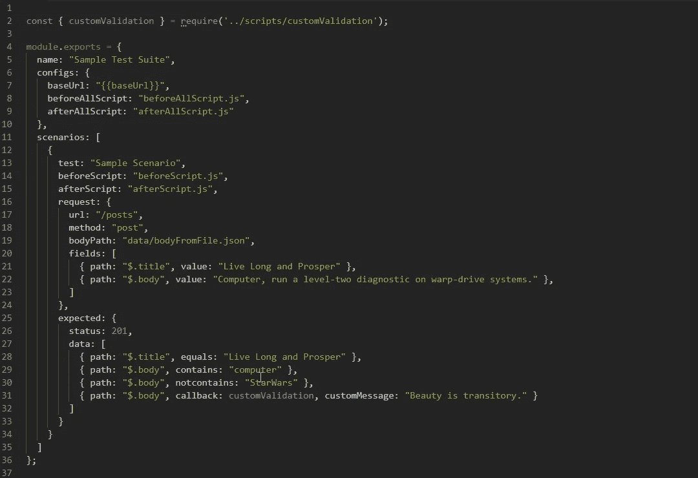
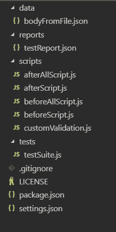
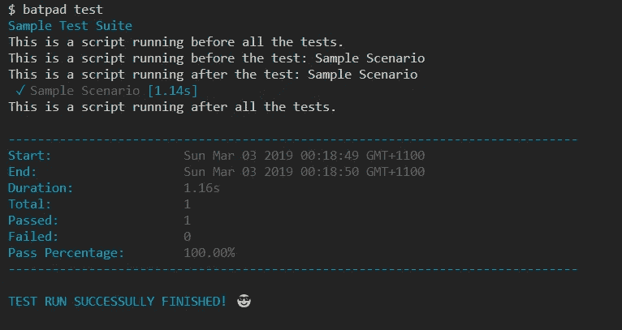

# BatPadJS: API 测试快速入门指南

> 原文：<https://itnext.io/batpadjs-api-testing-quick-start-guide-5dc4a7c11791?source=collection_archive---------1----------------------->



BatPadJS 快速入门指南

# 为什么是 BatPadJs？

假设您有一个测试微服务的项目，其中请求体是一个巨大的 JSON。您需要在 JSON 请求中发送不同的输入组合，并相应地验证结果 JSON。

为此，您有几种选择:

*   *创建大规模 JSON 的新副本，并在每个场景中更改某个值*
*   *通过指定基本 JSON(理想情况下只有必填字段)动态生成 JSON 请求体* ***并根据每个场景的需要注入/更新字段***

上面的选项 1 可以很容易地在任何测试自动化框架之上完成。然而，我认为这将是一场维护噩梦。

想象一下，在几周或几个月内，当您已经创建了几百个测试场景时，开发团队突然决定改变模式。您将最终更新您为所有场景创建的每个 JSON 文件。#哎唷#糟透了

选项 2 绝对是正确的选择。通过为每个场景动态生成 JSON 主体，您将最大限度地降低维护成本。而这正是 [BatPadJs](https://www.npmjs.com/package/batpadjs) 大放异彩的地方。

BatPadJS 提供了一种简单易行的方法，以声明的方式指定您的测试，包括您希望如何构建 JSON 请求体以及如何断言您期望的 API 响应。

# **样本测试套件**

BatPadJS 示例测试套件

引起你的注意了吗？然后让我们深入了解如何使用 BatPadJS 快速创建和执行您自己的 API 测试自动化框架。

# 装置

```
# Install BatPadJS Globally to take advantage of the built-in CLInpm install -g batpadjs# Alternatively, install it locally in the projectnpm install --save batpadjs
```

# BatPadJS CLI

创建自己的 API 测试自动化框架最简单的方法是使用 BatPadJS 内置 CLI。超级简单！

1.  首先，确保您的机器中有 [NodeJS](https://nodejs.org/en/download/) 和 [VSCode](https://code.visualstudio.com/download) 。
2.  为您的项目创建一个文件夹
3.  打开终端，并导航到项目文件夹
4.  在终端中发送以下命令

```
# Initialize a BatPadJS Projectbatpad init
```

BatPadJs 将生成样本测试文件来启动您的项目。

# 文件夹结构



BatPadJS 文件夹结构

典型的 BatPadJS 项目包含以下文件/文件夹:

1.  **数据** —该文件夹可能包含测试数据，如基本 JSON 文件(应仅包含必填字段)或您可能在任何场景中使用的其他文件
2.  **报告** —当测试完成时，该文件夹将包含 BatPadJs 报告(注意:报告在每次测试运行中都会被覆盖)
3.  **脚本** —该文件夹包含您可能想要在测试之前或之后执行的脚本
4.  **测试** —该文件夹包含所有的测试套件
5.  **settings.json** —这是 BatPadJS 测试运行器中使用的全局配置文件

# 测试执行

```
# Execute BatPadJS Testsbatpad test# You can also pass a filter based on test namesbatpad test --filter "Sample Scenario"
```



BatPadJS 执行

就是这样！您已经使用 BatPadJS 创建并执行了您自己的 API 测试自动化框架。

当然，除此之外，还有很多其他的东西不能挤进这个快速入门指南中。我肯定会再写几篇文章，深入探讨 BatPadJS 是如何工作的，以及它的许多特性。同时，您可以前往 GitHub 中的[示例文件夹，查看更多您可以参考的测试套件示例。](https://github.com/marcdacz/BatPadJS/tree/master/examples/tests)

暂时就这样了。希望这对有相同需求的团队有所帮助！本指南的完整源代码可以在[这里](https://github.com/marcdacz/api-test-batpadjs)找到，而 BatPadJS 源代码可以在[这里](https://github.com/marcdacz/BatPadJS)找到。

保持牛逼，下集再见！

马尔达茨