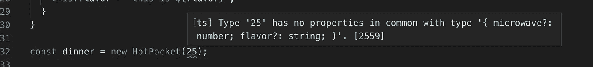
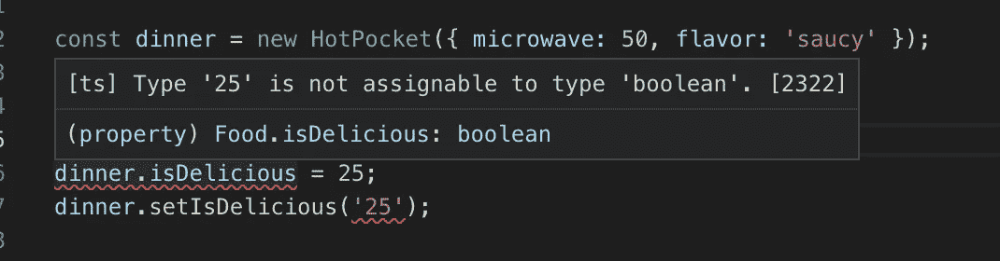
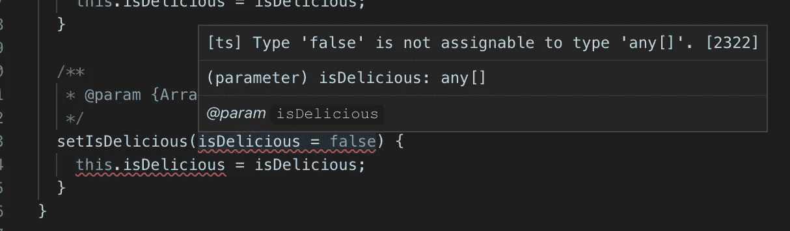
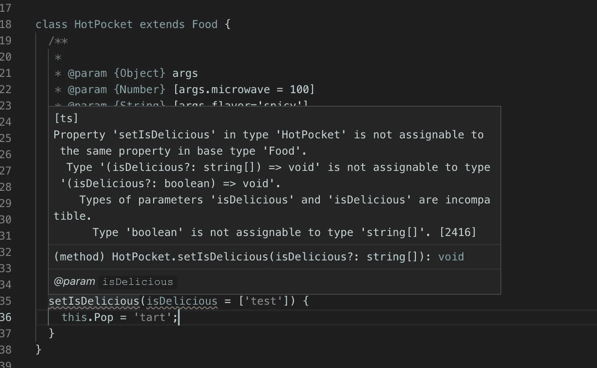

# 没有 Typescript*的严格类型

> 原文：<https://itnext.io/be-type-strict-without-typescript-296565483bfd?source=collection_archive---------1----------------------->

*好的，你还需要安装 VSCode 和 Typescript，但是不用在里面写。我只是想要一个点击诱饵标题...

如果你更喜欢用纯 JavaScript™️编写，但是仍然希望你能在你的 ide 中乘坐 2019 年静态类型警告的宣传列车，不要害怕！大约在【2018 年 8 月左右，Typescript 引入了 [JSDoc](http://usejsdoc.org/) 支持，这意味着我们现在可以根据@typedef 和@param 标志在我们的 [Javascript](http://usejsdoc.org/) 文件中推断变量类型。

JSDoc 总的来说有很多好处，比如更干净的代码、更好的文档、内置的 VS 代码和 Webstorm 警告，但是在处理复杂的对象属性或处理函数中的类型时，将 Typescript 添加到组合中会增加一层额外的保护。

让我们直接进入 [VS 代码](https://code.visualstudio.com/)设置。如果您想更深入地了解为什么您可能想走这条路而不是编写 Typescript，请滚动到末尾。要开始，确保您安装了最新的 VS 代码，然后启用这些设置。正是组合的 CheckJS 和 JSDoc 支持的力量让我们能够利用这些能力。

好了，我们来写点代码吧！我们将设置一个基本的 ES6 类和扩展类来展示我们如何创建一些类属性和函数参数。这也给了我们一个探索为函数参数记录析构参数的机会。

让我们跳进一些错误！首先，如果没有正确的析构参数，它不允许我们创建一个新对象。TS 提示提供了对必填和可选字段及其类型的理解。

一旦我们解决了这个讨厌的问题，你会注意到它不允许我们将原始类的布尔标志设置为一个数字。再次，严格的打字来拯救！

此外，它不会让我们把默认值和属性类型混淆起来！

即使我们解决了这个问题，VSCode 和 Typescript 也足够聪明，可以阻止您重写类方法和更改类型行为。

这只是几个例子，但希望它能让您了解到从这个设置中可以获得的一些好处。对于一些更复杂的 JSDoc 结构来说，确实需要一些猜测，但是 VS 代码会一直指导你。下面我就谈谈我个人对这个问题的一些看法。

我认为对我来说，主要的驱动力是每天听到关于 Typescript 的嗡嗡声，但又想继续用 Javascript 写作的个人矛盾。我们已经做出团队决定，在我们的 NodeJS repos 上没有编译步骤，但是我们希望得到严格类型警告的好处。Webstorm 的 intellisense 已经带我们走了很远，但是类型警告从来不是他们解决方案的一部分。

此外，我们的代码库中已经有了大量的 JSDoc，所以这仅仅是在我们处理代码时清理文档的问题。VSCode 和 Webstorm 都提供了自动添加文档块的好方法。

最后，你需要在你的公司和项目的限制下权衡你的选择，做出最好的决定。对我们来说，这是提高我们团队工作能力的阻力最小的途径，同时减少了记忆代码库的精神负担。我也很想听听你的方法！