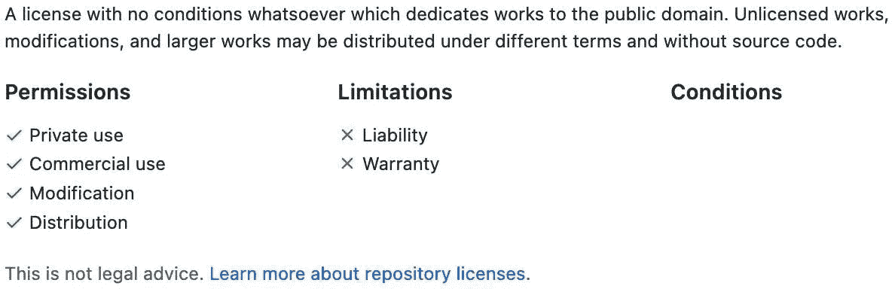
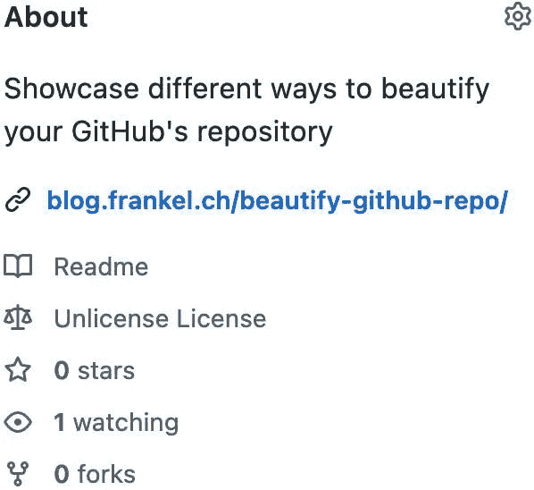
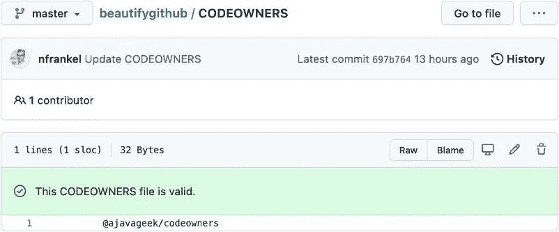
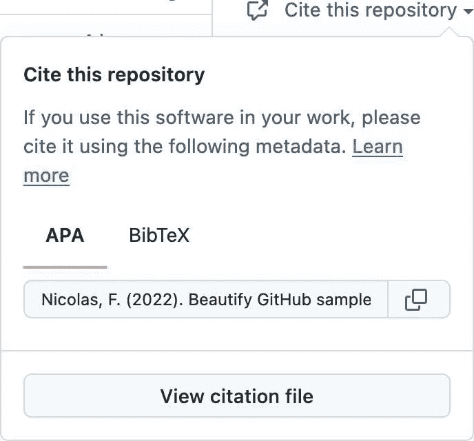
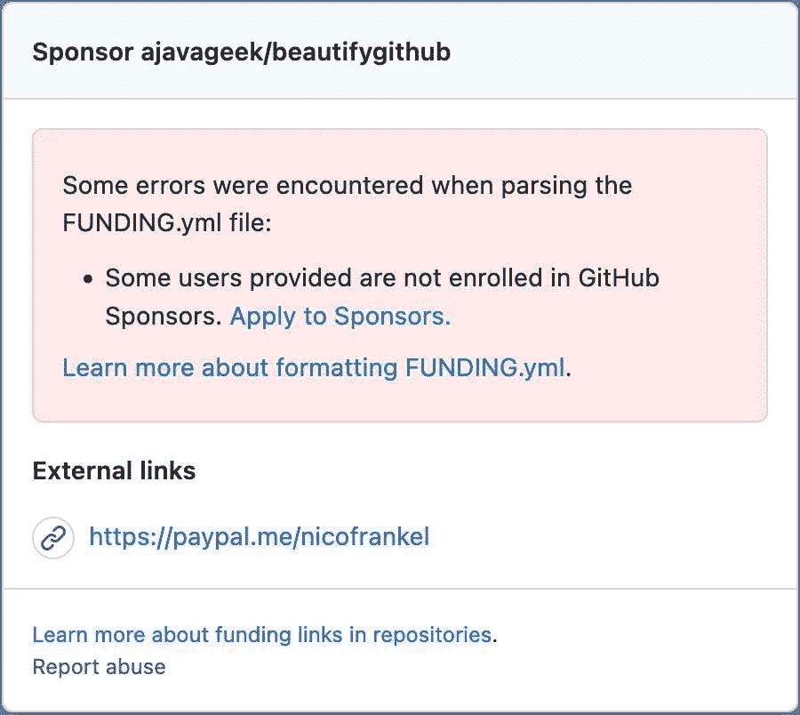

# 美化你的 GitHub repo

> 原文：<https://itnext.io/beautify-github-repo-7348b1971899?source=collection_archive---------2----------------------->


不管你喜不喜欢，GitHub 已经成为托管代码的主要提供商。您或您的公司可能正在使用 GitHub。我想在这篇文章中强调一些文件来美化你的 GitHub 库。

# 自述文件

我希望到现在为止，每个人都熟悉 READMES。如果一个人把一个自述文件放在他的 repo 的根目录下，GitHub 会在 repo 的主页上显示它的内容。

然而，这里有一些你可能不知道的提示。

自述文件可以采用不同的格式:

*   `README`:原始文本
*   `README.txt`:原始文本
*   `README.md` : (GitHub 口味)[降价](https://github.github.com/gfm/)
*   `README.adoc` : [Asciidoctor](https://asciidoctor.org/)

注意，HTML 不起作用:GitHub 显示原始的 HTML 代码，而不是“渲染”的 HTML。

此外，用户可以为组织设置自述文件。您首先需要创建一个名为 organization 的存储库。然后，在`/.github/profile/`目录下创建你想要的自述文件。例如，查看这个博客的组织，它向[显示了一个定制页面](https://github.com/ajavageek)。

更多详情，请查看[文档](https://docs.github.com/en/repositories/managing-your-repositorys-settings-and-features/customizing-your-repository/about-readmes)。

# 许可证

如果你希望人们使用你的代码，你应该告诉他们在什么条件下他们可以使用它。这正是许可你的代码的目的。传统上，大多数包的根目录下都有一个`LICENSE`(或`LICENSE.txt`)文件。GitHub 采用了这种做法。

你可以选择任何你想要的许可，但是 GitHub UI 为开源的提供了很好的帮助。转到*添加文件>创建新文件*。如果将新文件命名为`LICENSE`，将弹出一个新按钮:*选择一个许可模板*。当你点击它时，GitHub 会提供以下选择:

*   **阿帕奇许可证 2.0**
*   **GNU 通用公共许可证 v3.0**
*   **麻省理工学院许可证**
*   BSD 2-条款“简化”许可证
*   BSD 3-条款“新”或“修订”许可证
*   增强软件许可证 1.0
*   知识共享零版 1.0 通用版
*   Eclipse 公共许可证 2.0
*   GNU Affero 通用公共许可证 3.0 版
*   GNU 通用公共许可证 2.0 版
*   GNU 宽松通用公共许可证 v2.1
*   Mozilla 公共许可证 2.0
*   未获许可者

你可以选择一个来检查它的内容。GitHub 显示其权限、限制和条件:



您现在可以*审核并提交*。此时，你面临三个选择:

1.  *取消更改*取消一切
2.  *选择许可模板*返回许可选择
3.  提交新文件 …将新选择的许可证提交给存储库

添加许可证后，GitHub 会将其显示在存储库页面的右侧。



更多详情，请查看[文档](https://docs.github.com/en/repositories/managing-your-repositorys-settings-and-features/customizing-your-repository/licensing-a-repository)。

# 代码所有者

GitHub 自动将配置好的代码所有者添加到拉请求中。您在一个`CODEOWNERS`文件中定义它们，其格式有点类似于`.gitignore`。

下面是 GitHub 如何处理它的一个快速总结:

*   您可以将`CODEOWNERS`设置在根目录或`.github`子文件夹中
*   每个分支可以有不同的文件
*   一般的配置行由一个模式和一个拥有者
    `*.txt @nfrankel
    @nfrankel`组成，拥有所有的`txt`文件
*   与`.gitignore`一样，配置按顺序应用。底线优先于顶线:
    `@johndoe docs @nfrankel
    @johndoe`拥有一切，但是`@nfrankel`拥有`docs`文件夹
*   您可以设置多个所有者:
    `@johndoe @nfrankel`
*   所有者可以是个人，也可以是团队。要定义团队，请使用以团队名称为后缀的组织名称:
    `@ajavageek/developers`
*   您不能查看您自己打开的提取请求！如果是你打开 pull 请求来测试配置，GitHub 会跳过你(参见 [StackOverflow](https://stackoverflow.com/questions/61903008/codeowners-file-in-github-repo-not-working) )。

GitHub 跳过无效的配置行。要进行验证，您可以使用用户界面:



# 安全

项目希望人们报告安全问题。但是通信渠道需要是私有的，这样黑客就不会在问题被缓解、修复或同时缓解和修复之前知道这个问题。为此，GitHub 提供了一个定制的安全文件。

像自述文件一样，它可以采用不同的格式:

*   `SECURITY`和`SECURITY.txt`:原始文本
*   `SECURITY.md` : (GitHub 口味)[降价](https://github.github.com/gfm/)
*   `README.adoc` : [Asciidoctor](https://asciidoctor.org/)

像 CODEOWNERS 文件一样，你可以把它放在回购的根目录或一个`.github`子文件夹中

设置安全文件最简单的方法是通过 UI。转到*安全*选项卡，点击*设置安全策略*按钮。点击新窗口中的*开始设置*按钮。

GitHub 提供了一个默认的 Markdown 模板，但是当然，你可以选择改变格式和内容。重要的部分是告诉用户应该如何报告安全漏洞。

新创建的文件出现在*安全>查看安全策略*中。这里有一个 Asciidoctor 格式的[示例](https://github.com/ajavageek/beautifygithub/security/policy)。

# 引文

如果你的项目是好的，其他项目可能会使用它。这个项目可能会在学术著作中被引用，如果它本身是学术性质的，就更是如此。引用文件允许您回答以下问题:

*   软件的名字是什么？
*   我应该使用什么标签来唯一标识我所使用的软件版本？
*   什么样的人适合被引用为作者？

标准引用格式是 GitHub 提出的[引用文件格式](https://citation-file-format.github.io/):

> `*CITATION.cff*` *文件是纯文本文件，包含软件(和数据集)的人类和机器可读的引用信息。代码开发人员可以将它们包含在他们的库中，让其他人知道如何正确引用他们的软件。*

你不仅可以选择引文的格式，还可以引用另一个来源，*例如，*一篇相关的学术文章。

同样，GitHub 的用户界面可以帮助你创建一个`CITATION.cff`文件。当你创建一个，它会让你添加一个样本，你可以编辑你的心的内容。

```
cff-version: 1.2.0
title: Beautify GitHub sample repository
message: If you really want to cite this repository, here's how you should cite it.
type: software
authors:
  - given-names: Nicolas
    family-names: Fränkel
repository-code: 'https://github.com/ajavageek/beautifygithub'
license: Unlicense
```

添加文件后，一个新的 *Cite this repository* 链接出现在右边栏。点击时可以选择想要复制的格式，APA 或 BibTeX。



# 赞助

最后，我们来看看如何配置赞助。如果你通过你的开源项目为第三方提供了价值，让他们回报你是有意义的。注意，你不应该指望它，否则你会大吃一惊。

GitHub 允许通过`.github`存储库中的专用`FUNDING.yml`显示赞助选项。再一次，用户界面很有帮助。进入*设置*，点击*设置赞助商按钮*。它会打开一个普通窗口，用一个模板创建一个新文件。我是这样改的:

```
github:
  - nfrankel
custom:
  - [https://paypal.me/nicofrankel](https://paypal.me/nicofrankel)
```

预览选项卡验证您的输入。



在这种情况下，通过告知用户`nfrankel`(我)没有注册 GitHub 赞助商计划，验证失败。

一个新的“赞助这个项目”部分出现在回购主页的右侧栏。

您需要勾选*设置*中的“赞助”复选框，它才会出现。因此，你可以在回购中准备好一切，只有当你准备好了才激活它。

# 结论

GitHub 提供了多种方法来改善存储库的显示和可用性。对于任何想要与他人共享的存储库，许可证和自述文件应该是强制性的。除了他们，你应该提供这篇文章中列出的其他美化。

这篇文章的完整源代码可以在 GitHub 上找到。

**更进一步:**

*   [定制您的存储库](https://docs.github.com/en/repositories/managing-your-repositorys-settings-and-features/customizing-your-repository)
*   [向存储库添加安全策略](https://docs.github.com/en/code-security/getting-started/adding-a-security-policy-to-your-repository)
*   [引文文件格式(CFF)](https://citation-file-format.github.io/)
*   [关于引用文件](https://docs.github.com/en/repositories/managing-your-repositorys-settings-and-features/customizing-your-repository/about-citation-files)
*   [GitHub 特殊文件和路径](https://github.com/joelparkerhenderson/github-special-files-and-paths)

*原载于* [*一个 Java 极客*](https://blog.frankel.ch/beautify-github-repo/)*2022 年 4 月 17 日*