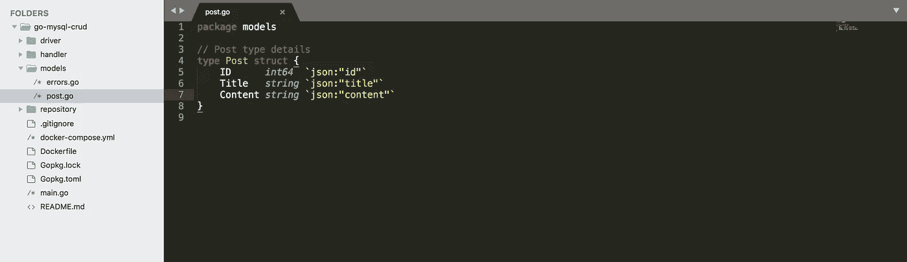
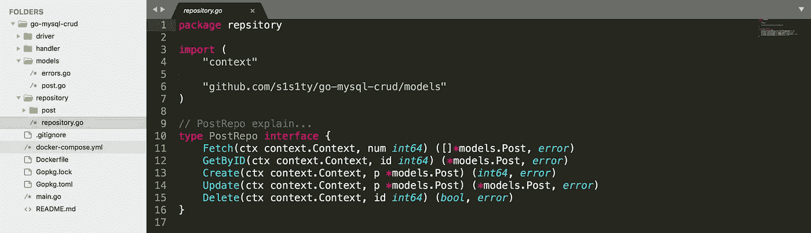

# 美化您的 Golang 项目

> 原文：<https://itnext.io/beautify-your-golang-project-f795b4b453aa?source=collection_archive---------0----------------------->

组织你的 golang 项目和代码

在我的上一篇文章中，我创建了一个服务，它是无组织的，只面向初学者。我的动机是提供一个创建 REST 服务的基本概念，并一步一步地前进。


如果你不熟悉我以前的帖子，你可以通过下面的链接了解功能。这并不难检查一瞥，或者如果你以前有关于建立 web API 服务的知识，那么你可以处理。

[](/building-restful-web-api-service-using-golang-chi-mysql-d85f427dee54) [## 使用 Golang、chi 和 MySQL 构建 RESTful web API 服务

### 使用 go 创建您的第一个 REST API

itnext.io](/building-restful-web-api-service-using-golang-chi-mysql-d85f427dee54) 

在本教程中，我将展示如何组织一个项目。组织你的代码是很重要的，因为当你想改变你以前代码的一些逻辑时，那么结构良好的项目可以很容易地采用这些改变，并且节省时间。虽然关于项目结构有不同的观点，但我更喜欢 4 层的结构。您可以从这里替换或修改任何内容。

```
project/
    model/
    repository/
    handler/
    driver/
    main.go
```

## **车型**

这一层将存储我们的所有模型结构，并由所有其他层使用。现在我们将移动 models/post.go 文件上的`post`模型结构。如果我们有另一个像`author`这样的模型，那么这些模型也将包含在这一层中。我们还添加了 error.go 文件。



发布模型

error.go 包含您新创建的错误。详情[你可以在这里](https://github.com/s1s1ty/go-mysql-crud/blob/master/models/errors.go)了解。

## 仓库

存储库负责与数据库相关的工作，例如查询、插入/存储或删除。这里没有实现任何业务逻辑。



回购后

在这里，我创建了 repository.go 进入 repository 文件夹。这个文件包含了所有与你的存储库相关的接口。如果我们有一个额外的域，例如 author 或其他，那么接口中的所有 author 方法都包含在这里。

如果你注意到上图的左边，我已经创建了一个名为 post 的文件夹。我们将在`post/post_mysql.go`文件上实现我们的接口。后缀为什么是 MySQL？因为如果我们有另一个数据库用于 post repository，如 mongo 或 redis，那么我们将包含 post_mongo.go(无论您怎么称呼)并实现 mongo 相关的查询。

post_mysql.go 必须满足 PostRepo 接口。如果我们想添加任何额外的方法，那么我们必须将它包含到接口中，并在 post_mysql.go 文件中实现它。

## 处理者

基本上，处理程序文件夹可以信任存储库，因为这一层决定了将使用哪个存储库层。任何流程都在这里办理。该层接受请求，调用存储库层，满足业务流程并发送响应。

处理程序层还包含几个协议实现，如 RPC、REST 等，并与不同的文件夹隔离。

## 驾驶员

在我们的结构中，驱动程序层由我们所有的数据库连接来描述。这一层负责与数据库连接，并将连接对象发送到控制器。

这里，我们将使用 main.go 代替控制器，因为我们的服务只有一个包含 CRUD 操作的域。

从我们的 main.go，我们将提供所有的数据库凭证，并与数据库连接。我们在 docker-compose 文件中提供的环境变量中读取 DB 凭据。我们也在这里保持我们所有的路线，但是你可以隔离它。

## 示例项目

您可以在此查看示例项目

```
[https://github.com/s1s1ty/go-mysql-crud](https://github.com/s1s1ty/go-mysql-crud)
```

我也鼓励你添加测试文件。同样，任何设计都不像圣经，我们必须根据我们的项目定义、业务逻辑等来实现它。

## 最后

你可以通过下面的链接了解更多关于这个话题的信息。

*   [https://8 thlight . com/blog/uncle-bob/2012/08/13/the-clean-architecture . html](https://8thlight.com/blog/uncle-bob/2012/08/13/the-clean-architecture.html)
*   [http://blog . ral ch . com/tutorial/design-patterns/golang-design-patterns/](http://blog.ralch.com/tutorial/design-patterns/golang-design-patterns/)
*   [https://hacker noon . com/golang-clean-architecture-EFD 6d 7 c 43047](https://hackernoon.com/golang-clean-archithecture-efd6d7c43047)
*   可以看鲍勃大叔的一个视频，很搞笑。

> 任何与这篇文章相关的问题，你都可以在评论区或 linkedin 上问我

最后，如果你注意到我犯的任何错误，你可以在下面的评论区给我发邮件。也可以在我的 GitHub [**资源库**](https://github.com/s1s1ty/go-mysql-crud) **上给我发 PR。**