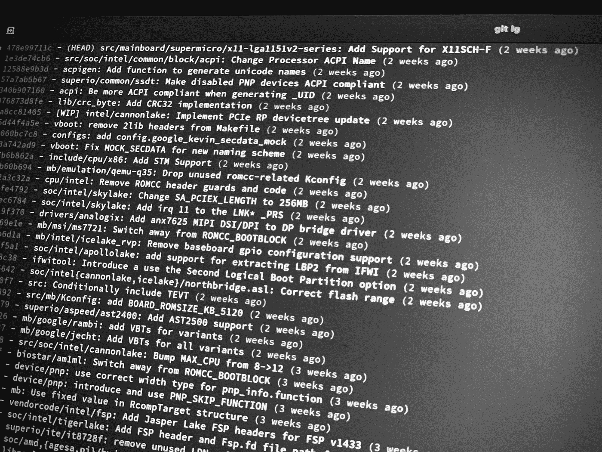
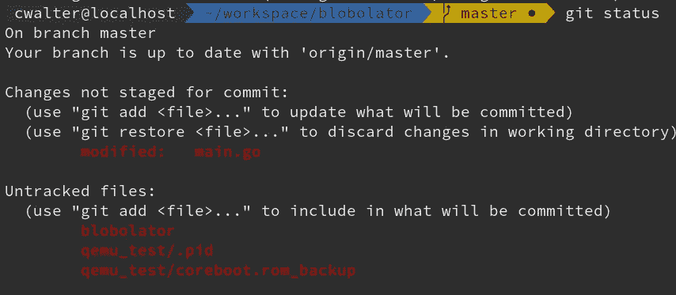
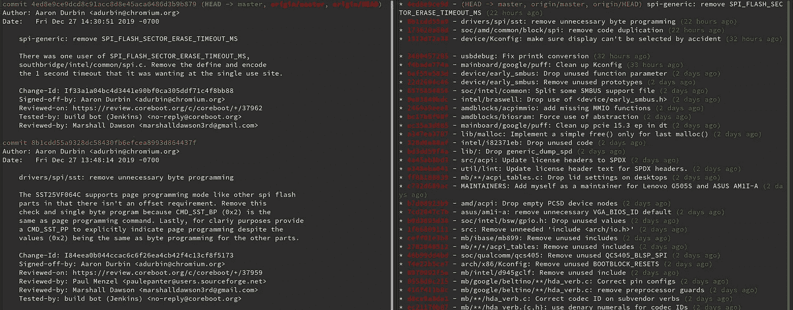

# 成为 Git 终端 Pro

> 原文：<https://itnext.io/become-a-git-terminal-pro-ab6d1955606f?source=collection_archive---------4----------------------->



Shell 中的 Git 日志

每个程序员都知道它，并且必须或者喜欢使用它——Git。Git 改变了我的工作方式——谁会不记得在你重写整个代码库之前，没完没了地按 Ctrl-Z 键回到工作状态。

Git 是一个版本控制系统，可以让你在开发软件的时候跟踪代码的变化。当你在团队中工作时，它是有用的，但当你独自工作时也是有用的——git 是必须的。

当我几个月前开始我的新工作时，我认为我已经了解 git 了。对于 Git，我总是倾向于使用像 [Sourcetree](https://www.sourcetreeapp.com/) 这样的图形用户界面，但是由于各种原因，我从 MacOS 切换到 Linux，不幸的是，我不得不切换到终端来使用 Git。回想起来，这是我被迫做出的最好的决定之一。我的新同事向我展示了一些小技巧和改进，这样我就可以结合 Git 和我喜欢共享的终端更快更安全地工作。

但是首先——让我们再次回顾一下**的基础知识**。我假设每个人都熟悉 git 的原理。如果不是——在 medium 上有很多关于 git 的介绍。

## git 克隆

*git 克隆*是 git 中使用最多的命令。每次当我们想从 github 或 gitlab 下载一个库时，我们必须将*克隆到本地文件夹中。*

## git 状态

*git status* 向您显示自您上次提交以来已经更改的文件。它列出了已转移但已更改的文件，以及尚未转移的文件。



git 状态示例

## git 添加

*git add < file >* 用于添加未暂存的文件，或将暂存但已更改的文件添加到下一次提交。使用 *git add* 我们收集我们想要提交的文件。

## git 提交

*git commit* 将所有添加的文件打包成一个 commit——并让您编写一个提交消息。该提交将被添加到您的本地存储库中。

## git 日志

git 日志向您展示了提交树。提交树由当前分支中的所有提交组成。

## git 推送

*git push* 上传您的**远程**存储库，以及您在**本地**存储库中所做的更改。请注意，只有提交才会被上传和同步。

## git 拉

*git pull* 与 *git push* 相反——它从**远程**存储库中提取尚未在**本地**存储库中的最新变更，并将这些变更合并到**本地**存储库中。

# 超越基础

好吧——我猜你们大多数人都知道基本知识。当我第一次在命令行中使用 git 时，我遇到了一个问题，那就是我想将我所做的本地更改分割成不同的提交。通常这没什么大不了的——当你想把在**一个**文件中所做的更改分割成**不同的**提交时，困难就来了。这就是 git add -p 发挥作用的地方。

## git add -p

*git add -p* 的工作方式与 *git add* 相同。它将您的更改添加到下一次提交中。但是 *git add -p* 会扫描您的更改，您可以交互地决定您想要添加哪些代码块。这使您可以自由地跳过一个文件中的部分，并将它们添加到下一次提交中。它还会再次显示代码更改供您查看，这样您就可以确保只添加真正应该在下一次提交时使用的代码，这样您就不会添加任何调试代码。

## 。gitconfig

你知不知道你可以在本地。 *gitconfig* ，在这里可以配置你的本地 git？你可以定义别名，设置你的名字和邮件，等等。完整的文档可以在[这里](https://git-scm.com/docs/git-config)找到。我的。gitconfig 文件主要做三件事。它定义了我的名字和邮件地址，我在签署提交时使用它们(您可以使用 git commit -s 来签署提交)，它还定义了别名。别名至少能提高你 100%的工作效率。我的。 *gitconfig* 基本上是这样的:

```
[user]
 name = Christian Walter
 email = [I](mailto:christian.walter@9elements.com)reallydontwant@toShare.com
[alias]
 ci = commit
 co = checkout
 st = status
 br = branch
 lg = log --graph --pretty=format:'%Cred%h%Creset -%C(yellow)%d%Creset %s %Cgreen(%cr) %C(bold blue)%Creset' --abbrev-commit
 stash-all = stash save --include-untracked
 undo = reset --soft HEAD^
 graph = log --graph --all ' --pretty=format:%Cred%h%Creset %ad | [%C(bold blue)%an%Creset] %Cgreen%d%Creset %s' --date=iso
```

所以让我们一个一个来。首先，`[user]`部分定义了我的名字和邮件地址。`[alias]`部分定义了几个别名，可能需要更详细的解释。前四个只是提交、签出、状态和分支的简短形式。如果你只输入 *git st* 而不是 *git status* ，它会运行得更快。生产力提高—检查！

lg 的别名很不错。这里发生了很多事情。简而言之:它将您扩展和放大的 git 历史转换为可读的 git 历史，您可以轻松浏览最近 10、20、50 或 100 次提交。



左边 git log 和右边 git lg 的比较。

别名`git lg`解析为`git log --graph --pretty=format:%Cred%h%Creset -%C(yellow)%d%Creset %s %Cgreen(%cr) %C(bold blue)%Creset --abbrev-commit`——让我们一步步来。`--graph`向 git 历史添加基于文本的图形表示。`--pretty`格式化输出 git 历史是如何打印的。在这里，您可以选择自己的颜色或格式，并根据自己的需要进行定制。`%h`是提交的散列值，`%s`是提交主题，`%cr`是相对提交日期。可以在[这里](https://git-scm.com/docs/pretty-formats)找到可能格式选项的完整列表。

回到我们的别名列表:接下来的两个也很简单。`stash-all`隐藏所有内容，非文件和暂存文件，并且`git undo`将您的存储库重置为当前存储库之前的提交状态。

最后但同样重要的是，`git graph`也是一个更复杂的别名，就像 *git lg* 一样，但是它包括所有的分支，也包括没有合并回工作分支的分支。它给你一个关于所有已经处理过的**分支的概述，并显示它们的历史。**

我希望你和我一样喜欢这些有用的建议。它提高了我的工作效率，现在我对在终端中使用 git 更有信心了。此外，我发现在终端中工作比在其他 GUI 中工作更愉快。

感谢 [Sebastian Deutsch](https://medium.com/u/5bd9cfa21179?source=post_page-----ab6d1955606f--------------------------------) 和 [9elements](https://medium.com/u/70c88a583df3?source=post_page-----ab6d1955606f--------------------------------) 提供的有用提示。我只是总结了一下。

**感谢阅读！**

**资源:**

Git 配置选项:[https://git-scm.com/docs/git-config](https://git-scm.com/docs/git-config)Git 漂亮格式选项:[https://git-scm.com/docs/pretty-formats](https://git-scm.com/docs/pretty-formats)