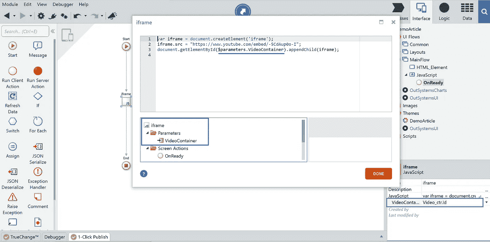
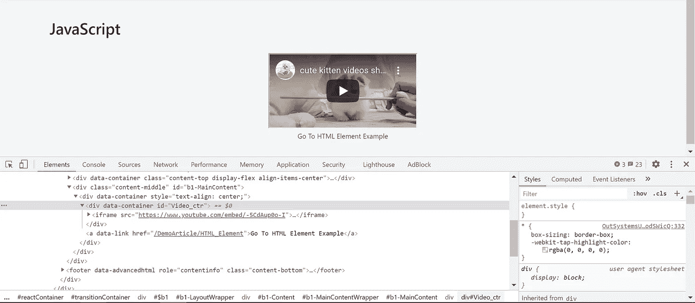
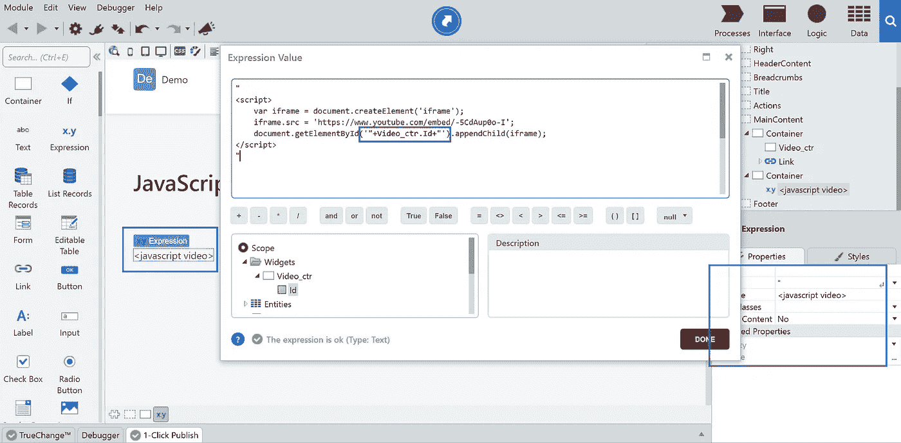
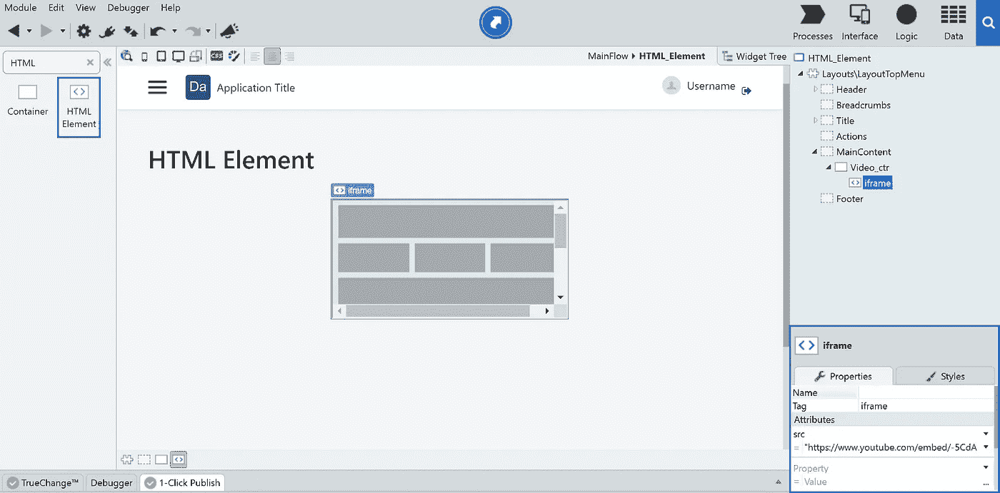
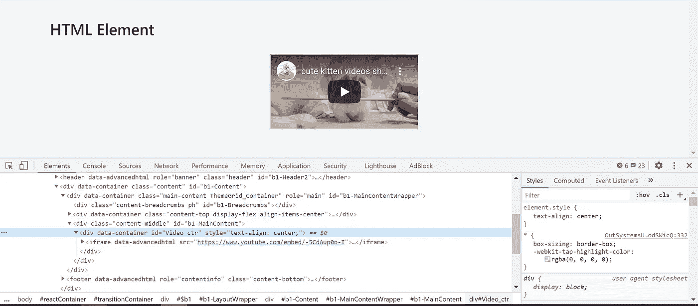
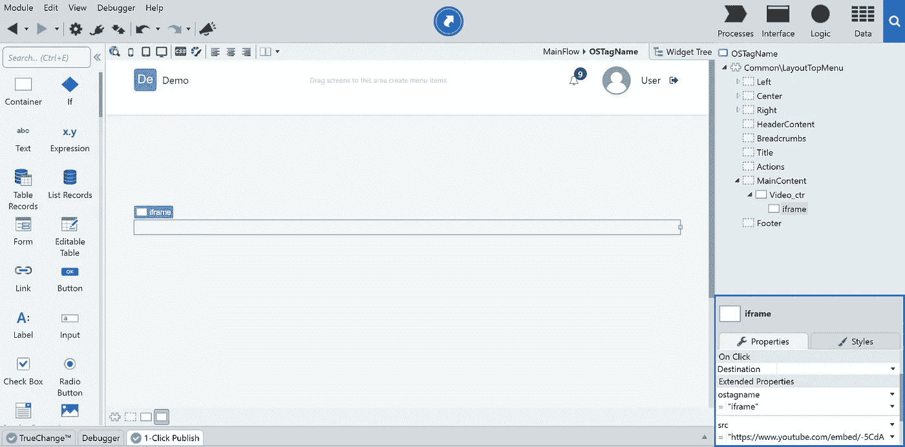
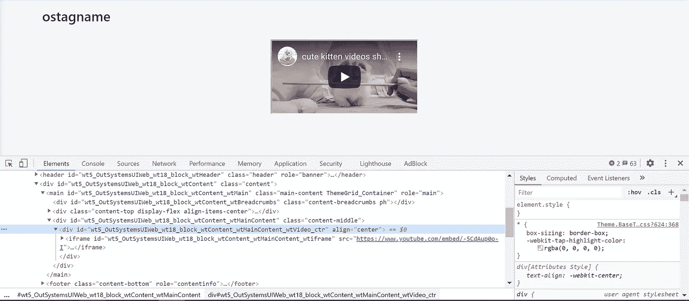

# 外部系统中的 HTML 提示和技巧

> 原文：<https://itnext.io/become-an-html-hero-in-outsystems-1420828b5455?source=collection_archive---------3----------------------->


HTML？小菜一碟。许多开发人员听到 HTML 时会这样想，但是如果您不得不在外部系统中使用它呢？在这篇文章中，你将读到在 OutSystems 应用程序中添加 HTML 标签的 3 种最常见的方法。

本文面向刚开始使用 OutSystems 的人，但对于更有经验的 OutSystems 开发人员来说，可能也有新的技巧。除此之外，提神剂不会伤害任何人；)

# 什么是 HTML 标签，我为什么需要它？

起初，我无法用简洁的方式解释 HTML 是什么，但后来我发现了这个 ELI5(像我 5 岁一样解释)短语:

> “HTML 是一种标记语言。标记语言是一组关于如何创建文档(如网页)的指令

所以，假设你有一个应用程序，你想在其中显示一个视频，这是你可以用 HTML 实现的方法之一:

*！DOCTYPE html>
<html>
<body>
iframe src = Your _ URL _ Here></iframe>
</body>
</html>*

每一个在 HTML 里面被称为一个标签。在许多情况下，您可能需要在应用程序中添加 HTML 标记。例如，您可以使用一个标签来显示一个视频，如上所示。

# 如何给你的 OutSystems 应用程序添加一个 HTML 标签？

假设您正在制作一个*反应式 web 应用程序*，其中您想要展示一个 YouTube 视频。做这件事有多种/不同的方法。一种是在 HTML 中添加 iframe 标签来显示、播放或暂停视频。对于移动或反应式应用程序，你可以通过两种不同的方式来实现，JavaScript 或使用 OutSystems 的 HTML 元素。还有第三种方式，只用于传统的网络应用。

## 1-使用 JavaScript 添加标签:

这是开发人员向他们的应用程序添加 HTML 标记的最常见方式，因此，您也可以找到许多关于这方面的文章。这里的[可以找到一个例子](https://www.w3schools.com/js/js_htmldom_nodes.asp)。
回到我们的例子，这是您在反应式应用程序中使用带有 JavaScript 的 iframe 标签添加 YouTube 视频所需要做的全部工作:

*   创建一个容器并给它命名，例如 Video_ctr。
*   为屏幕创建一个在线动作。
*   从工具箱中拖放 JavaScript。
*   打开 JavaScript 编辑器，右键单击编辑器底部的参数文件夹，选择*添加输入参数*并为其命名，如 VideoContainer。此参数的数据类型为文本，必须是强制的。
*   将以下代码放入编辑器中。

```
var iframe = document.createElement('iframe');
iframe.src = "[https://www.youtube.com/embed/-5CdAup0o-I](https://www.youtube.com/embed/-5CdAup0o-I)";
document.getElementById($parameters.VideoContainer).appendChild(iframe);
```

*   分配 Video_ctr。Id 到 VideoContainer 参数，像这样:



在上面的代码中，在第一行创建一个 iframe 标记，在最后一行将 iframe 标记作为子标记添加到 Video_ctr:



在传统的 web 应用程序中，您是这样做的:

*   创建一个容器并给它命名，例如 Video_ctr。
*   将另一个容器放在屏幕底部，并为其命名，例如 Script_ctr。
*   在 Script_ctr 中放一个表达式，并将 Escape Content 设置为 No，因为这将是一个 JavaScript 表达式，并给它一个例子，例如<javascript video="">。</javascript>
*   将以下代码设置为表达式的值:

```
"
<script>
    var iframe = document.createElement('iframe');
    iframe.src = 'https://www.youtube.com/embed/-5CdAup0o-I';
    document.getElementById('"+Video_ctr.Id+"').appendChild(iframe);
</script>
"
```

在上面的代码中，我们使用小部件 id (Video_ctr。Id)来获得元素的确切 id。

这是它在 Service Studio 中的样子:



并且:


## 2-使用 OutSystems 的 HTML 元素添加标签

这是你在制作一个反应式或移动应用程序时可以使用的另一种方法。

*   制作一个名为 Video_ctr 的容器。
*   从工具箱中拖放 HTML 元素小部件
*   在小部件的属性中，将 iframe 设置为 tag。
*   使用属性中的属性来设置视频源，如下所示:



这是它在您的浏览器中的样子:



还有另一种方式是 *only* 适用于传统的 web 应用程序:

## 3-向传统的 web 应用程序添加标签

这是我最喜欢的一个，使用 ostagname 添加标签，这只有在开发传统的 web 应用程序时才有可能。

要做到这一点，可以创建一个名为 Video_ctr 的容器。

*   在第一个容器中添加一个容器，并为其命名，例如 iframe。
*   在 iframe 容器的属性中，使用扩展属性，将其设置为 ostagname，并将值设置为“iframe”。
*   将下一个属性设置为 src，并将 url 作为值，如下所示:



瞧啊！



# 现在知道了这个，我该用哪个呢？

这里其实没有好坏之分。

如果你是一个 JavaScript 英雄，使用 JavaScript 的方式来添加 HTML 标签，这对于你所有的应用程序(移动，反应& web)都是可能的。

否则，如果你想把它们都放在外部系统中，只需为你的移动和/或反应式应用程序使用 HTML 元素，为你的传统 web 应用程序使用 ostagname，因为这两种方式是一样的。

我个人更喜欢用 OutSystems 方法而不是 JavaScript，所以 HTML element 和 ostagname 是我常用的。

请在评论中告诉我，你更喜欢使用哪种方式来给你的外部系统应用程序添加 HTML 标签。