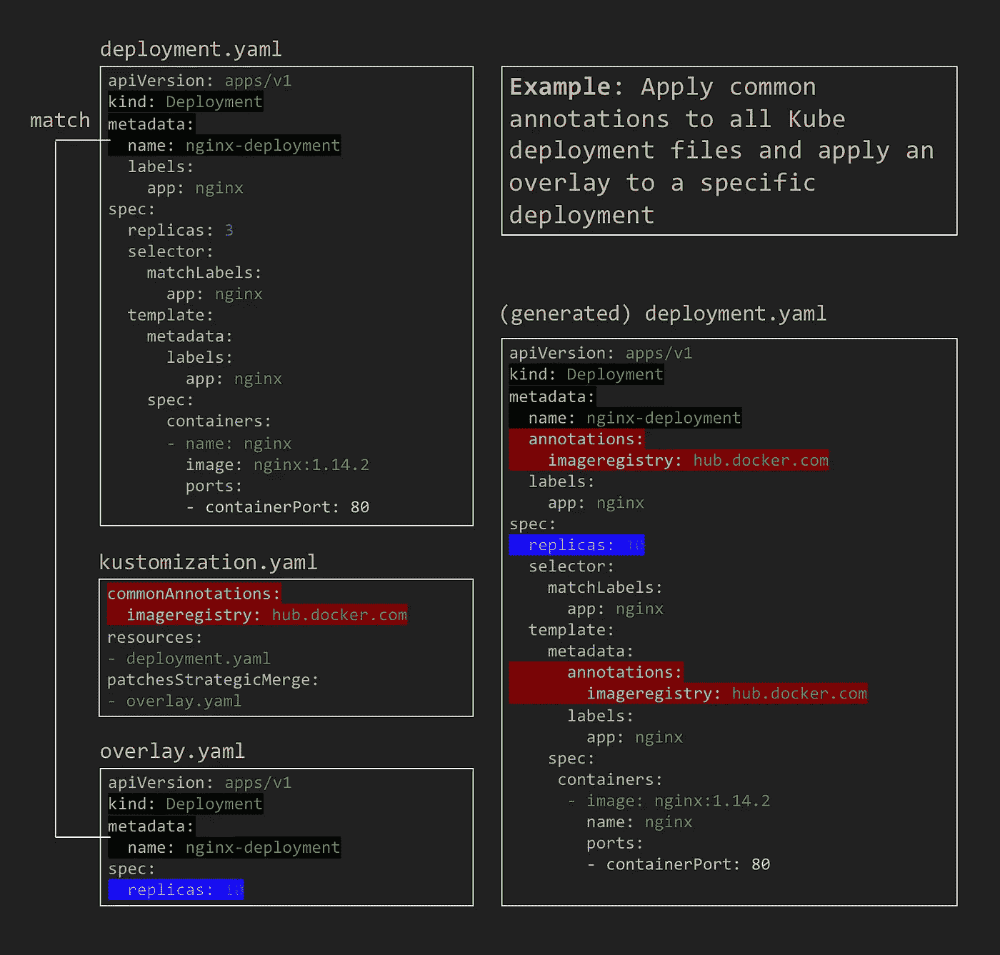
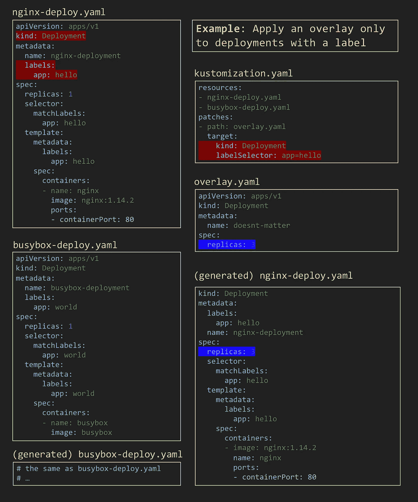
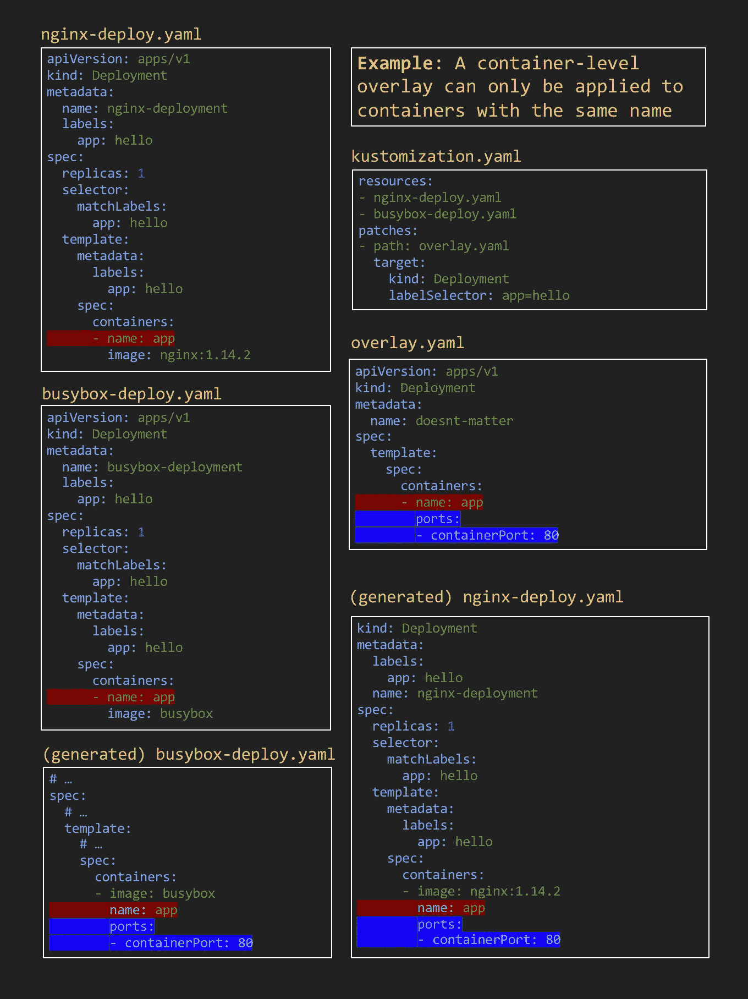

# 在使用 Kustomize 之前

> 原文：<https://itnext.io/before-you-use-kustomize-eaa9529cdd19?source=collection_archive---------2----------------------->

## 流行的 Kubernetes 配置管理工具 Kustomize 的优缺点

信用:[像素](https://www.pexels.com/photo/man-wearing-black-and-white-stripe-shirt-looking-at-white-printer-papers-on-the-wall-212286/)

Kustomize 是一个用来管理和定制 YAML 文件的工具——尤其是 Kubernetes 的配置 YAML 文件。它在过去的两年中迅速流行起来，并且从 1.14 版开始成为 kubectl 的一部分。因此，当我们的组织考虑放弃我们内部的 Kubernetes 配置管理工具时，Kustomize 是我们候选列表中的第一个。这是我在对 Kustomize 进行研究和原型制作后的发现。

# **TD；LR**

Kustomize 依靠“选择和修补”机制来简化和重构 Kubernetes 的配置 YAML 文件。虽然这种强大的方法提供了许多好处，但它对于某些任务也有局限性。

# **问题**

我们的团队在许多不同的环境中部署了多种微服务。查看配置文件后，我们发现:

*   不同微服务的配置之间的共性，例如标签和注释。
*   不同环境中相同微服务的配置之间的共性，如 DNS、CPU 和内存设置。

因此，我们理想的工具应该利用这些来重构，避免重复我们自己( [DRY](https://en.wikipedia.org/wiki/Don%27t_repeat_yourself) )。

# **无模板解决方案**

受文章“[Kubernetes](https://github.com/kubernetes/community/blob/master/contributors/design-proposals/architecture/declarative-application-management.md)中的声明式应用程序管理”的启发，Kustomize 鄙视复杂模板的使用，并通过将 YAML 文件分解为基本 YAML 文件和覆盖 YAML 文件来解决问题，然后根据情况组装它们。一般来说，Kustomize 有三种类型的文件:

*   **基本 YAML 文件:**这些定义了库贝 YAML 文件的框架。
*   **覆盖 YAML 文件**:这些是 Kube YAML 文件的一小部分，比如卷安装或容器的规格。
*   **库定制文件**:定义了叠加文件如何应用到基础文件，以生成最终的 YAML 文件，称为变体。它们还可以包含轻量级的覆盖，如公共标签和注释，以及生成配置映射和秘密。通常，每个环境都有自己的定制文件来调整该环境的配置。例如，dev kustomization 文件向特定部署添加了一个 sidecar 容器，而 production kustomization 文件则没有。

Kustomize 与一般的 YAML 文件合并的区别在于 Kustomize 理解 Kube YAML 语法。例如，Kustomize 中一个名为 [Target Selector](https://github.com/kubernetes-sigs/kustomize/blob/master/examples/patchMultipleObjects.md#target-selector) 的特性允许用户只对 Kube 元数据中包含特定标签或注释的部署文件应用覆盖。

# **有什么好吃的**

与模板解决方案相比，Kustomize 迫使人们在编写配置文件时避免常见的陷阱。典型的模板化配置文件由 3 部分组成:

*   渲染后不变的部分(文本)
*   渲染后更改的部分(模板)
*   组合它们的控制逻辑

当文件中充满了模板和 if…else 语句来处理不同的场景时，它变得非常难以阅读和维护。与此同时，缺乏与 Kube 语法的集成也使得一些任务(如为所有 Kube 资源添加名称前缀)变得繁琐且容易出错，因为用户需要检查所有文件并手动添加名称前缀的模板。

Kustomize 通过分离模板化配置文件的三个部分来促进良好实践。由于 Kustomize 只能组合原始的无模板 Kubernetes YAML 文件，所以所有的控制逻辑，如 if…else 语句，必须留在 Kustomize 文件中。在基础 YAML 和覆盖 YAML 的帮助下，Kustomize 鼓励将固定的文本放入基础 YAML，将变化的部分放入覆盖 YAML。与此同时，Kustomize 有一系列理解 Kube 语法的便捷转换器。它们可以用来避免人为错误，并像普通标签一样对所有 Kube 资源进行更改。

# **有什么不太好的**

权衡是所有软件设计都必须承受的负担，Kustomize 也不例外。Kustomize 可以帮助重构和定制不同环境的配置，但在重构微服务之间共享的配置时，它有局限性。

Kustomize 允许用户创建覆盖 YAML，并使用 kustomize 文件来决定如何将它们应用到基本 YAML。利用这一点并将 Kube 资源的一些公共属性提取到覆盖文件中似乎是一个好主意，比如标签、安全上下文和环境变量。然而，这只有在 Kustomize 可以将提取的部分放回原位时才有效。这听起来可能非常简单，但使用 Kustomize 并不总是那么简单。

有两种方法可以让 Kustomize 知道在哪里应用覆盖:

*   **通过路径**:基于路径的方法允许用户在覆盖文件的 YAML 结构中嵌入要覆盖的路径，或者用 [Json6902](https://github.com/kubernetes-sigs/kustomize/blob/master/examples/jsonpatch.md) 转换器在库定制化文件中显式声明该信息。这种方法对重构没有太大帮助，因为它要求覆盖和基本 YAMLs 中的路径之间有一对一的映射，并且没有部分可以共享。
*   通过选择器**:选择器方法，比如[目标选择器](https://github.com/kubernetes-sigs/kustomize/blob/master/examples/patchMultipleObjects.md#target-selector)，更适合重构。它允许用户指定一个选择器，例如，带有特定注释的所有部署，并对这些部署应用覆盖。**

然而，并不是 Kube config YAMLs 中的所有元素都是“可选择的”，因为选择器总是依赖于一些属性，比如 Kube YAML 的种类、标签或注释来选择 Kube 元素。尽管如此，并不是所有的 Kube 元素都有这些。例如，Kube 部署可以有一个容器列表，但是这些容器上没有类似注释的属性供 Kustomize 选择器使用。为了在多个部署中对容器应用公共覆盖，容器必须具有相同的名称。这使得诸如公共环境变量或容器安全上下文之类的重构任务变得几乎不可能。

# 我应该使用 Kustomize 吗？

上面提到的问题并非完全不可解，但多少有些根本性。为了使 Kube YAML 的每个部分都“可选择”，它需要对 Kube 对象模式进行更改或修改，例如，为每个对象添加类似注释的字段，或者重用一些现有字段作为注释，然后扩展 Kustomize 以支持它们。

但是，只有当微服务的复杂度达到一定程度时，问题才有可能出现。总的来说，我认为 Kustomize 的优点仍然大于缺点，尤其是如果你的团队还没有尝试 Kube 配置管理解决方案的话。

如果你喜欢这篇文章，[在 Medium 上跟随我](https://medium.com/@nealhu)！我撰写关于分布式系统和软件架构的文章，例如:

*   [为什么要建立自己的 Kubernetes 运营商](/why-should-you-build-your-own-kubernetes-operator-f60c25df0b1c)。这比你想象的更容易，也更有益
*   [自动化友好的软件系统以及如何构建它们](/automation-friendly-software-systems-and-how-to-build-them-7a7c5e3c1a15)。向更好的自动化方向设计软件系统的技巧
*   [极简软件架构](/minimalist-software-architecture-426888684e60)。构建大规模多区域分布式系统的经验教训