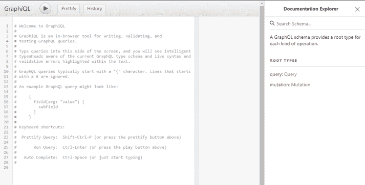
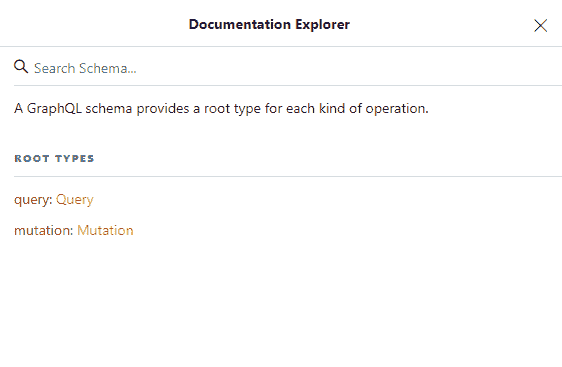

# Spring Boot graph QL 初学者指南

> 原文：<https://itnext.io/beginners-guide-to-graphql-with-spring-boot-69d229e87b19?source=collection_archive---------4----------------------->

GraphQL 是一种用于 API 的查询语言，允许客户端请求他们需要的有限数据，使客户端能够在有限数量的请求中收集数据。GraphQL 是强类型协议，所有数据操作都根据 GraphQL 模式进行验证。


在本文中，我们将使用 Spring Boot 构建一个简单的 GraphQL 服务器。

# 添加 Maven 依赖项

创建一个示例 Spring Boot 应用程序，并添加以下依赖项。

1.  *graph QL-spring-boot-starter*用于启用 GraphQL servlet，在路径 */graphql 下可用。*它初始化`*GraphQLSchema*` bean。
2.  *graphql-java* 允许用简单易懂的 graphql 模式语言编写模式。
3.  *GraphQL-spring-boot-starter*提供了用户界面，使用该界面我们可以测试我们的 graph QL 查询并查看查询定义。

```
 <dependency>
            <groupId>com.graphql-java</groupId>
            <artifactId>graphql-spring-boot-starter</artifactId>
            <version>5.0.2</version>
        </dependency>
        <dependency>
            <groupId>com.graphql-java</groupId>
            <artifactId>graphql-java-tools</artifactId>
            <version>5.2.4</version>
        </dependency>
        <dependency>
            <groupId>com.graphql-java</groupId>
            <artifactId>graphiql-spring-boot-starter</artifactId>
            <version>5.0.2</version>
        </dependency>
```

下面是完整的 POM 文件内容。

```
<?xml version="1.0" encoding="UTF-8"?>
<project 
         xmlns:xsi="http://www.w3.org/2001/XMLSchema-instance"
         xsi:schemaLocation="http://maven.apache.org/POM/4.0.0 http://maven.apache.org/xsd/maven-4.0.0.xsd">
    <modelVersion>4.0.0</modelVersion>

    <groupId>com.techshard.graphql</groupId>
    <artifactId>springboot-graphql</artifactId>
    <version>1.0-SNAPSHOT</version>

    <parent>
        <groupId>org.springframework.boot</groupId>
        <artifactId>spring-boot-starter-parent</artifactId>
        <version>2.1.6.RELEASE</version>
        <relativePath />
    </parent>

    <properties>
        <project.build.sourceEncoding>UTF-8</project.build.sourceEncoding>
        <project.reporting.outputEncoding>UTF-8</project.reporting.outputEncoding>
    </properties>

    <dependencies>
        <dependency>
            <groupId>org.springframework.boot</groupId>
            <artifactId>spring-boot-starter-web</artifactId>
        </dependency>
        <dependency>
            <groupId>org.springframework.boot</groupId>
            <artifactId>spring-boot-starter-data-jpa</artifactId>
        </dependency>
        <dependency>
            <groupId>com.graphql-java</groupId>
            <artifactId>graphql-spring-boot-starter</artifactId>
            <version>5.0.2</version>
        </dependency>
        <dependency>
            <groupId>com.graphql-java</groupId>
            <artifactId>graphql-java-tools</artifactId>
            <version>5.2.4</version>
        </dependency>
        <dependency>
            <groupId>com.graphql-java</groupId>
            <artifactId>graphiql-spring-boot-starter</artifactId>
            <version>5.0.2</version>
        </dependency>
        <dependency>
            <groupId>com.h2database</groupId>
            <artifactId>h2</artifactId>
            <scope>runtime</scope>
        </dependency>
        <dependency>
            <groupId>org.projectlombok</groupId>
            <artifactId>lombok</artifactId>
            <version>1.18.8</version>
            <optional>true</optional>
        </dependency>
    </dependencies>

    <build>
        <plugins>
            <plugin>
                <groupId>org.springframework.boot</groupId>
                <artifactId>spring-boot-maven-plugin</artifactId>
            </plugin>
        </plugins>
    </build>
</project>
```

# 创建 JPA 实体和存储库

让我们创建一个名为 *Vehicle* 的简单实体和一个相应的 JPA 存储库。我们将使用 *Lombok* 来避免编写诸如 getters、setters 等样板文件。

```
package com.techshard.graphql.dao.entity;

import lombok.Data;
import lombok.EqualsAndHashCode;

import javax.persistence.*;
import java.io.Serializable;
import java.time.LocalDate;

@Data
@EqualsAndHashCode
@Entity
public class Vehicle implements Serializable {

    private static final long serialVersionUID = 1L;

    @Id
    @Column(name = "ID", nullable = false)
    @GeneratedValue(strategy = GenerationType.AUTO)
    private int id;

    @Column(name = "type", nullable = false)
    private String type;

    @Column(name = "model_code", nullable = false)
    private String modelCode;

    @Column(name = "brand_name")
    private String brandName;

    @Column(name = "launch_date")
    private LocalDate launchDate;

    private transient  String formattedDate;

    // Getter and setter
    public String getFormattedDate() {
        return getLaunchDate().toString();
    }
}
```

下面是相应的 JPA 存储库。

```
package com.techshard.graphql.dao.repository;import com.techshard.graphql.dao.entity.Vehicle;
import org.springframework.data.jpa.repository.JpaRepository;
import org.springframework.stereotype.Repository;@Repository
public interface VehicleRepository extends JpaRepository<Vehicle, Integer> {
}
```

# GraphQL 模式

GraphQL 自带编写 GraphQL 模式的语言叫做[模式定义语言](https://www.howtographql.com/basics/2-core-concepts/) (SDL)。模式定义由端点上所有可用的 API 功能组成。

GraphQL 模式的典型示例如下所示:

```
type Vehicle {
	id: ID!,
	type: String,
	modelCode: String,
	brandName: String,
	launchDate: String
}

type Query {
	vehicles(count: Int):[Vehicle]
	vehicle(id: ID):Vehicle
}

type Mutation {
	createVehicle(type: String!, modelCode: String!, brandName: String, launchDate: String):Vehicle
}
```

在 src/main/resources 下创建一个文件夹 *graphql* ，并在该文件夹下创建一个文件 *vehicleql.graphqls* 。将以上内容复制粘贴到 *vehicleql.graphqls* 文件中。请注意，文件的名称可以是您选择的任何名称。只要确保文件扩展名为*.图表 qls.*

在上面的模式中，每个对象都用 type 定义。GraphQL 中的类型系统是最基本的组件，它表示一种可以从服务和对象包含的字段中提取的对象。

在我们的模式中，我们有一个名为 *Vehicle* 的对象，它是我们的域对象。类型*查询*表示可以向 GraphQL 服务器发出的获取数据的查询。这个查询是交互式的，它们可以被修改，并且可以看到新的结果。查询和结果的结构是相同的。这在 GraphQL 世界中很重要，因为我们总是得到我们期望的结果。

稍后我们将在本文中看到一个工作示例。

类型*突变*表示用于对数据执行写操作的查询。

# 根查询

查询或变异对象是根 GraphQL 对象，它们没有任何关联的数据类。在这种情况下，解析器类将实现 *GraphQLQueryResolver* 或*graphqlmationresolver*。将在这些解析器中搜索映射到各自根类型中的字段的方法。

让我们为*车辆定义根解析器。*

```
package com.techshard.graphql.query;import com.coxautodev.graphql.tools.GraphQLQueryResolver;
import com.techshard.graphql.dao.entity.Vehicle;
import com.techshard.graphql.service.VehicleService;
import org.springframework.beans.factory.annotation.Autowired;
import org.springframework.stereotype.Component;import java.util.List;
import java.util.Optional;@Component
public class VehicleQuery implements GraphQLQueryResolver { @Autowired
    private VehicleService vehicleService; public List<Vehicle> getVehicles(final int count) {
        return this.vehicleService.getAllVehicles(count);
    } public Optional<Vehicle> getVehicle(final int id) {
        return this.vehicleService.getVehicle(id);
    }
}
```

在这个类中，我们有方法来获取单个*车辆*对象和一系列*车辆*对象。注意，我们已经在上面的模式中定义了这些方法。

现在，让我们定义一个突变解析器。

```
package com.techshard.graphql.mutation;import com.coxautodev.graphql.tools.GraphQLMutationResolver;
import com.techshard.graphql.dao.entity.Vehicle;
import com.techshard.graphql.service.VehicleService;
import org.springframework.beans.factory.annotation.Autowired;
import org.springframework.stereotype.Component;import java.time.LocalDate;@Component
public class VehicleMutation implements GraphQLMutationResolver { @Autowired
    private VehicleService vehicleService; public Vehicle createVehicle(final String type, final String modelCode, final String brandName, final String launchDate) {
        return this.vehicleService.createVehicle(type, modelCode, brandName, launchDate);
    }
}
```

在这个类中，我们只有一个方法来创建一个 *Vehicle* 对象，这对应于我们的模式定义中的类型*突变*。

我们现在将定义一个进行实际交易的服务。

```
package com.techshard.graphql.service;import com.techshard.graphql.dao.entity.Vehicle;
import com.techshard.graphql.dao.repository.VehicleRepository;
import org.springframework.stereotype.Service;
import org.springframework.transaction.annotation.Transactional;import java.time.LocalDate;
import java.util.List;
import java.util.Optional;
import java.util.stream.Collectors;@Service
public class VehicleService { private final VehicleRepository vehicleRepository ; public VehicleService(final VehicleRepository vehicleRepository) {
        this.vehicleRepository = vehicleRepository ;
    } @Transactional
    public Vehicle createVehicle(final String type,final String modelCode, final String brandName, final String launchDate) {
        final Vehicle vehicle = new Vehicle();
        vehicle.setType(type);
        vehicle.setModelCode(modelCode);
        vehicle.setBrandName(brandName);
        vehicle.setLaunchDate(LocalDate.parse(launchDate));
        return this.vehicleRepository.save(vehicle);
    } @Transactional(readOnly = true)
    public List<Vehicle> getAllVehicles(final int count) {
        return this.vehicleRepository.findAll().stream().limit(count).collect(Collectors.toList());
    } @Transactional(readOnly = true)
    public Optional<Vehicle> getVehicle(final int id) {
        return this.vehicleRepository.findById(id);
    }
}
```

# 测试应用程序

应用程序现在可以测试了。运行 Spring Boot 应用程序。在浏览器中打开链接[http://localhost:8080/graphi QL](http://localhost:8080/graphiql)。我们将会看到一个如下的漂亮的用户界面。



在用户界面的右侧，我们还可以浏览文档。



现在，运行下面的查询。

```
mutation {
  createVehicle(type: "car", modelCode: "XYZ0192", brandName: "XYZ", launchDate: "2016-08-16") 
  {
    id
  }
}
```

这将在*车辆*表中创建一行。结果将是:

```
{
  "data": {
    "createVehicle": {
      "id": "1"
    }
  }
}
```

现在让我们运行一个查询来获取数据。

```
query {
  vehicles(count: 1) 
  {
    id, 
    type, 
    modelCode
	}
}
```

输出将是:

```
{
  "data": {
    "vehicles": [
      {
        "id": "1",
        "type": "bus",
        "modelCode": "XYZ123"
      }
    ]
  }
}
```

请注意，我们只要求有限数量的字段。我们可以通过添加或删除字段来更改查询，并查看新的结果。

# 结论

在本文中，我们研究了 GraphQL 的基本概念。点击查看详细文档[。](https://graphql.org/learn/)

本教程的完整源代码可以在 GitHub 上找到。