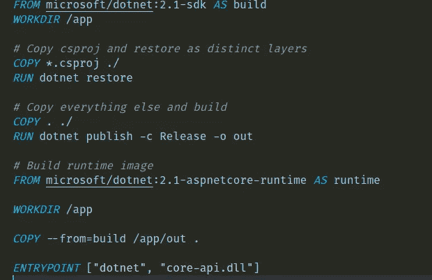
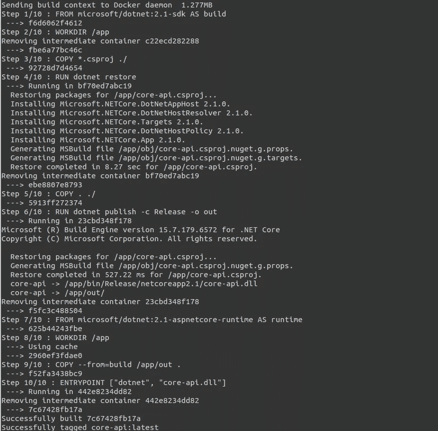
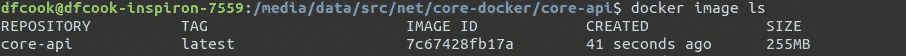
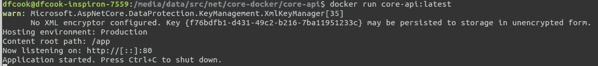
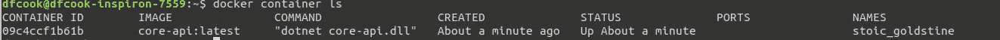
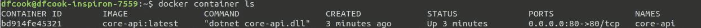

# 开始。用 docker 在 Linux 上开发. NET 核心，第 1 部分

> 原文：<https://itnext.io/beginning-net-core-development-with-docker-on-linux-6595a7eebdaa?source=collection_archive---------0----------------------->


特雷文·鲁迪在 [Unsplash](https://unsplash.com?utm_source=medium&utm_medium=referral) 上的照片

。NET core 带来了许多变革。NET 应用程序的编写不仅仅是跨平台开发的能力。我目前选择的主要开发平台是 Linux，我想建立一个开发工作流程，包括。NET core 作为单页 JavaScript 应用程序的后端。当我在做的时候，我认为它应该使用 docker 容器来简化构建和部署。

最终的结果是[这里是](https://github.com/dfcook/core-docker)，但是我想走完每个阶段，并尝试解释每个配置文件的用途以及特定设置的用途。当我在 Linux 上运行时，我希望在 Windows 机器上运行不会太难。我已经验证了代码可以在 Mac 上运行，没有任何改动。

这是文章的第 1 部分，重点是。NET 容器构建和介绍一些 docker 命令。第 2 部分将添加 UI 层，并研究如何组合容器。

## 先决条件

1.  [。NET Core SDK](https://www.microsoft.com/net/learn/get-started/linux/ubuntu18-04)
2.  [码头工人](https://docs.docker.com/install/linux/docker-ce/ubuntu/)
3.  [节点](https://nodejs.org/en/download/package-manager/#debian-and-ubuntu-based-linux-distributions)
4.  [Visual Studio 代码](https://code.visualstudio.com/)——或者任何编辑器，我喜欢 VS 代码，它有 docker 的扩展，允许我们以图形方式查看部署的图像和容器。

## 我们正在建造的东西

在这个故事中，没有太多的 C#或 JavaScript 编码，我将使用 dotnet 和 Vue cli 来生成基本的应用程序，并让 JavaScript 应用程序调用 dotnet 应用程序并显示一些基本数据。这个故事的重点是展示应用程序是如何封装在容器中并组合在一起的。

## 为什么要用 docker？

Docker 容器使得在不同的机器上复制你的应用程序变得非常容易。例如，一旦我在 Linux 上完成开发，我就去我的 mac，克隆 repo 并运行“docker-compose up”。下载并构建后，无需进一步安装，应用程序就可以在我的浏览器中使用了。

容器还提供隔离——容器中使用的依赖项和设置不会影响机器上运行的任何其他软件。这有助于避免依赖性冲突。

使用 docker 可以极大地简化部署，映像可以在构建后从中央集线器中提取，应用程序从开发阶段转移到试运行阶段再转移到生产阶段时不需要重新构建。

## 让我们开始—构建我们的 API

首先，创建一个名为 core-docker 的文件夹，然后在你的终端中打开它。输入以下内容:

```
mkdir core-api
cd core-apidotnet new webapi
dotnet restore
```

这将创建一个新的 webapi 项目并恢复其所有依赖项。的最新版本。NET 默认启用 HTTPS 重定向，我们在这里不需要它，所以我在 Startup.cs 中做了一个小小的改动


Startup.cs

完成后，在您的终端中输入“dotnet run”，api 将开始在端口 5000 上运行，如果您在浏览器中导航到[http://localhost:5000/API/Values](http://localhost:5000/api/Values)，您应该会看到一个 JSON 响应["value1 "，" value2"]。

## 建立形象

我们有一个正在运行的 API，所以让我们把它放在一个容器中。添加一个名为 Dockerfile 的文件，并在 Visual Studio 代码中打开，这将提示您安装我推荐的相关扩展。

我们的 API 的 other 文件由两部分组成，一部分用于构建，另一部分用于运行:



Dockerfile 文件

如果你以前没有使用过 docker，这可能看起来很令人生畏，但是它相对简单。每行以一个命令开始(FROM、COPY、RUN 等)，每个命令将从上到下依次执行。

1.  FROM 指定了要使用的 docker 映像，在第 1 行中，我们指定了将用于构建应用程序的 dotnet 2.1 SDK 映像。
2.  WORKDIR 指定映像中的工作目录。我们将使用/app 作为我们的工作目录。
3.  COPY 将文件从本地文件系统复制到映像中。我们将首先复制 csproj 文件并运行 restore，然后复制所有剩余的文件并运行 dotnet publish 来构建我们的应用程序。
4.  文件的运行时部分使用不同的 docker 基础映像，aspnetcore-runtime 映像，它复制构建中的所有文件，然后定义应用程序入口点。

要使用此文件进行构建，请执行以下命令:

```
docker build -t core-api .
```

这可能是一个相当漫长的过程，但是每个中间步骤都显示了它的状态，您应该看到类似这样的内容:



如果您现在运行:

```
docker image ls
```

这将列出系统上的所有映像，您应该会看到新构建的 core-api:



这一步需要注意一些有趣的事情，如果你看看 docker build 的输出，你会发现在每一步之后都会出现很多 ID。这是因为 docker 将每个命令递增地应用到您的图像，并创建一个新层。使用 docker history 命令可以看到这些层:

```
docker image history core-api:latest
```

此外，流程的不同阶段会相互影响。如果您查看第一条 FROM 语句，我们将它标记为“build ”,稍后在“runtime”部分，我们将在 COPY 语句中引用“build”。

如果你想删除图像，你可以使用 docker rm，这可以带图像名或 ID:

```
docker image rm 7c67428fb17a
```

如果你在 docker 中看到数百张图片，你可以要求它自动删除它们:

```
docker image prune
```

或者甚至要求 docker 对图像、容器和网络进行全面清理:

```
docker system prune
```

## 部署容器

现在我们有了一个映像，我们构建的应用程序，我们需要启动并运行它。我们使用 docker 的“run”命令来实现这一点:

```
docker run core-api:latest
```



这是启动容器的最简单方式，如果您随后运行:

```
docker container ls
```



您可以看到容器已经启动并运行，但处于生产模式，而不是我们使用 dotnet 命令启动它时的开发模式。此外，如果您访问 http://localhost/api/Values ，您应该会得到一个错误，而不是我们期望的 JSON 响应。看看 docker 给我们的容器起的名字，这是 docker 发明的一个随机生成的名字，如果我们希望将来能够一致地引用我们的容器，这个名字就不太好了。

我们可以用命令行参数解决所有这些问题。首先停止我们的容器运行并删除它:

```
docker container stop stoic_goldstine
docker container rm stoic_goldstine
```

(您需要用从 docker 容器返回的容器名称替换 stoic_goldstine)

现在，使用以下命令再次启动容器:

```
docker run --name core-api --env ASPNETCORE_ENVIRONMENT=Development -p 80:80 core-api:latest
```

我们添加了 3 个参数，name 是容器启动并运行时的名称，env 允许我们将环境变量传递给正在运行的容器，也许最重要的是，-p 允许我们将容器上的端口映射到我们机器上的端口。

当这个容器启动时，您可以使用 ls 命令并查看我们提供的名称和端口映射:



如果你去[http://localhost/API/Values](http://localhost/api/Values)，你应该得到预期的 JSON 响应。

## 任务完成了

这部分到此为止。第 2 部分将创建一个与 API 对话的简单 web UI，将它添加到自己的容器中，然后将我们的容器组合在一起以完成我们的开发环境。